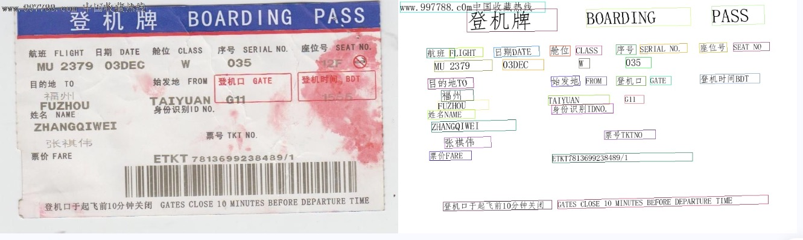

# PaddleX快速开始

### 🛠️ 安装

> ❗安装PaddleX前请先确保您有基础的Python运行环境

* **安装PaddlePaddle**
```bash
# cpu
python -m pip install paddlepaddle

# gpu，该命令仅适用于 CUDA 版本为 11.8 的机器环境
 python -m pip install paddlepaddle-gpu==3.0.0b1 -i https://www.paddlepaddle.org.cn/packages/stable/cu118/

# gpu，该命令仅适用于 CUDA 版本为 12.3 的机器环境
 python -m pip install paddlepaddle-gpu==3.0.0b1 -i https://www.paddlepaddle.org.cn/packages/stable/cu123/
```

* **安装PaddleX**

```bash
git clone https://github.com/PaddlePaddle/PaddleX.git
cd PaddleX
pip install -e .
```
  
更多安装方式参考[PaddleX安装教程](installation/installation.md)

### 💻 命令行使用

一行命令即可快速体验产线效果，统一的命令行格式为：

```bash
paddlex --pipeline [产线名称] --input [输入图片] --device [运行设备]
```

只需指定三个参数：
* `pipeline`：产线名称
* `input`：待处理的输入图片的本地路径或URL
* `device`: 使用的GPU序号（例如`gpu:0`表示使用第0块GPU），也可选择使用CPU（`cpu`）


以通用OCR产线为例：
```bash
paddlex --pipeline OCR --input https://paddle-model-ecology.bj.bcebos.com/paddlex/imgs/demo_image/general_ocr_002.png --device gpu:0
```
运行后的结果如下：

```bash
The prediction result is:
['登机口于起飞前10分钟关闭']
The prediction result is:
['GATES CLOSE 1O MINUTESBEFORE DEPARTURE TIME']
The prediction result is:
['ETKT7813699238489/1']
......
```

可视化结果如下：



</details>

其他产线的命令行使用，只需将`pipeline`参数调整为相应产线的名称。下面列出了每个产线对应的参数名称及详细的使用解释：

| 产线名称     | 对应参数                 | 详细说明 |
|----------|----------------------|------|
| 通用OCR产线 | `OCR` |   [通用OCR产线命令行使用说明](./pipeline_usage/OCR.md#221-命令行方式体验)   |
| 通用表格识别产线 | `table_recognition` |   [通用表格识别产线命令行使用说明](./pipeline_usage/table_recognition)   |
| PP-ChatOCRv3产线 | `pp_chatocrv3` |   [PP-ChatOCRv3产线命令行使用说明](./pipeline_usage/document_scene_information_extraction)   |


### 📝 Python脚本使用

几行代码即可完成产线的快速推理，统一的Python脚本格式如下：
```python
from paddlex import create_pipeline

pipeline = create_pipeline(pipeline=[产线名称])
output = pipeline.predict([输入图片名称])
for batch in output:
    for item in batch:
        res = item['result']
        res.print()
        res.save_to_img("./output/")
        res.save_to_json("./output/")
```
执行了如下几个步骤：

* `create_pipeline()` 实例化产线对象
* 传入图片并调用产线对象的`predict` 方法进行推理预测
* 对预测结果进行处理

其他产线的Python脚本使用，只需将`create_pipeline()`方法的`pipeline`参数调整为相应产线的名称。下面列出了每个产线对应的参数名称及详细的使用解释：

| 产线名称     | 对应参数                 | 详细说明 |
|----------|----------------------|------|
| 通用OCR产线 | `OCR` |   [通用OCR产线Python脚本使用说明](./pipeline_usage/OCR.md#222-python脚本方式集成)   |
| 通用表格识别产线 | `table_recognition` |   [通用表格识别产线Python脚本使用说明](./pipeline_usage/table_recognition)   |
| PP-ChatOCRv3产线 | `pp_chatocrv3` |   [PP-ChatOCRv3产线Python脚本使用说明](./pipeline_usage/document_scene_information_extraction)   |

## 🌟 更多
PaddleX的各个产线均支持**在线体验**和本地**快速推理**，您可以快速体验各个产线的预训练效果，如果您对产线的预训练效果满意，可以直接对产线进行[高性能部署](./pipeline_deploy/high_performance_deploy.md)/[服务化部署](./pipeline_deploy/service_deploy.md)/[端侧部署](./pipeline_deploy/lite_deploy.md)，如果不满意，您也可以对产线进行**二次开发**提升产线效果。完整的产线开发流程请参考[PaddleX产线开发工具本地使用教程](./pipeline_usage/pipeline_develop_guide.md)。

此外，PaddleX为OCR相关的每个产线和单功能模块都提供了详细的开发教程，您可以根据需要选择对应的产线或模块进行开发：

* [通用OCR产线使用教程](./pipeline_usage/OCR.md)
* [通用表格识别产线使用教程](./pipeline_usage/table_recognition.md)
* [PP-ChatOCRv3产线使用教程](./pipeline_usage/document_scene_information_extraction.md)
* [文本检测模块使用教程](./module_usage/text_detection.md)
* [文本识别模块使用教程](./module_usage/text_recognition.md)
* [表格结构识别模块使用教程](./module_usage/table_structure_recognition.md)
* [文本图像矫正模块使用教程](./module_usage/image_warping.md)
* [弯曲文本检测模块使用教程](./module_usage/curved_text_detection.md)


