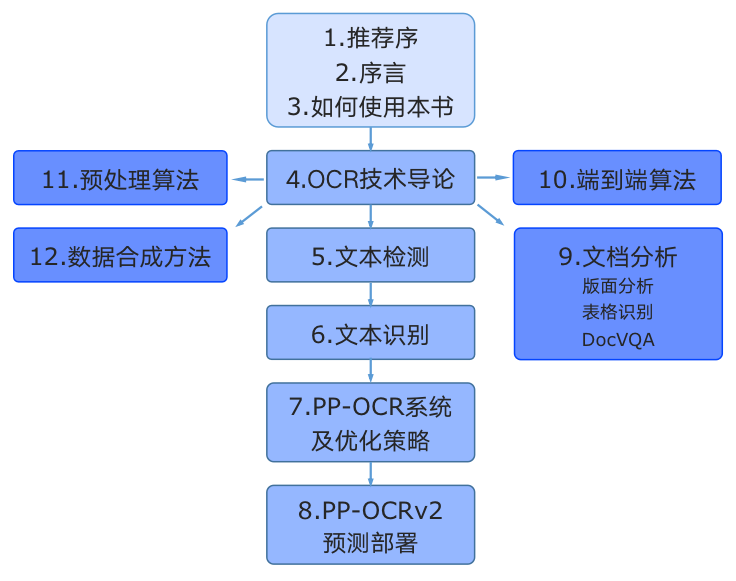

# 《动手学OCR》电子书

《动手学OCR》是PaddleOCR团队携手华中科技大学博导/教授，IAPR Fellow 白翔、复旦大学青年研究员陈智能、中国移动研究院视觉领域资深专家黄文辉、中国工商银行大数据人工智能实验室研究员等产学研同仁，以及OCR开发者共同打造的结合OCR前沿理论与代码实践的教材。主要特色如下：

- 覆盖从文本检测识别到文档分析的OCR全栈技术
- 紧密结合理论实践，跨越代码实现鸿沟，并配套教学视频
- Notebook交互式学习，灵活修改代码，即刻获得结果

## 本书结构

- 第一部分是本书的推荐序、序言与预备知识，包含本书的定位与使用书籍内容的过程中需要用到的知识索引、资源链接等
- 第二部分是本书的4-8章，介绍与OCR核心的检测、识别能力相关的概念、应用与产业实践。在“OCR技术导论”中总括性的解释OCR的应用场景和挑战、技术基本概念以及在产业应用中的痛点问题。然后在
“文本检测”与“文本识别”两章中介绍OCR的两个基本任务，并在每章中配套一个算法展开代码详解与实战练习。第6、7章是关于PP-OCR系列模型的详细介绍，PP-OCR是一套面向产业应用的OCR系统，在
基础检测和识别模型的基础之上经过一系列优化策略达到通用领域的产业级SOTA模型，同时打通多种预测部署方案，赋能企业快速落地OCR应用。
- 第三部分是本书的9-12章，介绍两阶段OCR引擎之外的应用，包括数据合成、预处理算法、端到端模型，重点展开了OCR在文档场景下的版面分析、表格识别、视觉文档问答的能力，同样通过算法与代码结
合的方式使得读者能够深入理解并应用。

## 资料地址

-  🎁《动手学OCR》、《OCR产业范例20讲》电子书、OCR垂类模型、PDF2Word软件以及其他学习大礼包领取链接：[百度网盘 PaddleOCR 开源大礼包](https://pan.baidu.com/s/1h__OYbbQ_rASB-m8ZC1bCA)，提取码：4232
- [notebook教程](https://github.com/PaddleOCR-Community/Dive-into-OCR)
- [教学视频](https://aistudio.baidu.com/aistudio/education/group/info/25207)
