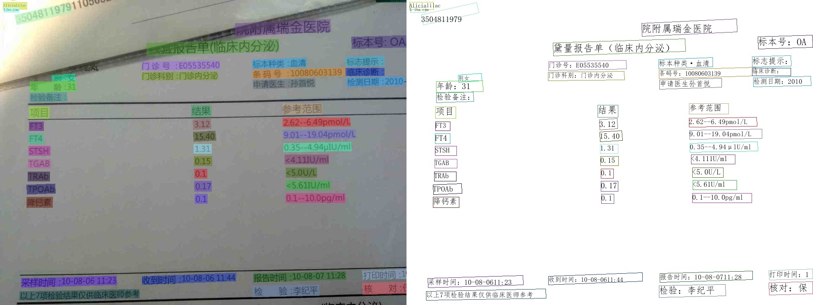

# Jetson部署PaddleOCR模型

本节介绍PaddleOCR在Jetson NX、TX2、nano、AGX等系列硬件的部署。

## 1. 环境准备

需要准备一台Jetson开发板，如果需要TensorRT预测，需准备好TensorRT环境，建议使用7.1.3版本的TensorRT；

### 1. Jetson安装PaddlePaddle

PaddlePaddle下载[链接](https://www.paddlepaddle.org.cn/inference/user_guides/download_lib.html#python)
请选择适合的您Jetpack版本、cuda版本、trt版本的安装包。

安装命令：

```bash linenums="1"
# 安装paddle，以paddlepaddle_gpu-2.3.0rc0-cp36-cp36m-linux_aarch64.whl 为例
pip3 install -U paddlepaddle_gpu-2.3.0rc0-cp36-cp36m-linux_aarch64.whl
```

### 2. 下载PaddleOCR代码并安装依赖

首先 clone PaddleOCR 代码：

```bash linenums="1"
git clone https://github.com/PaddlePaddle/PaddleOCR
```

然后，安装依赖：

```bash linenums="1"
cd PaddleOCR
pip3 install -r requirements.txt
```

- 注：jetson硬件CPU较差，依赖安装较慢，请耐心等待

## 2. 执行预测

从[文档](../model_list.md) 模型库中获取PPOCR模型，下面以PP-OCRv3模型为例，介绍在PPOCR模型在jetson上的使用方式：

下载并解压PP-OCRv3模型

```bash linenums="1"
wget https://paddleocr.bj.bcebos.com/PP-OCRv3/chinese/ch_PP-OCRv3_det_infer.tar
wget https://paddleocr.bj.bcebos.com/PP-OCRv3/chinese/ch_PP-OCRv3_rec_infer.tar
tar xf ch_PP-OCRv3_det_infer.tar
tar xf ch_PP-OCRv3_rec_infer.tar
```

执行文本检测预测：

```bash linenums="1"
cd PaddleOCR
python3 tools/infer/predict_det.py --det_model_dir=./inference/ch_PP-OCRv2_det_infer/  --image_dir=./doc/imgs/french_0.jpg  --use_gpu=True
```

执行命令后在终端会打印出预测的信息，并在 `./inference_results/` 下保存可视化结果。


执行文本识别预测：

```bash linenums="1"
python3 tools/infer/predict_det.py --rec_model_dir=./inference/ch_PP-OCRv2_rec_infer/  --image_dir=./doc/imgs_words/en/word_2.png  --use_gpu=True --rec_image_shape="3,48,320"
```

执行命令后在终端会打印出预测的信息，输出如下：

```bash linenums="1"
[2022/04/28 15:41:45] root INFO: Predicts of ./doc/imgs_words/en/word_2.png:('yourself', 0.98084533)
```

执行文本检测+文本识别串联预测：

```bash linenums="1"
python3 tools/infer/predict_system.py --det_model_dir=./inference/ch_PP-OCRv2_det_infer/ --rec_model_dir=./inference/ch_PP-OCRv2_rec_infer/ --image_dir=./doc/imgs/ --use_gpu=True --rec_image_shape="3,48,320"
```

执行命令后在终端会打印出预测的信息，并在 `./inference_results/` 下保存可视化结果



开启TRT预测只需要在以上命令基础上设置`--use_tensorrt=True`即可：

```bash linenums="1"
python3 tools/infer/predict_system.py --det_model_dir=./inference/ch_PP-OCRv2_det_infer/ --rec_model_dir=./inference/ch_PP-OCRv2_rec_infer/ --image_dir=./doc/imgs/00057937.jpg --use_gpu=True --use_tensorrt=True --rec_image_shape="3,48,320"
```

更多ppocr模型预测请参考[文档](../model_list.md)
