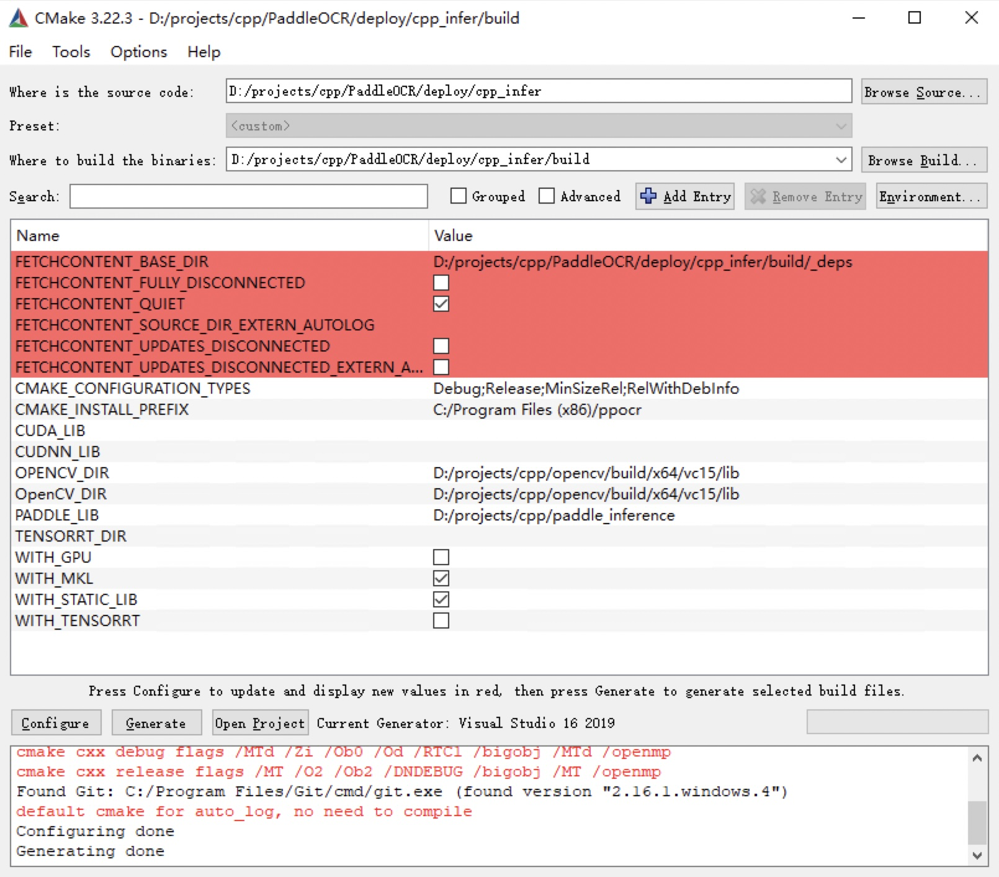

# Visual Studio 2019 Community CMake Compilation Guide

PaddleOCR is tested on Windows based on `Visual Studio 2019 Community`. Microsoft has supported direct management of `CMake` cross-platform compilation projects since `Visual Studio 2017`, but it was not until `2019` that stable and complete support was provided, so if you want to use CMake to manage project compilation and build, we recommend that you use the `Visual Studio 2019` environment to build.

**All the examples below are demonstrated with the working directory as `D:\projects\cpp`**.

## 1. Environment Preparation

### 1.1 Install the required environment

- Visual Studio 2019
- CUDA 10.2, cudnn 7+ (only required when using the GPU version of the prediction library)
- CMake 3.22+

Please make sure the system has the above basic software installed. We use the community version of `VS2019`.

### 1.2 Download PaddlePaddle C++ prediction library and Opencv

#### 1.2.1 Download PaddlePaddle C++ prediction library

PaddlePaddle C++ prediction library provides different precompiled versions for different `CPU` and `CUDA` versions. Please download according to the actual situation: [C++ prediction library download list](https://www.paddlepaddle.org.cn/inference/master/guides/install/download_lib.html#windows)

After decompression, the `D:\projects\paddle_inference` directory contains the following contents:

```
paddle_inference
├── paddle # paddle core library and header files
|
├── third_party # third-party dependent libraries and header files
|
└── version.txt # version and compilation information
```

#### 1.2.2 Install and configure OpenCV

1. Download Opencv for Windows platform from the OpenCV official website, [Download address](https://github.com/opencv/opencv/releases)
2. Run the downloaded executable file and unzip OpenCV to the specified directory, such as `D:\projects\cpp\opencv`

#### 1.2.3 Download PaddleOCR code

```bash linenums="1"
git clone -b dygraph https://github.com/PaddlePaddle/PaddleOCR
```

## 2. Start running

### Step1: Build Visual Studio project

After cmake is installed, there will be a cmake-gui program in the system. Open cmake-gui, fill in the source code path in the first input box, and fill in the compilation output path in the second input box


### Step2: Execute cmake configuration

Click the `Configure` button at the bottom of the interface. The first click will pop up a prompt box for Visual Studio configuration, as shown below. Select your Visual Studio version is fine, and the target platform is x64. Then click the `finish` button to start the automatic configuration.


The first execution will report an error, which is normal. Next, configure Opencv and the prediction library

- For cpu version, only the three parameters OPENCV_DIR, OpenCV_DIR, and PADDLE_LIB need to be considered

- OPENCV_DIR: Fill in the location of the opencv lib folder

- OpenCV_DIR: Fill in the location of the opencv lib folder

- PADDLE_LIB: The location of the paddle_inference folder

- For GPU version, on the basis of the cpu version, the following variables need to be filled in
CUDA_LIB, CUDNN_LIB, TENSORRT_DIR, WITH_GPU, WITH_TENSORRT

- CUDA_LIB: CUDA address, such as `C:\Program Files\NVIDIA GPU Computing Toolkit\CUDA\v11.2\lib\x64`

- CUDNN_LIB: The same as CUDA_LIB

- TENSORRT_DIR: The location where TRT is unzipped after downloading, such as `D:\TensorRT-8.0.1.6`
- WITH_GPU: Check
- WITH_TENSORRT: Check

The configured screenshot is as follows


After the configuration is completed, click the `Configure` button again.

**Note:**

1. If you are using the `openblas` version, please uncheck `WITH_MKL`
2. If you encounter the error `unable to access 'https://github.com/LDOUBLEV/AutoLog.git/': gnutls_handshake() failed: The TLS connection was non-properly terminated.`, change the github address in `deploy/cpp_infer/external-cmake/auto-log.cmake` to <https://gitee.com/Double_V/AutoLog> address.

### Step3: Generate Visual Studio Project

Click the `Generate` button to generate the sln file of the Visual Studio project.


Click the `Open Project` button to open the project in Visual Studio. The screenshot after opening is as follows


Before starting to generate the solution, perform the following steps:

1. Change `Debug` to `Release`

2. Download [dirent.h](https://paddleocr.bj.bcebos.com/deploy/cpp_infer/cpp_files/dirent.h) and copy it to the include folder of Visual Studio, such as `C:\Program Files (x86)\Microsoft Visual Studio\2019\Community\VC\Auxiliary\VS\include`.

Click `Build->Generate Solution`, and you can see the `ppocr.exe` file in the `build/Release/` folder.

Before running, copy the following files to the `build/Release/` folder

1. `paddle_inference/paddle/lib/paddle_inference.dll`

2. `paddle_inference/third_party/install/onnxruntime/lib/onnxruntime.dll`

3. `paddle_inference/third_party/install/paddle2onnx/lib/paddle2onnx.dll`

4. `opencv/build/x64/vc15/bin/opencv_world455.dll`

5. If you use the prediction library of the openblas version, you also need to copy `paddle_inference/third_party/install/openblas/lib/openblas.dll`

### Step4: Prediction

The above `Visual Studio The executable file compiled by 2019 is in the directory of build/Release/. Open cmd and switch to D:\projects\cpp\PaddleOCR\deploy\cpp_infer\:

cd /d D:\projects\cpp\PaddleOCR\deploy\cpp_infer

The executable file ppocr.exe is the sample prediction program. Its main usage is as follows. For more usage, please refer to the [Instructions](./cpp_infer.en.md) section of running demo.

```bash linenums="1"
# Switch terminal encoding to utf8
CHCP 65001
# Execute prediction
.\build\Release\ppocr.exe system --det_model_dir=D:\projects\cpp\ch_PP-OCRv2_det_slim_quant_infer --rec_model_dir=D:\projects\cpp\ch_PP-OCRv2_rec_slim_quant_infer --image_dir=D:\projects\cpp\PaddleOCR\doc\imgs\11.jpg
```

The recognition result is as follows


## FAQ

- When running, a pop-up window prompts `The application cannot be started normally (0xc0000142)`, and the `cmd` window prompts `You are using Paddle compiled with TensorRT, but TensorRT dynamic library is not found.`, copy all the dll files in the lib in the tensor directory to the release directory, and run it again.
