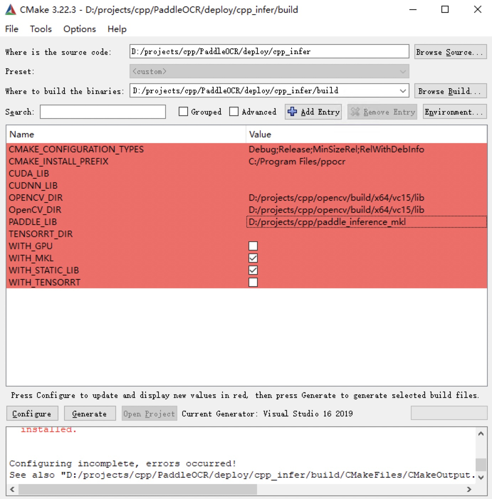
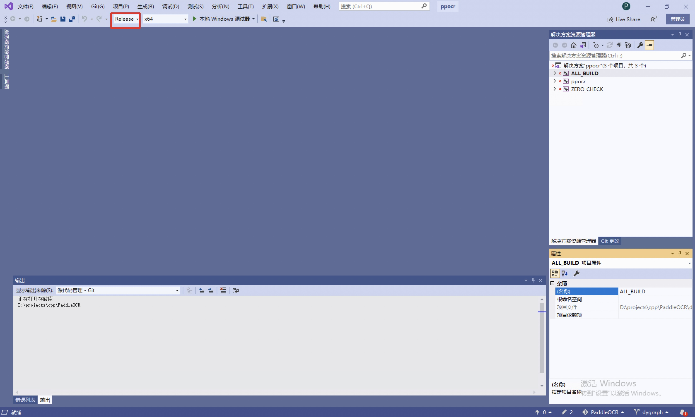

# Visual Studio 2019 Community CMake 编译指南

PaddleOCR在Windows 平台下基于`Visual Studio 2019 Community` 进行了测试。微软从`Visual Studio 2017`开始即支持直接管理`CMake`跨平台编译项目，但是直到`2019`才提供了稳定和完全的支持，所以如果你想使用CMake管理项目编译构建，我们推荐你使用`Visual Studio 2019`环境下构建。

**下面所有示例以工作目录为 `D:\projects\cpp`演示**。

## 1. 环境准备

### 1.1 安装必须环境

- Visual Studio 2019
- CUDA 10.2，cudnn 7+ （仅在使用GPU版本的预测库时需要）
- CMake 3.22+

请确保系统已经安装好上述基本软件，我们使用的是`VS2019`的社区版。

### 1.2 下载 PaddlePaddle C++ 预测库和 Opencv

#### 1.2.1 下载 PaddlePaddle C++ 预测库

PaddlePaddle C++ 预测库针对不同的`CPU`和`CUDA`版本提供了不同的预编译版本，请根据实际情况下载:  [C++预测库下载列表](https://www.paddlepaddle.org.cn/inference/master/guides/install/download_lib.html#windows)

解压后`D:\projects\paddle_inference`目录包含内容为：

```
paddle_inference
├── paddle # paddle核心库和头文件
|
├── third_party # 第三方依赖库和头文件
|
└── version.txt # 版本和编译信息
```

#### 1.2.2 安装配置OpenCV

1. 在OpenCV官网下载适用于Windows平台的Opencv， [下载地址](https://github.com/opencv/opencv/releases)
2. 运行下载的可执行文件，将OpenCV解压至指定目录，如`D:\projects\cpp\opencv`

#### 1.2.3 下载PaddleOCR代码

```bash linenums="1"
git clone -b dygraph https://github.com/PaddlePaddle/PaddleOCR
```

## 2. 开始运行

### Step1: 构建Visual Studio项目

cmake安装完后后系统里会有一个cmake-gui程序，打开cmake-gui，在第一个输入框处填写源代码路径，第二个输入框处填写编译输出路径


### Step2: 执行cmake配置

点击界面下方的`Configure`按钮，第一次点击会弹出提示框进行Visual Studio配置，如下图，选择你的Visual Studio版本即可，目标平台选择x64。然后点击`finish`按钮即开始自动执行配置。


第一次执行会报错，这是正常现象，接下来进行Opencv和预测库的配置

- cpu版本，仅需考虑OPENCV_DIR、OpenCV_DIR、PADDLE_LIB三个参数

  - OPENCV_DIR：填写opencv lib文件夹所在位置
  - OpenCV_DIR：同填写opencv lib文件夹所在位置
  - PADDLE_LIB：paddle_inference文件夹所在位置

- GPU版本，在cpu版本的基础上，还需填写以下变量
CUDA_LIB、CUDNN_LIB、TENSORRT_DIR、WITH_GPU、WITH_TENSORRT

- CUDA_LIB: CUDA地址，如 `C:\Program Files\NVIDIA GPU Computing Toolkit\CUDA\v11.2\lib\x64`
- CUDNN_LIB: 和CUDA_LIB一致
- TENSORRT_DIR：TRT下载后解压缩的位置，如 `D:\TensorRT-8.0.1.6`
- WITH_GPU: 打钩
- WITH_TENSORRT：打勾

配置好的截图如下



配置完成后，再次点击`Configure`按钮。

**注意：**

  1. 如果使用的是`openblas`版本，请把`WITH_MKL`勾去掉
  2. 遇到报错 `unable to access 'https://github.com/LDOUBLEV/AutoLog.git/': gnutls_handshake() failed: The TLS connection was non-properly terminated.`， 将 `deploy/cpp_infer/external-cmake/auto-log.cmake` 中的github地址改为 <https://gitee.com/Double_V/AutoLog> 地址即可。

### Step3: 生成Visual Studio 项目

点击`Generate`按钮即可生成Visual Studio 项目的sln文件。


点击`Open Project`按钮即可在Visual Studio 中打开项目。打开后截图如下



在开始生成解决方案之前，执行下面步骤：

1. 将`Debug`改为`Release`
2. 下载[dirent.h](https://paddleocr.bj.bcebos.com/deploy/cpp_infer/cpp_files/dirent.h)，并拷贝到 Visual Studio 的 include 文件夹下，如`C:\Program Files (x86)\Microsoft Visual Studio\2019\Community\VC\Auxiliary\VS\include`。

点击`生成->生成解决方案`，即可在`build/Release/`文件夹下看见`ppocr.exe`文件。

运行之前，将下面文件拷贝到`build/Release/`文件夹下

1. `paddle_inference/paddle/lib/paddle_inference.dll`
2. `paddle_inference/third_party/install/onnxruntime/lib/onnxruntime.dll`
3. `paddle_inference/third_party/install/paddle2onnx/lib/paddle2onnx.dll`
4. `opencv/build/x64/vc15/bin/opencv_world455.dll`
5. 如果使用openblas版本的预测库还需要拷贝 `paddle_inference/third_party/install/openblas/lib/openblas.dll`

### Step4: 预测

上述`Visual Studio 2019`编译产出的可执行文件在`build/Release/`目录下，打开`cmd`，并切换到`D:\projects\cpp\PaddleOCR\deploy\cpp_infer\`：

```bash linenums="1"
cd /d D:\projects\cpp\PaddleOCR\deploy\cpp_infer
```

可执行文件`ppocr.exe`即为样例的预测程序，其主要使用方法如下，更多使用方法可以参考[说明文档](./cpp_infer.md)`运行demo`部分。

```bash linenums="1"
# 切换终端编码为utf8
CHCP 65001
# 执行预测
.\build\Release\ppocr.exe system --det_model_dir=D:\projects\cpp\ch_PP-OCRv2_det_slim_quant_infer --rec_model_dir=D:\projects\cpp\ch_PP-OCRv2_rec_slim_quant_infer --image_dir=D:\projects\cpp\PaddleOCR\doc\imgs\11.jpg
```

识别结果如下


## FAQ

- 运行时，弹窗报错提示`应用程序无法正常启动(0xc0000142)`，并且`cmd`窗口内提示`You are using Paddle compiled with TensorRT, but TensorRT dynamic library is not found.`，把tensort目录下的lib里面的所有dll文件复制到release目录下，再次运行即可。
