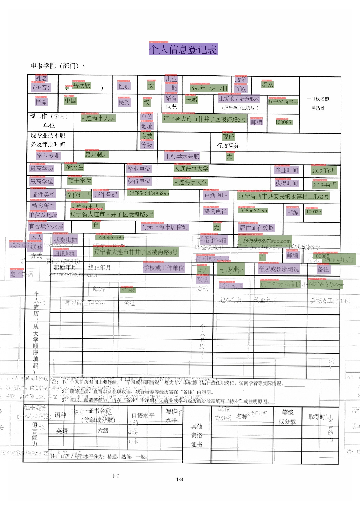

# Key Information Extraction

This tutorial provides a guide to the whole process of key information extraction using PaddleOCR, including data preparation, model training, optimization, evaluation, prediction of semantic entity recognition (SER) and relationship extraction (RE) tasks.

## 1. Data Preparation

### 1.1. Prepare for dataset

PaddleOCR supports the following data format when training KIE models.

- `general data` is used to train a dataset whose annotation is stored in a text file (SimpleDataset).

The default storage path of training data is `PaddleOCR/train_data`. If you already have datasets on your disk, you only need to create a soft link to the dataset directory.

```bash linenums="1"
# linux and mac os
ln -sf <path/to/dataset> <path/to/paddle_ocr>/train_data/dataset
# windows
mklink /d <path/to/paddle_ocr>/train_data/dataset <path/to/dataset>
```

### 1.2. Custom Dataset

The training process generally includes the training set and the evaluation set. The data formats of the two sets are same.

#### (1) Training set

It is recommended to put the training images into the same folder, record the path and annotation of images in a text file. The contents of the text file are as follows:

```text linenums="1"
" image path                 annotation information "
zh_train_0.jpg   [{"transcription": "汇丰晋信", "label": "other", "points": [[104, 114], [530, 114], [530, 175], [104, 175]], "id": 1, "linking": []}, {"transcription": "受理时间:", "label": "question", "points": [[126, 267], [266, 267], [266, 305], [126, 305]], "id": 7, "linking": [[7, 13]]}, {"transcription": "2020.6.15", "label": "answer", "points": [[321, 239], [537, 239], [537, 285], [321, 285]], "id": 13, "linking": [[7, 13]]}]
zh_train_1.jpg   [{"transcription": "中国人体器官捐献", "label": "other", "points": [[544, 459], [954, 459], [954, 517], [544, 517]], "id": 1, "linking": []}, {"transcription": ">编号:MC545715483585", "label": "other", "points": [[1462, 470], [2054, 470], [2054, 543], [1462, 543]], "id": 10, "linking": []}, {"transcription": "CHINAORGANDONATION", "label": "other", "points": [[543, 516], [958, 516], [958, 551], [543, 551]], "id": 14, "linking": []}, {"transcription": "中国人体器官捐献志愿登记表", "label": "header", "points": [[635, 793], [1892, 793], [1892, 904], [635, 904]], "id": 18, "linking": []}]
...
```

**Note:** In the text file, please split the image path and annotation with `\t`. Otherwise, error will happen when training.

The annotation can be parsed by `json` into a list of sub-annotations. Each element in the list is a dict, which stores the required information of each text line. The required fields are as follows.

- transcription: stores the text content of the text line
- label: the category of the text line content
- points: stores the four point position information of the text line
- id: stores the ID information of the text line for RE model training
- linking: stores the connection information between text lines for RE model training

#### (2) Evaluation set

The evaluation set is constructed in the same way as the training set.

#### (3) Dictionary file

The textlines in the training set and the evaluation set contain label information. The list of all labels is stored in the dictionary file (such as `class_list.txt`). Each line in the dictionary file is represented as a label name.

For example, FUND_zh data contains four categories. The contents of the dictionary file are as follows.

```text linenums="1"
OTHER
QUESTION
ANSWER
HEADER
```

In the annotation file, the annotation information of the `label` field of the text line content of each annotation needs to belong to the dictionary content.

The final dataset shall have the following file structure.

```text linenums="1"
|-train_data
  |-data_name
    |- train.json
    |- train
        |- zh_train_0.png
        |- zh_train_1.jpg
        | ...
    |- val.json
    |- val
        |- zh_val_0.png
        |- zh_val_1.jpg
        | ...
```

**Note:**

-The category information in the annotation file is not case sensitive. For example, 'HEADER' and 'header' will be seen as the same category ID.

- In the dictionary file, it is recommended to put the `other` category (other textlines that need not be paid attention to can be labeled as `other`) on the first line. When parsing, the category ID of the 'other' category will be resolved to 0, and the textlines predicted as `other` will not be visualized later.

### 1.3. Download data

If you do not have local dataset, you can donwload the source files of [XFUND](https://github.com/doc-analysis/XFUND) or [FUNSD](https://guillaumejaume.github.io/FUNSD) and use the scripts of [XFUND](../../ppstructure/kie/tools/trans_xfun_data.py) or [FUNSD](../../ppstructure/kie/tools/trans_funsd_label.py) for tranform them into PaddleOCR format. Then you can use the public dataset to quick experience KIE.

For more information about public KIE datasets, please refer to [KIE dataset tutorial](../../datasets/kie_datasets.en.md).

PaddleOCR also supports the annotation of KIE models. Please refer to [PPOCRLabel tutorial](https://github.com/PFCCLab/PPOCRLabel/blob/main/README.md).

## 2. Training

PaddleOCR provides training scripts, evaluation scripts and inference scripts. We will introduce based on VI-LayoutXLM model in this section.
This section will take the VI layoutxlm multimodal pre training model as an example to explain.

> If you want to use the SDMGR based KIE algorithm, please refer to: [SDMGR tutorial](../../algorithm/kie/algorithm_kie_sdmgr.en.md).

### 2.1. Start Training

If you do not use a custom dataset, you can use XFUND_zh that has been processed in PaddleOCR dataset for quick experience.

```bash linenums="1"
mkdir train_data
cd train_data
wget https://paddleocr.bj.bcebos.com/ppstructure/dataset/XFUND.tar && tar -xf XFUND.tar
cd ..
```

If you don't want to train, and want to directly experience the process of model evaluation, prediction, and inference, you can download the training model provided in PaddleOCR and skip section 2.1.

Use the following command to download the trained model.

```bash linenums="1"
mkdir pretrained_model
cd pretrained_model
# download and uncompress SER model
wget https://paddleocr.bj.bcebos.com/ppstructure/models/vi_layoutxlm/ser_vi_layoutxlm_xfund_pretrained.tar & tar -xf ser_vi_layoutxlm_xfund_pretrained.tar

# download and uncompress RE model
wget https://paddleocr.bj.bcebos.com/ppstructure/models/vi_layoutxlm/re_vi_layoutxlm_xfund_pretrained.tar & tar -xf re_vi_layoutxlm_xfund_pretrained.tar
```

Start training:

- If your paddlepaddle version is `CPU`, you need to set `Global.use_gpu=False` in your config file.
- During training, PaddleOCR will download the VI-LayoutXLM pretraining model by default. There is no need to download it in advance.

```bash linenums="1"
# GPU training, support single card and multi-cards
# The training log will be save in "{Global.save_model_dir}/train.log"

# train SER model using single card
python3 tools/train.py -c configs/kie/vi_layoutxlm/ser_vi_layoutxlm_xfund_zh.yml

# train SER model using multi-cards, you can use --gpus to assign the GPU ids.
python3 -m paddle.distributed.launch --gpus '0,1,2,3'  tools/train.py -c configs/kie/vi_layoutxlm/ser_vi_layoutxlm_xfund_zh.yml

# train RE model using single card
python3 tools/train.py -c configs/kie/vi_layoutxlm/re_vi_layoutxlm_xfund_zh.yml
```

Take the SER model training as an example. After the training is started, you will see the following log output.

```bash linenums="1"
[2022/08/08 16:28:28] ppocr INFO: epoch: [1/200], global_step: 10, lr: 0.000006, loss: 1.871535, avg_reader_cost: 0.28200 s, avg_batch_cost: 0.82318 s, avg_samples: 8.0, ips: 9.71838 samples/s, eta: 0:51:59
[2022/08/08 16:28:33] ppocr INFO: epoch: [1/200], global_step: 19, lr: 0.000018, loss: 1.461939, avg_reader_cost: 0.00042 s, avg_batch_cost: 0.32037 s, avg_samples: 6.9, ips: 21.53773 samples/s, eta: 0:37:55
[2022/08/08 16:28:39] ppocr INFO: cur metric, precision: 0.11526348939743859, recall: 0.19776657060518732, hmean: 0.14564265817747712, fps: 34.008392345050055
[2022/08/08 16:28:45] ppocr INFO: save best model is to ./output/ser_vi_layoutxlm_xfund_zh/best_accuracy
[2022/08/08 16:28:45] ppocr INFO: best metric, hmean: 0.14564265817747712, precision: 0.11526348939743859, recall: 0.19776657060518732, fps: 34.008392345050055, best_epoch: 1
[2022/08/08 16:28:51] ppocr INFO: save model in ./output/ser_vi_layoutxlm_xfund_zh/latest
```

The following information will be automatically printed.

|Field | meaning|
| :----: | :------: |
|epoch | current iteration round|
|iter | current iteration times|
|lr | current learning rate|
|loss | current loss function|
| reader_cost | current batch data processing time|
| batch_ Cost | total current batch time|
|samples | number of samples in the current batch|
|ips | number of samples processed per second|

PaddleOCR supports evaluation during training. you can modify `eval_batch_step` in the config file `configs/kie/vi_layoutxlm/ser_vi_layoutxlm_xfund_zh.yml` (default as 19 iters). Trained model with best hmean will be saved as `output/ser_vi_layoutxlm_xfund_zh/best_accuracy/`.

If the evaluation dataset is very large, it's recommended to enlarge the eval interval or evaluate the model after training.

**Note:** for more KIE models training and configuration files, you can go into `configs/kie/` or refer to [Frontier KIE algorithms](./algorithm_overview_en.md).

If you want to train model on your own dataset, you need to modify the data path, dictionary file and category number in the configuration file.

Take `configs/kie/vi_layoutxlm/ser_vi_layoutxlm_xfund_zh.yml` as an example, contents we need to fix is as follows.

```yaml linenums="1"
Architecture:
  # ...
  Backbone:
    name: LayoutXLMForSer
    pretrained: True
    mode: vi
    # Assuming that n categroies are included in the dictionary file (other is included), the the num_classes is set as 2n-1
    num_classes: &num_classes 7

PostProcess:
  name: kieSerTokenLayoutLMPostProcess
  # Modify the dictionary file path for your custom dataset
  class_path: &class_path train_data/XFUND/class_list_xfun.txt

Train:
  dataset:
    name: SimpleDataSet
    # Modify the data path for your training dataset
    data_dir: train_data/XFUND/zh_train/image
    # Modify the data annotation path for your training dataset
    label_file_list:
      - train_data/XFUND/zh_train/train.json
    ...
  loader:
    # batch size for single card when training
    batch_size_per_card: 8
    ...

Eval:
  dataset:
    name: SimpleDataSet
    # Modify the data path for your evaluation dataset
    data_dir: train_data/XFUND/zh_val/image
    # Modify the data annotation path for your evaluation dataset
    label_file_list:
      - train_data/XFUND/zh_val/val.json
    ...
  loader:
    # batch size for single card when evaluation
    batch_size_per_card: 8
```

**Note that the configuration file for prediction/evaluation must be consistent with the training file.**

### 2.2. Resume Training

If the training process is interrupted and you want to load the saved model to resume training, you can specify the path of the model to be loaded by specifying `Architecture.Backbone.checkpoints`.

```bash linenums="1"
python3 tools/train.py -c configs/kie/vi_layoutxlm/ser_vi_layoutxlm_xfund_zh.yml -o Architecture.Backbone.checkpoints=./output/ser_vi_layoutxlm_xfund_zh/best_accuracy
```

**Note:**

- Priority of `Architecture.Backbone.checkpoints` is higher than`Architecture.Backbone.pretrained`. You need to set `Architecture.Backbone.checkpoints` for model finetuning, resume and evalution. If you want to train with the NLP pretrained model, you need to set `Architecture.Backbone.pretrained` as `True` and set `Architecture.Backbone.checkpoints` as null (`null`).
- PaddleNLP pretrained models are used here for LayoutXLM series models, the model loading and saving logic is same as those in PaddleNLP. Therefore we do not need to set `Global.pretrained_model` or `Global.checkpoints` here.
- If you use knowledge distillation to train the LayoutXLM series models, resuming training is not supported now.

### 2.3. Mixed Precision Training

coming soon!

### 2.4. Distributed Training

During multi-machine multi-gpu training, use the `--ips` parameter to set the used machine IP address, and the `--gpus` parameter to set the used GPU ID:

```bash linenums="1"
python3 -m paddle.distributed.launch --ips="xx.xx.xx.xx,xx.xx.xx.xx" --gpus '0,1,2,3' tools/train.py -c configs/kie/vi_layoutxlm/ser_vi_layoutxlm_xfund_zh.yml
```

**Note:** (1) When using multi-machine and multi-gpu training, you need to replace the ips value in the above command with the address of your machine, and the machines need to be able to ping each other. (2) Training needs to be launched separately on multiple machines. The command to view the ip address of the machine is `ifconfig`. (3) For more details about the distributed training speedup ratio, please refer to [Distributed Training Tutorial](../blog/distributed_training.en.md).

### 2.5. Train with Knowledge Distillation

Knowledge distillation is supported in PaddleOCR for KIE model training process. The configuration file is [ser_vi_layoutxlm_xfund_zh_udml.yml](https://github.com/PaddlePaddle/PaddleOCR/tree/main/configs/kie/vi_layoutxlm/ser_vi_layoutxlm_xfund_zh_udml.yml). For more information, please refer to [doc](../model_compress/knowledge_distillation.en.md).

**Note:** The saving and loading logic of the LayoutXLM series KIE models in PaddleOCR is consistent with PaddleNLP, so only the parameters of the student model are saved in the distillation process. If you want to use the saved model for evaluation, you need to use the configuration of the student model (the student model corresponding to the distillation file above is [ser_vi_layoutxlm_xfund_zh.yml](https://github.com/PaddlePaddle/PaddleOCR/tree/main/configs/kie/vi_layoutxlm/ser_vi_layoutxlm_xfund_zh.yml).

### 2.6. Training on other platform

- Windows GPU/CPU
The Windows platform is slightly different from the Linux platform:
Windows platform only supports `single gpu` training and inference, specify GPU for training `set CUDA_VISIBLE_DEVICES=0`
On the Windows platform, DataLoader only supports single-process mode, so you need to set `num_workers` to 0;

- macOS
GPU mode is not supported, you need to set `use_gpu` to False in the configuration file, and the rest of the training evaluation prediction commands are exactly the same as Linux GPU.

- Linux DCU
Running on a DCU device requires setting the environment variable `export HIP_VISIBLE_DEVICES=0,1,2,3`, and the rest of the training and evaluation prediction commands are exactly the same as the Linux GPU.

## 3. Evaluation and Test

### 3.1. Evaluation

The trained model will be saved in `Global.save_model_dir`. When evaluation, you need to set `Architecture.Backbone.checkpoints` as your model directroy. The evaluation dataset can be set by modifying the `Eval.dataset.label_file_list` field in the `configs/kie/vi_layoutxlm/ser_vi_layoutxlm_xfund_zh.yml` file.

```bash linenums="1"
# GPU evaluation, Global.checkpoints is the weight to be tested
python3 tools/eval.py -c configs/kie/vi_layoutxlm/ser_vi_layoutxlm_xfund_zh.yml -o Architecture.Backbone.checkpoints=./output/ser_vi_layoutxlm_xfund_zh/best_accuracy
```

The following information will be printed such as precision, recall, hmean and so on.

```bash linenums="1"
[2022/08/09 07:59:28] ppocr INFO: metric eval ***************
[2022/08/09 07:59:28] ppocr INFO: precision:0.697476609016161
[2022/08/09 07:59:28] ppocr INFO: recall:0.8861671469740634
[2022/08/09 07:59:28] ppocr INFO: hmean:0.7805806758686339
[2022/08/09 07:59:28] ppocr INFO: fps:17.367364606899105
```

### 3.2. Test

Using the model trained by PaddleOCR, we can quickly get prediction through the following script.

The default prediction image is stored in `Global.infer_img`, and the trained model weight is specified via `-o Global.checkpoints`.

According to the `Global.save_model_dir` and `save_epoch_step` fields set in the configuration file, the following parameters will be saved.

```text linenums="1"
output/ser_vi_layoutxlm_xfund_zh/
├── best_accuracy
       ├── metric.states
       ├── model_config.json
       ├── model_state.pdparams
├── best_accuracy.pdopt
├── config.yml
├── train.log
├── latest
       ├── metric.states
       ├── model_config.json
       ├── model_state.pdparams
├── latest.pdopt
```

Among them, best_accuracy.*is the best model on the evaluation set; latest.* is the model of the last epoch.

The configuration file for prediction must be consistent with the training file. If you finish the training process using `python3 tools/train.py -c configs/kie/vi_layoutxlm/ser_vi_layoutxlm_xfund_zh.yml`. You can use the following command for prediction.

```bash linenums="1"
python3 tools/infer_kie_token_ser.py -c configs/kie/vi_layoutxlm/ser_vi_layoutxlm_xfund_zh.yml -o Architecture.Backbone.checkpoints=./output/ser_vi_layoutxlm_xfund_zh/best_accuracy Global.infer_img=./ppstructure/docs/kie/input/zh_val_42.jpg
```

The output image is as follows, which is also saved in `Global.save_res_path`.



During the prediction process, the detection and recognition model of PP-OCRv3 will be loaded by default for information extraction of OCR. If you want to load the OCR results obtained in advance, you can use the following method to predict, and specify `Global.infer_img` as the annotation file, which contains the image path and OCR information, and specifies `Global.infer_mode` as False, indicating that the OCR inference engine is not used at this time.

```bash linenums="1"
python3 tools/infer_kie_token_ser.py -c configs/kie/vi_layoutxlm/ser_vi_layoutxlm_xfund_zh.yml -o Architecture.Backbone.checkpoints=./output/ser_vi_layoutxlm_xfund_zh/best_accuracy Global.infer_img=./train_data/XFUND/zh_val/val.json Global.infer_mode=False
```

For the above image, if information extraction is performed using the labeled OCR results, the prediction results are as follows.


It can be seen that part of the detection information is more accurate, but the overall information extraction results are basically the same.

In RE model prediction, the SER model result needs to be given first, so the configuration file and model weight of SER need to be loaded at the same time, as shown in the following example.

```bash linenums="1"
python3 ./tools/infer_kie_token_ser_re.py \
  -c configs/kie/vi_layoutxlm/re_vi_layoutxlm_xfund_zh.yml \
  -o Architecture.Backbone.checkpoints=./pretrain_models/re_vi_layoutxlm_udml_xfund_zh/best_accuracy/ \
  Global.infer_img=./train_data/XFUND/zh_val/image/ \
  -c_ser configs/kie/vi_layoutxlm/ser_vi_layoutxlm_xfund_zh.yml \
  -o_ser Architecture.Backbone.checkpoints=pretrain_models/ \
  ser_vi_layoutxlm_udml_xfund_zh/best_accuracy/
```

The result is as follows.


If you want to load the OCR results obtained in advance, you can use the following method to predict, and specify `Global.infer_img` as the annotation file, which contains the image path and OCR information, and specifies `Global.infer_mode` as False, indicating that the OCR inference engine is not used at this time.

```bash linenums="1"
python3 ./tools/infer_kie_token_ser_re.py \
  -c configs/kie/vi_layoutxlm/re_vi_layoutxlm_xfund_zh.yml \
  -o Architecture.Backbone.checkpoints=./pretrain_models/re_vi_layoutxlm_udml_xfund_zh/best_accuracy/ \
  Global.infer_img=./train_data/XFUND/zh_val/val.json \
  Global.infer_mode=False \
  -c_ser configs/kie/vi_layoutxlm/ser_vi_layoutxlm_xfund_zh.yml \
  -o_ser Architecture.Backbone.checkpoints=pretrain_models/ser_vi_layoutxlm_udml_xfund_zh/best_accuracy/
```

`c_ser` denotes SER configurations file, `o_ser` denotes the SER model configurations that will override corresponding content in the file.

The result is as follows.


It can be seen that the re prediction results directly using the annotated OCR results are more accurate.

## 4. Model inference

### 4.1 Export the model

The inference model (the model saved by `paddle.jit.save`) is generally a solidified model saved after the model training is completed, and is mostly used to give prediction in deployment.

The model saved during the training process is the checkpoints model, which saves the parameters of the model and is mostly used to resume training.

Compared with the checkpoints model, the inference model will additionally save the structural information of the model. Therefore, it is easier to deploy because the model structure and model parameters are already solidified in the inference model file, and is suitable for integration with actual systems.

The SER model can be converted to the inference model using the following command.

```bash linenums="1"
# -c Set the training algorithm yml configuration file.
# -o Set optional parameters.
# Architecture.Backbone.checkpoints Set the training model address.
# Global.save_inference_dir Set the address where the converted model will be saved.
python3 tools/export_model.py -c configs/kie/vi_layoutxlm/ser_vi_layoutxlm_xfund_zh.yml -o Architecture.Backbone.checkpoints=./output/ser_vi_layoutxlm_xfund_zh/best_accuracy Global.save_inference_dir=./inference/ser_vi_layoutxlm
```

After the conversion is successful, there are three files in the model save directory:

```text linenums="1"
inference/ser_vi_layoutxlm/
    ├── inference.pdiparams         # The parameter file of recognition inference model
    ├── inference.pdiparams.info    # The parameter information of recognition inference model, which can be ignored
    └── inference.pdmodel           # The program file of recognition
```

The RE model can be converted to the inference model using the following command.

```bash linenums="1"
# -c Set the training algorithm yml configuration file.
# -o Set optional parameters.
# Architecture.Backbone.checkpoints Set the training model address.
# Global.save_inference_dir Set the address where the converted model will be saved.
python3 tools/export_model.py -c configs/kie/vi_layoutxlm/re_vi_layoutxlm_xfund_zh.yml -o Architecture.Backbone.checkpoints=./output/re_vi_layoutxlm_xfund_zh/best_accuracy Global.save_inference_dir=./inference/re_vi_layoutxlm
```

After the conversion is successful, there are three files in the model save directory:

```text linenums="1"
inference/re_vi_layoutxlm/
    ├── inference.pdiparams         # The parameter file of recognition inference model
    ├── inference.pdiparams.info    # The parameter information of recognition inference model, which can be ignored
    └── inference.pdmodel           # The program file of recognition
```

### 4.2 Model inference

The VI layoutxlm model performs reasoning based on the ser task, and can execute the following commands:

Using the following command to infer the VI-LayoutXLM SER model.

```bash linenums="1"
cd ppstructure
python3 kie/predict_kie_token_ser.py \
  --kie_algorithm=LayoutXLM \
  --ser_model_dir=../inference/ser_vi_layoutxlm \
  --image_dir=./docs/kie/input/zh_val_42.jpg \
  --ser_dict_path=../train_data/XFUND/class_list_xfun.txt \
  --vis_font_path=../doc/fonts/simfang.ttf \
  --ocr_order_method="tb-yx"
```

The visualized result will be saved in `./output`, which is shown as follows.


Using the following command to infer the VI-LayoutXLM RE model.

```bash linenums="1"
cd ppstructure
python3 kie/predict_kie_token_ser_re.py \
  --kie_algorithm=LayoutXLM \
  --re_model_dir=../inference/re_vi_layoutxlm \
  --ser_model_dir=../inference/ser_vi_layoutxlm \
  --use_visual_backbone=False \
  --image_dir=./docs/kie/input/zh_val_42.jpg \
  --ser_dict_path=../train_data/XFUND/class_list_xfun.txt \
  --vis_font_path=../doc/fonts/simfang.ttf \
  --ocr_order_method="tb-yx"
```

The visualized result will be saved in `./output`, which is shown as follows.


## 5. FAQ

Q1: After the training model is transferred to the inference model, the prediction effect is inconsistent?

**A**：The problems are mostly caused by inconsistent preprocessing and postprocessing parameters when the trained model predicts and the preprocessing and postprocessing parameters when the inference model predicts. You can compare whether there are differences in preprocessing, postprocessing, and prediction in the configuration files used for training.
