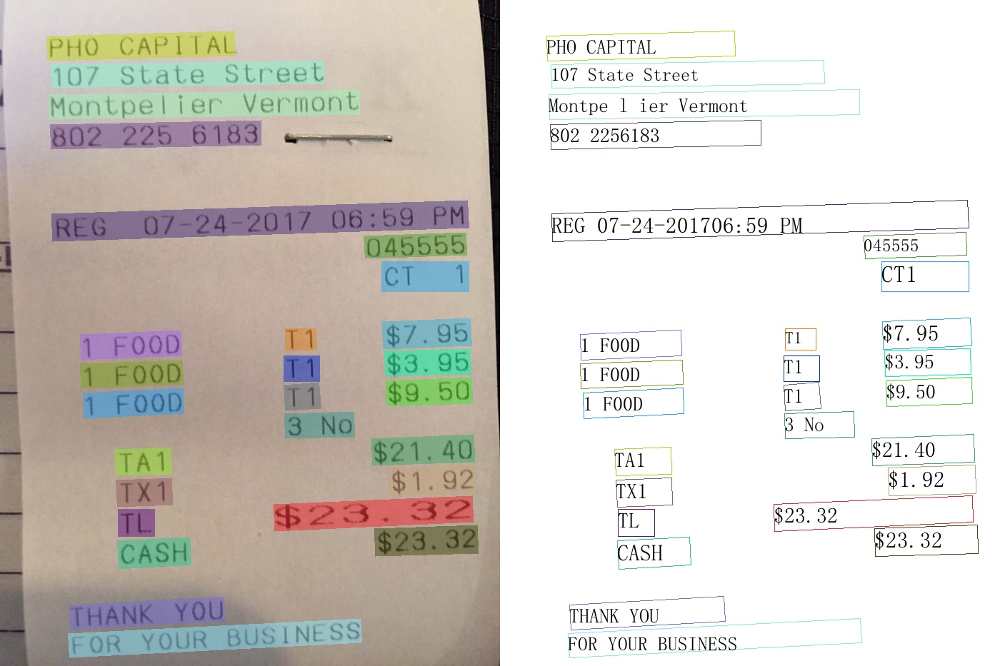

# PaddleOCR 快速开始

**说明：** 本文主要介绍PaddleOCR wheel包对PP-OCR系列模型的快速使用，如要体验文档分析相关功能，请参考[PP-Structure快速使用教程](../ppstructure/overview.md)。

## 1. 安装

### 1.1 安装PaddlePaddle

> 如果您没有基础的Python运行环境，请参考[运行环境准备](./environment.md)。

- 您的机器安装的是CUDA 11，请运行以下命令安装

  ```bash linenums="1"
  pip install paddlepaddle-gpu
  ```

- 您的机器是CPU，请运行以下命令安装

  ```bash linenums="1"
  pip install paddlepaddle
  ```

更多的版本需求，请参照[飞桨官网安装文档](https://www.paddlepaddle.org.cn/install/quick)中的说明进行操作。

### 1.2 安装PaddleOCR whl包

```bash linenums="1"
pip install paddleocr
```

- 对于Windows环境用户：直接通过pip安装的shapely库可能出现`[winRrror 126] 找不到指定模块的问题`。建议从[这里](https://www.lfd.uci.edu/~gohlke/pythonlibs/#shapely)下载shapely安装包完成安装。

## 2. 便捷使用

### 2.1 命令行使用

PaddleOCR提供了一系列测试图片，点击[这里](https://paddleocr.bj.bcebos.com/dygraph_v2.1/ppocr_img.zip)下载并解压，然后在终端中切换到相应目录

```bash linenums="1"
cd /path/to/ppocr_img
```

如果不使用提供的测试图片，可以将下方`--image_dir`参数替换为相应的测试图片路径。

#### 2.1.1 中英文模型

- 检测+方向分类器+识别全流程：`--use_angle_cls true`设置使用方向分类器识别180度旋转文字，`--use_gpu false`设置不使用GPU

  ```bash linenums="1"
  paddleocr --image_dir ./imgs/11.jpg --use_angle_cls true --use_gpu false
  ```

  结果是一个list，每个item包含了文本框，文字和识别置信度

  ```bash linenums="1"
  [[[28.0, 37.0], [302.0, 39.0], [302.0, 72.0], [27.0, 70.0]], ('纯臻营养护发素', 0.9658738374710083)]
  ......
  ```

  此外，paddleocr也支持输入pdf文件，并且可以通过指定参数`page_num`来控制推理前面几页，默认为0，表示推理所有页。

  ```bash linenums="1"
  paddleocr --image_dir ./xxx.pdf --use_angle_cls true --use_gpu false --page_num 2
  ```

- 单独使用检测：设置`--rec`为`false`

  ```bash linenums="1"
  paddleocr --image_dir ./imgs/11.jpg --rec false
  ```

  结果是一个list，每个item只包含文本框

  ```bash linenums="1"
  [[27.0, 459.0], [136.0, 459.0], [136.0, 479.0], [27.0, 479.0]]
  [[28.0, 429.0], [372.0, 429.0], [372.0, 445.0], [28.0, 445.0]]
  ......
  ```

- 单独使用识别：设置`--det`为`false`

  ```bash linenums="1"
  paddleocr --image_dir ./imgs_words/ch/word_1.jpg --det false
  ```

  结果是一个list，每个item只包含识别结果和识别置信度

  ```bash linenums="1"
  ['韩国小馆', 0.994467]
  ```

**版本说明**
paddleocr默认使用PP-OCRv4模型(`--ocr_version PP-OCRv4`)，如需使用其他版本可通过设置参数`--ocr_version`，具体版本说明如下：

| 版本名称 | 版本说明                                           |
| -------- | -------------------------------------------------- |
| PP-OCRv4 | 支持中、英文检测和识别，方向分类器，支持多语种识别 |
| PP-OCRv3 | 支持中、英文检测和识别，方向分类器，支持多语种识别 |
| PP-OCRv2 | 支持中英文的检测和识别，方向分类器，多语言暂未更新 |
| PP-OCR   | 支持中、英文检测和识别，方向分类器，支持多语种识别 |

如需新增自己训练的模型，可以在[paddleocr](https://github.com/PaddlePaddle/PaddleOCR/blob/c65a66c5fd37dee64916a8b2a2c84ea273d98cac/paddleocr.py)中增加模型链接和字段，重新编译即可。

更多whl包使用可参考[whl包文档](./blog/whl.md)

#### 2.1.2 多语言模型

PaddleOCR目前支持80个语种，可以通过修改`--lang`参数进行切换，对于英文模型，指定`--lang=en`。

``` bash
paddleocr --image_dir ./imgs_en/254.jpg --lang=en
```




结果是一个list，每个item包含了文本框，文字和识别置信度

```text linenums="1"
[[[67.0, 51.0], [327.0, 46.0], [327.0, 74.0], [68.0, 80.0]], ('PHOCAPITAL', 0.9944712519645691)]
[[[72.0, 92.0], [453.0, 84.0], [454.0, 114.0], [73.0, 122.0]], ('107 State Street', 0.9744491577148438)]
[[[69.0, 135.0], [501.0, 125.0], [501.0, 156.0], [70.0, 165.0]], ('Montpelier Vermont', 0.9357033967971802)]
......
```

常用的多语言简写包括

| 语种     | 缩写        |     | 语种     | 缩写   |     | 语种     | 缩写   |
| -------- | ----------- | --- | -------- | ------ | --- | -------- | ------ |
| 中文     | ch          |     | 法文     | fr     |     | 日文     | japan  |
| 英文     | en          |     | 德文     | german |     | 韩文     | korean |
| 繁体中文 | chinese_cht |     | 意大利文 | it     |     | 俄罗斯文 | ru     |

全部语种及其对应的缩写列表可查看[多语言模型教程](./blog/multi_languages.md)

### 2.2 Python脚本使用

#### 2.2.1 中英文与多语言使用

通过Python脚本使用PaddleOCR whl包，whl包会自动下载ppocr轻量级模型作为默认模型。

- 检测+方向分类器+识别全流程

```python linenums="1"
from paddleocr import PaddleOCR, draw_ocr

# Paddleocr目前支持的多语言语种可以通过修改lang参数进行切换
# 例如`ch`, `en`, `fr`, `german`, `korean`, `japan`
ocr = PaddleOCR(use_angle_cls=True, lang="ch")  # need to run only once to download and load model into memory
img_path = './imgs/11.jpg'
result = ocr.ocr(img_path, cls=True)
for idx in range(len(result)):
    res = result[idx]
    for line in res:
        print(line)

# 显示结果
from PIL import Image
result = result[0]
image = Image.open(img_path).convert('RGB')
boxes = [line[0] for line in result]
txts = [line[1][0] for line in result]
scores = [line[1][1] for line in result]
im_show = draw_ocr(image, boxes, txts, scores, font_path='./fonts/simfang.ttf')
im_show = Image.fromarray(im_show)
im_show.save('result.jpg')
```

结果是一个list，每个item包含了文本框，文字和识别置信度

```bash linenums="1"
[[[28.0, 37.0], [302.0, 39.0], [302.0, 72.0], [27.0, 70.0]], ('纯臻营养护发素', 0.9658738374710083)]
......
```

结果可视化


如果输入是PDF文件，那么可以参考下面代码进行可视化

```python linenums="1"
from paddleocr import PaddleOCR, draw_ocr

# Paddleocr目前支持的多语言语种可以通过修改lang参数进行切换
# 例如`ch`, `en`, `fr`, `german`, `korean`, `japan`
PAGE_NUM = 10 # 将识别页码前置作为全局，防止后续打开pdf的参数和前文识别参数不一致 / Set the recognition page number
pdf_path = 'default.pdf'
ocr = PaddleOCR(use_angle_cls=True, lang="ch", page_num=PAGE_NUM)  # need to run only once to download and load model into memory
# ocr = PaddleOCR(use_angle_cls=True, lang="ch", page_num=PAGE_NUM,use_gpu=0) # 如果需要使用GPU，请取消此行的注释 并注释上一行 / To Use GPU,uncomment this line and comment the above one.
result = ocr.ocr(pdf_path, cls=True)
for idx in range(len(result)):
    res = result[idx]
    if res == None: # 识别到空页就跳过，防止程序报错 / Skip when empty result detected to avoid TypeError:NoneType
        print(f"[DEBUG] Empty page {idx+1} detected, skip it.")
        continue
    for line in res:
        print(line)
# 显示结果
import fitz
from PIL import Image
import cv2
import numpy as np
imgs = []
with fitz.open(pdf_path) as pdf:
    for pg in range(0, PAGE_NUM):
        page = pdf[pg]
        mat = fitz.Matrix(2, 2)
        pm = page.get_pixmap(matrix=mat, alpha=False)
        # if width or height > 2000 pixels, don't enlarge the image
        if pm.width > 2000 or pm.height > 2000:
            pm = page.get_pixmap(matrix=fitz.Matrix(1, 1), alpha=False)
        img = Image.frombytes("RGB", [pm.width, pm.height], pm.samples)
        img = cv2.cvtColor(np.array(img), cv2.COLOR_RGB2BGR)
        imgs.append(img)
for idx in range(len(result)):
    res = result[idx]
    if res == None:
        continue
    image = imgs[idx]
    boxes = [line[0] for line in res]
    txts = [line[1][0] for line in res]
    scores = [line[1][1] for line in res]
    im_show = draw_ocr(image, boxes, txts, scores, font_path='doc/fonts/simfang.ttf')
    im_show = Image.fromarray(im_show)
    im_show.save('result_page_{}.jpg'.format(idx))
```

- 使用滑动窗口进行检测和识别

要使用滑动窗口进行光学字符识别（OCR），可以使用以下代码片段：

```python linenums="1"
from paddleocr import PaddleOCR
from PIL import Image, ImageDraw, ImageFont

# 初始化OCR引擎
ocr = PaddleOCR(use_angle_cls=True, lang="en")

img_path = "./very_large_image.jpg"
slice = {'horizontal_stride': 300, 'vertical_stride': 500, 'merge_x_thres': 50, 'merge_y_thres': 35}
results = ocr.ocr(img_path, cls=True, slice=slice)

# 加载图像
image = Image.open(img_path).convert("RGB")
draw = ImageDraw.Draw(image)
font = ImageFont.truetype("./doc/fonts/simfang.ttf", size=20)  # 根据需要调整大小

# 处理并绘制结果
for res in results:
    for line in res:
        box = [tuple(point) for point in line[0]]
        # 找出边界框
        box = [(min(point[0] for point in box), min(point[1] for point in box)),
               (max(point[0] for point in box), max(point[1] for point in box))]
        txt = line[1][0]
        draw.rectangle(box, outline="red", width=2)  # 绘制矩形
        draw.text((box[0][0], box[0][1] - 25), txt, fill="blue", font=font)  # 在矩形上方绘制文本

# 保存结果
image.save("result.jpg")

```

此示例初始化了启用角度分类的PaddleOCR实例，并将语言设置为英语。然后调用`ocr`方法，并使用多个参数来自定义检测和识别过程，包括处理图像切片的`slice`参数。

要更全面地了解切片操作，请参考[切片操作文档](./blog/slice.md)。

## 3. 小结

通过本节内容，相信您已经熟练掌握PaddleOCR whl包的使用方法并获得了初步效果。

飞桨AI套件（PaddleX）提供了飞桨生态优质模型，是训压推一站式全流程高效率开发平台，其使命是助力AI技术快速落地，愿景是使人人成为AI Developer！目前PP-OCRv4已上线PaddleX，您可以进入[通用OCR](https://aistudio.baidu.com/aistudio/modelsdetail?modelId=286)体验模型训练、压缩和推理部署全流程。
