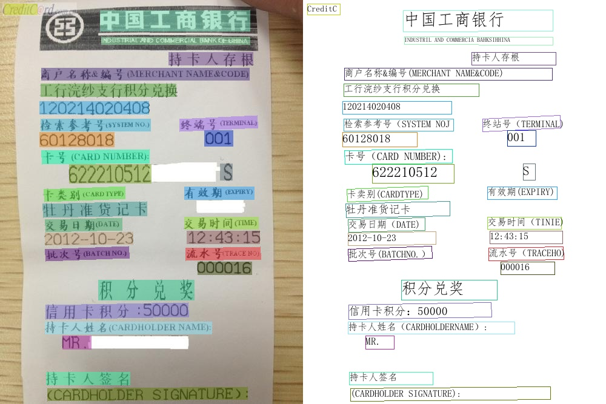
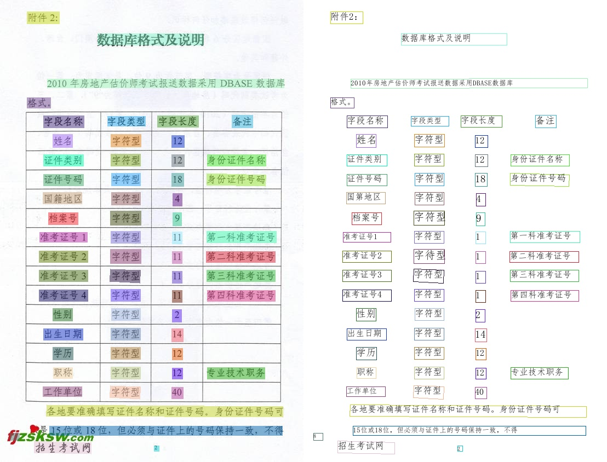
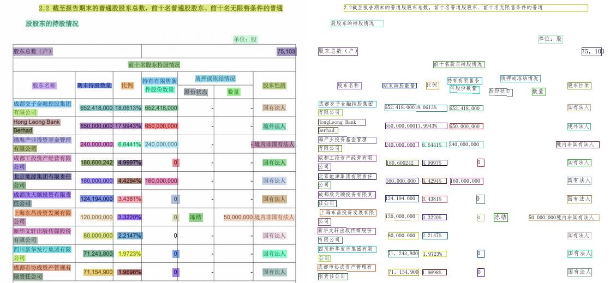

# Visualization

## PP-OCRv3

### PP-OCRv3 Chinese model

### PP-OCRv3 English model

### PP-OCRv3 Multilingual model

## PP-OCRv2

## ch_ppocr_server_2.0

## en_ppocr_mobile_2.0

## (multilingual)_ppocr_mobile_2.0

