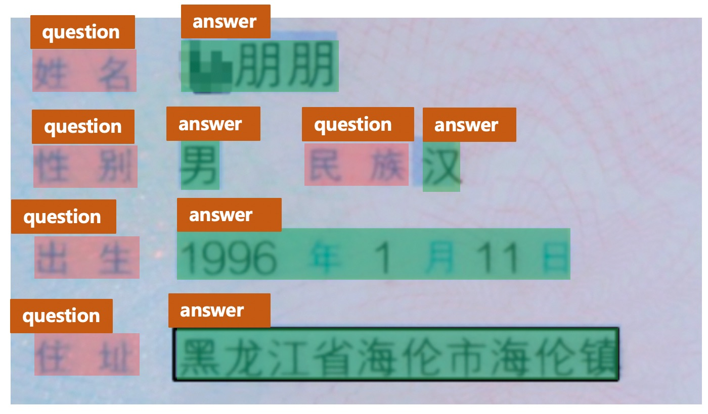

# Key Information Extraction Pipeline

## 1. Introduction

### 1.1 Background

Key information extraction (KIE) refers to extracting key information from text or images. As the downstream task of OCR, KIE of document image has many practical application scenarios, such as form recognition, ticket information extraction, ID card information extraction, etc. However, it is time-consuming and laborious to extract  key information from these document images by manpower. It's challengable but also valuable to combine multi-modal features (visual, layout, text, etc) together and complete KIE tasks.

For the document images in a specific scene, the position and layout of the key information are relatively fixed. Therefore, in the early stage of the research, there are many methods based on template matching to extract the key information. This method is still widely used in many simple scenarios at present. However, it takes long time to adjut the template for different scenarios.

The KIE in the document image generally contains 2 subtasks, which is as shown follows.

* (1) SER: semantic entity recognition, which classifies each detected textline, such as dividing it into name and ID No. As shown in the red boxes in the following figure.

* (2) RE: relationship extraction, which matches the question and answer based on SER results. As shown in the figure below, the yellow arrows match the question and answer.


### 1.2 Mainstream Deep-learning Solutions

General KIE methods are based on Named Entity Recognition (NER), but such methods only use text information and ignore location and visual feature information, which leads to limited accuracy. In recent years, most scholars have started to combine mutil-modal features to improve the accuracy of KIE model. The main methods are as follows:

* (1) Grid based methods. These methods mainly focus on the fusion of multi-modal information at the image level. Most texts are of character granularity. The text and structure information embedding method is simple, such as the algorithm of chargrid [1].

* (2) Token based methods. These methods refer to the NLP methods such as Bert, which encode the position, vision and other feature information into the multi-modal model, and conduct pre-training on large-scale datasets, so that in downstream tasks, only a small amount of annotation data is required to obtain excellent results. The representative algorithms are layoutlm [2], layoutlmv2 [3], layoutxlm [4], structext [5], etc.

* (3) GCN based methods. These methods try to learn the structural information between images and characters, so as to solve the problem of extracting open set information (templates not seen in the training set), such as GCN [6], SDMGR [7] and other algorithms.

* (4) End to end based methods: these methods put the existing OCR character recognition and KIE information extraction tasks into a unified network for common learning, and strengthen each other in the learning process. Such as TRIE [8].

For more detailed introduction of the algorithms, please refer to Chapter 6 of [Diving into OCR](https://aistudio.baidu.com/aistudio/education/group/info/25207).

## 2. KIE Pipeline

Token based methods such as LayoutXLM are implemented in PaddleOCR. What's more, in PP-StructureV2, we simplify the LayoutXLM model and proposed VI-LayoutXLM, in which the visual feature extraction module is removed for speed-up. The textline sorting strategy conforming to the human reading order and UDML knowledge distillation strategy are utilized for higher model accuracy.

In the non end-to-end KIE method, KIE needs at least **2 steps**. Firstly, the OCR model is used to extract the text and its position. Secondly, the KIE model is used to extract the key information according to the image, text position and text content.

### 2.1 Train OCR Models

#### 2.1.1 Text Detection

##### (1) Data

Most of the models provided in PaddleOCR are general models. In the process of text detection, the detection of adjacent text lines is generally based on the distance of the position. As shown in the figure above, when using PP-OCRv3 general English detection model for text detection, it is easy to detect the two fields representing different propoerties as one. Therefore, it is suggested to finetune a detection model according to your scenario firstly during the KIE task.

During data annotation, the different key information needs to be separated. Otherwise, it will increase the difficulty of subsequent KIE tasks.

For downstream tasks, generally speaking, `200~300` training images can guarantee the basic training effect. If there is not too much prior knowledge, **`200~300`** images can be labeled firstly for subsequent text detection model training.

##### (2) Model

In terms of model selection, PP-OCRv3 detection model is recommended. For more information about the training methods of the detection model, please refer to: [Text detection tutorial](../../doc/doc_en/detection_en.md) and [PP-OCRv3 detection model tutorial](../../doc/doc_ch/PPOCRv3_det_train.md).

#### 2.1.2 Text recognition

Compared with the natural scene, the text recognition in the document image is generally relatively easier (the background is not too complex), so **it is suggested to** try the PP-OCRv3 general text recognition model provided in PaddleOCR ([PP-OCRv3 model list](../../doc/doc_en/models_list_en.md))

##### (1) Data

However, there are also some challenges in some document scenarios, such as rare words in ID card scenarios and special fonts in invoice and other scenarios. These problems will increase the difficulty of text recognition. At this time, if you want to ensure or further improve the model accuracy, it is recommended to load PP-OCRv3 model based on the text recognition dataset of specific document scenarios for finetuning.

In the process of model finetuning, it is recommended to prepare at least `5000` vertical scene text recognition images to ensure the basic model fine-tuning effect. If you want to improve the accuracy and generalization ability of the model, you can synthesize more text recognition images similar to the scene, collect general real text recognition data from the public data set, and add them to the text recognition training process. In the training process, it is suggested that the ratio of real data, synthetic data and general data of each epoch should be around `1:1:1`, which can be controlled by setting the sampling ratio of different data sources. If there are 3 training text files, including 10k, 20k and 50k pieces of data respectively, the data can be set in the configuration file as follows:

```yaml linenums="1" linenums="1"
Train:
  dataset:
    name: SimpleDataSet
    data_dir: ./train_data/
    label_file_list:
    - ./train_data/train_list_10k.txt
    - ./train_data/train_list_10k.txt
    - ./train_data/train_list_50k.txt
    ratio_list: [1.0, 0.5, 0.2]
    ...
```

##### (2) Model

In terms of model selection, PP-OCRv3 recognition model is recommended. For more information about the training methods of the recognition model, please refer to: [Text recognition tutorial](../../doc/doc_en/recognition_en.md) and [PP-OCRv3 model list](../../doc/doc_en/models_list_en.md).

### 2.2 Train KIE Models

There are two main methods to extract the key information from the recognized texts.

(1) Directly use SER model to obtain the key information category. For example, in the ID card scenario, we mark "name" and "Geoff Sample" as "name_key" and "name_value", respectively. The **text field** corresponding to the category "name_value" finally identified is the key information we need.

(2) Joint use SER and RE models. For this case, we firstly use SER model to obtain all questions (keys) and questions (values) for the image text, and then use RE model to match all keys and values to find the relationship, so as to complete the extraction of key information.

#### 2.2.1 SER

Take the ID card scenario as an example. The key information generally includes `name`, `DOB`, etc. We can directly mark the corresponding fields as specific categories, as shown in the following figure.

<div align="center">
    
</div>

**Note:**

* In the labeling process, text content without key information about KIE shall be labeled as`other`, which is equivalent to background information. For example, in the ID card scenario, if we do not pay attention to `DOB` information, we can mark the categories of `DOB` and `Area manager` as `other`.
* In the annotation process of, it is required to annotate the **textline** position rather than the character.

In terms of data, generally speaking, for relatively fixed scenes, **50** training images can achieve acceptable effects. You can refer to [PPOCRLabel](https://github.com/PFCCLab/PPOCRLabel/blob/main/README.md) for finish the labeling process.

In terms of model, it is recommended to use the VI-layoutXLM model proposed in PP-StructureV2. It is improved based on the LayoutXLM model, removing the visual feature extraction module, and further improving the model inference speed without the significant reduction on model accuracy. For more tutorials, please refer to [VI-LayoutXLM introduction](../../doc/doc_en/algorithm_kie_vi_layoutxlm_en.md) and [KIE tutorial](../../doc/doc_en/kie_en.md).

#### 2.2.2 SER + RE

The SER model is mainly used to identify all keys and values in the document image, and the RE model is mainly used to match all keys and values.

Taking the ID card scenario as an example, the key information generally includes key information such as `name`, `DOB`, etc. in the SER stage, we need to identify all questions (keys) and answers (values). The demo annotation is as follows. All keys can be annotated as `question`, and all values can be annotated as `answer`.



In the RE stage, the ID and connection information of each field need to be marked, as shown in the following figure.


For each textline, you need to add 'ID' and 'linking' field information. The 'ID' records the unique identifier of the textline. Different text contents in the same images cannot be repeated. The 'linking' is a list that records the connection information between different texts. If the ID of the field "name" is 0 and the ID of the field "Geoff Sample" is 1, then they all have [[0, 1]] 'linking' marks, indicating that the fields with `id=0` and `id=1` form a key value relationship (the fields such as DOB and Expires are similar, and will not be repeated here).

**Note:**

During annotation, if value is multiple text lines, a key-value pair can be added in linking, such as `[[0, 1], [0, 2]]`.

In terms of data, generally speaking, for relatively fixed scenes, about **50** training images can achieve acceptable effects.

In terms of model, it is recommended to use the VI-layoutXLM model proposed in PP-StructureV2. It is improved based on the LayoutXLM model, removing the visual feature extraction module, and further improving the model inference speed without the significant reduction on model accuracy. For more tutorials, please refer to [VI-LayoutXLM introduction](../../doc/doc_en/algorithm_kie_vi_layoutxlm_en.md) and [KIE tutorial](../../doc/doc_en/kie_en.md).

## 3. Reference

[1] Katti A R, Reisswig C, Guder C, et al. Chargrid: Towards understanding 2d documents[J]. arXiv preprint arXiv:1809.08799, 2018.

[2] Xu Y, Li M, Cui L, et al. Layoutlm: Pre-training of text and layout for document image understanding[C]//Proceedings of the 26th ACM SIGKDD International Conference on Knowledge Discovery & Data Mining. 2020: 1192-1200.

[3] Xu Y, Xu Y, Lv T, et al. LayoutLMv2: Multi-modal pre-training for visually-rich document understanding[J]. arXiv preprint arXiv:2012.14740, 2020.

[4]: Xu Y, Lv T, Cui L, et al. Layoutxlm: Multimodal pre-training for multilingual visually-rich document understanding[J]. arXiv preprint arXiv:2104.08836, 2021.

[5] Li Y, Qian Y, Yu Y, et al. StrucTexT: Structured Text Understanding with Multi-Modal Transformers[C]//Proceedings of the 29th ACM International Conference on Multimedia. 2021: 1912-1920.

[6] Liu X, Gao F, Zhang Q, et al. Graph convolution for multimodal information extraction from visually rich documents[J]. arXiv preprint arXiv:1903.11279, 2019.

[7] Sun H, Kuang Z, Yue X, et al. Spatial Dual-Modality Graph Reasoning for Key Information Extraction[J]. arXiv preprint arXiv:2103.14470, 2021.

[8] Zhang P, Xu Y, Cheng Z, et al. Trie: End-to-end text reading and information extraction for document understanding[C]//Proceedings of the 28th ACM International Conference on Multimedia. 2020: 1413-1422.
