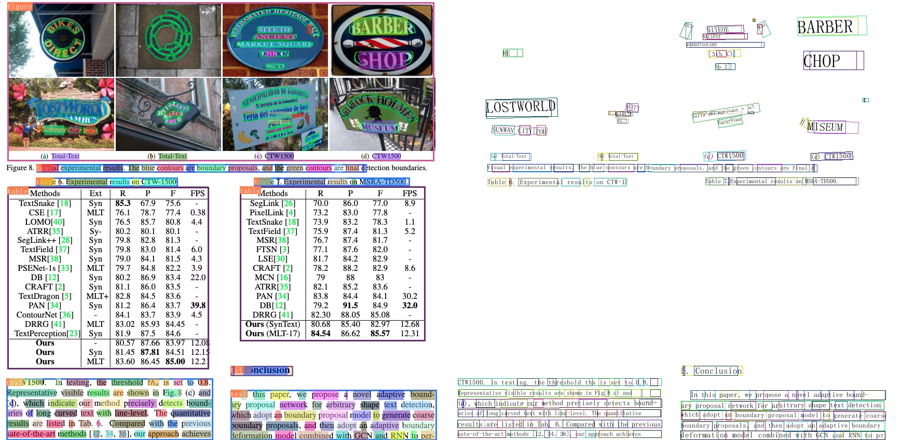
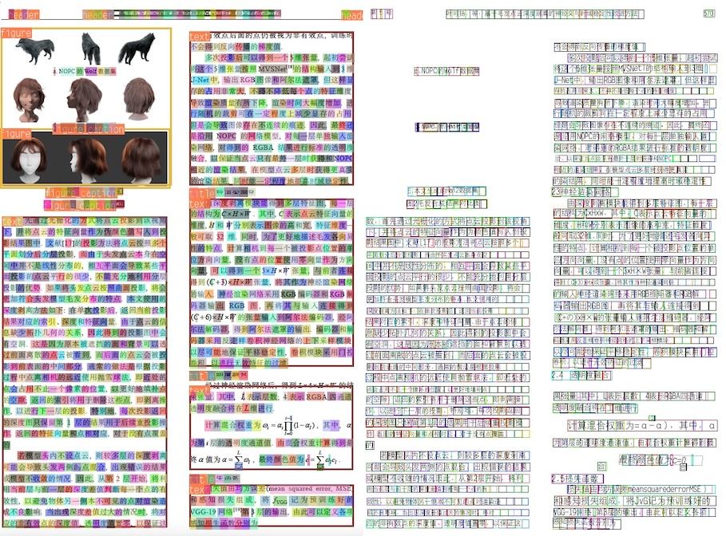

# 返回识别位置

根据横排的文档，识别模型不仅返回识别的内容，还返回每个文字的位置。

## 英文文档恢复

### 先下载推理模型

```bash linenums="1"
cd PaddleOCR/ppstructure

## download model
mkdir inference && cd inference
## Download the detection model of the ultra-lightweight English PP-OCRv3 model and unzip it
https://paddleocr.bj.bcebos.com/PP-OCRv3/english/en_PP-OCRv3_det_infer.tar && tar xf en_PP-OCRv3_det_infer.tar
## Download the recognition model of the ultra-lightweight English PP-OCRv3 model and unzip it
wget https://paddleocr.bj.bcebos.com/PP-OCRv3/english/en_PP-OCRv3_rec_infer.tar && tar xf en_PP-OCRv3_rec_infer.tar
## Download the ultra-lightweight English table inch model and unzip it
wget https://paddleocr.bj.bcebos.com/ppstructure/models/slanet/paddle3.0b2/en_ppstructure_mobile_v2.0_SLANet_infer.tar
tar xf en_ppstructure_mobile_v2.0_SLANet_infer.tar
## Download the layout model of publaynet dataset and unzip it
wget https://paddleocr.bj.bcebos.com/ppstructure/models/layout/picodet_lcnet_x1_0_fgd_layout_infer.tar
tar xf picodet_lcnet_x1_0_fgd_layout_infer.tar
cd ..
```

### 然后在/ppstructure/目录下使用下面的指令推理

```bash linenums="1"
python predict_system.py \
    --image_dir=./docs/ppstructure/images/table_1.png \
    --det_model_dir=inference/en_PP-OCRv3_det_infer \
    --rec_model_dir=inference/en_PP-OCRv3_rec_infer \
    --rec_char_dict_path=../ppocr/utils/en_dict.txt \
    --table_model_dir=inference/en_ppstructure_mobile_v2.0_SLANet_infer \
    --table_char_dict_path=../ppocr/utils/dict/table_structure_dict.txt \
    --layout_model_dir=inference/picodet_lcnet_x1_0_fgd_layout_infer \
    --layout_dict_path=../ppocr/utils/dict/layout_dict/layout_publaynet_dict.txt \
    --vis_font_path=../doc/fonts/simfang.ttf \
    --recovery=True \
    --output=../output/ \
    --return_word_box=True
```

### 在`../output/structure/table_1/show_0.jpg`下查看推理结果的可视化，如下图所示



## 针对中文文档恢复

### 先下载推理模型

```bash linenums="1"
cd PaddleOCR/ppstructure

## download model
cd inference
## Download the detection model of the ultra-lightweight Chinese PP-OCRv3 model and unzip it
wget https://paddleocr.bj.bcebos.com/PP-OCRv3/chinese/ch_PP-OCRv3_det_infer.tar && tar xf ch_PP-OCRv3_det_infer.tar
## Download the recognition model of the ultra-lightweight Chinese PP-OCRv3 model and unzip it
wget https://paddleocr.bj.bcebos.com/PP-OCRv3/chinese/ch_PP-OCRv3_rec_infer.tar && tar xf ch_PP-OCRv3_rec_infer.tar
## Download the ultra-lightweight Chinese table inch model and unzip it
wget https://paddleocr.bj.bcebos.com/ppstructure/models/slanet/paddle3.0b2/ch_ppstructure_mobile_v2.0_SLANet_infer.tar
tar xf ch_ppstructure_mobile_v2.0_SLANet_infer.tar
## Download the layout model of CDLA dataset and unzip it
wget https://paddleocr.bj.bcebos.com/ppstructure/models/layout/picodet_lcnet_x1_0_fgd_layout_cdla_infer.tar
tar xf picodet_lcnet_x1_0_fgd_layout_cdla_infer.tar
cd ..
```

### 上传下面的测试图片 "2.png" 至目录 ./docs/table/ 中


### 然后在/ppstructure/目录下使用下面的指令推理

```bash linenums="1"
python predict_system.py \
    --image_dir=./docs/table/2.png \
    --det_model_dir=inference/ch_PP-OCRv3_det_infer \
    --rec_model_dir=inference/ch_PP-OCRv3_rec_infer \
    --rec_char_dict_path=../ppocr/utils/ppocr_keys_v1.txt \
    --table_model_dir=inference/ch_ppstructure_mobile_v2.0_SLANet_infer \
    --table_char_dict_path=../ppocr/utils/dict/table_structure_dict_ch.txt \
    --layout_model_dir=inference/picodet_lcnet_x1_0_fgd_layout_cdla_infer \
    --layout_dict_path=../ppocr/utils/dict/layout_dict/layout_cdla_dict.txt \
    --vis_font_path=../doc/fonts/chinese_cht.ttf \
    --recovery=True \
    --output=../output/ \
    --return_word_box=True
```

### 在`../output/structure/2/show_0.jpg`下查看推理结果的可视化，如下图所示


