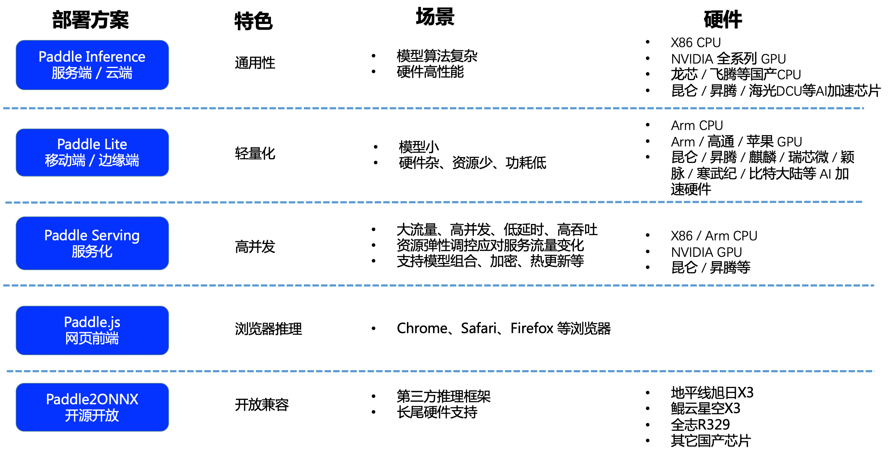

# PP-OCR Deployment

## Paddle Deployment Introduction

Paddle provides a variety of deployment schemes to meet the deployment requirements of different scenarios. Please choose according to the actual situation:

PP-OCR has supported muti deployment schemes. Click the link to get the specific tutorial.

- [Python Inference](./python_infer.en.md)
- [C++ Inference](./cpp_infer.en.md)
- [Serving (Python/C++)](./paddle_server.en.md)
- [Paddle-Lite (ARM CPU/OpenCL ARM GPU)](../../ppocr/infer_deploy/lite.en.md)
- [Paddle.js](../../ppocr/infer_deploy/paddle_js.en.md)
- [Jetson Inference](../../ppocr/infer_deploy/Jetson_infer.en.md)
- [Paddle2ONNX](../../ppocr/infer_deploy/paddle2onnx.en.md)

If you need the deployment tutorial of academic algorithm models other than PP-OCR, please directly enter the main page of corresponding algorithms, [entrance](../../algorithm/overview.en.md)。
