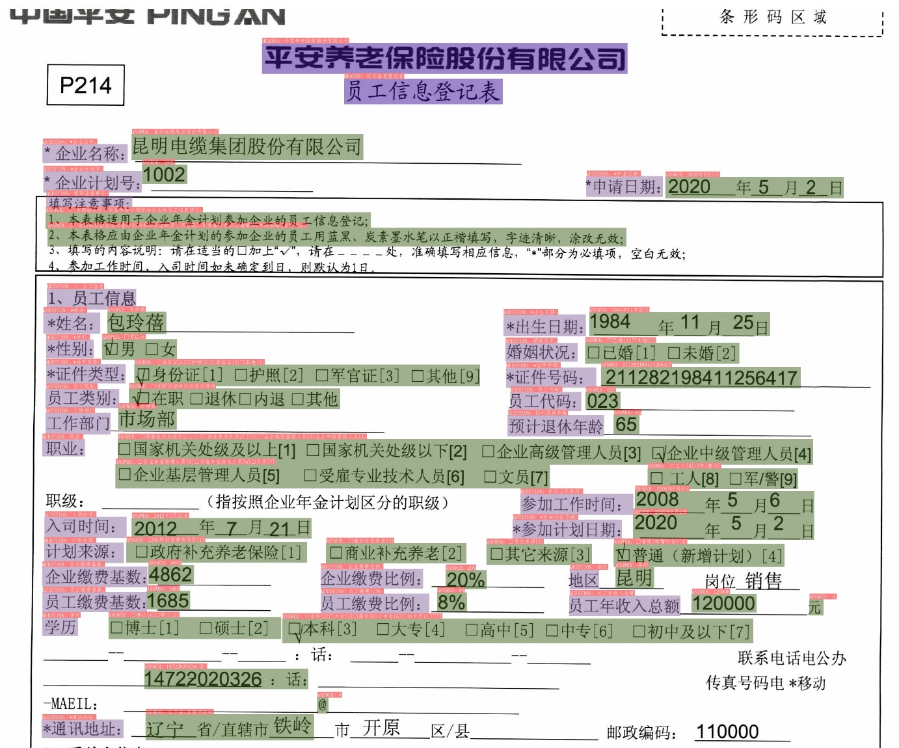
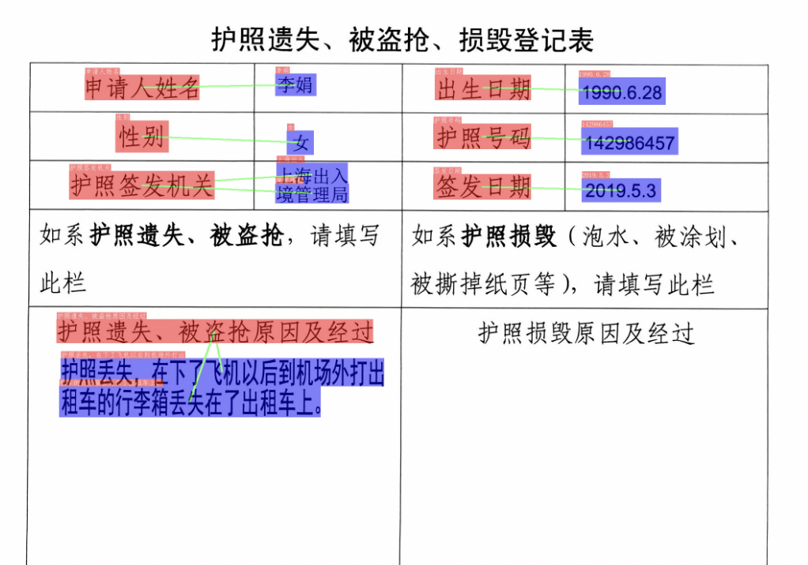

# Key Information Extraction (KIE)

## 1. Introduction

Key information extraction (KIE) refers to extracting key information from text or images. As downstream task of OCR, the key information extraction task of document image has many practical application scenarios, such as form recognition, ticket information extraction, ID card information extraction, etc.

PP-Structure conducts research based on the LayoutXLM multi-modal, and proposes the VI-LayoutXLM, which gets rid of visual features when finetuning the downstream tasks. An textline sorting method is also utilized to fit in reading order. What's more, UDML knowledge distillation is used for higher accuracy. Finally, the accuracy and inference speed of VI-LayoutXLM surpass those of LayoutXLM.

The main features of the key information extraction module in PP-Structure are as follows.

- Integrate multi-modal methods such as [LayoutXLM](https://arxiv.org/pdf/2104.08836.pdf), VI-LayoutXLM, and PP-OCR inference engine.
- Supports Semantic Entity Recognition (SER) and Relation Extraction (RE) tasks based on multimodal methods. Based on the SER task, the text recognition and classification in the image can be completed; based on the RE task, the relationship extraction of the text content in the image can be completed, such as judging the problem pair (pair).
- Supports custom training for SER tasks and RE tasks.
- Supports end-to-end system prediction and evaluation of OCR+SER.
- Supports end-to-end system prediction of OCR+SER+RE.
- Support SER model export and inference using PaddleInference.

## 2. Performance

We evaluate the methods on the Chinese dataset of [XFUND](https://github.com/doc-analysis/XFUND), and the performance is as follows

|Model | Backbone | Task | Config file | Hmean | Inference time (ms) | Download link|
| --- | --- |  --- | --- | --- | --- | --- |
|VI-LayoutXLM| VI-LayoutXLM-base | SER | [ser_vi_layoutxlm_xfund_zh_udml.yml](https://github.com/PaddlePaddle/PaddleOCR/tree/main/configs/kie/vi_layoutxlm/ser_vi_layoutxlm_xfund_zh_udml.yml)|**93.19%**| 15.49|[trained model](https://paddleocr.bj.bcebos.com/ppstructure/models/vi_layoutxlm/ser_vi_layoutxlm_xfund_pretrained.tar)|
|LayoutXLM| LayoutXLM-base | SER | [ser_layoutxlm_xfund_zh.yml](https://github.com/PaddlePaddle/PaddleOCR/tree/main/configs/kie/layoutlm_series/ser_layoutxlm_xfund_zh.yml)|90.38%| 19.49 | [trained model](https://paddleocr.bj.bcebos.com/pplayout/ser_LayoutXLM_xfun_zh.tar)|
|VI-LayoutXLM| VI-LayoutXLM-base | RE | [re_vi_layoutxlm_xfund_zh_udml.yml](https://github.com/PaddlePaddle/PaddleOCR/tree/main/configs/kie/vi_layoutxlm/re_vi_layoutxlm_xfund_zh_udml.yml)|**83.92%**| 15.49|[trained model](https://paddleocr.bj.bcebos.com/ppstructure/models/vi_layoutxlm/re_vi_layoutxlm_xfund_pretrained.tar)|
|LayoutXLM| LayoutXLM-base | RE | [re_layoutxlm_xfund_zh.yml](https://github.com/PaddlePaddle/PaddleOCR/tree/main/configs/kie/layoutlm_series/re_layoutxlm_xfund_zh.yml)|74.83%| 19.49|[trained model](https://paddleocr.bj.bcebos.com/pplayout/re_LayoutXLM_xfun_zh.tar)|

- Note：Inference environment：V100 GPU + cuda10.2 + cudnn8.1.1 + TensorRT 7.2.3.4，tested using fp16.

For more KIE models in PaddleOCR, please refer to [KIE model zoo](../../algorithm/overview.en.md).

## 3. Visualization

There are two main solutions to the key information extraction task based on VI-LayoutXLM series model.

(1) Text detection + text recognition + semantic entity recognition (SER)

(2) Text detection + text recognition + semantic entity recognition (SER) + relationship extraction (RE)

The following images are demo results of the SER and RE models. For more detailed introduction to the above solutions, please refer to [KIE Guide](../blog/how_to_do_kie.en.md).

### 3.1 SER

Demo results for SER task are as follows.




**Note:** test pictures are from [xfund dataset](https://github.com/doc-analysis/XFUND), [invoice dataset](https://aistudio.baidu.com/aistudio/datasetdetail/165561) and a composite ID card dataset.

Boxes of different colors in the image represent different categories.

The invoice and application form images have three categories: `request`, `answer` and `header`. The `question` and `answer` can be used to extract the relationship.

For the ID card image, the model can directly identify the key information such as `name`, `gender`, `nationality`, so that the subsequent relationship extraction process is not required, and the key information extraction task can be completed using only one model.

### 3.2 RE

Demo results for RE task are as follows.




Red boxes are questions, blue boxes are answers. The green lines means the two connected objects are a pair.

## 4. Usage

### 4.1 Prepare for the environment

Use the following command to install KIE dependencies.

```bash linenums="1"
git clone https://github.com/PaddlePaddle/PaddleOCR.git
cd PaddleOCR
pip install -r requirements.txt
pip install -r ppstructure/kie/requirements.txt
# 安装PaddleOCR引擎用于预测
pip install paddleocr -U
```

NOTE: For KIE tasks, it is necessary to downgrade the Paddle framework version (Paddle<2.6) and the PaddleNLP version (PaddleNLP<2.6).

The visualized results of SER are saved in the `./output` folder by default. Examples of results are as follows.


### 4.2 Quick start

Here we use XFUND dataset to quickly experience the SER model and RE model.

#### 4.2.1 Prepare for the dataset

```bash linenums="1"
mkdir train_data
cd train_data
# download and uncompress the dataset
wget https://paddleocr.bj.bcebos.com/ppstructure/dataset/XFUND.tar && tar -xf XFUND.tar
cd ..
```

#### 4.2.2 Predict images using the trained model

Use the following command to download the models.

```bash linenums="1"
mkdir pretrained_model
cd pretrained_model
# download and uncompress the SER trained model
wget https://paddleocr.bj.bcebos.com/ppstructure/models/vi_layoutxlm/ser_vi_layoutxlm_xfund_pretrained.tar && tar -xf ser_vi_layoutxlm_xfund_pretrained.tar

# download and uncompress the RE trained model
wget https://paddleocr.bj.bcebos.com/ppstructure/models/vi_layoutxlm/re_vi_layoutxlm_xfund_pretrained.tar && tar -xf re_vi_layoutxlm_xfund_pretrained.tar
```

If you want to use OCR engine to obtain end-to-end prediction results, you can use the following command to predict.

```bash linenums="1"
# just predict using SER trained model
python3 tools/infer_kie_token_ser.py \
  -c configs/kie/vi_layoutxlm/ser_vi_layoutxlm_xfund_zh.yml \
  -o Architecture.Backbone.checkpoints=./pretrained_model/ser_vi_layoutxlm_xfund_pretrained/best_accuracy \
  Global.infer_img=./ppstructure/docs/kie/input/zh_val_42.jpg

# predict using SER and RE trained model at the same time
python3 ./tools/infer_kie_token_ser_re.py \
  -c configs/kie/vi_layoutxlm/re_vi_layoutxlm_xfund_zh.yml \
  -o Architecture.Backbone.checkpoints=./pretrained_model/re_vi_layoutxlm_xfund_pretrained/best_accuracy \
  Global.infer_img=./train_data/XFUND/zh_val/image/zh_val_42.jpg \
  -c_ser configs/kie/vi_layoutxlm/ser_vi_layoutxlm_xfund_zh.yml \
  -o_ser Architecture.Backbone.checkpoints=./pretrained_model/ser_vi_layoutxlm_xfund_pretrained/best_accuracy
```

The visual result images and the predicted text file will be saved in the `Global.save_res_path` directory.

If you want to use a custom ocr model, you can set it through the following fields

- `Global.kie_det_model_dir`: the detection inference model path
- `Global.kie_rec_model_dir`: the recognition inference model path

If you want to load the text detection and recognition results collected before, you can use the following command to predict.

```bash linenums="1"
# just predict using SER trained model
python3 tools/infer_kie_token_ser.py \
  -c configs/kie/vi_layoutxlm/ser_vi_layoutxlm_xfund_zh.yml \
  -o Architecture.Backbone.checkpoints=./pretrained_model/ser_vi_layoutxlm_xfund_pretrained/best_accuracy \
  Global.infer_img=./train_data/XFUND/zh_val/val.json \
  Global.infer_mode=False

# predict using SER and RE trained model at the same time
python3 ./tools/infer_kie_token_ser_re.py \
  -c configs/kie/vi_layoutxlm/re_vi_layoutxlm_xfund_zh.yml \
  -o Architecture.Backbone.checkpoints=./pretrained_model/re_vi_layoutxlm_xfund_pretrained/best_accuracy \
  Global.infer_img=./train_data/XFUND/zh_val/val.json \
  Global.infer_mode=False \
  -c_ser configs/kie/vi_layoutxlm/ser_vi_layoutxlm_xfund_zh.yml \
  -o_ser Architecture.Backbone.checkpoints=./pretrained_model/ser_vi_layoutxlm_xfund_pretrained/best_accuracy
```

#### 4.2.3 Inference using PaddleInference

Firstly, download the inference SER inference model.

```bash linenums="1"
mkdir inference
cd inference
wget https://paddleocr.bj.bcebos.com/ppstructure/models/vi_layoutxlm/ser_vi_layoutxlm_xfund_infer.tar && tar -xf ser_vi_layoutxlm_xfund_infer.tar
wget https://paddleocr.bj.bcebos.com/ppstructure/models/vi_layoutxlm/re_vi_layoutxlm_xfund_infer.tar && tar -xf re_vi_layoutxlm_xfund_infer.tar
cd ..
```

- SER

Use the following command for inference.

```bash linenums="1"
cd ppstructure
python3 kie/predict_kie_token_ser.py \
  --kie_algorithm=LayoutXLM \
  --ser_model_dir=../inference/ser_vi_layoutxlm_xfund_infer \
  --image_dir=./docs/kie/input/zh_val_42.jpg \
  --ser_dict_path=../train_data/XFUND/class_list_xfun.txt \
  --vis_font_path=../doc/fonts/simfang.ttf \
  --ocr_order_method="tb-yx"
```

The visual results and text file will be saved in directory `output`.

- RE

Use the following command for inference.

```bash linenums="1"
cd ppstructure
python3 kie/predict_kie_token_ser_re.py \
  --kie_algorithm=LayoutXLM \
  --re_model_dir=../inference/re_vi_layoutxlm_xfund_infer \
  --ser_model_dir=../inference/ser_vi_layoutxlm_xfund_infer \
  --use_visual_backbone=False \
  --image_dir=./docs/kie/input/zh_val_42.jpg \
  --ser_dict_path=../train_data/XFUND/class_list_xfun.txt \
  --vis_font_path=../doc/fonts/simfang.ttf \
  --ocr_order_method="tb-yx"
```

The visual results and text file will be saved in directory `output`.

If you want to use a custom ocr model, you can set it through the following fields

- `--det_model_dir`: the detection inference model path
- `--rec_model_dir`: the recognition inference model path

### 4.3 More

For training, evaluation and inference tutorial for KIE models, please refer to [KIE doc](../model_train/train_kie.en.md).

For training, evaluation and inference tutorial for text detection models, please refer to [text detection doc](../../ppocr/model_train/detection.en.md).

For training, evaluation and inference tutorial for text recognition models, please refer to [text recognition doc](../../ppocr/model_train/recognition.en.md).

To complete the key information extraction task in your own scenario from data preparation to model selection, please refer to: [Guide to End-to-end KIE](../blog/how_to_do_kie.en.md)。

## 5. Reference

- LayoutXLM: Multimodal Pre-training for Multilingual Visually-rich Document Understanding, <https://arxiv.org/pdf/2104.08836.pdf>
- microsoft/unilm/layoutxlm, <https://github.com/microsoft/unilm/tree/master/layoutxlm>
- XFUND dataset, <https://github.com/doc-analysis/XFUND>

## 6. License

The content of this project itself is licensed under the [Attribution-NonCommercial-ShareAlike 4.0 International (CC BY-NC-SA 4.0)](https://creativecommons.org/licenses/by-nc-sa/4.0/)
