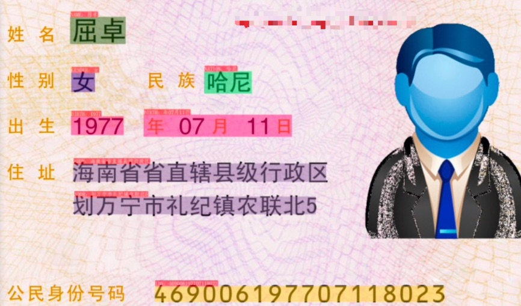
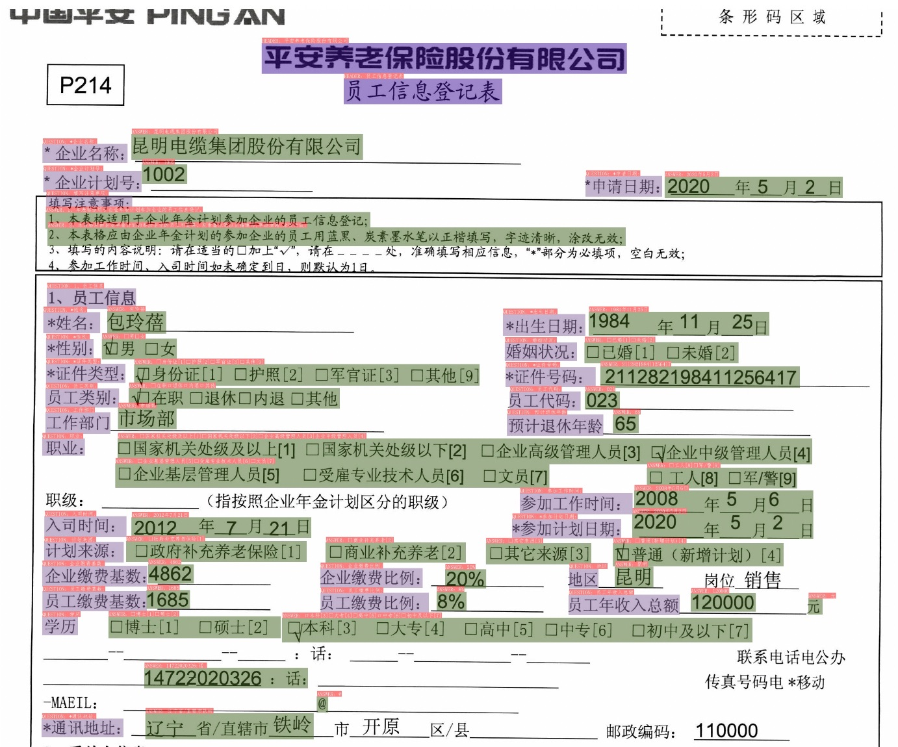
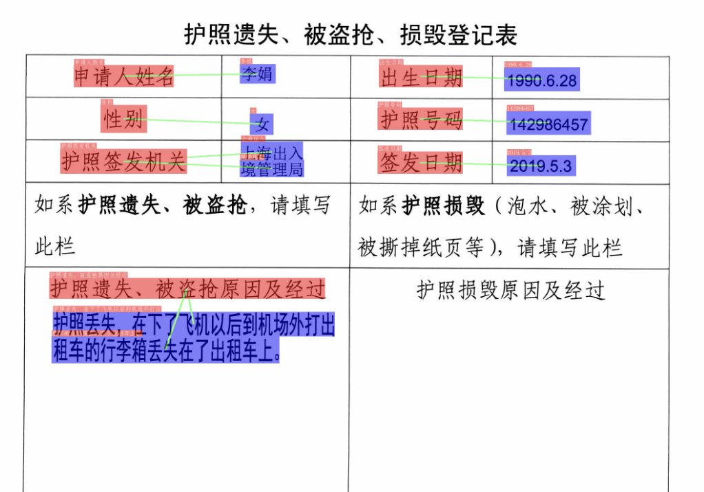

# 关键信息抽取

## 1. 简介

关键信息抽取 (Key Information Extraction, KIE)指的是是从文本或者图像中，抽取出关键的信息。针对文档图像的关键信息抽取任务作为OCR的下游任务，存在非常多的实际应用场景，如表单识别、车票信息抽取、身份证信息抽取等。

PP-Structure 基于 LayoutXLM 文档多模态系列方法进行研究与优化，设计了视觉特征无关的多模态模型结构VI-LayoutXLM，同时引入符合阅读顺序的文本行排序方法以及UDML联合互学习蒸馏方法，最终在精度与速度均超越LayoutXLM。

PP-Structure中关键信息抽取模块的主要特性如下：

- 集成[LayoutXLM](https://arxiv.org/pdf/2104.08836.pdf)、VI-LayoutXLM等多模态模型以及PP-OCR预测引擎。
- 支持基于多模态方法的语义实体识别 (Semantic Entity Recognition, SER) 以及关系抽取 (Relation Extraction, RE) 任务。基于 SER 任务，可以完成对图像中的文本识别与分类；基于 RE 任务，可以完成对图象中的文本内容的关系提取，如判断问题对(pair)。
- 支持SER任务和RE任务的自定义训练。
- 支持OCR+SER的端到端系统预测与评估。
- 支持OCR+SER+RE的端到端系统预测。
- 支持SER模型的动转静导出与基于PaddleInfernece的模型推理。

## 2. 精度与性能

我们在 [XFUND](https://github.com/doc-analysis/XFUND) 的中文数据集上对算法进行了评估，SER与RE上的任务性能如下

| 模型         | 骨干网络          | 任务 | 配置文件                                                                                                | hmean      | 预测耗时(ms) | 下载链接                                                                                                          |
| ------------ | ----------------- | ---- | ------- | ---------- | ------ | ------ |
| VI-LayoutXLM | VI-LayoutXLM-base | SER  | [ser_vi_layoutxlm_xfund_zh_udml.yml](../../configs/kie/vi_layoutxlm/ser_vi_layoutxlm_xfund_zh_udml.yml) | **93.19%** | 15.49        | [训练模型](https://paddleocr.bj.bcebos.com/ppstructure/models/vi_layoutxlm/ser_vi_layoutxlm_xfund_pretrained.tar) |
| LayoutXLM    | LayoutXLM-base    | SER  | [ser_layoutxlm_xfund_zh.yml](../../configs/kie/layoutlm_series/ser_layoutxlm_xfund_zh.yml)              | 90.38%     | 19.49        | [训练模型](https://paddleocr.bj.bcebos.com/pplayout/ser_LayoutXLM_xfun_zh.tar)                                    |
| VI-LayoutXLM | VI-LayoutXLM-base | RE   | [re_vi_layoutxlm_xfund_zh_udml.yml](../../configs/kie/vi_layoutxlm/re_vi_layoutxlm_xfund_zh_udml.yml)   | **83.92%** | 15.49        | [训练模型](https://paddleocr.bj.bcebos.com/ppstructure/models/vi_layoutxlm/re_vi_layoutxlm_xfund_pretrained.tar)  |
| LayoutXLM    | LayoutXLM-base    | RE   | [re_layoutxlm_xfund_zh.yml](../../configs/kie/layoutlm_series/re_layoutxlm_xfund_zh.yml)                | 74.83%     | 19.49        | [训练模型](https://paddleocr.bj.bcebos.com/pplayout/re_LayoutXLM_xfun_zh.tar)                                     |

- 注：预测耗时测试条件：V100 GPU + cuda10.2 + cudnn8.1.1 + TensorRT 7.2.3.4，使用FP16进行测试。

更多关于PaddleOCR中关键信息抽取模型的介绍，请参考[关键信息抽取模型库](../../algorithm/overview.md)。

## 3. 效果演示

基于多模态模型的关键信息抽取任务有2种主要的解决方案。

（1）文本检测 + 文本识别 + 语义实体识别(SER)
（2）文本检测 + 文本识别 + 语义实体识别(SER) + 关系抽取(RE)

下面给出SER与RE任务的示例效果，关于上述解决方案的详细介绍，请参考[关键信息抽取全流程指南](../blog/how_to_do_kie.md)。

### 3.1 SER

对于SER任务，效果如下所示。






**注意：** 测试图片来源于[XFUND数据集](https://github.com/doc-analysis/XFUND)、[发票数据集](https://aistudio.baidu.com/aistudio/datasetdetail/165561)以及合成的身份证数据集。

图中不同颜色的框表示不同的类别。

图中的发票以及申请表图像，有`QUESTION`, `ANSWER`, `HEADER` 3种类别，识别的`QUESTION`, `ANSWER`可以用于后续的问题与答案的关系抽取。

图中的身份证图像，则直接识别出其中的`姓名`、`性别`、`民族`等关键信息，这样就无需后续的关系抽取过程，一个模型即可完成关键信息抽取。

### 3.2 RE

对于RE任务，效果如下所示。




红色框是问题，蓝色框是答案。绿色线条表示连接的两端为一个key-value的pair。

## 4. 使用

### 4.1 准备环境

使用下面的命令安装运行SER与RE关键信息抽取的依赖。

```bash linenums="1"
git clone https://github.com/PaddlePaddle/PaddleOCR.git
cd PaddleOCR
pip install -r requirements.txt
pip install -r ppstructure/kie/requirements.txt
# 安装PaddleOCR引擎用于预测
pip install paddleocr -U
```

### 4.2 快速开始

下面XFUND数据集，快速体验SER模型与RE模型。

#### 4.2.1 准备数据

```bash linenums="1"
mkdir train_data
cd train_data
# 下载与解压数据
wget https://paddleocr.bj.bcebos.com/ppstructure/dataset/XFUND.tar && tar -xf XFUND.tar
cd ..
```

#### 4.2.2 基于动态图的预测

首先下载模型。

```bash linenums="1"
mkdir pretrained_model
cd pretrained_model
# 下载并解压SER预训练模型
wget https://paddleocr.bj.bcebos.com/ppstructure/models/vi_layoutxlm/ser_vi_layoutxlm_xfund_pretrained.tar && tar -xf ser_vi_layoutxlm_xfund_pretrained.tar

# 下载并解压RE预训练模型
wget https://paddleocr.bj.bcebos.com/ppstructure/models/vi_layoutxlm/re_vi_layoutxlm_xfund_pretrained.tar && tar -xf re_vi_layoutxlm_xfund_pretrained.tar
```

如果希望使用OCR引擎，获取端到端的预测结果，可以使用下面的命令进行预测。

```bash linenums="1"
# 仅预测SER模型
python3 tools/infer_kie_token_ser.py \
  -c configs/kie/vi_layoutxlm/ser_vi_layoutxlm_xfund_zh.yml \
  -o Architecture.Backbone.checkpoints=./pretrained_model/ser_vi_layoutxlm_xfund_pretrained/best_accuracy \
  Global.infer_img=./ppstructure/docs/kie/input/zh_val_42.jpg

# SER + RE模型串联
python3 ./tools/infer_kie_token_ser_re.py \
  -c configs/kie/vi_layoutxlm/re_vi_layoutxlm_xfund_zh.yml \
  -o Architecture.Backbone.checkpoints=./pretrained_model/re_vi_layoutxlm_xfund_pretrained/best_accuracy \
  Global.infer_img=./train_data/XFUND/zh_val/image/zh_val_42.jpg \
  -c_ser configs/kie/vi_layoutxlm/ser_vi_layoutxlm_xfund_zh.yml \
  -o_ser Architecture.Backbone.checkpoints=./pretrained_model/ser_vi_layoutxlm_xfund_pretrained/best_accuracy
```

`Global.save_res_path`目录中会保存可视化的结果图像以及预测的文本文件。

如果想使用自定义OCR模型，可通过如下字段进行设置

- `Global.kie_det_model_dir`: 设置检测inference模型地址
- `Global.kie_rec_model_dir`: 设置识别inference模型地址

如果希望加载标注好的文本检测与识别结果，仅预测可以使用下面的命令进行预测。

```bash linenums="1"
# 仅预测SER模型
python3 tools/infer_kie_token_ser.py \
  -c configs/kie/vi_layoutxlm/ser_vi_layoutxlm_xfund_zh.yml \
  -o Architecture.Backbone.checkpoints=./pretrained_model/ser_vi_layoutxlm_xfund_pretrained/best_accuracy \
  Global.infer_img=./train_data/XFUND/zh_val/val.json \
  Global.infer_mode=False

# SER + RE模型串联
python3 ./tools/infer_kie_token_ser_re.py \
  -c configs/kie/vi_layoutxlm/re_vi_layoutxlm_xfund_zh.yml \
  -o Architecture.Backbone.checkpoints=./pretrained_model/re_vi_layoutxlm_xfund_pretrained/best_accuracy \
  Global.infer_img=./train_data/XFUND/zh_val/val.json \
  Global.infer_mode=False \
  -c_ser configs/kie/vi_layoutxlm/ser_vi_layoutxlm_xfund_zh.yml \
  -o_ser Architecture.Backbone.checkpoints=./pretrained_model/ser_vi_layoutxlm_xfund_pretrained/best_accuracy
```

#### 4.2.3 基于PaddleInference的预测

首先下载SER和RE的推理模型。

```bash linenums="1"
mkdir inference
cd inference
wget https://paddleocr.bj.bcebos.com/ppstructure/models/vi_layoutxlm/ser_vi_layoutxlm_xfund_infer.tar && tar -xf ser_vi_layoutxlm_xfund_infer.tar
wget https://paddleocr.bj.bcebos.com/ppstructure/models/vi_layoutxlm/re_vi_layoutxlm_xfund_infer.tar && tar -xf re_vi_layoutxlm_xfund_infer.tar
cd ..
```

- SER

执行下面的命令进行预测。

```bash linenums="1"
cd ppstructure
python3 kie/predict_kie_token_ser.py \
  --kie_algorithm=LayoutXLM \
  --ser_model_dir=../inference/ser_vi_layoutxlm_xfund_infer \
  --image_dir=./docs/kie/input/zh_val_42.jpg \
  --ser_dict_path=../train_data/XFUND/class_list_xfun.txt \
  --vis_font_path=../doc/fonts/simfang.ttf \
  --ocr_order_method="tb-yx"
```

可视化结果保存在`output`目录下。

- RE

执行下面的命令进行预测。

```bash linenums="1"
cd ppstructure
python3 kie/predict_kie_token_ser_re.py \
  --kie_algorithm=LayoutXLM \
  --re_model_dir=../inference/re_vi_layoutxlm_xfund_infer \
  --ser_model_dir=../inference/ser_vi_layoutxlm_xfund_infer \
  --use_visual_backbone=False \
  --image_dir=./docs/kie/input/zh_val_42.jpg \
  --ser_dict_path=../train_data/XFUND/class_list_xfun.txt \
  --vis_font_path=../doc/fonts/simfang.ttf \
  --ocr_order_method="tb-yx"
```

可视化结果保存在`output`目录下。

如果想使用自定义OCR模型，可通过如下字段进行设置

- `--det_model_dir`: 设置检测inference模型地址
- `--rec_model_dir`: 设置识别inference模型地址

### 4.3 更多

关于KIE模型的训练评估与推理，请参考：[关键信息抽取教程](./train_kie.md)。

关于文本检测模型的训练评估与推理，请参考：[文本检测教程](../../ppocr/model_train/detection.md)。

关于文本识别模型的训练评估与推理，请参考：[文本识别教程](../../ppocr/model_train/recognition.md)。

关于怎样在自己的场景中完成关键信息抽取任务，请参考：[关键信息抽取全流程指南](../blog/how_to_do_kie.md)。

## 5. 参考链接

- LayoutXLM: Multimodal Pre-training for Multilingual Visually-rich Document Understanding, <https://arxiv.org/pdf/2104.08836.pdf>
- microsoft/unilm/layoutxlm, <https://github.com/microsoft/unilm/tree/master/layoutxlm>
- XFUND dataset, <https://github.com/doc-analysis/XFUND>

## 6. License

The content of this project itself is licensed under the [Attribution-NonCommercial-ShareAlike 4.0 International (CC BY-NC-SA 4.0)](https://creativecommons.org/licenses/by-nc-sa/4.0/)
