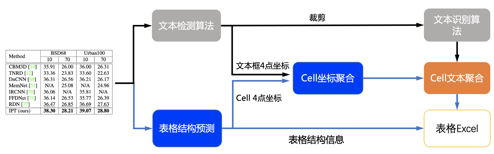

# 表格识别

## 1. 表格识别 pipeline

表格识别主要包含三个模型

1. 单行文本检测-DB
2. 单行文本识别-CRNN
3. 表格结构和cell坐标预测-SLANet

具体流程图如下



流程说明:

1. 图片由单行文字检测模型检测到单行文字的坐标，然后送入识别模型拿到识别结果。
2. 图片由SLANet模型拿到表格的结构信息和单元格的坐标信息。
3. 由单行文字的坐标、识别结果和单元格的坐标一起组合出单元格的识别结果。
4. 单元格的识别结果和表格结构一起构造表格的html字符串。

## 2. 性能

我们在 PubTabNet<sup>[1]</sup> 评估数据集上对算法进行了评估，性能如下

| 算法                | Acc    | [TEDS(Tree-Edit-Distance-based Similarity)](https://github.com/ibm-aur-nlp/PubTabNet/tree/master/src) | Speed |
| ------------------- | ------ | ----------------------------------------------------------------------------------------------------- | ----- |
| EDD<sup>[2]</sup>   | x      | 88.30%                                                                                                | x     |
| TableRec-RARE(ours) | 71.73% | 93.88%                                                                                                | 779ms |
| SLANet(ours)        | 76.31% | 95.89%                                                                                                | 766ms |

性能指标解释如下：

- Acc: 模型对每张图像里表格结构的识别准确率，错一个token就算错误。
- TEDS: 模型对表格信息还原的准确度，此指标评价内容不仅包含表格结构，还包含表格内的文字内容。
- Speed: 模型在CPU机器上，开启MKL的情况下，单张图片的推理速度。

## 3. 效果演示


## 4. 使用

### 4.1 快速开始

PP-Structure目前提供了中英文两种语言的表格识别模型，模型链接见 [models_list](../models_list.md)。也提供了whl包的形式方便快速使用，详见 [quickstart](../quick_start.md)。

下面以中文表格识别模型为例，介绍如何识别一张表格。

使用如下命令即可快速完成一张表格的识别。

```bash linenums="1"
cd PaddleOCR/ppstructure

# 下载模型
mkdir inference && cd inference
# 下载PP-OCRv3文本检测模型并解压
wget https://paddleocr.bj.bcebos.com/PP-OCRv3/chinese/ch_PP-OCRv3_det_infer.tar && tar xf ch_PP-OCRv3_det_infer.tar
# 下载PP-OCRv3文本识别模型并解压
wget https://paddleocr.bj.bcebos.com/PP-OCRv3/chinese/ch_PP-OCRv3_rec_infer.tar && tar xf ch_PP-OCRv3_rec_infer.tar
# 下载PP-StructureV2中文表格识别模型并解压
wget https://paddleocr.bj.bcebos.com/ppstructure/models/slanet/paddle3.0b2/ch_ppstructure_mobile_v2.0_SLANet_infer.tar && tar xf ch_ppstructure_mobile_v2.0_SLANet_infer.tar
cd ..
# 执行表格识别
python table/predict_table.py \
    --det_model_dir=inference/ch_PP-OCRv3_det_infer \
    --rec_model_dir=inference/ch_PP-OCRv3_rec_infer  \
    --table_model_dir=inference/ch_ppstructure_mobile_v2.0_SLANet_infer \
    --rec_char_dict_path=../ppocr/utils/ppocr_keys_v1.txt \
    --table_char_dict_path=../ppocr/utils/dict/table_structure_dict_ch.txt \
    --image_dir=docs/table/table.jpg \
    --output=../output/table
```

运行完成后，每张图片的excel表格会保存到output字段指定的目录下，同时在该目录下回生产一个html文件，用于可视化查看单元格坐标和识别的表格。

**NOTE**

1. 如果想使用英文模型，需要在 [models_list](../../ppocr/model_list.md) 中下载英文文字检测识别模型和英文表格识别模型，同时替换`table_structure_dict_ch.txt`为`table_structure_dict.txt`即可。
2. 如需使用TableRec-RARE模型，需要替换`table_structure_dict_ch.txt`为`table_structure_dict.txt`，同时参数`--merge_no_span_structure=False`

### 4.2 模型训练、评估与推理

文本检测模型的训练、评估和推理流程可参考 [detection](../../ppocr/model_train/detection.md)

文本识别模型的训练、评估和推理流程可参考 [recognition](../../ppocr/model_train/recognition.md)

表格识别模型的训练、评估和推理流程可参考 [table_recognition](../../ppstructure/model_train/train_table.md)

### 4.3 计算TEDS

表格使用 [TEDS(Tree-Edit-Distance-based Similarity)](https://github.com/ibm-aur-nlp/PubTabNet/tree/master/src) 作为模型的评估指标。在进行模型评估之前，需要将pipeline中的三个模型分别导出为inference模型(我们已经提供好)，还需要准备评估的gt， gt示例如下:

```txt
PMC5755158_010_01.png    <html><body><table><thead><tr><td></td><td><b>Weaning</b></td><td><b>Week 15</b></td><td><b>Off-test</b></td></tr></thead><tbody><tr><td>Weaning</td><td>–</td><td>–</td><td>–</td></tr><tr><td>Week 15</td><td>–</td><td>0.17 ± 0.08</td><td>0.16 ± 0.03</td></tr><tr><td>Off-test</td><td>–</td><td>0.80 ± 0.24</td><td>0.19 ± 0.09</td></tr></tbody></table></body></html>
```

gt每一行都由文件名和表格的html字符串组成，文件名和表格的html字符串之间使用`\t`分隔。

也可使用如下命令，由标注文件生成评估的gt文件：

```bash linenums="1"
python3 ppstructure/table/convert_label2html.py --ori_gt_path /path/to/your_label_file --save_path /path/to/save_file
```

准备完成后使用如下命令进行评估，评估完成后会输出teds指标。

```bash linenums="1"
cd PaddleOCR/ppstructure
python3 table/eval_table.py \
    --det_model_dir=path/to/det_model_dir \
    --rec_model_dir=path/to/rec_model_dir \
    --table_model_dir=path/to/table_model_dir \
    --image_dir=docs/table/table.jpg \
    --rec_char_dict_path=../ppocr/utils/dict/table_dict.txt \
    --table_char_dict_path=../ppocr/utils/dict/table_structure_dict.txt \
    --det_limit_side_len=736 \
    --det_limit_type=min \
    --gt_path=path/to/gt.txt
```

如使用英文表格识别模型在PubLatNet数据集上进行评估

```bash linenums="1"
cd PaddleOCR/ppstructure
# 下载模型
mkdir inference && cd inference
# 下载基于PubTabNet数据集训练的文本检测模型并解压
wget https://paddleocr.bj.bcebos.com/dygraph_v2.0/table/en_ppocr_mobile_v2.0_table_det_infer.tar && tar xf en_ppocr_mobile_v2.0_table_det_infer.tar
# 下载基于PubTabNet数据集训练的文本识别模型并解压
wget https://paddleocr.bj.bcebos.com/dygraph_v2.0/table/en_ppocr_mobile_v2.0_table_rec_infer.tar && tar xf en_ppocr_mobile_v2.0_table_rec_infer.tar
# 下载基于PubTabNet数据集训练的表格识别模型并解压
wget https://paddleocr.bj.bcebos.com/ppstructure/models/slanet/paddle3.0b2/en_ppstructure_mobile_v2.0_SLANet_infer.tar && tar xf en_ppstructure_mobile_v2.0_SLANet_infer.tar
cd ..

python3 table/eval_table.py \
    --det_model_dir=inference/en_ppocr_mobile_v2.0_table_det_infer \
    --rec_model_dir=inference/en_ppocr_mobile_v2.0_table_rec_infer \
    --table_model_dir=inference/en_ppstructure_mobile_v2.0_SLANet_infer \
    --image_dir=train_data/table/pubtabnet/val/ \
    --rec_char_dict_path=../ppocr/utils/dict/table_dict.txt \
    --table_char_dict_path=../ppocr/utils/dict/table_structure_dict.txt \
    --det_limit_side_len=736 \
    --det_limit_type=min \
    --rec_image_shape=3,32,320 \
    --gt_path=path/to/gt.txt
```

将会输出

```bash linenums="1"
teds: 95.89
```

## 5. Reference

1. <https://github.com/ibm-aur-nlp/PubTabNet>
2. <https://arxiv.org/pdf/1911.10683>
