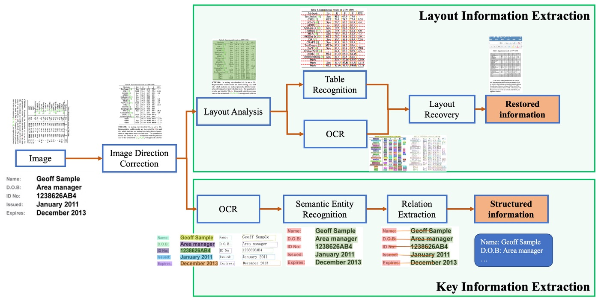
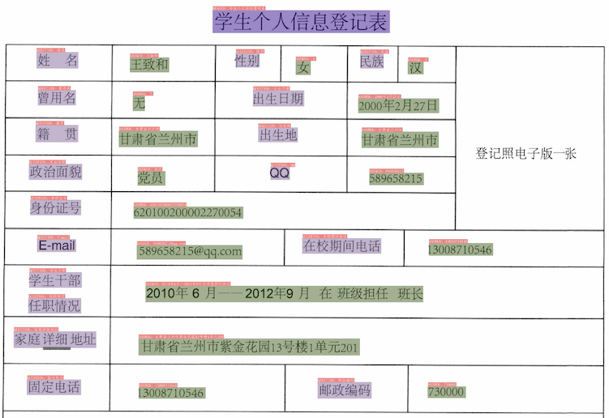
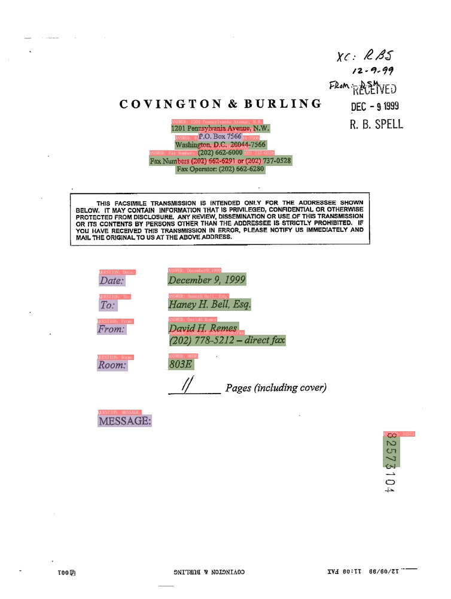

# PP-Structure 文档分析

## 1. 简介

PP-Structure是PaddleOCR团队自研的智能文档分析系统，旨在帮助开发者更好的完成版面分析、表格识别等文档理解相关任务。

PP-StructureV2系统流程图如下所示，文档图像首先经过图像矫正模块，判断整图方向并完成转正，随后可以完成版面信息分析与关键信息抽取2类任务。

- 版面分析任务中，图像首先经过版面分析模型，将图像划分为文本、表格、图像等不同区域，随后对这些区域分别进行识别，如，将表格区域送入表格识别模块进行结构化识别，将文本区域送入OCR引擎进行文字识别，最后使用版面恢复模块将其恢复为与原始图像布局一致的word或者pdf格式的文件；
- 关键信息抽取任务中，首先使用OCR引擎提取文本内容，然后由语义实体识别模块获取图像中的语义实体，最后经关系抽取模块获取语义实体之间的对应关系，从而提取需要的关键信息。

更多技术细节：👉 PP-StructureV2技术报告 [中文版](docs/PP-StructureV2_introduction.md)，[英文版](https://arxiv.org/abs/2210.05391)。

PP-StructureV2支持各个模块独立使用或灵活搭配，如，可以单独使用版面分析，或单独使用表格识别，点击下面相应链接获取各个独立模块的使用教程：

- [版面分析](model_train/train_layout.md)
- [表格识别](model_train/train_table.md)
- [关键信息抽取](model_train/train_kie.md)
- [版面复原](model_train/recovery_to_doc.md)

## 2. 特性

PP-StructureV2的主要特性如下：

- 支持对图片/pdf形式的文档进行版面分析，可以划分**文字、标题、表格、图片、公式等**区域；
- 支持通用的中英文**表格检测**任务；
- 支持表格区域进行结构化识别，最终结果输出**Excel文件**；
- 支持基于多模态的关键信息抽取(Key Information Extraction，KIE)任务-**语义实体识别**(Semantic Entity Recognition，SER)和**关系抽取**(Relation Extraction，RE)；
- 支持**版面复原**，即恢复为与原始图像布局一致的word或者pdf格式的文件；
- 支持自定义训练及python whl包调用等多种推理部署方式，简单易用；
- 与半自动数据标注工具PPOCRLabel打通，支持版面分析、表格识别、SER三种任务的标注。

## 3. 效果展示

PP-StructureV2支持各个模块独立使用或灵活搭配，如，可以单独使用版面分析，或单独使用表格识别，这里仅展示几种代表性使用方式的可视化效果。

### 3.1 版面分析和表格识别

下图展示了版面分析+表格识别的整体流程，图片先有版面分析划分为图像、文本、标题和表格四种区域，然后对图像、文本和标题三种区域进行OCR的检测识别，对表格进行表格识别，其中图像还会被存储下来以便使用。

### 3.1.1 版面识别返回单字坐标

下图展示了基于上一节版面分析对文字进行定位的效果， 可参考[文档](blog/return_word_pos.md)。

### 3.2 版面恢复

下图展示了基于上一节版面分析和表格识别的结果进行版面恢复的效果。

### 3.3 关键信息抽取

- SER

图中不同颜色的框表示不同的类别。

- RE

图中红色框表示`问题`，蓝色框表示`答案`，`问题`和`答案`之间使用绿色线连接。

## 4. 快速体验

请参考[快速使用](./quick_start.md)教程。

## 5. 模型库

部分任务需要同时用到结构化分析模型和OCR模型，如表格识别需要使用表格识别模型进行结构化解析，同时也要用到OCR模型对表格内的文字进行识别，请根据具体需求选择合适的模型。

结构化分析相关模型下载可以参考：

- [PP-Structure 模型库](./models_list.md)

OCR相关模型下载可以参考：

- [PP-OCR 模型库](../ppocr/model_list.md)
