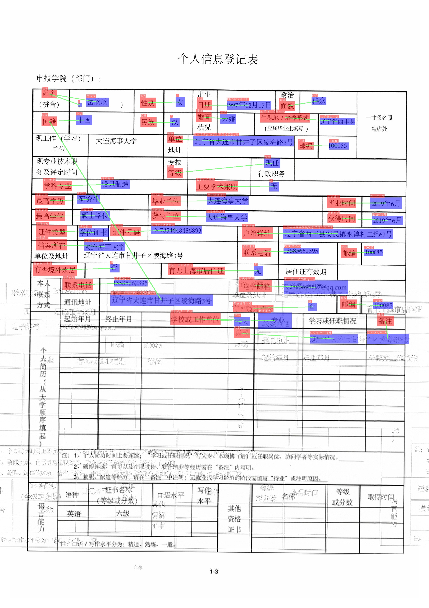

# 关键信息抽取算法-VI-LayoutXLM

## 1. 算法简介

VI-LayoutXLM基于LayoutXLM进行改进，在下游任务训练过程中，去除视觉骨干网络模块，最终精度基本无损的情况下，模型推理速度进一步提升。

在XFUND_zh数据集上，算法复现效果如下：

|模型|骨干网络|任务|配置文件|hmean|下载链接|
| --- | --- |---| --- | --- | --- |
|VI-LayoutXLM |VI-LayoutXLM-base | SER |[ser_vi_layoutxlm_xfund_zh_udml.yml](https://github.com/PaddlePaddle/PaddleOCR/tree/main/configs/kie/vi_layoutxlm/ser_vi_layoutxlm_xfund_zh_udml.yml)|93.19%|[训练模型](https://paddleocr.bj.bcebos.com/ppstructure/models/vi_layoutxlm/ser_vi_layoutxlm_xfund_pretrained.tar)/[推理模型](https://paddleocr.bj.bcebos.com/ppstructure/models/vi_layoutxlm/ser_vi_layoutxlm_xfund_infer.tar)|
|VI-LayoutXLM |VI-LayoutXLM-base |RE | [re_vi_layoutxlm_xfund_zh_udml.yml](https://github.com/PaddlePaddle/PaddleOCR/tree/main/configs/kie/vi_layoutxlm/re_vi_layoutxlm_xfund_zh_udml.yml)|83.92%|[训练模型](https://paddleocr.bj.bcebos.com/ppstructure/models/vi_layoutxlm/re_vi_layoutxlm_xfund_pretrained.tar)/[推理模型](https://paddleocr.bj.bcebos.com/ppstructure/models/vi_layoutxlm/re_vi_layoutxlm_xfund_infer.tar)|

## 2. 环境配置

请先参考[《运行环境准备》](../../ppocr/environment.md)配置PaddleOCR运行环境，参考[《项目克隆》](../../ppocr/blog/clone.md)克隆项目代码。

## 3. 模型训练、评估、预测

请参考[关键信息抽取教程](../../ppocr/model_train/kie.md)。PaddleOCR对代码进行了模块化，训练不同的关键信息抽取模型只需要**更换配置文件**即可。

## 4. 推理部署

### 4.1 Python推理

#### SER

首先将训练得到的模型转换成inference model。以VI-LayoutXLM模型在XFUND_zh数据集上训练的模型为例（[模型下载地址](https://paddleocr.bj.bcebos.com/ppstructure/models/vi_layoutxlm/ser_vi_layoutxlm_xfund_pretrained.tar)），可以使用下面的命令进行转换。

``` bash
wget https://paddleocr.bj.bcebos.com/ppstructure/models/vi_layoutxlm/ser_vi_layoutxlm_xfund_pretrained.tar
tar -xf ser_vi_layoutxlm_xfund_pretrained.tar
python3 tools/export_model.py -c configs/kie/vi_layoutxlm/ser_vi_layoutxlm_xfund_zh.yml -o Architecture.Backbone.checkpoints=./ser_vi_layoutxlm_xfund_pretrained/best_accuracy Global.save_inference_dir=./inference/ser_vi_layoutxlm_infer
```

VI-LayoutXLM模型基于SER任务进行推理，可以执行如下命令：

```bash linenums="1"
cd ppstructure
python3 kie/predict_kie_token_ser.py \
  --kie_algorithm=LayoutXLM \
  --ser_model_dir=../inference/ser_vi_layoutxlm_infer \
  --image_dir=./docs/kie/input/zh_val_42.jpg \
  --ser_dict_path=../train_data/XFUND/class_list_xfun.txt \
  --vis_font_path=../doc/fonts/simfang.ttf \
  --ocr_order_method="tb-yx"
```

SER可视化结果默认保存到`./output`文件夹里面，结果示例如下：


#### RE

首先将训练得到的模型转换成inference model。以VI-LayoutXLM模型在XFUND_zh数据集上训练的模型为例（[模型下载地址](https://paddleocr.bj.bcebos.com/ppstructure/models/vi_layoutxlm/re_vi_layoutxlm_xfund_pretrained.tar)），可以使用下面的命令进行转换。

``` bash
wget https://paddleocr.bj.bcebos.com/ppstructure/models/vi_layoutxlm/re_vi_layoutxlm_xfund_pretrained.tar
tar -xf re_vi_layoutxlm_xfund_pretrained.tar
python3 tools/export_model.py -c configs/kie/vi_layoutxlm/re_vi_layoutxlm_xfund_zh.yml -o Architecture.Backbone.checkpoints=./re_vi_layoutxlm_xfund_pretrained/best_accuracy Global.save_inference_dir=./inference/re_vi_layoutxlm_infer
```

VI-LayoutXLM模型基于RE任务进行推理，可以执行如下命令：

```bash linenums="1"
cd ppstructure
python3 kie/predict_kie_token_ser_re.py \
  --kie_algorithm=LayoutXLM \
  --re_model_dir=../inference/re_vi_layoutxlm_infer \
  --ser_model_dir=../inference/ser_vi_layoutxlm_infer \
  --use_visual_backbone=False \
  --image_dir=./docs/kie/input/zh_val_42.jpg \
  --ser_dict_path=../train_data/XFUND/class_list_xfun.txt \
  --vis_font_path=../doc/fonts/simfang.ttf \
  --ocr_order_method="tb-yx"
```

RE可视化结果默认保存到`./output`文件夹里面，结果示例如下：



### 4.2 C++推理部署

暂不支持

### 4.3 Serving服务化部署

暂不支持

### 4.4 更多推理部署

暂不支持

## 5. FAQ

## 引用

```bibtex
@article{DBLP:journals/corr/abs-2104-08836,
  author    = {Yiheng Xu and
               Tengchao Lv and
               Lei Cui and
               Guoxin Wang and
               Yijuan Lu and
               Dinei Flor{\^{e}}ncio and
               Cha Zhang and
               Furu Wei},
  title     = {LayoutXLM: Multimodal Pre-training for Multilingual Visually-rich
               Document Understanding},
  journal   = {CoRR},
  volume    = {abs/2104.08836},
  year      = {2021},
  url       = {https://arxiv.org/abs/2104.08836},
  eprinttype = {arXiv},
  eprint    = {2104.08836},
  timestamp = {Thu, 14 Oct 2021 09:17:23 +0200},
  biburl    = {https://dblp.org/rec/journals/corr/abs-2104-08836.bib},
  bibsource = {dblp computer science bibliography, https://dblp.org}
}

@article{DBLP:journals/corr/abs-1912-13318,
  author    = {Yiheng Xu and
               Minghao Li and
               Lei Cui and
               Shaohan Huang and
               Furu Wei and
               Ming Zhou},
  title     = {LayoutLM: Pre-training of Text and Layout for Document Image Understanding},
  journal   = {CoRR},
  volume    = {abs/1912.13318},
  year      = {2019},
  url       = {http://arxiv.org/abs/1912.13318},
  eprinttype = {arXiv},
  eprint    = {1912.13318},
  timestamp = {Mon, 01 Jun 2020 16:20:46 +0200},
  biburl    = {https://dblp.org/rec/journals/corr/abs-1912-13318.bib},
  bibsource = {dblp computer science bibliography, https://dblp.org}
}

@article{DBLP:journals/corr/abs-2012-14740,
  author    = {Yang Xu and
               Yiheng Xu and
               Tengchao Lv and
               Lei Cui and
               Furu Wei and
               Guoxin Wang and
               Yijuan Lu and
               Dinei A. F. Flor{\^{e}}ncio and
               Cha Zhang and
               Wanxiang Che and
               Min Zhang and
               Lidong Zhou},
  title     = {LayoutLMv2: Multi-modal Pre-training for Visually-Rich Document Understanding},
  journal   = {CoRR},
  volume    = {abs/2012.14740},
  year      = {2020},
  url       = {https://arxiv.org/abs/2012.14740},
  eprinttype = {arXiv},
  eprint    = {2012.14740},
  timestamp = {Tue, 27 Jul 2021 09:53:52 +0200},
  biburl    = {https://dblp.org/rec/journals/corr/abs-2012-14740.bib},
  bibsource = {dblp computer science bibliography, https://dblp.org}
}
```
