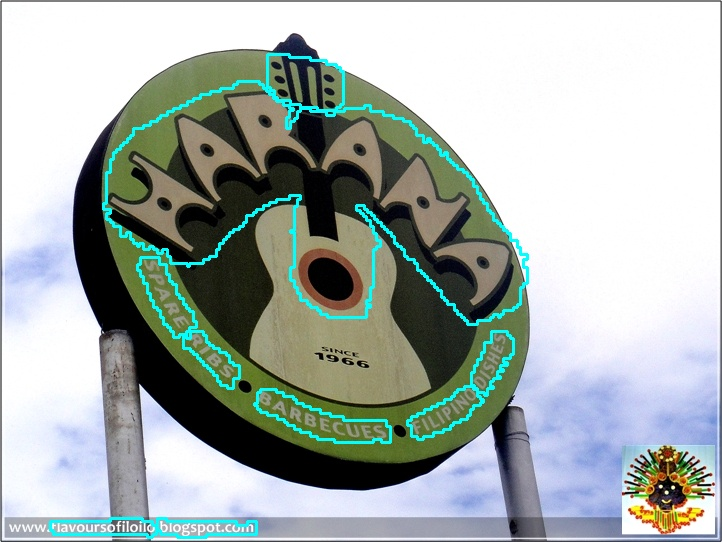

# CT

## 1. 算法简介

论文信息：
> [CentripetalText: An Efficient Text Instance Representation for Scene Text Detection](https://arxiv.org/abs/2107.05945)
> Tao Sheng, Jie Chen, Zhouhui Lian
> NeurIPS, 2021

在Total-Text文本检测公开数据集上，算法复现效果如下：

|模型|骨干网络|配置文件|precision|recall|Hmean|下载链接|
| --- | --- | --- | --- | --- | --- | --- |
|CT|ResNet18_vd|[configs/det/det_r18_vd_ct.yml](https://github.com/PaddlePaddle/PaddleOCR/tree/main/configs/det/det_r18_vd_ct.yml)|88.68%|81.70%|85.05%|[训练模型](https://paddleocr.bj.bcebos.com/dygraph_v2.0/en/det_r18_ct_train.tar)|

## 2. 环境配置

请先参考[《运行环境准备》](../../ppocr/environment.md)配置PaddleOCR运行环境，参考[《项目克隆》](../../ppocr/blog/clone.md)克隆项目代码。

## 3. 模型训练、评估、预测

CT模型使用Total-Text文本检测公开数据集训练得到，数据集下载可参考 [Total-Text-Dataset](https://github.com/cs-chan/Total-Text-Dataset/tree/master/Dataset), 我们将标签文件转成了paddleocr格式，转换好的标签文件下载参考[train.txt](https://paddleocr.bj.bcebos.com/dataset/ct_tipc/train.txt), [text.txt](https://paddleocr.bj.bcebos.com/dataset/ct_tipc/test.txt)。

请参考[文本检测训练教程](../../ppocr/model_train/detection.md)。PaddleOCR对代码进行了模块化，训练不同的检测模型只需要**更换配置文件**即可。

## 4. 推理部署

### 4.1 Python推理

首先将CT文本检测训练过程中保存的模型，转换成inference model。以基于Resnet18_vd骨干网络，在Total-Text英文数据集训练的模型为例（ [模型下载地址](https://paddleocr.bj.bcebos.com/dygraph_v2.0/en/det_r18_ct_train.tar) )，可以使用如下命令进行转换：

```bash linenums="1"
python3 tools/export_model.py -c configs/det/det_r18_vd_ct.yml -o Global.pretrained_model=./det_r18_ct_train/best_accuracy  Global.save_inference_dir=./inference/det_ct
```

CT文本检测模型推理，可以执行如下命令：

```bash linenums="1"
python3 tools/infer/predict_det.py --image_dir="./doc/imgs_en/img623.jpg" --det_model_dir="./inference/det_ct/" --det_algorithm="CT"
```

可视化文本检测结果默认保存到`./inference_results`文件夹里面，结果文件的名称前缀为`det_res`。结果示例如下：



### 4.2 C++推理

暂不支持

### 4.3 Serving服务化部署

暂不支持

### 4.4 更多推理部署

暂不支持

## 5. FAQ

## 引用

```bibtex
@inproceedings{sheng2021centripetaltext,
    title={CentripetalText: An Efficient Text Instance Representation for Scene Text Detection},
    author={Tao Sheng and Jie Chen and Zhouhui Lian},
    booktitle={Thirty-Fifth Conference on Neural Information Processing Systems},
    year={2021}
}
```
