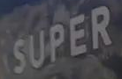

# CRNN

## 1. 算法简介

论文信息：
> [An End-to-End Trainable Neural Network for Image-based Sequence Recognition and Its Application to Scene Text Recognition](https://arxiv.org/abs/1507.05717)
> Baoguang Shi, Xiang Bai, Cong Yao
> IEEE, 2015

参考[DTRB](https://arxiv.org/abs/1904.01906) 文字识别训练和评估流程，使用MJSynth和SynthText两个文字识别数据集训练，在IIIT, SVT, IC03, IC13, IC15, SVTP, CUTE数据集上进行评估，算法效果如下：

|模型|骨干网络|Avg Accuracy|配置文件|下载链接|
|---|---|---|---|---|
|CRNN|Resnet34_vd|81.04%|[configs/rec/rec_r34_vd_none_bilstm_ctc.yml](https://github.com/PaddlePaddle/PaddleOCR/tree/main/configs/rec/rec_r34_vd_none_bilstm_ctc.yml)|[训练模型](https://paddleocr.bj.bcebos.com/dygraph_v2.0/en/rec_r34_vd_none_bilstm_ctc_v2.0_train.tar)|
|CRNN|MobileNetV3|77.95%|[configs/rec/rec_mv3_none_bilstm_ctc.yml](https://github.com/PaddlePaddle/PaddleOCR/tree/main/configs/rec/rec_mv3_none_bilstm_ctc.yml)|[训练模型](https://paddleocr.bj.bcebos.com/dygraph_v2.0/en/rec_mv3_none_bilstm_ctc_v2.0_train.tar)|

## 2. 环境配置

请先参考[《运行环境准备》](../../ppocr/environment.md)配置PaddleOCR运行环境，参考[《项目克隆》](../../ppocr/blog/clone.md)克隆项目代码。

## 3. 模型训练、评估、预测

请参考[文本识别训练教程](../../ppocr/model_train/recognition.md)。PaddleOCR对代码进行了模块化，训练不同的识别模型只需要**更换配置文件**即可。

### 训练

在完成数据准备后，便可以启动训练，训练命令如下：

```bash linenums="1"
# 单卡训练（训练周期长，不建议）
python3 tools/train.py -c configs/rec/rec_r34_vd_none_bilstm_ctc.yml

# 多卡训练，通过--gpus参数指定卡号
python3 -m paddle.distributed.launch --gpus '0,1,2,3'  tools/train.py -c rec_r34_vd_none_bilstm_ctc.yml
```

### 评估

```bash linenums="1"
# GPU 评估， Global.pretrained_model 为待测权重
python3 -m paddle.distributed.launch --gpus '0' tools/eval.py -c configs/rec/rec_r34_vd_none_bilstm_ctc.yml -o Global.pretrained_model={path/to/weights}/best_accuracy
```

### 预测

```bash linenums="1"
# 预测使用的配置文件必须与训练一致
python3 tools/infer_rec.py -c configs/rec/rec_r34_vd_none_bilstm_ctc.yml -o Global.pretrained_model={path/to/weights}/best_accuracy Global.infer_img=doc/imgs_words/en/word_1.png
```

## 4. 推理部署

### 4.1 Python推理

首先将 CRNN 文本识别训练过程中保存的模型，转换成inference model。以基于Resnet34_vd骨干网络，使用MJSynth和SynthText两个英文文本识别合成数据集训练的[模型](https://paddleocr.bj.bcebos.com/dygraph_v2.0/en/rec_r34_vd_none_bilstm_ctc_v2.0_train.tar) 为例，可以使用如下命令进行转换：

```bash linenums="1"
python3 tools/export_model.py -c configs/rec/rec_r34_vd_none_bilstm_ctc.yml -o Global.pretrained_model=./rec_r34_vd_none_bilstm_ctc_v2.0_train/best_accuracy  Global.save_inference_dir=./inference/rec_crnn
```

CRNN 文本识别模型推理，可以执行如下命令：

```bash linenums="1"
python3 tools/infer/predict_rec.py --image_dir="./doc/imgs_words_en/word_336.png" --rec_model_dir="./inference/rec_crnn/" --rec_image_shape="3, 32, 100" --rec_char_dict_path="./ppocr/utils/ic15_dict.txt"
```



执行命令后，上面图像的识别结果如下：

```bash linenums="1"
Predicts of ./doc/imgs_words_en/word_336.png:('super', 0.9999073)
```

**注意**：由于上述模型是参考[DTRB](https://arxiv.org/abs/1904.01906)文本识别训练和评估流程，与超轻量级中文识别模型训练有两方面不同：

- 训练时采用的图像分辨率不同，训练上述模型采用的图像分辨率是[3，32，100]，而中文模型训练时，为了保证长文本的识别效果，训练时采用的图像分辨率是[3, 32, 320]。预测推理程序默认的形状参数是训练中文采用的图像分辨率，即[3, 32, 320]。因此，这里推理上述英文模型时，需要通过参数rec_image_shape设置识别图像的形状。
- 字符列表，DTRB论文中实验只是针对26个小写英文本母和10个数字进行实验，总共36个字符。所有大小字符都转成了小写字符，不在上面列表的字符都忽略，认为是空格。因此这里没有输入字符字典，而是通过如下命令生成字典.因此在推理时需要设置参数rec_char_dict_path，指定为英文字典"./ppocr/utils/ic15_dict.txt"。

  ```python linenums="1"
  self.character_str = "0123456789abcdefghijklmnopqrstuvwxyz"
  dict_character = list(self.character_str)
  ```

### 4.2 C++推理

准备好推理模型后，参考[cpp infer](../../ppocr/infer_deploy/cpp_infer.md)教程进行操作即可。

### 4.3 Serving服务化部署

准备好推理模型后，参考[pdserving](../../ppocr/infer_deploy/paddle_server.md)教程进行Serving服务化部署，包括Python Serving和C++ Serving两种模式。

### 4.4 更多推理部署

CRNN模型还支持以下推理部署方式：

- Paddle2ONNX推理：准备好推理模型后，参考[paddle2onnx](../../ppocr/infer_deploy/paddle2onnx.md)教程操作。

## 5. FAQ

## 引用

```bibtex
@ARTICLE{7801919,
  author={Shi, Baoguang and Bai, Xiang and Yao, Cong},
  journal={IEEE Transactions on Pattern Analysis and Machine Intelligence},
  title={An End-to-End Trainable Neural Network for Image-Based Sequence Recognition and Its Application to Scene Text Recognition},
  year={2017},
  volume={39},
  number={11},
  pages={2298-2304},
  doi={10.1109/TPAMI.2016.2646371}}
```
