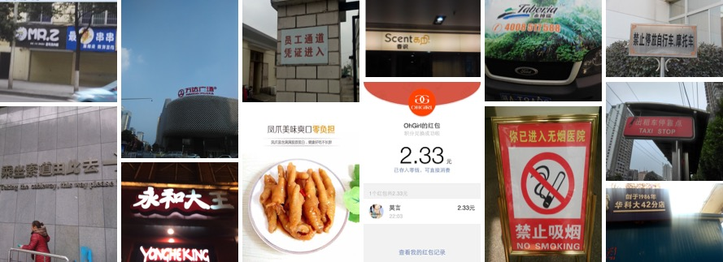
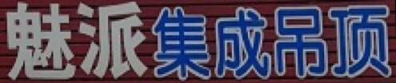
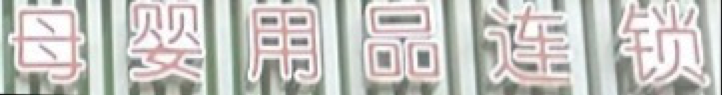
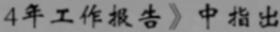

This is a collection of commonly used Chinese datasets, which is being updated continuously. You are welcome to contribute to this list～

In addition to opensource data, users can also use synthesis tools to synthesize data themselves. Current available synthesis tools include [text_renderer](https://github.com/Sanster/text_renderer), [SynthText](https://github.com/ankush-me/SynthText), [TextRecognitionDataGenerator](https://github.com/Belval/TextRecognitionDataGenerator), etc.

#### 1. ICDAR2019-LSVT

- **Data sources**：<https://ai.baidu.com/broad/introduction?dataset=lsvt>
- **Introduction**： A total of 45w Chinese street view images, including 5w (2w test + 3w training) fully labeled data (text coordinates + text content), 40w weakly labeled data (text content only), as shown in the following figure:
    

    (a) Fully labeled data

    

    (b) Weakly labeled data
- **Download link**：<https://ai.baidu.com/broad/download?dataset=lsvt>

#### 2. ICDAR2017-RCTW-17

- **Data sources**：<https://rctw.vlrlab.net/>
- **Introduction**：It contains 12000 + images, most of them are collected in the wild through mobile camera. Some are screenshots. These images show a variety of scenes, including street views, posters, menus, indoor scenes and screenshots of mobile applications.
    
- **Download link**：<https://rctw.vlrlab.net/dataset/>

#### 3. Chinese Street View Text Recognition

- **Data sources**：<https://aistudio.baidu.com/aistudio/competition/detail/8>
- **Introduction**：A total of 290000 pictures are included, of which 210000 are used as training sets (with labels) and 80000 are used as test sets (without labels). The dataset is collected from the Chinese street view, and is formed by by cutting out the text line area (such as shop signs, landmarks, etc.) in the street view picture. All the images are preprocessed: by using affine transform, the text area is proportionally mapped to a picture with a height of 48 pixels, as shown in the figure:

    

    (a) Label: 魅派集成吊顶

    
    (b) Label: 母婴用品连锁
- **Download link**
<https://aistudio.baidu.com/aistudio/datasetdetail/8429>

#### 4. Chinese Document Text Recognition

- **Data sources**：<https://github.com/YCG09/chinese_ocr>
- **Introduction**：
    - A total of 3.64 million pictures are divided into training set and validation set according to 99:1.
    - Using Chinese corpus (news + classical Chinese), the data is randomly generated through changes in font, size, grayscale, blur, perspective, stretching, etc.
    - 5990 characters including Chinese characters, English letters, numbers and punctuation（Characters set: <https://github.com/YCG09/chinese_ocr/blob/master/train/char_std_5990.txt> ）
    - Each sample is fixed with 10 characters, and the characters are randomly intercepted from the sentences in the corpus
    - Image resolution is 280x32

        

        
- **Download link**：<https://pan.baidu.com/s/1QkI7kjah8SPHwOQ40rS1Pw> (Password: lu7m)

#### 5、ICDAR2019-ArT

- **Data source**：<https://ai.baidu.com/broad/introduction?dataset=art>
- **Introduction**：It includes 10166 images, 5603 in training sets and 4563 in test sets. It is composed of three parts: total text, scut-ctw1500 and Baidu curved scene text, including text with various shapes such as horizontal, multi-directional and curved.
    
- **Download link**：<https://ai.baidu.com/broad/download?dataset=art>

#### 6. Electronic seal dataset

- **Data source**: <https://aistudio.baidu.com/aistudio/datasetdetail/154271/0>
- **Data introduction**: Contains 10,000 images in total, 8,000 images in the training set, and 2,000 images in the test set. The dataset is synthesized by a program and does not involve privacy security. It is mainly used for the training and detection of seal curved text. Contributed by developer [jingsongliujing](https://github.com/jingsongliujing)
- **Download address**: <https://aistudio.baidu.com/aistudio/datasetdetail/154271/0>

## References

**ICDAR 2019-LSVT Challenge**

```bibtex
@article{sun2019icdar,
  title={ICDAR 2019 Competition on Large-scale Street View Text with Partial Labeling--RRC-LSVT},
  author={Sun, Yipeng and Ni, Zihan and Chng, Chee-Kheng and Liu, Yuliang and Luo, Canjie and Ng, Chun Chet and Han, Junyu and Ding, Errui and Liu, Jingtuo and Karatzas, Dimosthenis and others},
  journal={arXiv preprint arXiv:1909.07741},
  year={2019}
}
```

**ICDAR 2019-ArT Challenge**

```bibtex
@article{chng2019icdar2019,
  title={ICDAR2019 Robust Reading Challenge on Arbitrary-Shaped Text (RRC-ArT)},
  author={Chng, Chee-Kheng and Liu, Yuliang and Sun, Yipeng and Ng, Chun Chet and Luo, Canjie and Ni, Zihan and Fang, ChuanMing and Zhang, Shuaitao and Han, Junyu and Ding, Errui and others},
  journal={arXiv preprint arXiv:1909.07145},
  year={2019}
}
```
