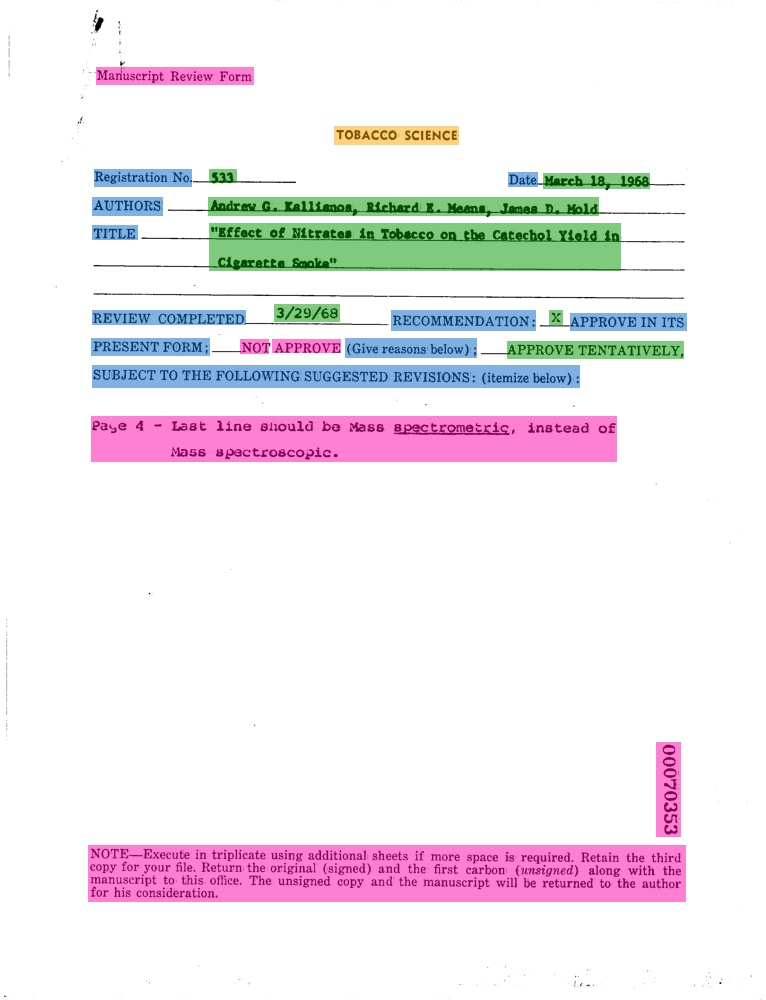
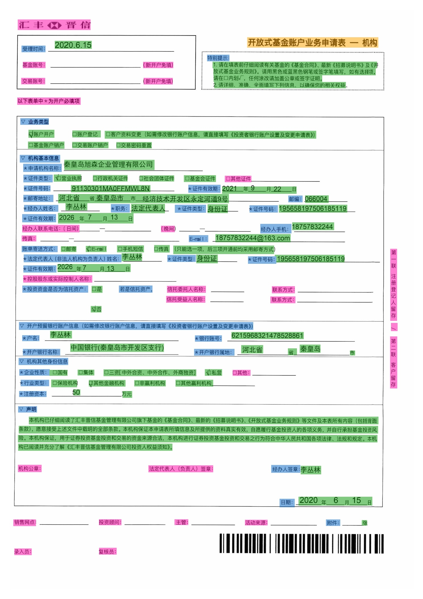
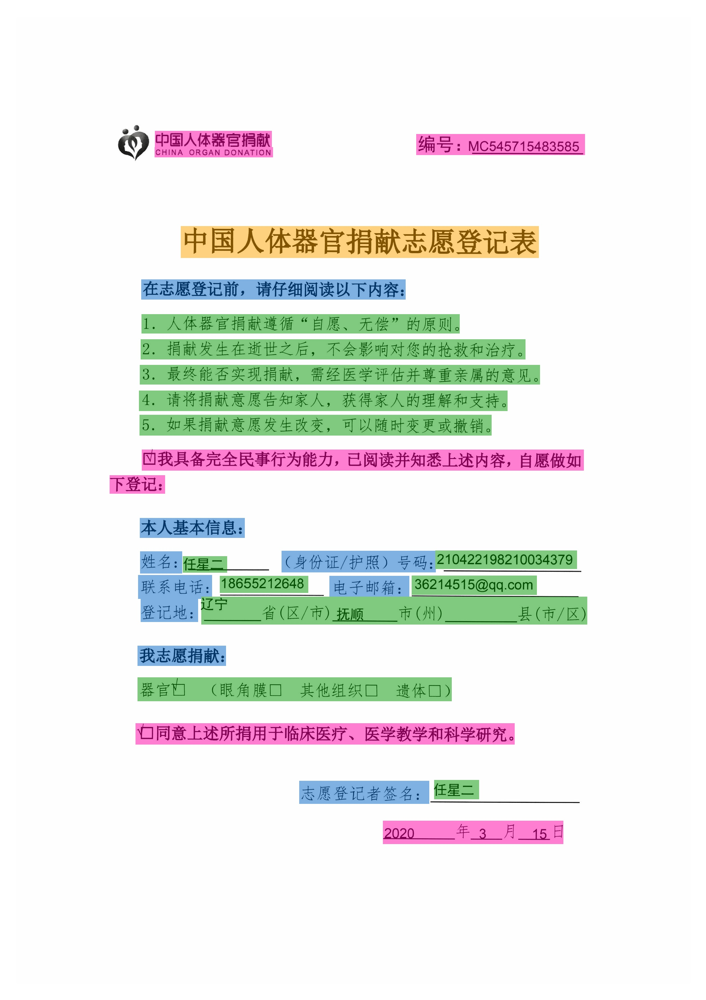
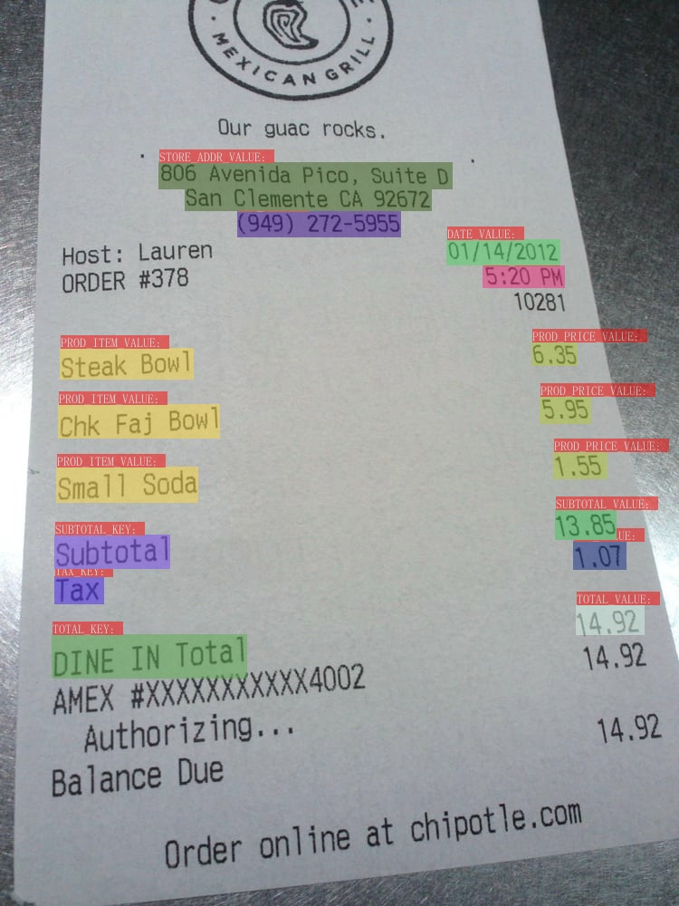
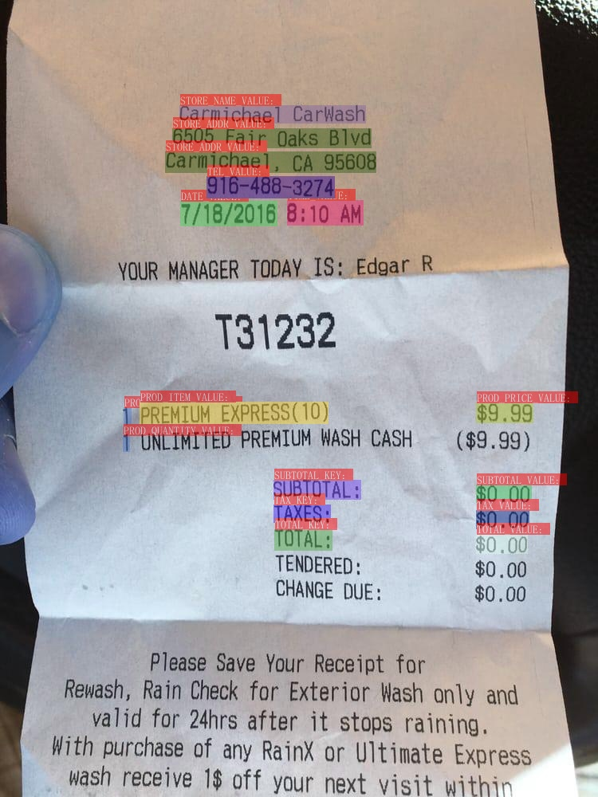

## Key Information Extraction dataset

Here are the common datasets key information extraction, which are being updated continuously. Welcome to contribute datasets.

### 1. FUNSD dataset

- **Data source**: <https://guillaumejaume.github.io/FUNSD/>
- **Data Introduction**: The FUNSD dataset is a dataset for form comprehension. It contains 199 real, fully annotated scanned images, including market reports, advertisements, and academic reports, etc., and is divided into 149 training set and 50 test set. The FUNSD dataset is suitable for many types of DocVQA tasks, such as field-level entity classification, field-level entity connection, etc. Part of the image and the annotation box visualization are shown below:

    

    

    In the figure, the orange area represents `header`, the light blue area represents `question`, the green area represents `answer`, and the pink area represents `other`.

- **Download address**: <https://guillaumejaume.github.io/FUNSD/download/>

### 2. XFUND dataset

- **Data source**: <https://github.com/doc-analysis/XFUND>
- **Data introduction**: XFUND is a multilingual form comprehension dataset, which contains form data in 7 different languages, and all are manually annotated in the form of key-value pairs. The data for each language contains 199 form data, which are divided into 149 training sets and 50 test sets. Part of the image and the annotation box visualization are shown below.

    

    

- **Download address**: <https://github.com/doc-analysis/XFUND/releases/tag/v1.0>

### 3. wildreceipt dataset

- **Data source**: <https://arxiv.org/abs/2103.14470>
- **Data introduction**: wildreceipt is an English receipt dataset, which contains 26 different categories. There are 1267 training images and 472 evaluation images, in which 50,000 textlines and boxes are annotated. Part of the image and the annotation box visualization are shown below.

    

    

**Note：** Boxes with category `Ignore` or `Others` are not visualized here.

- **Download address**：
    - Official dataset: [link](https://download.openmmlab.com/mmocr/data/wildreceipt.tar)
    - Dataset converted for PaddleOCR training process: [link](https://paddleocr.bj.bcebos.com/ppstructure/dataset/wildreceipt.tar)
