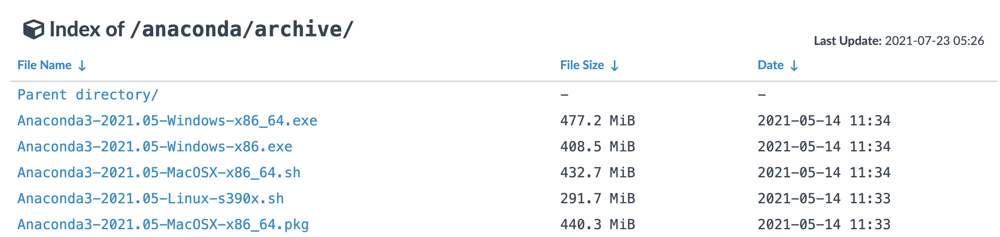
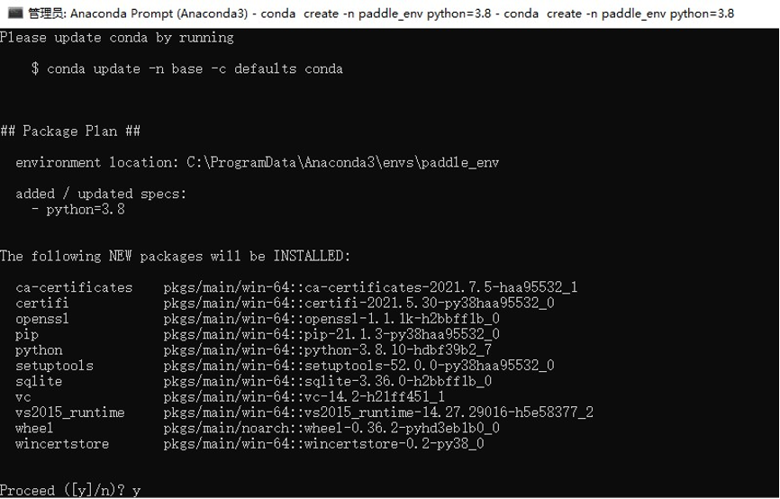
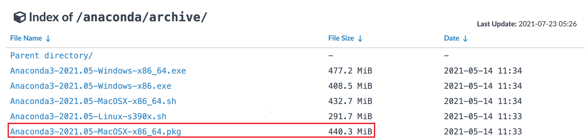
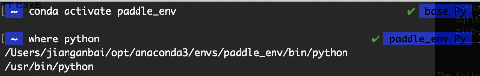

# 运行环境准备

Windows和Mac用户推荐使用Anaconda搭建Python环境，Linux用户建议使用docker搭建Python环境。

推荐环境：

- PaddlePaddle >= 2.1.2
- Python 3
- CUDA10.1 / CUDA10.2
- CUDNN 7.6

> 如果您已经安装Python环境，可以直接参考[PaddleOCR快速开始](./quick_start.md)

## 1. Python环境搭建

### 1.1 Windows

#### 1.1.1 安装Anaconda

- 说明：使用paddlepaddle需要先安装python环境，这里我们选择python集成环境Anaconda工具包
  - Anaconda是1个常用的python包管理程序
  - 安装完Anaconda后，可以安装python环境，以及numpy等所需的工具包环境。

- Anaconda下载：
  - 地址：<https://mirrors.tuna.tsinghua.edu.cn/anaconda/archive/?C=M&O=D>
  - 大部分win10电脑均为64位操作系统，选择x86_64版本；若电脑为32位操作系统，则选择x86.exe

    
  - 下载完成后，双击安装程序进入图形界面
  - 默认安装位置为C盘，建议将安装位置更改到D盘：

    

  - 勾选conda加入环境变量，忽略警告：

    

#### 1.1.2 打开终端并创建conda环境

- 打开Anaconda Prompt终端：左下角Windows Start Menu -> Anaconda3 -> Anaconda Prompt启动控制台

  

- 创建新的conda环境

  ```bash linenums="1"
  # 在命令行输入以下命令，创建名为paddle_env的环境
  # 此处为加速下载，使用清华源
  conda create --name paddle_env python=3.8 --channel https://mirrors.tuna.tsinghua.edu.cn/anaconda/pkgs/free/  # 这是一行命令
  ```

  该命令会创建1个名为paddle_env、python版本为3.8的可执行环境，根据网络状态，需要花费一段时间

  之后命令行中会输出提示信息，输入y并回车继续安装

  

- 激活刚创建的conda环境，在命令行中输入以下命令：

  ```bash linenums="1"
  # 激活paddle_env环境
  conda activate paddle_env
  # 查看当前python的位置
  where python
  ```

    

以上anaconda环境和python环境安装完毕

### 1.2 Mac

#### 1.2.1 安装Anaconda

- 说明：使用paddlepaddle需要先安装python环境，这里我们选择python集成环境Anaconda工具包
  - Anaconda是1个常用的python包管理程序
  - 安装完Anaconda后，可以安装python环境，以及numpy等所需的工具包环境
- Anaconda下载：
  - 地址：<https://mirrors.tuna.tsinghua.edu.cn/anaconda/archive/?C=M&O=D>

  

  - 选择最下方的`Anaconda3-2021.05-MacOSX-x86_64.pkg`下载
- 下载完成后，双击.pkg文件进入图形界面
  - 按默认设置即可，安装需要花费一段时间
- 建议安装vscode或pycharm等代码编辑器

#### 1.2.2 打开终端并创建conda环境

- 打开终端
  - 同时按下command键和空格键，在聚焦搜索中输入"终端"，双击进入终端

- **将conda加入环境变量**

  - 加入环境变量是为了让系统能识别conda命令

  - 输入以下命令，在终端中打开`~/.bash_profile`：

     ```bash linenums="1"
     vim ~/.bash_profile
     ```

  - 在`~/.bash_profile`中将conda添加为环境变量：

     ```bash linenums="1"
     # 先按i进入编辑模式
     # 在第一行输入：
     export PATH="~/opt/anaconda3/bin:$PATH"
     # 若安装时自定义了安装位置，则将~/opt/anaconda3/bin改为自定义的安装目录下的bin文件夹
     ```

    ```bash linenums="1"
    # 修改后的~/.bash_profile文件应如下（其中xxx为用户名）：
    export PATH="~/opt/anaconda3/bin:$PATH"
    # >>> conda initialize >>>
    # !! Contents within this block are managed by 'conda init' !!
    __conda_setup="$('/Users/xxx/opt/anaconda3/bin/conda' 'shell.bash' 'hook' 2> /dev/null)"
    if [ $? -eq 0 ]; then
            eval "$__conda_setup"
    else
            if [ -f "/Users/xxx/opt/anaconda3/etc/profile.d/conda.sh" ]; then
                    . "/Users/xxx/opt/anaconda3/etc/profile.d/conda.sh"
            else
                    export PATH="/Users/xxx/opt/anaconda3/bin:$PATH"
            fi
    fi
    unset __conda_setup
    # <<< conda initialize <<<
    ```

    - 修改完成后，先按`esc`键退出编辑模式，再输入`:wq!`并回车，以保存退出

  - 验证是否能识别conda命令：

    - 在终端中输入`source ~/.bash_profile`以更新环境变量
    - 再在终端输入`conda info --envs`，若能显示当前有base环境，则conda已加入环境变量

- 创建新的conda环境

  ```bash linenums="1"
  # 在命令行输入以下命令，创建名为paddle_env的环境
  # 此处为加速下载，使用清华源
  conda create --name paddle_env python=3.8 --channel https://mirrors.tuna.tsinghua.edu.cn/anaconda/pkgs/free/
  ```

  - 该命令会创建1个名为paddle_env、python版本为3.8的可执行环境，根据网络状态，需要花费一段时间

  - 之后命令行中会输出提示信息，输入y并回车继续安装

    

- 激活刚创建的conda环境，在命令行中输入以下命令：

  ```bash linenums="1"
  # 激活paddle_env环境
  conda activate paddle_env
  # 查看当前python的位置
  where python
  ```

  

以上anaconda环境和python环境安装完毕

### 1.3 Linux

Linux用户可选择Anaconda或Docker两种方式运行。如果你熟悉Docker且需要训练PaddleOCR模型，推荐使用Docker环境，PaddleOCR的开发流程均在Docker环境下运行。如果你不熟悉Docker，也可以使用Anaconda来运行项目。

#### 1.3.1 Anaconda环境配置

- 说明：使用paddlepaddle需要先安装python环境，这里我们选择python集成环境Anaconda工具包
  - Anaconda是1个常用的python包管理程序
  - 安装完Anaconda后，可以安装python环境，以及numpy等所需的工具包环境

- **下载Anaconda**：

  - 下载地址：<https://mirrors.tuna.tsinghua.edu.cn/anaconda/archive/?C=M&O=D>

    

    - 选择适合您操作系统的版本
    - 可在终端输入`uname -m`查询系统所用的指令集

- 下载法1：本地下载，再将安装包传到linux服务器上

- 下载法2：直接使用linux命令行下载

  ```bash linenums="1"
    # 首先安装wget
  sudo apt-get install wget  # Ubuntu
    sudo yum install wget  # CentOS
  ```

  ```bash linenums="1"
    # 然后使用wget从清华源上下载
  # 如要下载Anaconda3-2021.05-Linux-x86_64.sh，则下载命令如下：
    wget https://mirrors.tuna.tsinghua.edu.cn/anaconda/archive/Anaconda3-2021.05-Linux-x86_64.sh

  # 若您要下载其他版本，需要将最后1个/后的文件名改成您希望下载的版本
  ```

- 安装Anaconda：

  - 在命令行输入`sh Anaconda3-2021.05-Linux-x86_64.sh`
    - 若您下载的是其它版本，则将该命令的文件名替换为您下载的文件名
  - 按照安装提示安装即可
    - 查看许可时可输入q来退出

- **将conda加入环境变量**

  - 加入环境变量是为了让系统能识别conda命令，若您在安装时已将conda加入环境变量path，则可跳过本步

  - 在终端中打开`~/.bashrc`：

    ```bash linenums="1"
    # 在终端中输入以下命令：
    vim ~/.bashrc
    ```

  - 在`~/.bashrc`中将conda添加为环境变量：

    ```bash linenums="1"
    # 先按i进入编辑模式
    # 在第一行输入：
    export PATH="~/anaconda3/bin:$PATH"
    # 若安装时自定义了安装位置，则将~/anaconda3/bin改为自定义的安装目录下的bin文件夹
    ```

    ```bash linenums="1"
    # 修改后的~/.bash_profile文件应如下（其中xxx为用户名）：
    export PATH="~/opt/anaconda3/bin:$PATH"
    # >>> conda initialize >>>
    # !! Contents within this block are managed by 'conda init' !!
    __conda_setup="$('/Users/xxx/opt/anaconda3/bin/conda' 'shell.bash' 'hook' 2> /dev/null)"
    if [ $? -eq 0 ]; then
        eval "$__conda_setup"
    else
        if [ -f "/Users/xxx/opt/anaconda3/etc/profile.d/conda.sh" ]; then
            . "/Users/xxx/opt/anaconda3/etc/profile.d/conda.sh"
        else
            export PATH="/Users/xxx/opt/anaconda3/bin:$PATH"
        fi
    fi
    unset __conda_setup
    # <<< conda initialize <<<
    ```

    - 修改完成后，先按`esc`键退出编辑模式，再输入`:wq!`并回车，以保存退出

  - 验证是否能识别conda命令：

    - 在终端中输入`source ~/.bash_profile`以更新环境变量
    - 再在终端输入`conda info --envs`，若能显示当前有base环境，则conda已加入环境变量

- 创建新的conda环境

   ```bash linenums="1"
   # 在命令行输入以下命令，创建名为paddle_env的环境
   # 此处为加速下载，使用清华源
   conda create --name paddle_env python=3.8 --channel https://mirrors.tuna.tsinghua.edu.cn/anaconda/pkgs/free/
   ```

  - 该命令会创建1个名为paddle_env、python版本为3.8的可执行环境，根据网络状态，需要花费一段时间

  - 之后命令行中会输出提示信息，输入y并回车继续安装

    

- 激活刚创建的conda环境，在命令行中输入以下命令：

  ```bash linenums="1"
  # 激活paddle_env环境
  conda activate paddle_env
  ```

以上anaconda环境和python环境安装完毕

#### 1.3.2 Docker环境配置

**注意：第一次使用这个镜像，会自动下载该镜像，请耐心等待。您也可以访问[DockerHub](https://hub.docker.com/r/paddlepaddle/paddle/tags/)获取与您机器适配的镜像。**

```bash linenums="1"
# 切换到工作目录下
cd /home/Projects
# 首次运行需创建一个docker容器，再次运行时不需要运行当前命令
# 创建一个名字为ppocr的docker容器，并将当前目录映射到容器的/paddle目录下

#如果您希望在CPU环境下使用docker，使用docker而不是nvidia-docker创建docker
sudo docker run --name ppocr -v $PWD:/paddle --network=host -it registry.baidubce.com/paddlepaddle/paddle:2.1.3-gpu-cuda10.2-cudnn7 /bin/bash

#如果使用CUDA10，请运行以下命令创建容器，设置docker容器共享内存shm-size为64G，建议设置32G以上
# 如果是CUDA11+CUDNN8，推荐使用镜像registry.baidubce.com/paddlepaddle/paddle:2.1.3-gpu-cuda11.2-cudnn8
sudo nvidia-docker run --name ppocr -v $PWD:/paddle --shm-size=64G --network=host -it registry.baidubce.com/paddlepaddle/paddle:2.1.3-gpu-cuda10.2-cudnn7 /bin/bash

# ctrl+P+Q可退出docker 容器，重新进入docker 容器使用如下命令
sudo docker container exec -it ppocr /bin/bash
```
