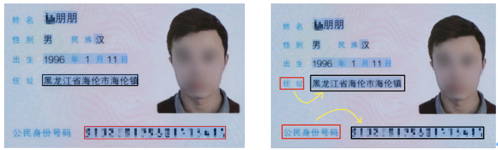
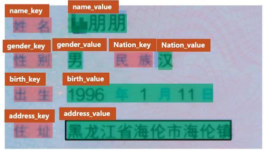
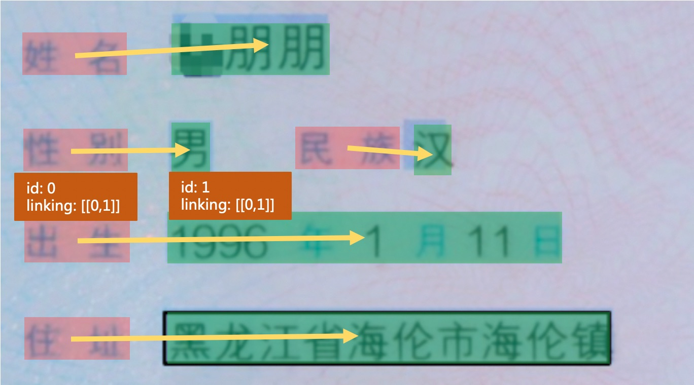

# 怎样完成基于图像数据的信息抽取任务

## 1. 简介

### 1.1 背景

关键信息抽取 (Key Information Extraction, KIE)指的是是从文本或者图像中，抽取出关键的信息。针对文档图像的关键信息抽取任务作为OCR的下游任务，存在非常多的实际应用场景，如表单识别、车票信息抽取、身份证信息抽取等。然而，使用人力从这些文档图像中提取或者收集关键信息耗时费力，怎样自动化融合图像中的视觉、布局、文字等特征并完成关键信息抽取是一个价值与挑战并存的问题。

对于特定场景的文档图像，其中的关键信息位置、版式等较为固定，因此在研究早期有很多基于模板匹配的方法进行关键信息的抽取，考虑到其流程较为简单，该方法仍然被广泛应用在目前的很多场景中。但是这种基于模板匹配的方法在应用到不同的场景中时，需要耗费大量精力去调整与适配模板，迁移成本较高。

文档图像中的KIE一般包含2个子任务，示意图如下图所示。

* （1）SER: 语义实体识别 (Semantic Entity Recognition)，对每一个检测到的文本进行分类，如将其分为姓名，身份证。如下图中的黑色框和红色框。
* （2）RE: 关系抽取 (Relation Extraction)，对每一个检测到的文本进行分类，如将其分为问题 (key) 和答案 (value) 。然后对每一个问题找到对应的答案，相当于完成key-value的匹配过程。如下图中的红色框和黑色框分别代表问题和答案，黄色线代表问题和答案之间的对应关系。



### 1.2 基于深度学习的主流方法

一般的KIE方法基于命名实体识别(Named Entity Recognition,NER)来展开研究，但是此类方法仅使用了文本信息而忽略了位置与视觉特征信息，因此精度受限。近几年大多学者开始融合多个模态的输入信息，进行特征融合，并对多模态信息进行处理，从而提升KIE的精度。主要方法有以下几种

* （1）基于Grid的方法：此类方法主要关注图像层面多模态信息的融合，文本大多大多为字符粒度，对文本与结构结构信息的嵌入方式较为简单，如Chargrid[1]等算法。
* （2）基于Token的方法：此类方法参考NLP中的BERT等方法，将位置、视觉等特征信息共同编码到多模态模型中，并且在大规模数据集上进行预训练，从而在下游任务中，仅需要少量的标注数据便可以获得很好的效果。如LayoutLM[2], LayoutLMv2[3], LayoutXLM[4], StrucText[5]等算法。
* （3）基于GCN的方法：此类方法尝试学习图像、文字之间的结构信息，从而可以解决开集信息抽取的问题（训练集中没有见过的模板），如GCN[6]、SDMGR[7]等算法。
* （4）基于End-to-end的方法：此类方法将现有的OCR文字识别以及KIE信息抽取2个任务放在一个统一的网络中进行共同学习，并在学习过程中相互加强。如Trie[8]等算法。

更多关于该系列算法的详细介绍，请参考“动手学OCR·十讲”课程的课节六部分：[文档分析理论与实践](https://aistudio.baidu.com/aistudio/education/group/info/25207)。

## 2. 关键信息抽取任务流程

PaddleOCR中实现了LayoutXLM等算法（基于Token），同时，在PP-StructureV2中，对LayoutXLM多模态预训练模型的网络结构进行简化，去除了其中的Visual backbone部分，设计了视觉无关的VI-LayoutXLM模型，同时引入符合人类阅读顺序的排序逻辑以及UDML知识蒸馏策略，最终同时提升了关键信息抽取模型的精度与推理速度。

下面介绍怎样基于PaddleOCR完成关键信息抽取任务。

在非End-to-end的KIE方法中，完成关键信息抽取，至少需要**2个步骤**：首先使用OCR模型，完成文字位置与内容的提取，然后使用KIE模型，根据图像、文字位置以及文字内容，提取出其中的关键信息。

### 2.1 训练OCR模型

#### 2.1.1 文本检测

##### （1）数据

PaddleOCR中提供的模型大多数为通用模型，在进行文本检测的过程中，相邻文本行的检测一般是根据位置的远近进行区分，如上图，使用PP-OCRv3通用中英文检测模型进行文本检测时，容易将”民族“与“汉”这2个代表不同的字段检测到一起，从而增加后续KIE任务的难度。因此建议在做KIE任务的过程中，首先训练一个针对该文档数据集的检测模型。

在数据标注时，关键信息的标注需要隔开，比上图中的 “民族汉” 3个字相隔较近，此时需要将”民族“与”汉“标注为2个文本检测框，否则会增加后续KIE任务的难度。

对于下游任务，一般来说，`200~300`张的文本训练数据即可保证基本的训练效果，如果没有太多的先验知识，可以先标注 **`200~300`** 张图片，进行后续文本检测模型的训练。

##### （2）模型

在模型选择方面，推荐使用PP-OCRv3_det，关于更多关于检测模型的训练方法介绍，请参考：[OCR文本检测模型训练教程](../../ppocr/model_train/detection.md)。

#### 2.1.2 文本识别

相对自然场景，文档图像中的文本内容识别难度一般相对较低（背景相对不太复杂），因此**优先建议**尝试PaddleOCR中提供的PP-OCRv3通用文本识别模型([PP-OCRv3模型库链接](../../ppocr/model_list.md))。

##### （1）数据

然而，在部分文档场景中也会存在一些挑战，如身份证场景中存在着罕见字，在发票等场景中的字体比较特殊，这些问题都会增加文本识别的难度，此时如果希望保证或者进一步提升模型的精度，建议基于特定文档场景的文本识别数据集，加载PP-OCRv3模型进行微调。

在模型微调的过程中，建议准备至少`5000`张垂类场景的文本识别图像，可以保证基本的模型微调效果。如果希望提升模型的精度与泛化能力，可以合成更多与该场景类似的文本识别数据，从公开数据集中收集通用真实文本识别数据，一并添加到该场景的文本识别训练任务过程中。在训练过程中，建议每个epoch的真实垂类数据、合成数据、通用数据比例在`1:1:1`左右，这可以通过设置不同数据源的采样比例进行控制。如有3个训练文本文件，分别包含1W、2W、5W条数据，那么可以在配置文件中设置数据如下：

```yaml linenums="1" linenums="1"
Train:
  dataset:
    name: SimpleDataSet
    data_dir: ./train_data/
    label_file_list:
    - ./train_data/train_list_1W.txt
    - ./train_data/train_list_2W.txt
    - ./train_data/train_list_5W.txt
    ratio_list: [1.0, 0.5, 0.2]
    ...
```

##### （2）模型

在模型选择方面，推荐使用通用中英文文本识别模型PP-OCRv3_rec，关于更多关于文本识别模型的训练方法介绍，请参考：[OCR文本识别模型训练教程](../../ppocr/model_train/recognition.md)。

### 2.2 训练KIE模型

对于识别得到的文字进行关键信息抽取，有2种主要的方法。

（1）直接使用SER，获取关键信息的类别：如身份证场景中，将“姓名“与”张三“分别标记为`name_key`与`name_value`。最终识别得到的类别为`name_value`对应的**文本字段**即为我们所需要的关键信息。

（2）联合SER与RE进行使用：这种方法中，首先使用SER，获取图像文字内容中所有的key与value，然后使用RE方法，对所有的key与value进行配对，找到映射关系，从而完成关键信息的抽取。

#### 2.2.1 SER

以身份证场景为例， 关键信息一般包含`姓名`、`性别`、`民族`等，我们直接将对应的字段标注为特定的类别即可，如下图所示。



**注意：**

* 标注过程中，对于无关于KIE关键信息的文本内容，均需要将其标注为`other`类别，相当于背景信息。如在身份证场景中，如果我们不关注性别信息，那么可以将“性别”与“男”这2个字段的类别均标注为`other`。
* 标注过程中，需要以**文本行**为单位进行标注，无需标注单个字符的位置信息。

数据量方面，一般来说，对于比较固定的场景，**50张**左右的训练图片即可达到可以接受的效果，可以使用[PPOCRLabel](https://github.com/PFCCLab/PPOCRLabel/blob/main/README_ch.md)完成KIE的标注过程。

模型方面，推荐使用PP-StructureV2中提出的VI-LayoutXLM模型，它基于LayoutXLM模型进行改进，去除其中的视觉特征提取模块，在精度基本无损的情况下，进一步提升了模型推理速度。更多教程请参考：[VI-LayoutXLM算法介绍](../../algorithm/kie/algorithm_kie_layoutxlm.md)与[KIE关键信息抽取使用教程](../model_train/train_kie.md)。

#### 2.2.2 SER + RE

该过程主要包含SER与RE 2个过程。SER阶段主要用于识别出文档图像中的所有key与value，RE阶段主要用于对所有的key与value进行匹配。

以身份证场景为例， 关键信息一般包含`姓名`、`性别`、`民族`等关键信息，在SER阶段，我们需要识别所有的question (key) 与answer (value) 。标注如下所示。每个字段的类别信息（`label`字段）可以是question、answer或者other（与待抽取的关键信息无关的字段）


在RE阶段，需要标注每个字段的的id与连接信息，如下图所示。



每个文本行字段中，需要添加`id`与`linking`字段信息，`id`记录该文本行的唯一标识，同一张图片中的不同文本内容不能重复，`linking`是一个列表，记录了不同文本之间的连接信息。如字段“出生”的id为0，字段“1996年1月11日”的id为1，那么它们均有[[0, 1]]的`linking`标注，表示该id=0与id=1的字段构成key-value的关系（姓名、性别等字段类似，此处不再一一赘述）。

**注意：**

* 标注过程中，如果value是多个字符，那么linking中可以新增一个key-value对，如`[[0, 1], [0, 2]]`

数据量方面，一般来说，对于比较固定的场景，**50张**左右的训练图片即可达到可以接受的效果，可以使用PPOCRLabel完成KIE的标注过程。

模型方面，推荐使用PP-StructureV2中提出的VI-LayoutXLM模型，它基于LayoutXLM模型进行改进，去除其中的视觉特征提取模块，在精度基本无损的情况下，进一步提升了模型推理速度。更多教程请参考：[VI-LayoutXLM算法介绍](../../algorithm/kie/algorithm_kie_layoutxlm.md)与[KIE关键信息抽取使用教程](../model_train/train_kie.md)。

## 3. 参考文献

[1] Katti A R, Reisswig C, Guder C, et al. Chargrid: Towards understanding 2d documents[J]. arXiv preprint arXiv:1809.08799, 2018.

[2] Xu Y, Li M, Cui L, et al. Layoutlm: Pre-training of text and layout for document image understanding[C]//Proceedings of the 26th ACM SIGKDD International Conference on Knowledge Discovery & Data Mining. 2020: 1192-1200.

[3] Xu Y, Xu Y, Lv T, et al. LayoutLMv2: Multi-modal pre-training for visually-rich document understanding[J]. arXiv preprint arXiv:2012.14740, 2020.

[4]: Xu Y, Lv T, Cui L, et al. Layoutxlm: Multimodal pre-training for multilingual visually-rich document understanding[J]. arXiv preprint arXiv:2104.08836, 2021.

[5] Li Y, Qian Y, Yu Y, et al. StrucTexT: Structured Text Understanding with Multi-Modal Transformers[C]//Proceedings of the 29th ACM International Conference on Multimedia. 2021: 1912-1920.

[6] Liu X, Gao F, Zhang Q, et al. Graph convolution for multimodal information extraction from visually rich documents[J]. arXiv preprint arXiv:1903.11279, 2019.

[7] Sun H, Kuang Z, Yue X, et al. Spatial Dual-Modality Graph Reasoning for Key Information Extraction[J]. arXiv preprint arXiv:2103.14470, 2021.

[8] Zhang P, Xu Y, Cheng Z, et al. Trie: End-to-end text reading and information extraction for document understanding[C]//Proceedings of the 28th ACM International Conference on Multimedia. 2020: 1413-1422.
