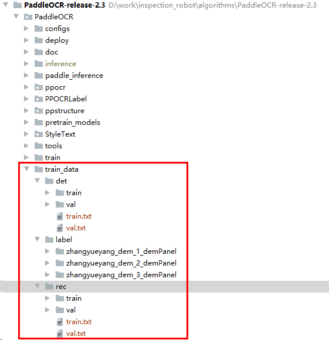
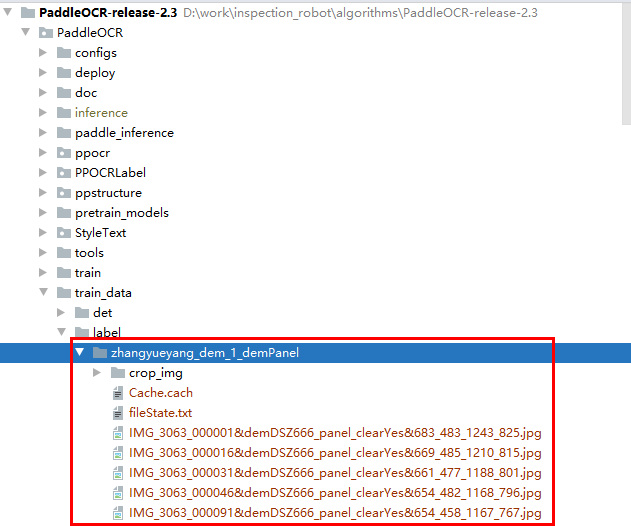

1、功能描述：分别划分检测和识别的训练集和验证集

2、说明：可以根据自己的路径和需求调整参数，图像数据往往多人合作分批标注，每一批图像数据放在一个文件夹内用PPOCRLabel进行标注，如此会有多个标注好的图像文件夹汇总并划分训练集和验证集的需求。

3、使用方法：

3.1 首先使用PPOCRLabel标注好图像，一般是分批次标注，多个标注好的图像文件夹存放在train_data目录下的label文件夹里，文件夹没有自己创建，label同级路径下创建det文件夹存放划分好的文本检测数据集，label同级路径下创建rec文件夹存放划分好的字符识别数据集，目录结构如下图所示：

3.2  gen_ocr_train_val.py参数说明

trainValRatio 训练集和验证集的图像数量划分比例，根据你的实际情况设定，默认是0.8

labelRootPath PPOCRLabel标注的数据集存放路径，默认是./train_data/label

detRootPath 根据PPOCRLabel标注的数据集划分后的文本检测数据集存放的路径 

recRootPath 根据PPOCRLabel标注的数据集划分后的字符识别数据集存放的路径 

detLabelFileName 使用PPOCRLabel标注图像时，人工确认过的标注结果会存放在Label.txt内

recLabelFileName 使用PPOCRLabel标注图像时，点击导出识别结果后，会对人工确认过的字符标注结果进行字符裁剪，生成裁剪后的字符图像路径以及字符图像对应的字符标签保存到rec_gt.txt中

recImageDirName 使用PPOCRLabel标注图像时，点击导出识别结果后，会把裁剪后的字符图像保存到crop_img文件夹内

3.3 执行gen_ocr_train_val.py方法
如果目录结构和文件夹名称是严格按照以上说明创建的，可以直接在windows环境下执行gen_ocr_train_val.bat，在linux环境下需要执行gen_ocr_train_val.sh，默认划分比例是0.8
也可以在终端中输入以下命令执行：
python gen_ocr_train_val.py --trainValRatio 0.8 --labelRootPath ./train_data/label --detRootPath ./train_data/det --recRootPath ./train_data/rec
如果想创建自己的目录结构和文件夹名称，需要手动修改命令里的路径
