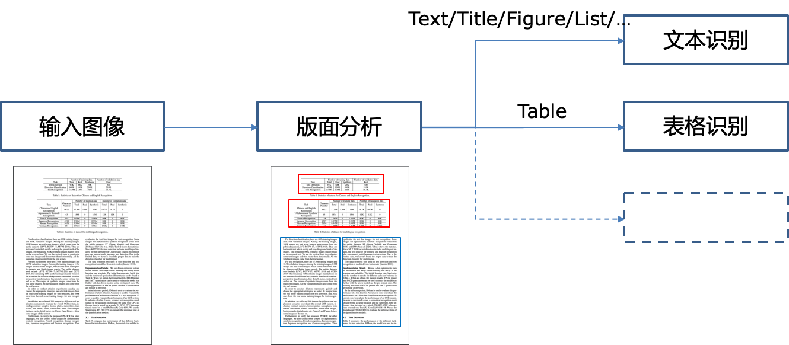

# PaddleStructure

## 1. Introduction to pipeline

PaddleStructure is a toolkit for complex layout text OCR, the process is as follows



In PaddleStructure, the image will be analyzed by layoutparser first. In the layout analysis, the area in the image will be classified, and the OCR process will be carried out according to the category.

Currently layoutparser will output five categories:
1. Text
2. Title
3. Figure
4. List
5. Table
   
Types 1-4 follow the traditional OCR process, and 5 follow the Table OCR process.

## 2. LayoutParser


## 3. Table OCR

[doc](table/README.md)

## 4. PaddleStructure whl package introduction

### 4.1 Use

4.1.1 Use by code
```python
import cv2
from paddlestructure import PaddleStructure,draw_result

table_engine = PaddleStructure(
    output='./output/table',
    show_log=True)

img_path = '../doc/table/1.png'
img = cv2.imread(img_path)
result = table_engine(img)
for line in result:
    print(line)

from PIL import Image

font_path = 'path/tp/PaddleOCR/doc/fonts/simfang.ttf'
image = Image.open(img_path).convert('RGB')
im_show = draw_result(image, result,font_path=font_path)
im_show = Image.fromarray(im_show)
im_show.save('result.jpg')
```

4.1.2 Use by command line
```bash
paddlestructure --image_dir=../doc/table/1.png
```

### 参数说明
大部分参数和paddleocr whl包保持一致，见 [whl包文档](../doc/doc_ch/whl.md)

| 字段                    | 说明                                            | 默认值           |
|------------------------|------------------------------------------------------|------------------|
| output                 | excel和识别结果保存的地址                    | ./output/table            |
| structure_max_len      |  structure模型预测时，图像的长边resize尺度             |  488            |
| structure_model_dir      |  structure inference 模型地址             |  None            |
| structure_char_type      |  structure 模型所用字典地址             |  ../ppocr/utils/dict/table_structure_dict.tx            |


