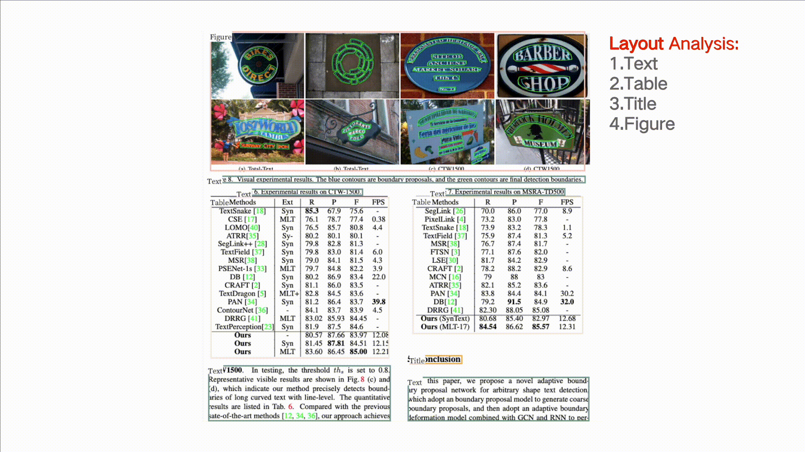
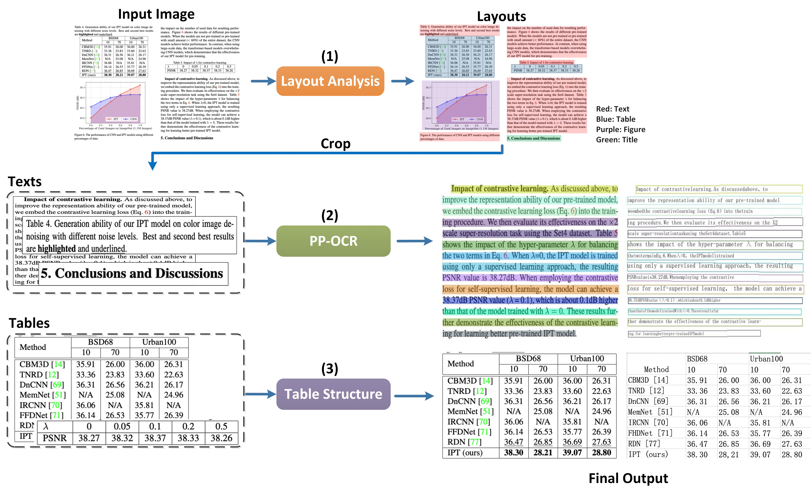

English | [简体中文](README_ch.md)

# PP-Structure

PP-Structure is an OCR toolkit that can be used for complex documents analysis. The main features are as follows:
- Support the layout analysis of documents, divide the documents into 5 types of areas **text, title, table, image and list** (conjunction with Layout-Parser)
- Support to extract the texts from the text, title, picture and list areas (used in conjunction with PP-OCR)
- Support to extract excel files from the table areas
- Support python whl package and command line usage, easy to use
- Support custom training for layout analysis and table structure tasks

## 1. Visualization




## 2. Installation

### 2.1 Install requirements

- **（1) Install PaddlePaddle**

```bash
pip3 install --upgrade pip

# GPU
python3 -m pip install paddlepaddle-gpu==2.1.1 -i https://mirror.baidu.com/pypi/simple

# CPU
 python3 -m pip install paddlepaddle==2.1.1 -i https://mirror.baidu.com/pypi/simple

```
For more，refer [Installation](https://www.paddlepaddle.org.cn/install/quick) .

- **(2) Install Layout-Parser**

```bash
pip3 install -U https://paddleocr.bj.bcebos.com/whl/layoutparser-0.0.0-py3-none-any.whl
```

### 2.2 Install PaddleOCR（including PP-OCR and PP-Structure）

- **（1) PIP install PaddleOCR whl package（inference only）**

```bash
pip install "paddleocr>=2.2"
```

- **（2) Clone PaddleOCR（Inference+training）**

```bash
git clone https://github.com/PaddlePaddle/PaddleOCR
```


## 3. Quick Start

### 3.1 Use by command line

```bash
paddleocr --image_dir=../doc/table/1.png --type=structure
```

### 3.2 Use by python API

```python
import os
import cv2
from paddleocr import PPStructure,draw_structure_result,save_structure_res

table_engine = PPStructure(show_log=True)

save_folder = './output/table'
img_path = '../doc/table/1.png'
img = cv2.imread(img_path)
result = table_engine(img)
save_structure_res(result, save_folder,os.path.basename(img_path).split('.')[0])

for line in result:
    line.pop('img')
    print(line)

from PIL import Image

font_path = '../doc/fonts/simfang.ttf'
image = Image.open(img_path).convert('RGB')
im_show = draw_structure_result(image, result,font_path=font_path)
im_show = Image.fromarray(im_show)
im_show.save('result.jpg')
```
### 3.3 Returned results format
The returned results of PP-Structure is a list composed of a dict, an example is as follows

```shell
[
  {   'type': 'Text',
      'bbox': [34, 432, 345, 462],
      'res': ([[36.0, 437.0, 341.0, 437.0, 341.0, 446.0, 36.0, 447.0], [41.0, 454.0, 125.0, 453.0, 125.0, 459.0, 41.0, 460.0]],
                [('Tigure-6. The performance of CNN and IPT models using difforen', 0.90060663), ('Tent  ', 0.465441)])
  }
]
```
The description of each field in dict is as follows

| Parameter            | Description           |
| --------------- | -------------|
|type|Type of image area|
|bbox|The coordinates of the image area in the original image, respectively [left upper x, left upper y, right bottom x, right bottom y]|
|res|OCR or table recognition result of image area。<br> Table: HTML string of the table; <br> OCR: A tuple containing the detection coordinates and recognition results of each single line of text|


### 3.4 Parameter description：

| Parameter            | Description                                     | Default value                                        |
| --------------- | ---------------------------------------- | ------------------------------------------- |
| output          | The path where excel and recognition results are saved                | ./output/table                              |
| table_max_len   | The long side of the image is resized in table structure model  | 488                                         |
| table_model_dir | inference model path of table structure model          | None                                        |
| table_char_type | dict path of table structure model                 | ../ppocr/utils/dict/table_structure_dict.tx |

Most of the parameters are consistent with the paddleocr whl package, see [doc of whl](../doc/doc_en/whl_en.md)

After running, each image will have a directory with the same name under the directory specified in the output field. Each table in the picture will be stored as an excel and figure area will be cropped and saved, the excel and image file name will be the coordinates of the table in the image.

## 4. PP-Structure Pipeline


In PP-Structure, the image will be analyzed by layoutparser first. In the layout analysis, the area in the image will be classified, including **text, title, image, list and table** 5 categories. For the first 4 types of areas, directly use the PP-OCR to complete the text detection and recognition. The table area will  be converted to an excel file of the same table style via Table OCR.

### 4.1 LayoutParser

Layout analysis divides the document data into regions, including the use of Python scripts for layout analysis tools, extraction of special category detection boxes, performance indicators, and custom training layout analysis models. For details, please refer to [document](layout/README_en.md).

### 4.2 Table Recognition

Table Recognition converts table image into excel documents, which include the detection and recognition of table text and the prediction of table structure and cell coordinates. For detailed, please refer to [document](table/README.md)

## 5. Prediction by inference engine

Use the following commands to complete the inference.

```python
cd PaddleOCR/ppstructure

# download model
mkdir inference && cd inference
# Download the detection model of the ultra-lightweight Chinese OCR model and uncompress it
wget https://paddleocr.bj.bcebos.com/dygraph_v2.0/ch/ch_ppocr_mobile_v2.0_det_infer.tar && tar xf ch_ppocr_mobile_v2.0_det_infer.tar
# Download the recognition model of the ultra-lightweight Chinese OCR model and uncompress it
wget https://paddleocr.bj.bcebos.com/dygraph_v2.0/ch/ch_ppocr_mobile_v2.0_rec_infer.tar && tar xf ch_ppocr_mobile_v2.0_rec_infer.tar
# Download the table structure model of the ultra-lightweight Chinese OCR model and uncompress it
wget https://paddleocr.bj.bcebos.com/dygraph_v2.0/table/en_ppocr_mobile_v2.0_table_structure_infer.tar && tar xf en_ppocr_mobile_v2.0_table_structure_infer.tar
cd ..

python3 predict_system.py --det_model_dir=inference/ch_ppocr_mobile_v2.0_det_infer --rec_model_dir=inference/ch_ppocr_mobile_v2.0_rec_infer --table_model_dir=inference/en_ppocr_mobile_v2.0_table_structure_infer --image_dir=../doc/table/1.png --rec_char_dict_path=../ppocr/utils/ppocr_keys_v1.txt --table_char_dict_path=../ppocr/utils/dict/table_structure_dict.txt --rec_char_type=ch --output=../output/table --vis_font_path=../doc/fonts/simfang.ttf
```
After running, each image will have a directory with the same name under the directory specified in the output field. Each table in the picture will be stored as an excel and figure area will be cropped and saved, the excel and image file name will be the coordinates of the table in the image.

**Model List**


|model name|description|config|model size|download|
| --- | --- | --- | --- | --- |
|en_ppocr_mobile_v2.0_table_structure|Table structure prediction for English table scenarios|[table_mv3.yml](../configs/table/table_mv3.yml)|18.6M|[inference model](https://paddleocr.bj.bcebos.com/dygraph_v2.0/table/en_ppocr_mobile_v2.0_table_structure_infer.tar) |

**Model List**

LayoutParser model

|model name|description|download|
| --- | --- | --- |
| ppyolov2_r50vd_dcn_365e_publaynet | The layout analysis model trained on the PubLayNet data set can be divided into 5 types of areas **text, title, table, picture and list** | [PubLayNet](https://paddle-model-ecology.bj.bcebos.com/model/layout-parser/ppyolov2_r50vd_dcn_365e_publaynet.tar) |
| ppyolov2_r50vd_dcn_365e_tableBank_word | The layout analysis model trained on the TableBank Word dataset can only detect tables | [TableBank Word](https://paddle-model-ecology.bj.bcebos.com/model/layout-parser/ppyolov2_r50vd_dcn_365e_tableBank_word.tar) |
| ppyolov2_r50vd_dcn_365e_tableBank_latex | The layout analysis model trained on the TableBank Latex dataset can only detect tables | [TableBank Latex](https://paddle-model-ecology.bj.bcebos.com/model/layout-parser/ppyolov2_r50vd_dcn_365e_tableBank_latex.tar) |

OCR and table recognition model

|model name|description|model size|download|
| --- | --- | --- | --- |
|ch_ppocr_mobile_slim_v2.0_det|Slim pruned lightweight model, supporting Chinese, English, multilingual text detection|2.6M|[inference model](https://paddleocr.bj.bcebos.com/dygraph_v2.0/slim/ch_ppocr_mobile_v2.0_det_prune_infer.tar) / [trained model](https://paddleocr.bj.bcebos.com/dygraph_v2.0/slim/ch_ppocr_mobile_v2.0_det_prune_infer.tar) |
|ch_ppocr_mobile_slim_v2.0_rec|Slim pruned and quantized lightweight model, supporting Chinese, English and number recognition|6M|[inference model](https://paddleocr.bj.bcebos.com/dygraph_v2.0/ch/ch_ppocr_mobile_v2.0_rec_slim_infer.tar) / [trained model](https://paddleocr.bj.bcebos.com/dygraph_v2.0/ch/ch_ppocr_mobile_v2.0_rec_slim_train.tar) |
|en_ppocr_mobile_v2.0_table_det|Text detection of English table scenes trained on PubLayNet dataset|4.7M|[inference model](https://paddleocr.bj.bcebos.com/dygraph_v2.0/table/en_ppocr_mobile_v2.0_table_det_infer.tar) / [trained model](https://paddleocr.bj.bcebos.com/dygraph_v2.1/table/en_ppocr_mobile_v2.0_table_det_train.tar) |
|en_ppocr_mobile_v2.0_table_rec|Text recognition of English table scene trained on PubLayNet dataset|6.9M|[inference model](https://paddleocr.bj.bcebos.com/dygraph_v2.0/table/en_ppocr_mobile_v2.0_table_rec_infer.tar)  [trained model](https://paddleocr.bj.bcebos.com/dygraph_v2.1/table/en_ppocr_mobile_v2.0_table_rec_train.tar) |
|en_ppocr_mobile_v2.0_table_structure|Table structure prediction of English table scene trained on PubLayNet dataset|18.6M|[inference model](https://paddleocr.bj.bcebos.com/dygraph_v2.0/table/en_ppocr_mobile_v2.0_table_structure_infer.tar) / [trained model](https://paddleocr.bj.bcebos.com/dygraph_v2.1/table/en_ppocr_mobile_v2.0_table_structure_train.tar) |

If you need to use other models, you can download the model in [model_list](../doc/doc_en/models_list_en.md) or use your own trained model to configure it to the three fields of `det_model_dir`, `rec_model_dir`, `table_model_dir` .
