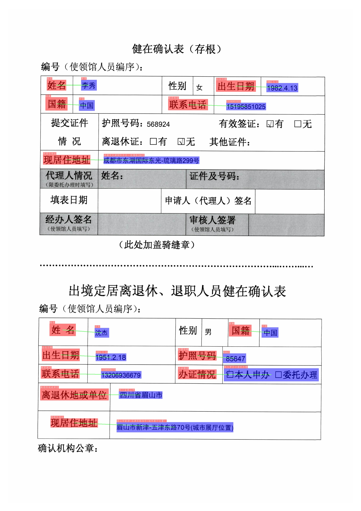
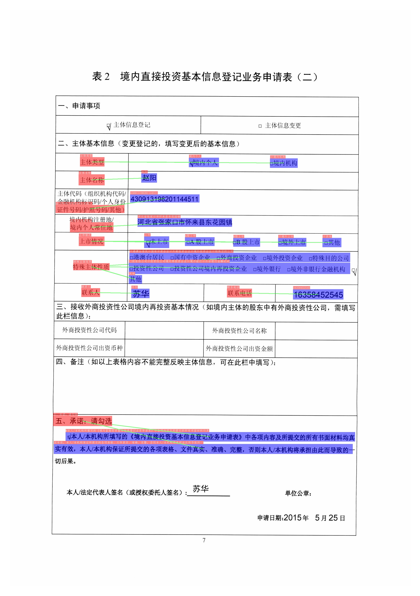

English | [简体中文](README_ch.md)

- [1. Introduction](#1-introduction)
- [2. Update log](#2-update-log)
- [3. Features](#3-features)
- [4. Results](#4-results)
  - [4.1 Layout analysis and table recognition](#41-layout-analysis-and-table-recognition)
  - [4.2 DOC-VQA](#42-doc-vqa)
- [5. Quick start](#5-quick-start)
- [6. PP-Structure System](#6-pp-structure-system)
  - [6.1 Layout analysis and table recognition](#61-layout-analysis-and-table-recognition)
    - [6.1.1 Layout analysis](#611-layout-analysis)
    - [6.1.2 Table recognition](#612-table-recognition)
  - [6.2 DOC-VQA](#62-doc-vqa)
- [7. Model List](#7-model-list)
  - [7.1 Layout analysis model](#71-layout-analysis-model)
  - [7.2 OCR and table recognition model](#72-ocr-and-table-recognition-model)
  - [7.3 DOC-VQA model](#73-doc-vqa-model)

## 1. Introduction

PP-Structure is an OCR toolkit that can be used for document analysis and processing with complex structures, designed to help developers better complete document understanding tasks

## 2. Update log
* 2022.02.12 DOC-VQA add LayoutLMv2 model。
* 2021.12.07 add [DOC-VQA SER and RE tasks](vqa/README.md)。

## 3. Features

The main features of PP-Structure are as follows:

- Support the layout analysis of documents, divide the documents into 5 types of areas **text, title, table, image and list** (conjunction with Layout-Parser)
- Support to extract the texts from the text, title, picture and list areas (used in conjunction with PP-OCR)
- Support to extract excel files from the table areas
- Support python whl package and command line usage, easy to use
- Support custom training for layout analysis and table structure tasks
- Support Document Visual Question Answering (DOC-VQA) tasks: Semantic Entity Recognition (SER) and Relation Extraction (RE)

## 4. Results

### 4.1 Layout analysis and table recognition

The figure shows the pipeline of layout analysis + table recognition. The image is first divided into four areas of image, text, title and table by layout analysis, and then OCR detection and recognition is performed on the three areas of image, text and title, and the table is performed table recognition, where the image will also be stored for use.

### 4.2 DOC-VQA

* SER
*
 | 
---|---

Different colored boxes in the figure represent different categories. For xfun dataset, there are three categories: query, answer and header:

* Dark purple: header
* Light purple: query
* Army green: answer

The corresponding category and OCR recognition results are also marked at the top left of the OCR detection box.

* RE

 | 
---|---

In the figure, the red box represents the question, the blue box represents the answer, and the question and answer are connected by green lines. The corresponding category and OCR recognition results are also marked at the top left of the OCR detection box.

## 5. Quick start

Start from [Quick Installation](./docs/quickstart.md)

## 6. PP-Structure System

### 6.1 Layout analysis and table recognition

In PP-Structure, the image will be divided into 5 types of areas **text, title, image list and table**. For the first 4 types of areas, directly use PP-OCR system to complete the text detection and recognition. For the table area, after the table structuring process, the table in image is converted into an Excel file with the same table style.

#### 6.1.1 Layout analysis

Layout analysis classifies image by region, including the use of Python scripts of layout analysis tools, extraction of designated category detection boxes, performance indicators, and custom training layout analysis models. For details, please refer to [document](layout/README.md).

#### 6.1.2 Table recognition

Table recognition converts table images into excel documents, which include the detection and recognition of table text and the prediction of table structure and cell coordinates. For detailed instructions, please refer to [document](table/README.md)

### 6.2 DOC-VQA

Document Visual Question Answering (DOC-VQA) if a type of Visual Question Answering (VQA), which includes Semantic Entity Recognition (SER) and Relation Extraction (RE) tasks. Based on SER task, text recognition and classification in images can be completed. Based on THE RE task, we can extract the relation of the text content in the image, such as judge the problem pair. For details, please refer to [document](vqa/README.md)

## 7. Model List

PP-Structure Series Model List (Updating)

### 7.1 Layout analysis model

|model name|description|download|
| --- | --- | --- |
| ppyolov2_r50vd_dcn_365e_publaynet | The layout analysis model trained on the PubLayNet dataset can divide image into 5 types of areas **text, title, table, picture, and list** | [PubLayNet](https://paddle-model-ecology.bj.bcebos.com/model/layout-parser/ppyolov2_r50vd_dcn_365e_publaynet.tar) |

### 7.2 OCR and table recognition model

|model name|description|model size|download|
| --- | --- | --- | --- |
|ch_PP-OCRv2_det_slim|[New] Slim quantization with distillation lightweight model, supporting Chinese, English, multilingual text detection| 3M |[inference model](https://paddleocr.bj.bcebos.com/PP-OCRv2/chinese/ch_PP-OCRv2_det_slim_quant_infer.tar)|
|ch_PP-OCRv2_rec_slim|[New] Slim qunatization with distillation lightweight model, supporting Chinese, English, multilingual text recognition| 9M |[inference model](https://paddleocr.bj.bcebos.com/PP-OCRv2/chinese/ch_PP-OCRv2_rec_slim_quant_infer.tar) / [trained model](https://paddleocr.bj.bcebos.com/PP-OCRv2/chinese/ch_PP-OCRv2_rec_slim_quant_train.tar) |
|en_ppocr_mobile_v2.0_table_structure|Table structure prediction of English table scene trained on PubLayNet dataset| 18.6M |[inference model](https://paddleocr.bj.bcebos.com/dygraph_v2.0/table/en_ppocr_mobile_v2.0_table_structure_infer.tar) / [trained model](https://paddleocr.bj.bcebos.com/dygraph_v2.1/table/en_ppocr_mobile_v2.0_table_structure_train.tar) |

### 7.3 DOC-VQA model

|model name|description|model size|download|
| --- | --- | --- | --- |
|ser_LayoutXLM_xfun_zhd|SER model trained on xfun Chinese dataset based on LayoutXLM|1.4G|[inference model coming soon]() / [trained model](https://paddleocr.bj.bcebos.com/pplayout/ser_LayoutXLM_xfun_zh.tar) |
|re_LayoutXLM_xfun_zh|RE model trained on xfun Chinese dataset based on LayoutXLM|1.4G|[inference model coming soon]() / [trained model](https://paddleocr.bj.bcebos.com/pplayout/re_LayoutXLM_xfun_zh.tar) |

If you need to use other models, you can download the model in [PPOCR model_list](../doc/doc_en/models_list_en.md) and  [PPStructure model_list](./docs/model_list.md)
