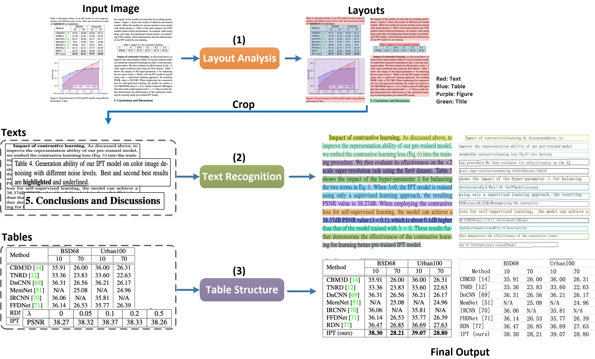

# PaddleStructure

PaddleStructure is an OCR toolkit for complex layout analysis. It can divide document data in the form of pictures into **text, table, title, picture and list** 5 types of areas, and extract the table area as excel
## 1. Quick start

### install

**install layoutparser**
```sh
pip3 install -U https://paddleocr.bj.bcebos.com/whl/layoutparser-0.0.0-py3-none-any.whl
```
**install paddlestructure**

install by pypi

```bash
pip install paddlestructure
```

build own whl package and install
```bash
python3 setup.py bdist_wheel
pip3 install dist/paddlestructure-x.x.x-py3-none-any.whl # x.x.x is the version of paddlestructure
```

### 1.2 Use

#### 1.2.1 Use by command line

```bash
paddlestructure --image_dir=../doc/table/1.png
```

#### 1.2.2 Use by code

```python
import os
import cv2
from paddlestructure import PaddleStructure,draw_result,save_res

table_engine = PaddleStructure(show_log=True)

save_folder = './output/table'
img_path = '../doc/table/1.png'
img = cv2.imread(img_path)
result = table_engine(img)
save_res(result, save_folder,os.path.basename(img_path).split('.')[0])

for line in result:
    print(line)

from PIL import Image

font_path = '../doc/fonts/simfang.ttf' # PaddleOCR下提供字体包
image = Image.open(img_path).convert('RGB')
im_show = draw_result(image, result,font_path=font_path)
im_show = Image.fromarray(im_show)
im_show.save('result.jpg')
```

#### 1.2.3 Parameter Description：

| Parameter            | Description                                     | Default value                                        |
| --------------- | ---------------------------------------- | ------------------------------------------- |
| output          | The path where excel and recognition results are saved                | ./output/table                              |
| table_max_len   | The long side of the image is resized in table structure model  | 488                                         |
| table_model_dir | inference model path of table structure model          | None                                        |
| table_char_type | dict path of table structure model                 | ../ppocr/utils/dict/table_structure_dict.tx |

Most of the parameters are consistent with the paddleocr whl package, see [doc of whl](../doc/doc_en/whl_en.md)

After running, each image will have a directory with the same name under the directory specified in the output field. Each table in the picture will be stored as an excel, and the excel file name will be the coordinates of the table in the image.

## 2. PaddleStructure Pipeline

the process is as follows


In PaddleStructure, the image will be analyzed by layoutparser first. In the layout analysis, the area in the image will be classified, including **text, title, image, list and table** 5 categories. For the first 4 types of areas, directly use the PP-OCR to complete the text detection and recognition. The table area will  be converted to an excel file of the same table style via Table OCR.

### 2.1 LayoutParser

Layout analysis divides the document data into regions, including the use of Python scripts for layout analysis tools, extraction of special category detection boxes, performance indicators, and custom training layout analysis models. For details, please refer to [document](layout/README_en.md).

### 2.2 Table OCR

Table OCR converts table image into excel documents, which include the detection and recognition of table text and the prediction of table structure and cell coordinates. For detailed, please refer to [document](table/README.md)

## 3. Predictive by inference engine

Use the following commands to complete the inference. 

```python
python3 table/predict_system.py --det_model_dir=path/to/det_model_dir --rec_model_dir=path/to/rec_model_dir --table_model_dir=path/to/table_model_dir --image_dir=../doc/table/1.png --rec_char_dict_path=../ppocr/utils/dict/table_dict.txt --table_char_dict_path=../ppocr/utils/dict/table_structure_dict.txt --rec_char_type=EN --det_limit_side_len=736 --det_limit_type=min --output ../output/table
```
After running, each image will have a directory with the same name under the directory specified in the output field. Each table in the picture will be stored as an excel, and the excel file name will be the coordinates of the table in the image.

**Model List**


|model name|description|config|model size|download|
| --- | --- | --- | --- | --- |
|en_ppocr_mobile_v2.0_table_det|Text detection in English table scene|[ch_det_mv3_db_v2.0.yml](../configs/det/ch_ppocr_v2.0/ch_det_mv3_db_v2.0.yml)| 4.7M |[inference model](https://paddleocr.bj.bcebos.com/dygraph_v2.0/table/en_ppocr_mobile_v2.0_table_det_infer.tar) |
|en_ppocr_mobile_v2.0_table_rec|Text recognition in English table scene|[rec_chinese_lite_train_v2.0.yml](..//configs/rec/rec_mv3_none_bilstm_ctc.yml)|6.9M|[inference model](https://paddleocr.bj.bcebos.com/dygraph_v2.0/table/en_ppocr_mobile_v2.0_table_rec_infer.tar) |
|en_ppocr_mobile_v2.0_table_structure|Table structure prediction for English table scenarios|[table_mv3.yml](../configs/table/table_mv3.yml)|18.6M|[inference model](https://paddleocr.bj.bcebos.com/dygraph_v2.0/table/en_ppocr_mobile_v2.0_table_structure_infer.tar) |