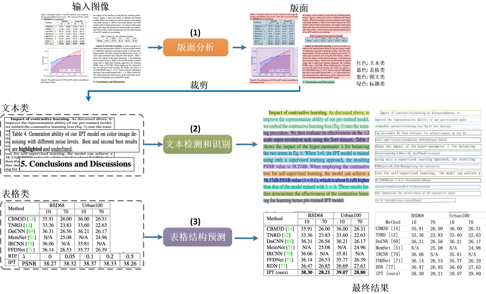

[English](README.md) | 简体中文

# PP-Structure

PP-Structure是一个可用于复杂文档结构分析和处理的OCR工具包，主要特性如下：
- 支持对图片形式的文档进行版面分析，可以划分**文字、标题、表格、图片以及列表**5类区域（与Layout-Parser联合使用）
- 支持文字、标题、图片以及列表区域提取为文字字段（与PP-OCR联合使用）
- 支持表格区域进行结构化分析，最终结果输出Excel文件
- 支持python whl包和命令行两种方式，简单易用
- 支持版面分析和表格结构化两类任务自定义训练
- 支持文档关键信息提取-SER和RE任务

## 1. 效果展示

### 1.1 版面分析和表格识别

### 1.2 VQA

* SER

 | 
---|---

图中不同颜色的框表示不同的类别，对于XFUN数据集，有`QUESTION`, `ANSWER`, `HEADER` 3种类别

* 深紫色：HEADER
* 浅紫色：QUESTION
* 军绿色：ANSWER

在OCR检测框的左上方也标出了对应的类别和OCR识别结果。

* RE

 | 
---|---

图中红色框表示问题，蓝色框表示答案，问题和答案之间使用绿色线连接。在OCR检测框的左上方也标出了对应的类别和OCR识别结果。

## 3. PP-Structure  Pipeline介绍

### 3.1 版面分析+表格识别

在PP-Structure中，图片会先经由Layout-Parser进行版面分析，在版面分析中，会对图片里的区域进行分类，包括**文字、标题、图片、列表和表格**5类。对于前4类区域，直接使用PP-OCR完成对应区域文字检测与识别。对于表格类区域，经过表格结构化处理后，表格图片转换为相同表格样式的Excel文件。

#### 3.1.1 版面分析

版面分析对文档数据进行区域分类，其中包括版面分析工具的Python脚本使用、提取指定类别检测框、性能指标以及自定义训练版面分析模型，详细内容可以参考[文档](layout/README_ch.md)。

#### 3.1.2 表格识别

表格识别将表格图片转换为excel文档，其中包含对于表格文本的检测和识别以及对于表格结构和单元格坐标的预测，详细说明参考[文档](table/README_ch.md)

### 3.2 VQA

coming soon
