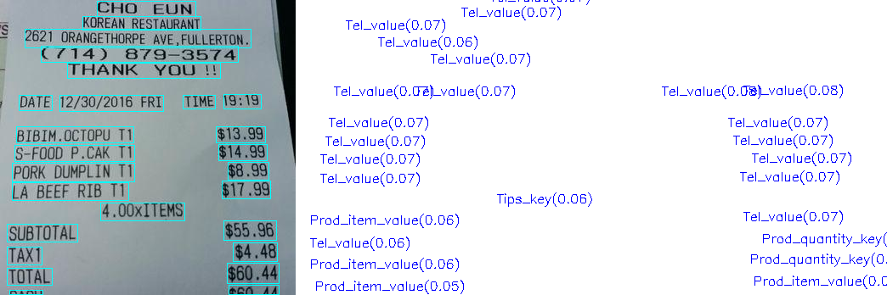

- [关键信息提取(Key Information Extraction)](#关键信息提取key-information-extraction)
  - [1. 快速使用](#1-快速使用)
  - [2. 执行训练](#2-执行训练)
  - [3. 执行评估](#3-执行评估)
  - [4. 参考文献](#4-参考文献)

# 关键信息提取(Key Information Extraction)

本节介绍PaddleOCR中关键信息提取SDMGR方法的快速使用和训练方法。

SDMGR是一个关键信息提取算法，将每个检测到的文本区域分类为预定义的类别，如订单ID、发票号码，金额等。


## 1. 快速使用

训练和测试的数据采用wildreceipt数据集，通过如下指令下载数据集：

```
wget https://paddleocr.bj.bcebos.com/dygraph_v2.1/kie/wildreceipt.tar && tar xf wildreceipt.tar
```

数据集格式：
```
./wildreceipt
├── class_list.txt          # box内的文本类别，比如金额、时间、日期等。
├── dict.txt                # 识别的字典文件，数据集中包含的字符列表
├── wildreceipt_train.txt   # 训练数据标签文件
└── wildreceipt_test.txt    # 评估数据标签文件
└── image_files/            # 图像数据文件夹
```

其中标签文件里的格式为：
```
" 图像文件名                    json.dumps编码的图像标注信息"
image_files/Image_16/11/d5de7f2a20751e50b84c747c17a24cd98bed3554.jpeg	[{"label": 1, "transcription": "SAFEWAY", "points": [[550.0, 190.0], [937.0, 190.0], [937.0, 104.0], [550.0, 104.0]]}, {"label": 25, "transcription": "TM", "points": [[1048.0, 211.0], [1074.0, 211.0], [1074.0, 196.0], [1048.0, 196.0]]}, {"label": 25, "transcription": "ATOREMGRTOMMILAZZO", "points": [[535.0, 239.0], [833.0, 239.0], [833.0, 200.0], [535.0, 200.0]]}, {"label": 5, "transcription": "703-777-5833", "points": [[907.0, 256.0], [1081.0, 256.0], [1081.0, 223.0], [907.0, 223.0]]}......
```

**注：如果您希望在自己的数据集上训练，建议按照上述数据个数准备数据集。**

执行预测：

```
cd PaddleOCR/
wget https://paddleocr.bj.bcebos.com/dygraph_v2.1/kie/kie_vgg16.tar && tar xf kie_vgg16.tar
python3.7 tools/infer_kie.py -c configs/kie/kie_unet_sdmgr.yml -o Global.checkpoints=kie_vgg16/best_accuracy  Global.infer_img=../wildreceipt/1.txt
```

执行预测后的结果保存在`./output/sdmgr_kie/predicts_kie.txt`文件中，可视化结果保存在`/output/sdmgr_kie/kie_results/`目录下。

可视化结果如下图所示：

<div align="center">
    
</div>

## 2. 执行训练

创建数据集软链到PaddleOCR/train_data目录下：
```
cd PaddleOCR/ && mkdir train_data && cd train_data

ln -s ../../wildreceipt ./
```

训练采用的配置文件是configs/kie/kie_unet_sdmgr.yml，配置文件中默认训练数据路径是`train_data/wildreceipt`，准备好数据后，可以通过如下指令执行训练：
```
python3.7 tools/train.py -c configs/kie/kie_unet_sdmgr.yml -o Global.save_model_dir=./output/kie/
```
## 3. 执行评估

```
python3.7 tools/eval.py -c configs/kie/kie_unet_sdmgr.yml -o Global.checkpoints=./output/kie/best_accuracy
```


## 4. 参考文献

<!-- [ALGORITHM] -->

```bibtex
@misc{sun2021spatial,
      title={Spatial Dual-Modality Graph Reasoning for Key Information Extraction},
      author={Hongbin Sun and Zhanghui Kuang and Xiaoyu Yue and Chenhao Lin and Wayne Zhang},
      year={2021},
      eprint={2103.14470},
      archivePrefix={arXiv},
      primaryClass={cs.CV}
}
```
