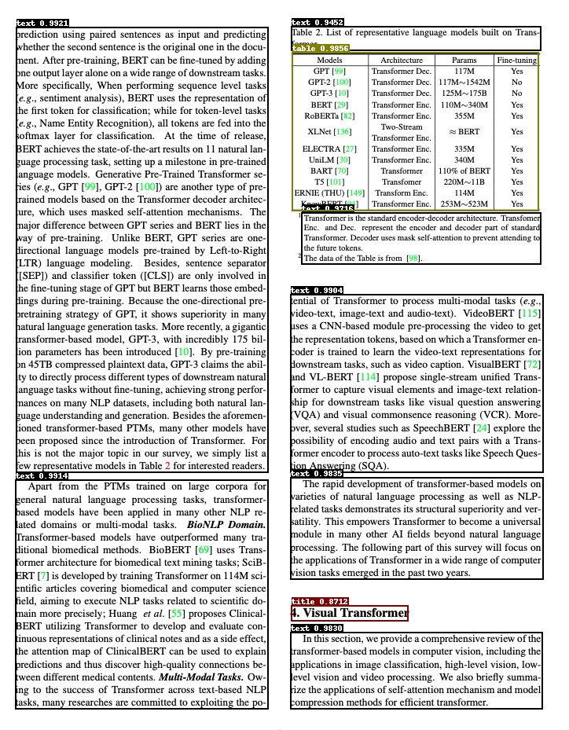

English | [简体中文](README_ch.md)

# Layout analysis

- [1. Introduction](#1-Introduction)
- [2. Quick start](#2-Quick-start)
- [3. Install](#3-Install)
  - [3.1 Install PaddlePaddle](#31-Install-paddlepaddle)
  - [3.2 Install PaddleDetection](#32-Install-paddledetection)
- [4. Data preparation](#4-Data-preparation)
  - [4.1 English data set](#41-English-data-set)
  - [4.2 More datasets](#42-More-datasets)
- [5. Start training](#5-Start-training)
  - [5.1 Train](#51-Train)
  - [5.2 FGD Distillation training](#52-Fgd-distillation-training)
- [6. Model evaluation and prediction](#6-Model-evaluation-and-prediction)
  - [6.1 Indicator evaluation](#61-Indicator-evaluation)
  - [6.2 Test layout analysis results](#62-Test-layout-analysis-results)
- [7. Model export and inference](#7-Model-export-and-inference)
  - [7.1 Model export](#71-Model-export)
  - [7.2 Model inference](#72-Model-inference)


## 1. Introduction

Layout analysis refers to the regional division of documents in the form of pictures and the positioning of key areas, such as text, title, table, picture, etc. The layout analysis algorithm is based on the lightweight model PP-picodet of [PaddleDetection]( https://github.com/PaddlePaddle/PaddleDetection ), including English layout analysis, Chinese layout analysis and table layout analysis models.  English layout analysis models can detect document layout elements such as text, title, table, figure, list. Chinese layout analysis models can detect document layout elements such as text, figure, figure caption, table, table caption, header, footer, reference, and equation. Table layout analysis models can detect table regions.

<div align="center">
    
</div>

## 2. Quick start
PP-Structure currently provides layout analysis models in Chinese, English and table documents. For the model link, see [models_list](../docs/models_list_en.md). The whl package is also provided for quick use, see [quickstart](../docs/quickstart_en.md) for details.

## 3. Install

### 3.1. Install PaddlePaddle

- **（1) Install PaddlePaddle**

```bash
python3 -m pip install --upgrade pip

# GPU Install
python3 -m pip install "paddlepaddle-gpu>=2.3" -i https://mirror.baidu.com/pypi/simple

# CPU Install
python3 -m pip install "paddlepaddle>=2.3" -i https://mirror.baidu.com/pypi/simple
```
For more requirements, please refer to the instructions in the [Install file](https://www.paddlepaddle.org.cn/install/quick)。

### 3.2. Install PaddleDetection

- **（1）Download PaddleDetection Source code**

```bash
git clone https://github.com/PaddlePaddle/PaddleDetection.git
```

- **（2）Install third-party libraries**

```bash
cd PaddleDetection
python3 -m pip install -r requirements.txt
```

## 4. Data preparation

If you want to experience the prediction process directly, you can skip data preparation and download the pre-training model.

### 4.1. English data set

Download document analysis data set [PubLayNet](https://developer.ibm.com/exchanges/data/all/publaynet/)（Dataset 96G），contains 5 classes：`{0: "Text", 1: "Title", 2: "List", 3:"Table", 4:"Figure"}`

```
# Download data
wget https://dax-cdn.cdn.appdomain.cloud/dax-publaynet/1.0.0/publaynet.tar.gz
# Decompress data
tar -xvf publaynet.tar.gz
```

Uncompressed **directory structure：**

```
|-publaynet
  |- test
     |- PMC1277013_00004.jpg
     |- PMC1291385_00002.jpg
     | ...
  |- train.json
  |- train
     |- PMC1291385_00002.jpg
     |- PMC1277013_00004.jpg
     | ...
  |- val.json
  |- val
     |- PMC538274_00004.jpg
     |- PMC539300_00004.jpg
     | ...
```

**data distribution：**

| File or Folder | Description    | num     |
| :------------- | :------------- | ------- |
| `train/`       | Training set pictures     | 335,703 |
| `val/`         | Verification set pictures     | 11,245  |
| `test/`        | Test set pictures     | 11,405  |
| `train.json`   | Training set annotation files | -       |
| `val.json`     | Validation set dimension files | -       |

**Data Annotation**

The JSON file contains the annotations of all images, and the data is stored in a dictionary nested manner.Contains the following keys：

- info，represents the dimension file info。

- licenses，represents the dimension file licenses。

- images，represents the list of image information in the annotation file，each element is the information of an image。The information of one of the images is as follows:

  ```
  {
      'file_name': 'PMC4055390_00006.jpg',    # file_name
      'height': 601,                      # image height
      'width': 792,                       # image width
      'id': 341427                        # image id
  }
  ```

- annotations， represents the list of annotation information of the target object in the annotation file，each element is the annotation information of a target object。The following is the annotation information of one of the target objects:

  ```
  {

      'segmentation':             # Segmentation annotation of objects
      'area': 60518.099043117836, # Area of object
      'iscrowd': 0,               # iscrowd
      'image_id': 341427,         # image id
      'bbox': [50.58, 490.86, 240.15, 252.16], # bbox [x1,y1,w,h]
      'category_id': 1,           # category_id
      'id': 3322348               # image id
  }
  ```

### 4.2. More datasets

We provide CDLA(Chinese layout analysis), TableBank(Table layout analysis)etc. data set download links，process to the JSON format of the above annotation file，that is, the training can be conducted in the same way。

| dataset                                                      | 简介                                                         |
| ------------------------------------------------------------ | ------------------------------------------------------------ |
| [cTDaR2019_cTDaR](https://cndplab-founder.github.io/cTDaR2019/) | For form detection (TRACKA) and form identification (TRACKB).Image types include historical data sets (beginning with cTDaR_t0, such as CTDAR_T00872.jpg) and modern data sets (beginning with cTDaR_t1, CTDAR_T10482.jpg). |
| [IIIT-AR-13K](http://cvit.iiit.ac.in/usodi/iiitar13k.php)    | Data sets constructed by manually annotating figures or pages from publicly available annual reports, containing 5 categories:table, figure, natural image, logo, and signature. |
| [TableBank](https://github.com/doc-analysis/TableBank)       | For table detection and recognition of large datasets, including Word and Latex document formats |
| [CDLA](https://github.com/buptlihang/CDLA)                   | Chinese document layout analysis data set, for Chinese literature (paper) scenarios, including 10 categories:Text, Title, Figure, Figure caption, Table, Table caption, Header, Footer, Reference, Equation |
| [DocBank](https://github.com/doc-analysis/DocBank)           | Large-scale dataset (500K document pages) constructed using weakly supervised methods for document layout analysis, containing 12 categories:Author, Caption, Date, Equation, Figure, Footer, List, Paragraph, Reference, Section, Table, Title |


## 5. Start training

Training scripts, evaluation scripts, and prediction scripts are provided, and the PubLayNet pre-training model is used as an example in this section.

If you do not want training and directly experience the following process of model evaluation, prediction, motion to static, and inference, you can download the provided pre-trained model (PubLayNet dataset) and skip this part.

```
mkdir pretrained_model
cd pretrained_model
# Download PubLayNet pre-training model（Direct experience model evaluates, predicts, and turns static）
wget https://paddleocr.bj.bcebos.com/ppstructure/models/layout/picodet_lcnet_x1_0_fgd_layout.pdparams
# Download the PubLaynet inference model（Direct experience model reasoning）
wget https://paddleocr.bj.bcebos.com/ppstructure/models/layout/picodet_lcnet_x1_0_fgd_layout_infer.tar
```

If the test image is Chinese, the pre-trained model of Chinese CDLA dataset can be downloaded to identify 10 types of document regions：Table, Figure, Figure caption, Table, Table caption, Header, Footer, Reference, Equation，Download the training model and inference model of Model 'picodet_lcnet_x1_0_fgd_layout_cdla' in [layout analysis model](https://github.com/PaddlePaddle/PaddleOCR/blob/dygraph/ppstructure/docs/models_list.md)。If only the table area in the image is detected, you can download the pre-trained model of the table dataset, and download the training model and inference model of the 'picodet_LCnet_x1_0_FGd_layout_table' model in [Layout Analysis model](https://github.com/PaddlePaddle/PaddleOCR/blob/dygraph/ppstructure/docs/models_list.md)

### 5.1. Train

Start training with the PaddleDetection [layout analysis profile](https://github.com/PaddlePaddle/PaddleDetection/tree/release/2.5/configs/picodet/legacy_model/application/layout_analysis)

* Modify Profile

If you want to train your own data set, you need to modify the data configuration and the number of categories in the configuration file.


Using 'configs/picodet/legacy_model/application/layout_analysis/picodet_lcnet_x1_0_layout.yml' as an example, the change is as follows:

```yaml
metric: COCO
# Number of categories
num_classes: 5

TrainDataset:
  !COCODataSet
    # Modify to your own training data directory
    image_dir: train
    # Modify to your own training data label file
    anno_path: train.json
    # Modify to your own training data root directory
    dataset_dir: /root/publaynet/
    data_fields: ['image', 'gt_bbox', 'gt_class', 'is_crowd']

EvalDataset:
  !COCODataSet
    # Modify to your own validation data directory
    image_dir: val
    # Modify to your own validation data label file
    anno_path: val.json
    # Modify to your own validation data root
    dataset_dir: /root/publaynet/

TestDataset:
  !ImageFolder
    # Modify to your own test data label file
    anno_path: /root/publaynet/val.json
```

* Start training. During training, PP picodet pre training model will be downloaded by default. There is no need to download in advance.

```bash
# GPU training supports single-card and multi-card training
# The training log is automatically saved to the log directory

# Single card training
export CUDA_VISIBLE_DEVICES=0
python3 tools/train.py \
    -c configs/picodet/legacy_model/application/layout_analysis/picodet_lcnet_x1_0_layout.yml \
    --eval

# Multi-card training, with the -- GPUS parameter specifying the card number
export CUDA_VISIBLE_DEVICES=0,1,2,3
python3 -m paddle.distributed.launch --gpus '0,1,2,3'  tools/train.py \
    -c configs/picodet/legacy_model/application/layout_analysis/picodet_lcnet_x1_0_layout.yml \
    --eval
```

**Attention：**If the video memory is out during training, adjust Batch_size in TrainReader and base_LR in LearningRate. The published config is obtained by 8-card training. If the number of GPU cards is changed to 1, then the base_LR needs to be reduced by 8 times.

After starting training normally, you will see the following log output:

```
[08/15 04:02:30] ppdet.utils.checkpoint INFO: Finish loading model weights: /root/.cache/paddle/weights/LCNet_x1_0_pretrained.pdparams
[08/15 04:02:46] ppdet.engine INFO: Epoch: [0] [   0/1929] learning_rate: 0.040000 loss_vfl: 1.216707 loss_bbox: 1.142163 loss_dfl: 0.544196 loss: 2.903065 eta: 17 days, 13:50:26 batch_cost: 15.7452 data_cost: 2.9112 ips: 1.5243 images/s
[08/15 04:03:19] ppdet.engine INFO: Epoch: [0] [  20/1929] learning_rate: 0.064000 loss_vfl: 1.180627 loss_bbox: 0.939552 loss_dfl: 0.442436 loss: 2.628206 eta: 2 days, 12:18:53 batch_cost: 1.5770 data_cost: 0.0008 ips: 15.2184 images/s
[08/15 04:03:47] ppdet.engine INFO: Epoch: [0] [  40/1929] learning_rate: 0.088000 loss_vfl: 0.543321 loss_bbox: 1.071401 loss_dfl: 0.457817 loss: 2.057003 eta: 2 days, 0:07:03 batch_cost: 1.3190 data_cost: 0.0007 ips: 18.1954 images/s
[08/15 04:04:12] ppdet.engine INFO: Epoch: [0] [  60/1929] learning_rate: 0.112000 loss_vfl: 0.630989 loss_bbox: 0.859183 loss_dfl: 0.384702 loss: 1.883143 eta: 1 day, 19:01:29 batch_cost: 1.2177 data_cost: 0.0006 ips: 19.7087 images/s
```

- `--eval` indicates that the best model is saved as `output/picodet_lcnet_x1_0_layout/best_accuracy`  by default during the evaluation process 。

**Note that the configuration file for prediction / evaluation must be consistent with the training.**

### 5.2. FGD Distillation Training

PaddleDetection supports FGD-based [Focal and Global Knowledge Distillation for Detectors]( https://arxiv.org/abs/2111.11837v1)  The training process of the target detection model of distillation, FGD distillation is divided into two parts `Focal` and `Global`.     `Focal` Distillation separates the foreground and background of the image, allowing the student model to focus on the key pixels of the foreground and background features of the teacher model respectively;`  Global`Distillation section reconstructs the relationships between different pixels and transfers them from the teacher to the student to compensate for the global information lost in `Focal`Distillation.

Change the dataset and modify the data configuration and number of categories in the [TODO] configuration, referring to 4.1. Start training:

```bash
# Single Card Training
export CUDA_VISIBLE_DEVICES=0
python3 tools/train.py \
    -c configs/picodet/legacy_model/application/layout_analysis/picodet_lcnet_x1_0_layout.yml \
    --slim_config configs/picodet/legacy_model/application/layout_analysis/picodet_lcnet_x2_5_layout.yml \
    --eval
```

- `-c`: Specify the model configuration file.
- `--slim_config`:  Specify the compression policy profile.

## 6. Model evaluation and prediction

### 6.1. Indicator evaluation

 Model parameters in training are saved by default in `output/picodet_ Lcnet_ X1_ 0_ Under the layout` directory. When evaluating indicators, you need to set `weights` to point to the saved parameter file.Assessment datasets can be accessed via `configs/picodet/legacy_ Model/application/layout_ Analysis/picodet_ Lcnet_ X1_ 0_ Layout. Yml` . Modify `EvalDataset`  : `img_dir`,`anno_ Path`and`dataset_dir` setting.

```bash
# GPU evaluation, weights as weights to be measured
python3 tools/eval.py \
    -c configs/picodet/legacy_model/application/layout_analysis/picodet_lcnet_x1_0_layout.yml \
    -o weights=./output/picodet_lcnet_x1_0_layout/best_model
```

The following information will be printed out, such as mAP, AP0.5, etc.

```py
 Average Precision  (AP) @[ IoU=0.50:0.95 | area=   all | maxDets=100 ] = 0.935
 Average Precision  (AP) @[ IoU=0.50      | area=   all | maxDets=100 ] = 0.979
 Average Precision  (AP) @[ IoU=0.75      | area=   all | maxDets=100 ] = 0.956
 Average Precision  (AP) @[ IoU=0.50:0.95 | area= small | maxDets=100 ] = 0.404
 Average Precision  (AP) @[ IoU=0.50:0.95 | area=medium | maxDets=100 ] = 0.782
 Average Precision  (AP) @[ IoU=0.50:0.95 | area= large | maxDets=100 ] = 0.969
 Average Recall     (AR) @[ IoU=0.50:0.95 | area=   all | maxDets=  1 ] = 0.539
 Average Recall     (AR) @[ IoU=0.50:0.95 | area=   all | maxDets= 10 ] = 0.938
 Average Recall     (AR) @[ IoU=0.50:0.95 | area=   all | maxDets=100 ] = 0.949
 Average Recall     (AR) @[ IoU=0.50:0.95 | area= small | maxDets=100 ] = 0.495
 Average Recall     (AR) @[ IoU=0.50:0.95 | area=medium | maxDets=100 ] = 0.818
 Average Recall     (AR) @[ IoU=0.50:0.95 | area= large | maxDets=100 ] = 0.978
[08/15 07:07:09] ppdet.engine INFO: Total sample number: 11245, averge FPS: 24.405059207157436
[08/15 07:07:09] ppdet.engine INFO: Best test bbox ap is 0.935.
```

If you use the provided pre-training model for evaluation or the FGD distillation training model, replace the `weights` model path and execute the following command for evaluation:

```
python3 tools/eval.py \
    -c configs/picodet/legacy_model/application/layout_analysis/picodet_lcnet_x1_0_layout.yml \
    --slim_config configs/picodet/legacy_model/application/layout_analysis/picodet_lcnet_x2_5_layout.yml \
    -o weights=output/picodet_lcnet_x2_5_layout/best_model
```

- `-c`: Specify the model configuration file.
- `--slim_config`:  Specify the distillation policy profile.
- `-o weights`: Specify the model path trained by the distillation algorithm.

### 6.2. Test Layout Analysis Results


The profile predicted to be used must be consistent with the training, for example, if you pass `python3 tools/train'. Py-c configs/picodet/legacy_ Model/application/layout_ Analysis/picodet_ Lcnet_ X1_ 0_ Layout. Yml` completed the training process for the model.

With  trained PaddleDetection model, you can use the following commands to make model predictions.

```bash
python3 tools/infer.py \
    -c configs/picodet/legacy_model/application/layout_analysis/picodet_lcnet_x1_0_layout.yml \
    -o weights='output/picodet_lcnet_x1_0_layout/best_model.pdparams' \
    --infer_img='docs/images/layout.jpg' \
    --output_dir=output_dir/ \
    --draw_threshold=0.5
```

- `--infer_img`:  Reasoning for a single picture can also be done via `--infer_ Dir`Inform all pictures in the file.
- `--output_dir`:  Specify the path to save the visualization results.
- `--draw_threshold`:Specify the NMS threshold for drawing the result box.

If you use the provided pre-training model for prediction or the FGD distillation training model, change the `weights` model path and execute the following command to make the prediction:

```
python3 tools/infer.py \
    -c configs/picodet/legacy_model/application/layout_analysis/picodet_lcnet_x1_0_layout.yml \
    --slim_config configs/picodet/legacy_model/application/layout_analysis/picodet_lcnet_x2_5_layout.yml \
    -o weights='output/picodet_lcnet_x2_5_layout/best_model.pdparams' \
    --infer_img='docs/images/layout.jpg' \
    --output_dir=output_dir/ \
    --draw_threshold=0.5
```


## 7. Model Export and Inference


### 7.1 Model Export

The inference model (the model saved by `paddle.jit.save`) is generally a solidified model saved after the model training is completed, and is mostly used to give prediction in deployment.

The model saved during the training process is the checkpoints model, which saves the parameters of the model and is mostly used to resume training.

Compared with the checkpoints model, the inference model will additionally save the structural information of the model. Therefore, it is easier to deploy because the model structure and model parameters are already solidified in the inference model file, and is suitable for integration with actual systems.

Layout analysis model to inference model steps are as follows：

```bash
python3 tools/export_model.py \
    -c configs/picodet/legacy_model/application/layout_analysis/picodet_lcnet_x1_0_layout.yml \
    -o weights=output/picodet_lcnet_x1_0_layout/best_model \
    --output_dir=output_inference/
```

* If no post-export processing is required, specify：`-o export.benchmark=True`（If -o already exists, delete -o here）
* If you do not need to export NMS, specify：`-o export.nms=False`

After successful conversion, there are three files in the directory:

```
output_inference/picodet_lcnet_x1_0_layout/
    ├── model.pdiparams         # inference Parameter file for model
    ├── model.pdiparams.info    # inference Model parameter information, ignorable
    └── model.pdmodel           # inference Model Structure File for Model
```

If you change the `weights` model path using the provided pre-training model to the Inference model, or using the FGD distillation training model, the model to inference model steps are as follows:

```bash
python3 tools/export_model.py \
    -c configs/picodet/legacy_model/application/layout_analysis/picodet_lcnet_x1_0_layout.yml \
    --slim_config configs/picodet/legacy_model/application/layout_analysis/picodet_lcnet_x2_5_layout.yml \
    -o weights=./output/picodet_lcnet_x2_5_layout/best_model \
    --output_dir=output_inference/
```

### 7.2 Model inference

Replace model_with the provided inference training model for inference or the FGD distillation training `model_dir`Inference model path, execute the following commands for inference:

```bash
python3 deploy/python/infer.py \
    --model_dir=output_inference/picodet_lcnet_x1_0_layout/ \
    --image_file=docs/images/layout.jpg \
    --device=CPU
```

- --device：Specify the GPU or CPU device

When model inference is complete, you will see the following log output:

```
------------------------------------------
-----------  Model Configuration -----------
Model Arch: PicoDet
Transform Order:
--transform op: Resize
--transform op: NormalizeImage
--transform op: Permute
--transform op: PadStride
--------------------------------------------
class_id:0, confidence:0.9921, left_top:[20.18,35.66],right_bottom:[341.58,600.99]
class_id:0, confidence:0.9914, left_top:[19.77,611.42],right_bottom:[341.48,901.82]
class_id:0, confidence:0.9904, left_top:[369.36,375.10],right_bottom:[691.29,600.59]
class_id:0, confidence:0.9835, left_top:[369.60,608.60],right_bottom:[691.38,736.72]
class_id:0, confidence:0.9830, left_top:[369.58,805.38],right_bottom:[690.97,901.80]
class_id:0, confidence:0.9716, left_top:[383.68,271.44],right_bottom:[688.93,335.39]
class_id:0, confidence:0.9452, left_top:[370.82,34.48],right_bottom:[688.10,63.54]
class_id:1, confidence:0.8712, left_top:[370.84,771.03],right_bottom:[519.30,789.13]
class_id:3, confidence:0.9856, left_top:[371.28,67.85],right_bottom:[685.73,267.72]
save result to: output/layout.jpg
Test iter 0
------------------ Inference Time Info ----------------------
total_time(ms): 2196.0, img_num: 1
average latency time(ms): 2196.00, QPS: 0.455373
preprocess_time(ms): 2172.50, inference_time(ms): 11.90, postprocess_time(ms): 11.60
```

- Model：model structure
- Transform Order：Preprocessing operation
- class_id, confidence, left_top, right_bottom：Indicates category id, confidence level, upper left coordinate, lower right coordinate, respectively
- save result to：Save path of visual layout analysis results, default save to ./output folder
- inference time info：Inference time, where preprocess_time represents the preprocessing time, Inference_time represents the model prediction time, and postprocess_time represents the post-processing time

The result of visualization layout is shown in the following figure

<div align="center">
    
</div>


## Citations

```
@inproceedings{zhong2019publaynet,
  title={PubLayNet: largest dataset ever for document layout analysis},
  author={Zhong, Xu and Tang, Jianbin and Yepes, Antonio Jimeno},
  booktitle={2019 International Conference on Document Analysis and Recognition (ICDAR)},
  year={2019},
  volume={},
  number={},
  pages={1015-1022},
  doi={10.1109/ICDAR.2019.00166},
  ISSN={1520-5363},
  month={Sep.},
  organization={IEEE}
}

@inproceedings{yang2022focal,
  title={Focal and global knowledge distillation for detectors},
  author={Yang, Zhendong and Li, Zhe and Jiang, Xiaohu and Gong, Yuan and Yuan, Zehuan and Zhao, Danpei and Yuan, Chun},
  booktitle={Proceedings of the IEEE/CVF Conference on Computer Vision and Pattern Recognition},
  pages={4643--4652},
  year={2022}
}
```
