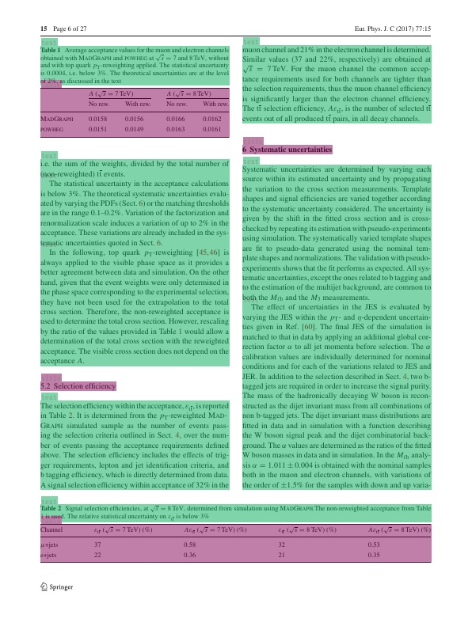

简体中文 | [English](README.md)

# 版面分析

- [1. 简介](#1-简介)
- [2. 快速开始](#2-快速开始)
- [3. 安装](#3-安装)
  - [3.1 安装PaddlePaddle](#31-安装paddlepaddle)
  - [3.2 安装PaddleDetection](#32-安装paddledetection)
- [4. 数据准备](#4-数据准备)
  - [4.1 英文数据集](#41-英文数据集)
  - [4.2 更多数据集](#42-更多数据集)
- [5. 开始训练](#5-开始训练)
  - [5.1 启动训练](#51-启动训练)
  - [5.2 FGD蒸馏训练](#52-fgd蒸馏训练)
- [6. 模型评估与预测](#6-模型评估与预测)
  - [6.1 指标评估](#61-指标评估)
  - [6.2 测试版面分析结果](#62-测试版面分析结果)
- [7 模型导出与预测](#7-模型导出与预测)
  - [7.1 模型导出](#71-模型导出)
  - [7.2 模型推理](#72-模型推理)

## 1. 简介

版面分析指的是对图片形式的文档进行区域划分，定位其中的关键区域，如文字、标题、表格、图片等。版面分析算法基于[PaddleDetection](https://github.com/PaddlePaddle/PaddleDetection)的轻量模型PP-PicoDet进行开发。

<div align="center">
    
</div>

## 2. 快速开始

PP-Structure目前提供了中文、英文、表格三类文档版面分析模型，模型链接见 [models_list](../docs/models_list.md#1-版面分析模型)。也提供了whl包的形式方便快速使用，详见 [quickstart](../docs/quickstart.md)。


## 3. 安装

### 3.1. 安装PaddlePaddle

- **（1) 安装PaddlePaddle**

```bash
python3 -m pip install --upgrade pip

# GPU安装
python3 -m pip install "paddlepaddle-gpu>=2.3" -i https://mirror.baidu.com/pypi/simple

# CPU安装
python3 -m pip install "paddlepaddle>=2.3" -i https://mirror.baidu.com/pypi/simple
```
更多需求，请参照[安装文档](https://www.paddlepaddle.org.cn/install/quick)中的说明进行操作。

### 3.2. 安装PaddleDetection

- **（1）下载PaddleDetection源码**

```bash
git clone https://github.com/PaddlePaddle/PaddleDetection.git
```

- **（2）安装其他依赖**

```bash
cd PaddleDetection
python3 -m pip install -r requirements.txt
```

## 4. 数据准备

如果希望直接体验预测过程，可以跳过数据准备，下载我们提供的预训练模型。

### 4.1. 英文数据集

下载文档分析数据集[PubLayNet](https://developer.ibm.com/exchanges/data/all/publaynet/)（数据集96G），包含5个类：`{0: "Text", 1: "Title", 2: "List", 3:"Table", 4:"Figure"}`

```
# 下载数据
wget https://dax-cdn.cdn.appdomain.cloud/dax-publaynet/1.0.0/publaynet.tar.gz
# 解压数据
tar -xvf publaynet.tar.gz
```

解压之后的**目录结构：**

```
|-publaynet
  |- test
     |- PMC1277013_00004.jpg
     |- PMC1291385_00002.jpg
     | ...
  |- train.json
  |- train
     |- PMC1291385_00002.jpg
     |- PMC1277013_00004.jpg
     | ...
  |- val.json
  |- val
     |- PMC538274_00004.jpg
     |- PMC539300_00004.jpg
     | ...
```

**数据分布：**

| File or Folder | Description    | num     |
| :------------- | :------------- | ------- |
| `train/`       | 训练集图片     | 335,703 |
| `val/`         | 验证集图片     | 11,245  |
| `test/`        | 测试集图片     | 11,405  |
| `train.json`   | 训练集标注文件 | -       |
| `val.json`     | 验证集标注文件 | -       |

**标注格式：**

json文件包含所有图像的标注，数据以字典嵌套的方式存放，包含以下key：

- info，表示标注文件info。

- licenses，表示标注文件licenses。

- images，表示标注文件中图像信息列表，每个元素是一张图像的信息。如下为其中一张图像的信息：

  ```
  {
      'file_name': 'PMC4055390_00006.jpg',    # file_name
      'height': 601,                      # image height
      'width': 792,                       # image width
      'id': 341427                        # image id
  }
  ```

- annotations，表示标注文件中目标物体的标注信息列表，每个元素是一个目标物体的标注信息。如下为其中一个目标物体的标注信息：

  ```
  {

      'segmentation':             # 物体的分割标注
      'area': 60518.099043117836, # 物体的区域面积
      'iscrowd': 0,               # iscrowd
      'image_id': 341427,         # image id
      'bbox': [50.58, 490.86, 240.15, 252.16], # bbox [x1,y1,w,h]
      'category_id': 1,           # category_id
      'id': 3322348               # image id
  }
  ```

### 4.2. 更多数据集

我们提供了CDLA(中文版面分析)、TableBank(表格版面分析)等数据集的下连接，处理为上述标注文件json格式，即可以按相同方式进行训练。

| dataset                                                      | 简介                                                         |
| ------------------------------------------------------------ | ------------------------------------------------------------ |
| [cTDaR2019_cTDaR](https://cndplab-founder.github.io/cTDaR2019/) | 用于表格检测(TRACKA)和表格识别(TRACKB)。图片类型包含历史数据集(以cTDaR_t0开头，如cTDaR_t00872.jpg)和现代数据集(以cTDaR_t1开头，cTDaR_t10482.jpg)。 |
| [IIIT-AR-13K](http://cvit.iiit.ac.in/usodi/iiitar13k.php)    | 手动注释公开的年度报告中的图形或页面而构建的数据集，包含5类：table, figure, natural image, logo, and signature |
| [CDLA](https://github.com/buptlihang/CDLA)                   | 中文文档版面分析数据集，面向中文文献类（论文）场景，包含10类：Table、Figure、Figure caption、Table、Table caption、Header、Footer、Reference、Equation |
| [TableBank](https://github.com/doc-analysis/TableBank)       | 用于表格检测和识别大型数据集，包含Word和Latex2种文档格式     |
| [DocBank](https://github.com/doc-analysis/DocBank)           | 使用弱监督方法构建的大规模数据集(500K文档页面)，用于文档布局分析，包含12类：Author、Caption、Date、Equation、Figure、Footer、List、Paragraph、Reference、Section、Table、Title |


## 5. 开始训练

提供了训练脚本、评估脚本和预测脚本，本节将以PubLayNet预训练模型为例进行讲解。

如果不希望训练，直接体验后面的模型评估、预测、动转静、推理的流程，可以下载提供的预训练模型(PubLayNet数据集)，并跳过本部分。

```
mkdir pretrained_model
cd pretrained_model
# 下载PubLayNet预训练模型（直接体验模型评估、预测、动转静）
wget https://paddleocr.bj.bcebos.com/ppstructure/models/layout/picodet_lcnet_x1_0_fgd_layout.pdparams
# 下载PubLaynet推理模型（直接体验模型推理）
wget https://paddleocr.bj.bcebos.com/ppstructure/models/layout/picodet_lcnet_x1_0_fgd_layout_infer.tar
```

如果测试图片为中文，可以下载中文CDLA数据集的预训练模型，识别10类文档区域：Table、Figure、Figure caption、Table、Table caption、Header、Footer、Reference、Equation，在[版面分析模型](../docs/models_list.md)中下载`picodet_lcnet_x1_0_fgd_layout_cdla`模型的训练模型和推理模型。如果只检测图片中的表格区域，可以下载表格数据集的预训练模型，在[版面分析模型](../docs/models_list.md)中下载`picodet_lcnet_x1_0_fgd_layout_table`模型的训练模型和推理模型。

### 5.1. 启动训练

开始训练:

* 修改配置文件

如果你希望训练自己的数据集，需要修改配置文件中的数据配置、类别数。


以`configs/picodet/legacy_model/application/layout_analysis/picodet_lcnet_x1_0_layout.yml` 为例，修改的内容如下所示。

```yaml
metric: COCO
# 类别数
num_classes: 5

TrainDataset:
  !COCODataSet
    # 修改为你自己的训练数据目录
    image_dir: train
    # 修改为你自己的训练数据标签文件
    anno_path: train.json
    # 修改为你自己的训练数据根目录
    dataset_dir: /root/publaynet/
    data_fields: ['image', 'gt_bbox', 'gt_class', 'is_crowd']

EvalDataset:
  !COCODataSet
    # 修改为你自己的验证数据目录
    image_dir: val
    # 修改为你自己的验证数据标签文件
    anno_path: val.json
    # 修改为你自己的验证数据根目录
    dataset_dir: /root/publaynet/

TestDataset:
  !ImageFolder
    # 修改为你自己的测试数据标签文件
    anno_path: /root/publaynet/val.json
```

* 开始训练，在训练时，会默认下载PP-PicoDet预训练模型，这里无需预先下载。

```bash
# GPU训练 支持单卡，多卡训练
# 训练日志会自动保存到 log 目录中

# 单卡训练
export CUDA_VISIBLE_DEVICES=0
python3 tools/train.py \
    -c configs/picodet/legacy_model/application/layout_analysis/picodet_lcnet_x1_0_layout.yml \
    --eval

# 多卡训练，通过--gpus参数指定卡号
export CUDA_VISIBLE_DEVICES=0,1,2,3
python3 -m paddle.distributed.launch --gpus '0,1,2,3'  tools/train.py \
    -c configs/picodet/legacy_model/application/layout_analysis/picodet_lcnet_x1_0_layout.yml \
    --eval
```

**注意：**如果训练时显存out memory，将TrainReader中batch_size调小，同时LearningRate中base_lr等比例减小。发布的config均由8卡训练得到，如果改变GPU卡数为1，那么base_lr需要减小8倍。

正常启动训练后，会看到以下log输出：

```
[08/15 04:02:30] ppdet.utils.checkpoint INFO: Finish loading model weights: /root/.cache/paddle/weights/LCNet_x1_0_pretrained.pdparams
[08/15 04:02:46] ppdet.engine INFO: Epoch: [0] [   0/1929] learning_rate: 0.040000 loss_vfl: 1.216707 loss_bbox: 1.142163 loss_dfl: 0.544196 loss: 2.903065 eta: 17 days, 13:50:26 batch_cost: 15.7452 data_cost: 2.9112 ips: 1.5243 images/s
[08/15 04:03:19] ppdet.engine INFO: Epoch: [0] [  20/1929] learning_rate: 0.064000 loss_vfl: 1.180627 loss_bbox: 0.939552 loss_dfl: 0.442436 loss: 2.628206 eta: 2 days, 12:18:53 batch_cost: 1.5770 data_cost: 0.0008 ips: 15.2184 images/s
[08/15 04:03:47] ppdet.engine INFO: Epoch: [0] [  40/1929] learning_rate: 0.088000 loss_vfl: 0.543321 loss_bbox: 1.071401 loss_dfl: 0.457817 loss: 2.057003 eta: 2 days, 0:07:03 batch_cost: 1.3190 data_cost: 0.0007 ips: 18.1954 images/s
[08/15 04:04:12] ppdet.engine INFO: Epoch: [0] [  60/1929] learning_rate: 0.112000 loss_vfl: 0.630989 loss_bbox: 0.859183 loss_dfl: 0.384702 loss: 1.883143 eta: 1 day, 19:01:29 batch_cost: 1.2177 data_cost: 0.0006 ips: 19.7087 images/s
```

- `--eval`表示训练的同时，进行评估， 评估过程中默认将最佳模型，保存为 `output/picodet_lcnet_x1_0_layout/best_accuracy` 。

**注意，预测/评估时的配置文件请务必与训练一致。**

### 5.2. FGD蒸馏训练

PaddleDetection支持了基于FGD([Focal and Global Knowledge Distillation for Detectors](https://arxiv.org/abs/2111.11837v1))蒸馏的目标检测模型训练过程，FGD蒸馏分为两个部分`Focal`和`Global`。`Focal`蒸馏分离图像的前景和背景，让学生模型分别关注教师模型的前景和背景部分特征的关键像素；`Global`蒸馏部分重建不同像素之间的关系并将其从教师转移到学生，以补偿`Focal`蒸馏中丢失的全局信息。

更换数据集，修改【TODO】配置中的数据配置、类别数，具体可以参考4.1。启动训练：

```bash
# 单卡训练
export CUDA_VISIBLE_DEVICES=0
python3 tools/train.py \
    -c configs/picodet/legacy_model/application/layout_analysis/picodet_lcnet_x1_0_layout.yml \
    --slim_config configs/picodet/legacy_model/application/layout_analysis/picodet_lcnet_x2_5_layout.yml \
    --eval
```

- `-c`: 指定模型配置文件。
- `--slim_config`: 指定压缩策略配置文件。

## 6. 模型评估与预测

### 6.1. 指标评估

训练中模型参数默认保存在`output/picodet_lcnet_x1_0_layout`目录下。在评估指标时，需要设置`weights`指向保存的参数文件。评估数据集可以通过 `configs/picodet/legacy_model/application/layout_analysis/picodet_lcnet_x1_0_layout.yml`  修改`EvalDataset`中的 `image_dir`、`anno_path`和`dataset_dir` 设置。

```bash
# GPU 评估， weights 为待测权重
python3 tools/eval.py \
    -c configs/picodet/legacy_model/application/layout_analysis/picodet_lcnet_x1_0_layout.yml \
    -o weights=./output/picodet_lcnet_x1_0_layout/best_model
```

会输出以下信息，打印出mAP、AP0.5等信息。

```py
 Average Precision  (AP) @[ IoU=0.50:0.95 | area=   all | maxDets=100 ] = 0.935
 Average Precision  (AP) @[ IoU=0.50      | area=   all | maxDets=100 ] = 0.979
 Average Precision  (AP) @[ IoU=0.75      | area=   all | maxDets=100 ] = 0.956
 Average Precision  (AP) @[ IoU=0.50:0.95 | area= small | maxDets=100 ] = 0.404
 Average Precision  (AP) @[ IoU=0.50:0.95 | area=medium | maxDets=100 ] = 0.782
 Average Precision  (AP) @[ IoU=0.50:0.95 | area= large | maxDets=100 ] = 0.969
 Average Recall     (AR) @[ IoU=0.50:0.95 | area=   all | maxDets=  1 ] = 0.539
 Average Recall     (AR) @[ IoU=0.50:0.95 | area=   all | maxDets= 10 ] = 0.938
 Average Recall     (AR) @[ IoU=0.50:0.95 | area=   all | maxDets=100 ] = 0.949
 Average Recall     (AR) @[ IoU=0.50:0.95 | area= small | maxDets=100 ] = 0.495
 Average Recall     (AR) @[ IoU=0.50:0.95 | area=medium | maxDets=100 ] = 0.818
 Average Recall     (AR) @[ IoU=0.50:0.95 | area= large | maxDets=100 ] = 0.978
[08/15 07:07:09] ppdet.engine INFO: Total sample number: 11245, averge FPS: 24.405059207157436
[08/15 07:07:09] ppdet.engine INFO: Best test bbox ap is 0.935.
```

若使用**提供的预训练模型进行评估**，或使用**FGD蒸馏训练的模型**，更换`weights`模型路径，执行如下命令进行评估：

```
python3 tools/eval.py \
    -c configs/picodet/legacy_model/application/layout_analysis/picodet_lcnet_x1_0_layout.yml \
    --slim_config configs/picodet/legacy_model/application/layout_analysis/picodet_lcnet_x2_5_layout.yml \
    -o weights=output/picodet_lcnet_x2_5_layout/best_model
```

- `-c`: 指定模型配置文件。
- `--slim_config`: 指定蒸馏策略配置文件。
- `-o weights`: 指定蒸馏算法训好的模型路径。

### 6.2 测试版面分析结果


预测使用的配置文件必须与训练一致，如您通过 `python3 tools/train.py -c configs/picodet/legacy_model/application/layout_analysis/picodet_lcnet_x1_0_layout.yml` 完成了模型的训练过程。

使用 PaddleDetection 训练好的模型，您可以使用如下命令进行模型预测。

```bash
python3 tools/infer.py \
    -c configs/picodet/legacy_model/application/layout_analysis/picodet_lcnet_x1_0_layout.yml \
    -o weights='output/picodet_lcnet_x1_0_layout/best_model.pdparams' \
    --infer_img='docs/images/layout.jpg' \
    --output_dir=output_dir/ \
    --draw_threshold=0.5
```

- `--infer_img`: 推理单张图片，也可以通过`--infer_dir`推理文件中的所有图片。
- `--output_dir`: 指定可视化结果保存路径。
- `--draw_threshold`:指定绘制结果框的NMS阈值。

若使用**提供的预训练模型进行预测**，或使用**FGD蒸馏训练的模型**，更换`weights`模型路径，执行如下命令进行预测：

```
python3 tools/infer.py \
    -c configs/picodet/legacy_model/application/layout_analysis/picodet_lcnet_x1_0_layout.yml \
    --slim_config configs/picodet/legacy_model/application/layout_analysis/picodet_lcnet_x2_5_layout.yml \
    -o weights='output/picodet_lcnet_x2_5_layout/best_model.pdparams' \
    --infer_img='docs/images/layout.jpg' \
    --output_dir=output_dir/ \
    --draw_threshold=0.5
```


## 7. 模型导出与预测


### 7.1 模型导出

inference 模型（`paddle.jit.save`保存的模型） 一般是模型训练，把模型结构和模型参数保存在文件中的固化模型，多用于预测部署场景。 训练过程中保存的模型是checkpoints模型，保存的只有模型的参数，多用于恢复训练等。 与checkpoints模型相比，inference 模型会额外保存模型的结构信息，在预测部署、加速推理上性能优越，灵活方便，适合于实际系统集成。

版面分析模型转inference模型步骤如下：

```bash
python3 tools/export_model.py \
    -c configs/picodet/legacy_model/application/layout_analysis/picodet_lcnet_x1_0_layout.yml \
    -o weights=output/picodet_lcnet_x1_0_layout/best_model \
    --output_dir=output_inference/
```

* 如无需导出后处理，请指定：`-o export.benchmark=True`（如果-o已出现过，此处删掉-o）
* 如无需导出NMS，请指定：`-o export.nms=False`

转换成功后，在目录下有三个文件：

```
output_inference/picodet_lcnet_x1_0_layout/
    ├── model.pdiparams         # inference模型的参数文件
    ├── model.pdiparams.info    # inference模型的参数信息，可忽略
    └── model.pdmodel           # inference模型的模型结构文件
```

若使用**提供的预训练模型转Inference模型**，或使用**FGD蒸馏训练的模型**，更换`weights`模型路径，模型转inference模型步骤如下：

```bash
python3 tools/export_model.py \
    -c configs/picodet/legacy_model/application/layout_analysis/picodet_lcnet_x1_0_layout.yml \
    --slim_config configs/picodet/legacy_model/application/layout_analysis/picodet_lcnet_x2_5_layout.yml \
    -o weights=./output/picodet_lcnet_x2_5_layout/best_model \
    --output_dir=output_inference/
```


### 7.2 模型推理

若使用**提供的推理训练模型推理**，或使用**FGD蒸馏训练的模型**，更换`model_dir`推理模型路径，执行如下命令进行推理：

```bash
python3 deploy/python/infer.py \
    --model_dir=output_inference/picodet_lcnet_x1_0_layout/ \
    --image_file=docs/images/layout.jpg \
    --device=CPU
```

- --device：指定GPU、CPU设备

模型推理完成，会看到以下log输出

```
------------------------------------------
-----------  Model Configuration -----------
Model Arch: PicoDet
Transform Order:
--transform op: Resize
--transform op: NormalizeImage
--transform op: Permute
--transform op: PadStride
--------------------------------------------
class_id:0, confidence:0.9921, left_top:[20.18,35.66],right_bottom:[341.58,600.99]
class_id:0, confidence:0.9914, left_top:[19.77,611.42],right_bottom:[341.48,901.82]
class_id:0, confidence:0.9904, left_top:[369.36,375.10],right_bottom:[691.29,600.59]
class_id:0, confidence:0.9835, left_top:[369.60,608.60],right_bottom:[691.38,736.72]
class_id:0, confidence:0.9830, left_top:[369.58,805.38],right_bottom:[690.97,901.80]
class_id:0, confidence:0.9716, left_top:[383.68,271.44],right_bottom:[688.93,335.39]
class_id:0, confidence:0.9452, left_top:[370.82,34.48],right_bottom:[688.10,63.54]
class_id:1, confidence:0.8712, left_top:[370.84,771.03],right_bottom:[519.30,789.13]
class_id:3, confidence:0.9856, left_top:[371.28,67.85],right_bottom:[685.73,267.72]
save result to: output/layout.jpg
Test iter 0
------------------ Inference Time Info ----------------------
total_time(ms): 2196.0, img_num: 1
average latency time(ms): 2196.00, QPS: 0.455373
preprocess_time(ms): 2172.50, inference_time(ms): 11.90, postprocess_time(ms): 11.60
```

- Model：模型结构
- Transform Order：预处理操作
- class_id、confidence、left_top、right_bottom：分别表示类别id、置信度、左上角坐标、右下角坐标
- save result to：可视化版面分析结果保存路径，默认保存到`./output`文件夹
- Inference Time Info：推理时间，其中preprocess_time表示预处理耗时，inference_time表示模型预测耗时，postprocess_time表示后处理耗时

可视化版面结果如下图所示

<div align="center">
    
</div>


## Citations

```
@inproceedings{zhong2019publaynet,
  title={PubLayNet: largest dataset ever for document layout analysis},
  author={Zhong, Xu and Tang, Jianbin and Yepes, Antonio Jimeno},
  booktitle={2019 International Conference on Document Analysis and Recognition (ICDAR)},
  year={2019},
  volume={},
  number={},
  pages={1015-1022},
  doi={10.1109/ICDAR.2019.00166},
  ISSN={1520-5363},
  month={Sep.},
  organization={IEEE}
}

@inproceedings{yang2022focal,
  title={Focal and global knowledge distillation for detectors},
  author={Yang, Zhendong and Li, Zhe and Jiang, Xiaohu and Gong, Yuan and Yuan, Zehuan and Zhao, Danpei and Yuan, Chun},
  booktitle={Proceedings of the IEEE/CVF Conference on Computer Vision and Pattern Recognition},
  pages={4643--4652},
  year={2022}
}
```
