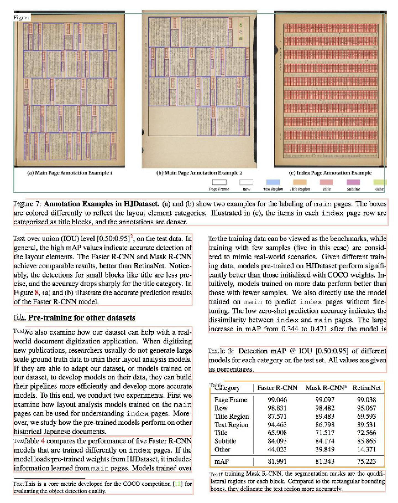
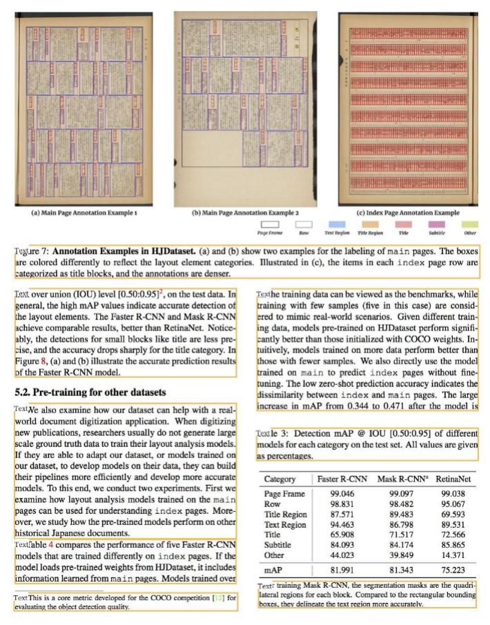

[English](README.md) | 简体中文
- [版面分析使用说明](#版面分析使用说明)
  - [1.  安装whl包](#1--安装whl包)
  - [2. 使用](#2-使用)
  - [3. 后处理](#3-后处理)
  - [4. 指标](#4-指标)
  - [5. 训练版面分析模型](#5-训练版面分析模型)

# 版面分析使用说明

## 1.  安装whl包
```bash
pip install -U https://paddleocr.bj.bcebos.com/whl/layoutparser-0.0.0-py3-none-any.whl
```

## 2. 使用

使用layoutparser识别给定文档的布局：

```python
import cv2
import layoutparser as lp
image = cv2.imread("doc/table/layout.jpg")
image = image[..., ::-1]

# 加载模型
model = lp.PaddleDetectionLayoutModel(config_path="lp://PubLayNet/ppyolov2_r50vd_dcn_365e_publaynet/config",
                                threshold=0.5,
                                label_map={0: "Text", 1: "Title", 2: "List", 3:"Table", 4:"Figure"},
                                enforce_cpu=False,
                                enable_mkldnn=True)
# 检测
layout = model.detect(image)

# 显示结果
show_img = lp.draw_box(image, layout, box_width=3, show_element_type=True)
show_img.show()
```

下图展示了结果，不同颜色的检测框表示不同的类别，并通过`show_element_type`在框的左上角显示具体类别：

<div align="center">

</div>

`PaddleDetectionLayoutModel`函数参数说明如下:

|      参数      |            含义             |   默认值    |                             备注                             |
| :------------: | :-------------------------: | :---------: | :----------------------------------------------------------: |
|  config_path   |        模型配置路径         |    None     | 指定config_path会自动下载模型(仅第一次，之后模型存在，不会再下载) |
|   model_path   |          模型路径           |    None     | 本地模型路径，config_path和model_path必须设置一个，不能同时为None |
|   threshold    |       预测得分的阈值        |     0.5     |                              \                               |
|  input_shape   |     reshape之后图片尺寸     | [3,640,640] |                              \                               |
|   batch_size   |       测试batch size        |      1      |                              \                               |
|   label_map    |         类别映射表          |    None     | 设置config_path时，可以为None，根据数据集名称自动获取label_map |
|  enforce_cpu   |     代码是否使用CPU运行     |    False    |         设置为False表示使用GPU，True表示强制使用CPU          |
| enforce_mkldnn | CPU预测中是否开启MKLDNN加速 |    True     |                              \                               |
|   thread_num   |        设置CPU线程数        |     10      |                              \                               |

目前支持以下几种模型配置和label map，您可以通过修改 `--config_path`和 `--label_map`使用这些模型，从而检测不同类型的内容：

| dataset                                                      | config_path                                                  | label_map                                                 |
| ------------------------------------------------------------ | ------------------------------------------------------------ | --------------------------------------------------------- |
| [TableBank](https://doc-analysis.github.io/tablebank-page/index.html) word | lp://TableBank/ppyolov2_r50vd_dcn_365e_tableBank_word/config | {0:"Table"}                                               |
| TableBank latex                                              | lp://TableBank/ppyolov2_r50vd_dcn_365e_tableBank_latex/config | {0:"Table"}                                               |
| [PubLayNet](https://github.com/ibm-aur-nlp/PubLayNet)        | lp://PubLayNet/ppyolov2_r50vd_dcn_365e_publaynet/config      | {0: "Text", 1: "Title", 2: "List", 3:"Table", 4:"Figure"} |

* TableBank word和TableBank latex分别在word文档、latex文档数据集训练；
* 下载的TableBank数据集里同时包含word和latex。

## 3. 后处理

版面分析检测包含多个类别，如果只想获取指定类别(如"Text"类别)的检测框、可以使用下述代码：

```python
# 接上面代码
# 首先过滤特定文本类型的区域
text_blocks = lp.Layout([b for b in layout if b.type=='Text'])
figure_blocks = lp.Layout([b for b in layout if b.type=='Figure'])

# 因为在图像区域内可能检测到文本区域，所以只需要删除它们
text_blocks = lp.Layout([b for b in text_blocks \
                   if not any(b.is_in(b_fig) for b_fig in figure_blocks)])

# 对文本区域排序并分配id
h, w = image.shape[:2]

left_interval = lp.Interval(0, w/2*1.05, axis='x').put_on_canvas(image)

left_blocks = text_blocks.filter_by(left_interval, center=True)
left_blocks.sort(key = lambda b:b.coordinates[1])

right_blocks = [b for b in text_blocks if b not in left_blocks]
right_blocks.sort(key = lambda b:b.coordinates[1])

# 最终合并两个列表，并按顺序添加索引
text_blocks = lp.Layout([b.set(id = idx) for idx, b in enumerate(left_blocks + right_blocks)])

# 显示结果
show_img = lp.draw_box(image, text_blocks,
            box_width=3,
            show_element_id=True)
show_img.show()
```

显示只有"Text"类别的结果：

<div align="center">

</div>

## 4. 指标

| Dataset   | mAP  | CPU time cost | GPU time cost |
| --------- | ---- | ------------- | ------------- |
| PubLayNet | 93.6 | 1713.7ms      | 66.6ms        |
| TableBank | 96.2 | 1968.4ms      | 65.1ms        |

**Envrionment：**

​    **CPU：**  Intel(R) Xeon(R) CPU E5-2650 v4 @ 2.20GHz，24core

​    **GPU：**  a single NVIDIA Tesla P40

## 5. 训练版面分析模型

上述模型基于[PaddleDetection](https://github.com/PaddlePaddle/PaddleDetection) 训练，如果您想训练自己的版面分析模型，请参考：[train_layoutparser_model](train_layoutparser_model_ch.md)
