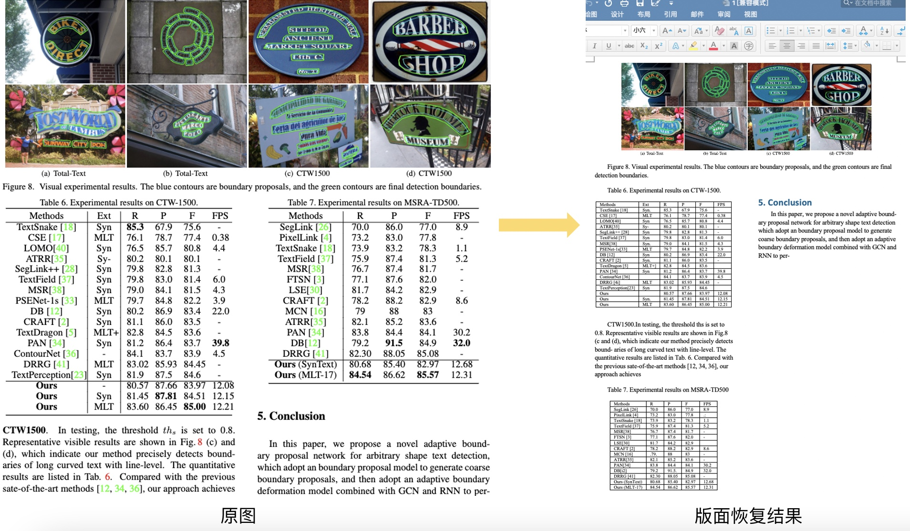

English | [简体中文](README_ch.md)

- [Getting Started](#getting-started)
  - [1.  Introduction](#1)
  - [2. Quick Start](#2)

<a name="1"></a>

## 1.  Introduction

Layout recovery means that after OCR recognition, the content is still arranged like the original document pictures, and the paragraphs are output to word document in the same order.

Layout recovery combines [layout analysis](../layout/README.md)、[table recognition](../table/README.md) to better recover images, tables, titles, etc.
The following figure shows the result：

<div align="center">

</div>

<a name="2"></a>

## 2. Quick Start

```python
cd PaddleOCR/ppstructure

# download model
mkdir inference && cd inference
# Download the detection model of the ultra-lightweight English PP-OCRv3 model and unzip it
wget https://paddleocr.bj.bcebos.com/PP-OCRv3/chinese/ch_PP-OCRv3_det_infer.tar && tar xf ch_PP-OCRv3_det_infer.tar
# Download the recognition model of the ultra-lightweight English PP-OCRv3 model and unzip it
wget https://paddleocr.bj.bcebos.com/PP-OCRv3/chinese/ch_PP-OCRv3_rec_infer.tar && tar xf  ch_PP-OCRv3_rec_infer.tar
# Download the ultra-lightweight English table inch model and unzip it
wget https://paddleocr.bj.bcebos.com/dygraph_v2.0/table/en_ppocr_mobile_v2.0_table_structure_infer.tar && tar xf en_ppocr_mobile_v2.0_table_structure_infer.tar
cd ..
# run
python3 predict_system.py --det_model_dir=inference/en_PP-OCRv3_det_infer --rec_model_dir=inference/en_PP-OCRv3_rec_infer --table_model_dir=inference/en_ppocr_mobile_v2.0_table_structure_infer --rec_char_dict_path=../ppocr/utils/en_dict.txt --table_char_dict_path=../ppocr/utils/dict/table_structure_dict.txt --output ./output/table --rec_image_shape=3,48,320 --vis_font_path=../doc/fonts/simfang.ttf --recovery=True --image_dir=./docs/table/1.png
```

After running, the docx  of each picture will be saved in the directory specified by the output field