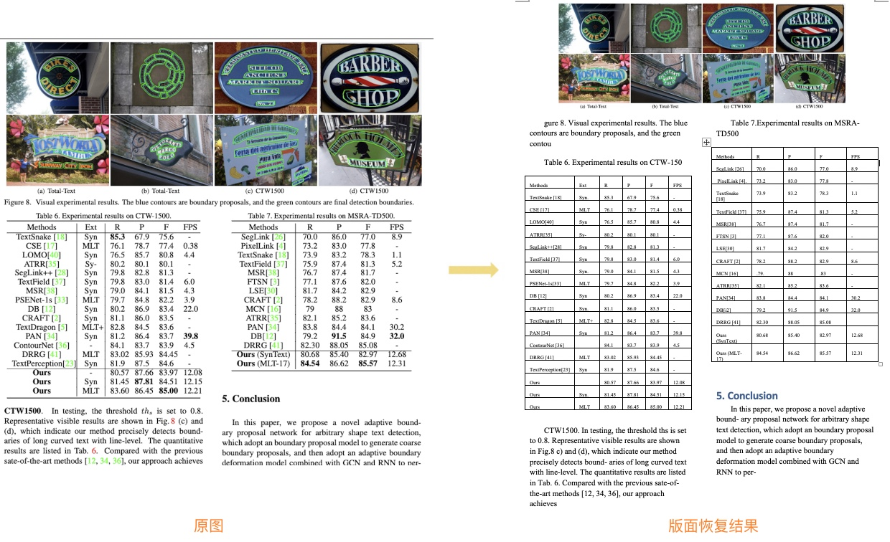
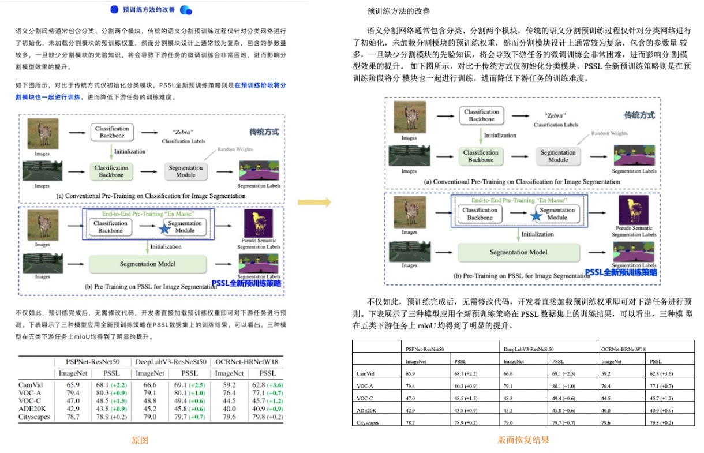

English | [简体中文](README_ch.md)

# Layout Recovery

- [1. Introduction](#1)
- [2. Install](#2)
    - [2.1 Install PaddlePaddle](#2.1)
    - [2.2 Install PaddleOCR](#2.2)
- [3. Quick Start using standard PDF parse](#3)
- [4. Quick Start using image format PDF parse ](#4)
    - [4.1 Download models](#4.1)
    - [4.2 Layout recovery](#4.2)
- [5. More](#5)

<a name="1"></a>

## 1. Introduction

The layout recovery module is used to restore the image or pdf to an
editable Word file consistent with the original image layout.

Two layout recovery methods are provided, you can choose by PDF format:

- **Standard PDF parse(the input is standard PDF)**: Python based PDF to word library [pdf2docx] (https://github.com/dothinking/pdf2docx) is optimized, the method extracts data from PDF with PyMuPDF, then parse layout with rule, finally, generate docx with python-docx.

- **Image format PDF parse(the input can be standard PDF or image format PDF)**: Layout recovery combines [layout analysis](../layout/README.md)、[table recognition](../table/README.md) to better recover images, tables, titles, etc. supports input files in PDF and document image formats in Chinese and English.

The input formats and application scenarios of the two methods are as follows:

|  method   | input formats |                      application scenarios/problem                       |
| :-----: | :----------: | :----------------------------------------------------------: |
| Standard PDF parse |     pdf      | Advantages: Better recovery for non-paper documents, each page remains on the same page after restoration<br>Disadvantages: English characters in some Chinese documents are garbled, some contents are still beyond the current page, the whole page content is restored to the table format, and the recovery effect of some pictures is not good |
| Image format PDF parse( |  pdf、picture   | Advantages: More suitable for paper document content recovery,  OCR recognition effect is more good<br>Disadvantages: Currently, the recovery is based on rules, the effect of content typesetting (spacing, fonts, etc.) need to be further improved, and the effect of layout recovery depends on layout analysis |

The following figure shows the effect of restoring the layout of documents by using PDF parse:

<div align="center">

</div>

The following figures show the effect of restoring the layout of English and Chinese documents by using OCR technique:

<div align="center">

</div>

<div align="center">

</div>


<a name="2"></a>

## 2. Install

<a name="2.1"></a>

### 2.1 Install PaddlePaddle

```bash
python3 -m pip install --upgrade pip

# If you have cuda9 or cuda10 installed on your machine, please run the following command to install
python3 -m pip install "paddlepaddle-gpu" -i https://mirror.baidu.com/pypi/simple

# CPU installation
python3 -m pip install "paddlepaddle" -i https://mirror.baidu.com/pypi/simple
````

For more requirements, please refer to the instructions in [Installation Documentation](https://www.paddlepaddle.org.cn/en/install/quick?docurl=/documentation/docs/en/install/pip/macos-pip_en.html).

<a name="2.2"></a>

### 2.2 Install PaddleOCR

- **(1) Download source code**

```bash
[Recommended] git clone https://github.com/PaddlePaddle/PaddleOCR

# If the pull cannot be successful due to network problems, you can also choose to use the hosting on the code cloud:
git clone https://gitee.com/paddlepaddle/PaddleOCR

# Note: Code cloud hosting code may not be able to synchronize the update of this github project in real time, there is a delay of 3 to 5 days, please use the recommended method first.
````

- **(2) Install recovery `requirements`**

The layout restoration is exported as docx files, so python-docx API need to be installed, and PyMuPDF api([requires Python >= 3.7](https://pypi.org/project/PyMuPDF/)) need to be installed to process the input files in pdf format.

Install all the libraries by running the following command:

```bash
python3 -m pip install -r ppstructure/recovery/requirements.txt
````

 And if using pdf parse method, we need to install pdf2docx api.

```bash
wget https://paddleocr.bj.bcebos.com/whl/pdf2docx-0.0.0-py3-none-any.whl
pip3 install pdf2docx-0.0.0-py3-none-any.whl
```

<a name="3"></a>

## 3. Quick Start using standard PDF parse

`use_pdf2docx_api` use PDF parse for layout recovery, The whl package is also provided  for quick use, follow the above code, for more infomation please refer to [quickstart](../docs/quickstart_en.md) for details.

```bash
# install paddleocr
pip3 install "paddleocr>=2.6"
paddleocr --image_dir=ppstructure/recovery/UnrealText.pdf --type=structure --recovery=true --use_pdf2docx_api=true
```

Command line:

```bash
python3 predict_system.py \
    --image_dir=ppstructure/recovery/UnrealText.pdf \
    --recovery=True \
    --use_pdf2docx_api=True \
    --output=../output/
```

<a name="4"></a>
## 4. Quick Start using image format PDF parse

Through layout analysis, we divided the image/PDF documents into regions, located the key regions, such as text, table, picture, etc., and recorded the location, category, and regional pixel value information of each region. Different regions are processed separately, where:

- OCR detection and recognition is performed in the text area, and the coordinates of the OCR detection box and the text content information are added on the basis of the previous information

- The table area identifies tables and records html and text information of tables
- Save the image directly

We can restore the test picture through the layout information, OCR detection and recognition structure, table information, and saved pictures.

The whl package is also provided  for quick use, follow the above code, for more infomation please refer to [quickstart](../docs/quickstart_en.md) for details.

```bash
paddleocr --image_dir=ppstructure/docs/table/1.png --type=structure --recovery=true --lang='en'
```

<a name="4.1"></a>
### 4.1 Download models

If input is English document, download English models:

```bash
cd PaddleOCR/ppstructure

# download model
mkdir inference && cd inference
# Download the detection model of the ultra-lightweight English PP-OCRv3 model and unzip it
https://paddleocr.bj.bcebos.com/PP-OCRv3/english/en_PP-OCRv3_det_infer.tar && tar xf en_PP-OCRv3_det_infer.tar
# Download the recognition model of the ultra-lightweight English PP-OCRv3 model and unzip it
wget https://paddleocr.bj.bcebos.com/PP-OCRv3/english/en_PP-OCRv3_rec_infer.tar && tar xf en_PP-OCRv3_rec_infer.tar
# Download the ultra-lightweight English table inch model and unzip it
wget https://paddleocr.bj.bcebos.com/ppstructure/models/slanet/en_ppstructure_mobile_v2.0_SLANet_infer.tar
tar xf en_ppstructure_mobile_v2.0_SLANet_infer.tar
# Download the layout model of publaynet dataset and unzip it
wget https://paddleocr.bj.bcebos.com/ppstructure/models/layout/picodet_lcnet_x1_0_fgd_layout_infer.tar
tar xf picodet_lcnet_x1_0_fgd_layout_infer.tar
cd ..
```
If input is Chinese document，download Chinese models:
[Chinese and English ultra-lightweight PP-OCRv3 model](https://github.com/PaddlePaddle/PaddleOCR/blob/dygraph/README.md#pp-ocr-series-model-listupdate-on-september-8th)、[table recognition model](https://github.com/PaddlePaddle/PaddleOCR/blob/dygraph/ppstructure/docs/models_list.md#22-表格识别模型)、[layout analysis model](https://github.com/PaddlePaddle/PaddleOCR/blob/dygraph/ppstructure/docs/models_list.md#1-版面分析模型)

<a name="4.2"></a>
### 4.2 Layout recovery


```bash
python3 predict_system.py \
    --image_dir=./docs/table/1.png \
    --det_model_dir=inference/en_PP-OCRv3_det_infer \
    --rec_model_dir=inference/en_PP-OCRv3_rec_infer \
    --rec_char_dict_path=../ppocr/utils/en_dict.txt \
    --table_model_dir=inference/en_ppstructure_mobile_v2.0_SLANet_infer \
    --table_char_dict_path=../ppocr/utils/dict/table_structure_dict.txt \
    --layout_model_dir=inference/picodet_lcnet_x1_0_fgd_layout_infer \
    --layout_dict_path=../ppocr/utils/dict/layout_dict/layout_publaynet_dict.txt \
    --vis_font_path=../doc/fonts/simfang.ttf \
    --recovery=True \
    --output=../output/
```

After running, the docx of each picture will be saved in the directory specified by the output field

Field：

- image_dir：test file， can be picture, picture directory, pdf file, pdf file directory
- det_model_dir：OCR detection model path
- rec_model_dir：OCR recognition model path
- rec_char_dict_path：OCR recognition dict path. If the Chinese model is used, change to "../ppocr/utils/ppocr_keys_v1.txt". And if you trained the model on your own dataset, change to the trained dictionary
- table_model_dir：tabel recognition model path
- table_char_dict_path：tabel recognition dict path. If the Chinese model is used, no need to change
- layout_model_dir：layout analysis model path
- layout_dict_path：layout analysis dict path. If the Chinese model is used, change to "../ppocr/utils/dict/layout_dict/layout_cdla_dict.txt"
- recovery：whether to enable layout of recovery, default False
- output：save the recovery result path

<a name="5"></a>

## 5. More

For training, evaluation and inference tutorial for text detection models, please refer to [text detection doc](https://github.com/PaddlePaddle/PaddleOCR/blob/dygraph/doc/doc_en/detection_en.md).

For training, evaluation and inference tutorial for text recognition models, please refer to [text recognition doc](https://github.com/PaddlePaddle/PaddleOCR/blob/dygraph/doc/doc_en/recognition_en.md).

For training, evaluation and inference tutorial for layout analysis models, please refer to [layout analysis doc](https://github.com/PaddlePaddle/PaddleOCR/blob/dygraph/ppstructure/layout/README.md)

For training, evaluation and inference tutorial for table recognition models, please refer to [table recognition doc](https://github.com/PaddlePaddle/PaddleOCR/blob/dygraph/ppstructure/table/README.md)
