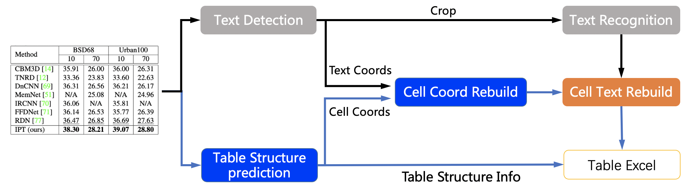
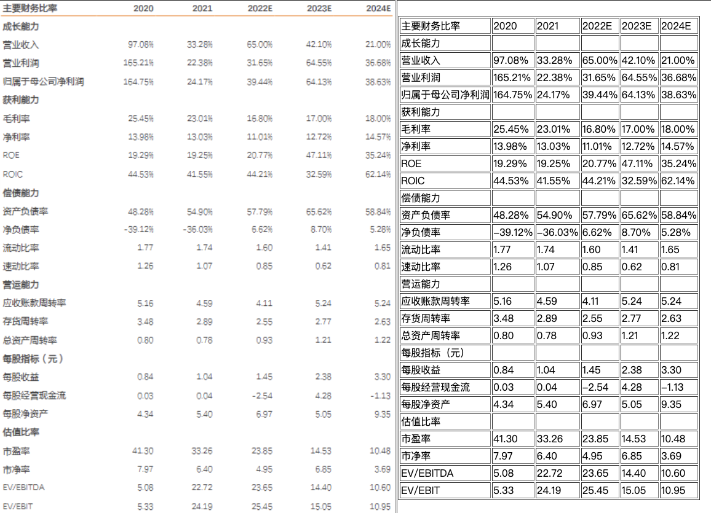
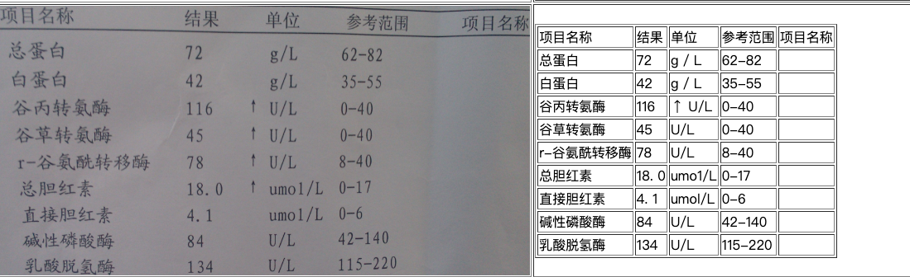

English | [简体中文](README_ch.md)

# Table Recognition

- [1. pipeline](#1-pipeline)
- [2. Performance](#2-performance)
- [3. Result](#3-result)
- [4. How to use](#4-how-to-use)
  - [4.1 Quick start](#41-quick-start)
  - [4.2 Training, Evaluation and Inference](#42-training-evaluation-and-inference)
  - [4.3 Calculate TEDS](#43-calculate-teds)
- [5. Reference](#5-reference)


## 1. pipeline
The table recognition mainly contains three models
1. Single line text detection-DB
2. Single line text recognition-CRNN
3. Table structure and cell coordinate prediction-SLANet

The table recognition flow chart is as follows



1. The coordinates of single-line text is detected by DB model, and then sends it to the recognition model to get the recognition result.
2. The table structure and cell coordinates is predicted by SLANet model.
3. The recognition result of the cell is combined by the coordinates, recognition result of the single line and the coordinates of the cell.
4. The cell recognition result and the table structure together construct the html string of the table.

## 2. Performance
We evaluated the algorithm on the PubTabNet<sup>[1]</sup> eval dataset, and the performance is as follows:

|Method|Acc|[TEDS(Tree-Edit-Distance-based Similarity)](https://github.com/ibm-aur-nlp/PubTabNet/tree/master/src)|Speed|
| --- | --- | --- | ---|
| EDD<sup>[2]</sup> |x| 88.3 |x|
| TableRec-RARE(ours) | 71.73%| 93.88% |779ms|
| SLANet(ours) | 76.31%|    95.89%|766ms|

The performance indicators are explained as follows:
- Acc: The accuracy of the table structure in each image, a wrong token is considered an error.
- TEDS: The accuracy of the model's restoration of table information. This indicator evaluates not only the table structure, but also the text content in the table.
- Speed: The inference speed of a single image when the model runs on the CPU machine and MKL is enabled.

## 3. Result





## 4. How to use

### 4.1 Quick start

PP-Structure currently provides table recognition models in both Chinese and English. For the model link, see [models_list](../docs/models_list.md). The whl package is also provided for quick use, see [quickstart](../docs/quickstart_en.md) for details.

The following takes the Chinese table recognition model as an example to introduce how to recognize a table.

Use the following commands to quickly complete the identification of a table.

```python
cd PaddleOCR/ppstructure

# download model
mkdir inference && cd inference
# Download the PP-OCRv3 text detection model and unzip it
wget https://paddleocr.bj.bcebos.com/PP-OCRv3/chinese/ch_PP-OCRv3_det_infer.tar && tar xf ch_PP-OCRv3_det_infer.tar
# Download the PP-OCRv3 text recognition model and unzip it
wget https://paddleocr.bj.bcebos.com/PP-OCRv3/chinese/ch_PP-OCRv3_rec_infer.tar && tar xf ch_PP-OCRv3_rec_infer.tar
# Download the PP-Structurev2 form recognition model and unzip it
wget https://paddleocr.bj.bcebos.com/ppstructure/models/slanet/ch_ppstructure_mobile_v2.0_SLANet_infer.tar && tar xf ch_ppstructure_mobile_v2.0_SLANet_infer.tar
cd ..
# run
python3.7 table/predict_table.py \
    --det_model_dir=inference/ch_PP-OCRv3_det_infer \
    --rec_model_dir=inference/ch_PP-OCRv3_rec_infer  \
    --table_model_dir=inference/ch_ppstructure_mobile_v2.0_SLANet_infer \
    --rec_char_dict_path=../ppocr/utils/ppocr_keys_v1.txt \
    --table_char_dict_path=../ppocr/utils/dict/table_structure_dict_ch.txt \
    --image_dir=docs/table/table.jpg \
    --output=../output/table

```

After the operation is completed, the excel table of each image will be saved to the directory specified by the output field, and an html file will be produced in the directory to visually view the cell coordinates and the recognized table.

**NOTE**
1. If you want to use the English table recognition model, you need to download the English text detection and recognition model and the English table recognition model in [models_list](../docs/models_list_en.md), and replace `table_structure_dict_ch.txt` with `table_structure_dict.txt`.
2. To use the TableRec-RARE model, you need to replace `table_structure_dict_ch.txt` with `table_structure_dict.txt`, and add parameter `--merge_no_span_structure=False`

### 4.2 Training, Evaluation and Inference

The training, evaluation and inference process of the text detection model can be referred to [detection](../../doc/doc_en/detection_en.md)

The training, evaluation and inference process of the text recognition model can be referred to [recognition](../../doc/doc_en/recognition_en.md)

The training, evaluation and inference process of the table recognition model can be referred to [table_recognition](../../doc/doc_en/table_recognition_en.md)

### 4.3 Calculate TEDS

The table uses [TEDS(Tree-Edit-Distance-based Similarity)](https://github.com/ibm-aur-nlp/PubTabNet/tree/master/src) as the evaluation metric of the model. Before the model evaluation, the three models in the pipeline need to be exported as inference models (we have provided them), and the gt for evaluation needs to be prepared. Examples of gt are as follows:
```txt
PMC5755158_010_01.png    <html><body><table><thead><tr><td></td><td><b>Weaning</b></td><td><b>Week 15</b></td><td><b>Off-test</b></td></tr></thead><tbody><tr><td>Weaning</td><td>–</td><td>–</td><td>–</td></tr><tr><td>Week 15</td><td>–</td><td>0.17 ± 0.08</td><td>0.16 ± 0.03</td></tr><tr><td>Off-test</td><td>–</td><td>0.80 ± 0.24</td><td>0.19 ± 0.09</td></tr></tbody></table></body></html>
```
Each line in gt consists of the file name and the html string of the table. The file name and the html string of the table are separated by `\t`.

You can also use the following command to generate an evaluation gt file from the annotation file:
```python
python3 ppstructure/table/convert_label2html.py --ori_gt_path /path/to/your_label_file --save_path /path/to/save_file
```

Use the following command to evaluate. After the evaluation is completed, the teds indicator will be output.
```python
python3 table/eval_table.py \
    --det_model_dir=path/to/det_model_dir \
    --rec_model_dir=path/to/rec_model_dir \
    --table_model_dir=path/to/table_model_dir \
    --image_dir=docs/table/table.jpg \
    --rec_char_dict_path=../ppocr/utils/dict/table_dict.txt \
    --table_char_dict_path=../ppocr/utils/dict/table_structure_dict.txt \
    --det_limit_side_len=736 \
    --det_limit_type=min \
    --gt_path=path/to/gt.txt
```

Evaluate on the PubLatNet dataset using the English model

```bash
cd PaddleOCR/ppstructure
# Download the model
mkdir inference && cd inference
# Download the text detection model trained on the PubTabNet dataset and unzip it
wget https://paddleocr.bj.bcebos.com/dygraph_v2.0/table/en_ppocr_mobile_v2.0_table_det_infer.tar && tar xf en_ppocr_mobile_v2.0_table_det_infer.tar
# Download the text recognition model trained on the PubTabNet dataset and unzip it
wget https://paddleocr.bj.bcebos.com/dygraph_v2.0/table/en_ppocr_mobile_v2.0_table_rec_infer.tar && tar xf en_ppocr_mobile_v2.0_table_rec_infer.tar
# Download the table recognition model trained on the PubTabNet dataset and unzip it
wget https://paddleocr.bj.bcebos.com/ppstructure/models/slanet/en_ppstructure_mobile_v2.0_SLANet_infer.tar && tar xf en_ppstructure_mobile_v2.0_SLANet_infer.tar
cd ..

python3 table/eval_table.py \
    --det_model_dir=inference/en_ppocr_mobile_v2.0_table_det_infer \
    --rec_model_dir=inference/en_ppocr_mobile_v2.0_table_rec_infer \
    --table_model_dir=inference/en_ppstructure_mobile_v2.0_SLANet_infer \
    --image_dir=train_data/table/pubtabnet/val/ \
    --rec_char_dict_path=../ppocr/utils/dict/table_dict.txt \
    --table_char_dict_path=../ppocr/utils/dict/table_structure_dict.txt \
    --det_limit_side_len=736 \
    --det_limit_type=min \
    --rec_image_shape=3,32,320 \
    --gt_path=path/to/gt.txt
```

output is
```bash
teds: 95.89
```

## 5. Reference
1. https://github.com/ibm-aur-nlp/PubTabNet
2. https://arxiv.org/pdf/1911.10683
