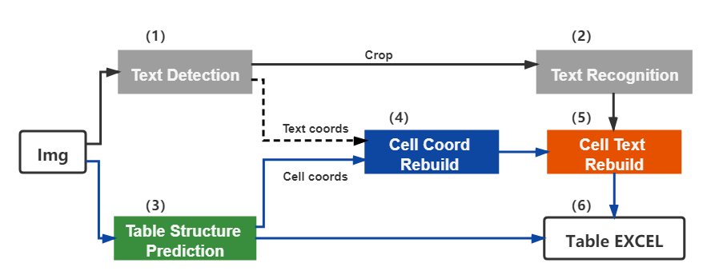

# Table Recognition

## 1. pipeline
The table recognition mainly contains three models
1. Single line text detection-DB
2. Single line text recognition-CRNN
3. Table structure and cell coordinate prediction-RARE

The table recognition flow chart is as follows



1. The coordinates of single-line text is detected by DB model, and then sends it to the recognition model to get the recognition result.
2. The table structure and cell coordinates is predicted by RARE model.
3. The recognition result of the cell is combined by the coordinates, recognition result of the single line and the coordinates of the cell.
4. The cell recognition result and the table structure together construct the html string of the table.

## 2. How to use

### 2.1 quick start

```python
cd PaddleOCR/ppstructure

# download model
mkdir inference && cd inference
# Download the detection model of the ultra-lightweight table English OCR model and unzip it
wget https://paddleocr.bj.bcebos.com/dygraph_v2.0/table/en_ppocr_mobile_v2.0_table_det_infer.tar && tar xf en_ppocr_mobile_v2.0_table_det_infer.tar
# Download the recognition model of the ultra-lightweight table English OCR model and unzip it
wget https://paddleocr.bj.bcebos.com/dygraph_v2.0/table/en_ppocr_mobile_v2.0_table_rec_infer.tar && tar xf en_ppocr_mobile_v2.0_table_rec_infer.tar
# Download the ultra-lightweight English table inch model and unzip it
wget https://paddleocr.bj.bcebos.com/dygraph_v2.0/table/en_ppocr_mobile_v2.0_table_structure_infer.tar && tar xf en_ppocr_mobile_v2.0_table_structure_infer.tar
cd ..
# run
python3 table/predict_table.py --det_model_dir=inference/en_ppocr_mobile_v2.0_table_det_infer --rec_model_dir=inference/en_ppocr_mobile_v2.0_table_rec_infer --table_model_dir=inference/en_ppocr_mobile_v2.0_table_structure_infer --image_dir=../doc/table/table.jpg --rec_char_dict_path=../ppocr/utils/ppocr_keys_v1.txt --table_char_dict_path=../ppocr/utils/dict/table_structure_dict.txt --rec_char_type=ch --det_limit_side_len=736 --det_limit_type=min --output ../output/table
```
Note: The above model is trained on the PubLayNet dataset and only supports English scanning scenarios. If you need to identify other scenarios, you need to train the model yourself and replace the three fields `det_model_dir`, `rec_model_dir`, `table_model_dir`.

After running, the excel sheet of each picture will be saved in the directory specified by the output field

### 2.2 Train

In this chapter, we only introduce the training of the table structure model, For model training of [text detection](../../doc/doc_en/detection_en.md) and [text recognition](../../doc/doc_en/recognition_en.md), please refer to the corresponding documents

#### data preparation  
The training data uses public data set [PubTabNet](https://arxiv.org/abs/1911.10683 ), Can be downloaded from the official [website](https://github.com/ibm-aur-nlp/PubTabNet) 。The PubTabNet data set contains about 500,000 images, as well as annotations in html format。

#### Start training  
*If you are installing the cpu version of paddle, please modify the `use_gpu` field in the configuration file to false*
```shell
# single GPU training
python3 tools/train.py -c configs/table/table_mv3.yml
# multi-GPU training
# Set the GPU ID used by the '--gpus' parameter.
python3 -m paddle.distributed.launch --gpus '0,1,2,3' tools/train.py -c configs/table/table_mv3.yml
```

In the above instruction, use `-c` to select the training to use the `configs/table/table_mv3.yml` configuration file.
For a detailed explanation of the configuration file, please refer to [config](../../doc/doc_en/config_en.md).

#### load trained model and continue training

If you expect to load trained model and continue the training again, you can specify the parameter `Global.checkpoints` as the model path to be loaded.

```shell
python3 tools/train.py -c configs/table/table_mv3.yml -o Global.checkpoints=./your/trained/model
```

**Note**: The priority of `Global.checkpoints` is higher than that of `Global.pretrain_weights`, that is, when two parameters are specified at the same time, the model specified by `Global.checkpoints` will be loaded first. If the model path specified by `Global.checkpoints` is wrong, the one specified by `Global.pretrain_weights` will be loaded.

### 2.3 Eval

The table uses [TEDS(Tree-Edit-Distance-based Similarity)](https://github.com/ibm-aur-nlp/PubTabNet/tree/master/src)) as the evaluation metric of the model. Before the model evaluation, the three models in the pipeline need to be exported as inference models (we have provided them), and the gt for evaluation needs to be prepared. Examples of gt are as follows:
```json
{"PMC4289340_004_00.png": [
  ["<html>", "<body>", "<table>", "<thead>", "<tr>", "<td>", "</td>", "<td>", "</td>", "<td>", "</td>", "</tr>", "</thead>", "<tbody>", "<tr>", "<td>", "</td>", "<td>", "</td>", "<td>", "</td>", "</tr>",  "</tbody>", "</table>", "</body>", "</html>"], 
  [[1, 4, 29, 13], [137, 4, 161, 13], [215, 4, 236, 13], [1, 17, 30, 27], [137, 17, 147, 27], [215, 17, 225, 27]], 
  [["<b>", "F", "e", "a", "t", "u", "r", "e", "</b>"], ["<b>", "G", "b", "3", " ", "+", "</b>"], ["<b>", "G", "b", "3", " ", "-", "</b>"], ["<b>", "P", "a", "t", "i", "e", "n", "t", "s", "</b>"], ["6", "2"], ["4", "5"]]
]}
```
In gt json, the key is the image name, the value is the corresponding gt, and gt is a list composed of four items, and each item is
1. HTML string list of table structure
2. The coordinates of each cell (not including the empty text in the cell)
3. The text information in each cell (not including the empty text in the cell)

Use the following command to evaluate. After the evaluation is completed, the teds indicator will be output.
```python
cd PaddleOCR/ppstructure
python3 table/eval_table.py --det_model_dir=path/to/det_model_dir --rec_model_dir=path/to/rec_model_dir --table_model_dir=path/to/table_model_dir --image_dir=../doc/table/1.png --rec_char_dict_path=../ppocr/utils/dict/table_dict.txt --table_char_dict_path=../ppocr/utils/dict/table_structure_dict.txt --rec_char_type=EN --det_limit_side_len=736 --det_limit_type=min --gt_path=path/to/gt.json
```

If the PubLatNet eval dataset is used, it will be output
```bash
teds: 94.85
```

### 2.4 Inference

```python
cd PaddleOCR/ppstructure
python3 table/predict_table.py --det_model_dir=path/to/det_model_dir --rec_model_dir=path/to/rec_model_dir --table_model_dir=path/to/table_model_dir --image_dir=../doc/table/1.png --rec_char_dict_path=../ppocr/utils/dict/table_dict.txt --table_char_dict_path=../ppocr/utils/dict/table_structure_dict.txt --rec_char_type=EN --det_limit_side_len=736 --det_limit_type=min --output ../output/table
```
After running, the excel sheet of each picture will be saved in the directory specified by the output field
