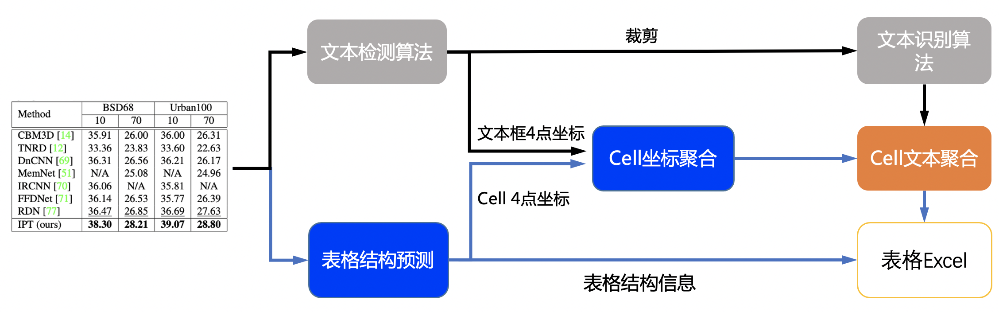

- [表格识别](#表格识别)
  - [1. 表格识别 pipeline](#1-表格识别-pipeline)
  - [2. 性能](#2-性能)
  - [3. 使用](#3-使用)
    - [3.1 快速开始](#31-快速开始)
    - [3.2 训练](#32-训练)
    - [3.3 评估](#33-评估)
    - [3.4 预测](#34-预测)

# 表格识别

## 1. 表格识别 pipeline

表格识别主要包含三个模型
1. 单行文本检测-DB
2. 单行文本识别-CRNN
3. 表格结构和cell坐标预测-RARE

具体流程图如下



流程说明:

1. 图片由单行文字检测模型检测到单行文字的坐标，然后送入识别模型拿到识别结果。
2. 图片由表格结构和cell坐标预测模型拿到表格的结构信息和单元格的坐标信息。
3. 由单行文字的坐标、识别结果和单元格的坐标一起组合出单元格的识别结果。
4. 单元格的识别结果和表格结构一起构造表格的html字符串。


## 2. 性能
我们在 PubTabNet<sup>[1]</sup> 评估数据集上对算法进行了评估，性能如下


|算法|[TEDS(Tree-Edit-Distance-based Similarity)](https://github.com/ibm-aur-nlp/PubTabNet/tree/master/src)|
| --- | --- |
| EDD<sup>[2]</sup> | 88.3 |
| Ours | 93.32 |

## 3. 使用

### 3.1 快速开始

```python
cd PaddleOCR/ppstructure

# 下载模型
mkdir inference && cd inference
# 下载超轻量级表格英文OCR模型的检测模型并解压
wget https://paddleocr.bj.bcebos.com/dygraph_v2.0/table/en_ppocr_mobile_v2.0_table_det_infer.tar && tar xf en_ppocr_mobile_v2.0_table_det_infer.tar
# 下载超轻量级表格英文OCR模型的识别模型并解压
wget https://paddleocr.bj.bcebos.com/dygraph_v2.0/table/en_ppocr_mobile_v2.0_table_rec_infer.tar && tar xf en_ppocr_mobile_v2.0_table_rec_infer.tar
# 下载超轻量级英文表格英寸模型并解压
wget https://paddleocr.bj.bcebos.com/dygraph_v2.0/table/en_ppocr_mobile_v2.0_table_structure_infer.tar && tar xf en_ppocr_mobile_v2.0_table_structure_infer.tar
cd ..
# 执行预测
python3 table/predict_table.py --det_model_dir=inference/en_ppocr_mobile_v2.0_table_det_infer --rec_model_dir=inference/en_ppocr_mobile_v2.0_table_rec_infer --table_model_dir=inference/en_ppocr_mobile_v2.0_table_structure_infer --image_dir=../doc/table/table.jpg --rec_char_dict_path=../ppocr/utils/dict/table_dict.txt --table_char_dict_path=../ppocr/utils/dict/table_structure_dict.txt --det_limit_side_len=736 --det_limit_type=min --output ../output/table
```
运行完成后，每张图片的excel表格会保存到output字段指定的目录下

note: 上述模型是在 PubLayNet 数据集上训练的表格识别模型，仅支持英文扫描场景，如需识别其他场景需要自己训练模型后替换 `det_model_dir`,`rec_model_dir`,`table_model_dir`三个字段即可。

### 3.2 训练

在这一章节中，我们仅介绍表格结构模型的训练，[文字检测](../../doc/doc_ch/detection.md)和[文字识别](../../doc/doc_ch/recognition.md)的模型训练请参考对应的文档。

* 数据准备  

训练数据使用公开数据集PubTabNet ([论文](https://arxiv.org/abs/1911.10683)，[下载地址](https://github.com/ibm-aur-nlp/PubTabNet))。PubTabNet数据集包含约50万张表格数据的图像，以及图像对应的html格式的注释。

* 启动训练

*如果您安装的是cpu版本，请将配置文件中的 `use_gpu` 字段修改为false*
```shell
# 单机单卡训练
python3 tools/train.py -c configs/table/table_mv3.yml
# 单机多卡训练，通过 --gpus 参数设置使用的GPU ID
python3 -m paddle.distributed.launch --gpus '0,1,2,3' tools/train.py -c configs/table/table_mv3.yml
```

上述指令中，通过-c 选择训练使用configs/table/table_mv3.yml配置文件。有关配置文件的详细解释，请参考[链接](../../doc/doc_ch/config.md)。

* 断点训练

如果训练程序中断，如果希望加载训练中断的模型从而恢复训练，可以通过指定Global.checkpoints指定要加载的模型路径：
```shell
python3 tools/train.py -c configs/table/table_mv3.yml -o Global.checkpoints=./your/trained/model
```

**注意**：`Global.checkpoints`的优先级高于`Global.pretrain_weights`的优先级，即同时指定两个参数时，优先加载`Global.checkpoints`指定的模型，如果`Global.checkpoints`指定的模型路径有误，会加载`Global.pretrain_weights`指定的模型。

### 3.3 评估

表格使用 [TEDS(Tree-Edit-Distance-based Similarity)](https://github.com/ibm-aur-nlp/PubTabNet/tree/master/src) 作为模型的评估指标。在进行模型评估之前，需要将pipeline中的三个模型分别导出为inference模型(我们已经提供好)，还需要准备评估的gt， gt示例如下:
```json
{"PMC4289340_004_00.png": [
  ["<html>", "<body>", "<table>", "<thead>", "<tr>", "<td>", "</td>", "<td>", "</td>", "<td>", "</td>", "</tr>", "</thead>", "<tbody>", "<tr>", "<td>", "</td>", "<td>", "</td>", "<td>", "</td>", "</tr>",  "</tbody>", "</table>", "</body>", "</html>"],
  [[1, 4, 29, 13], [137, 4, 161, 13], [215, 4, 236, 13], [1, 17, 30, 27], [137, 17, 147, 27], [215, 17, 225, 27]],
  [["<b>", "F", "e", "a", "t", "u", "r", "e", "</b>"], ["<b>", "G", "b", "3", " ", "+", "</b>"], ["<b>", "G", "b", "3", " ", "-", "</b>"], ["<b>", "P", "a", "t", "i", "e", "n", "t", "s", "</b>"], ["6", "2"], ["4", "5"]]
]}
```
json 中，key为图片名，value为对应的gt，gt是一个由三个item组成的list，每个item分别为
1. 表格结构的html字符串list
2. 每个cell的坐标 (不包括cell里文字为空的)
3. 每个cell里的文字信息 (不包括cell里文字为空的)

准备完成后使用如下命令进行评估，评估完成后会输出teds指标。
```python
cd PaddleOCR/ppstructure
python3 table/eval_table.py --det_model_dir=path/to/det_model_dir --rec_model_dir=path/to/rec_model_dir --table_model_dir=path/to/table_model_dir --image_dir=../doc/table/1.png --rec_char_dict_path=../ppocr/utils/dict/table_dict.txt --table_char_dict_path=../ppocr/utils/dict/table_structure_dict.txt --det_limit_side_len=736 --det_limit_type=min --gt_path=path/to/gt.json
```
如使用PubLatNet评估数据集，将会输出
```bash
teds: 93.32
```
### 3.4 预测

```python
cd PaddleOCR/ppstructure
python3 table/predict_table.py --det_model_dir=path/to/det_model_dir --rec_model_dir=path/to/rec_model_dir --table_model_dir=path/to/table_model_dir --image_dir=../doc/table/1.png --rec_char_dict_path=../ppocr/utils/dict/table_dict.txt --table_char_dict_path=../ppocr/utils/dict/table_structure_dict.txt --det_limit_side_len=736 --det_limit_type=min --output ../output/table
```

Reference
1. https://github.com/ibm-aur-nlp/PubTabNet
2. https://arxiv.org/pdf/1911.10683
