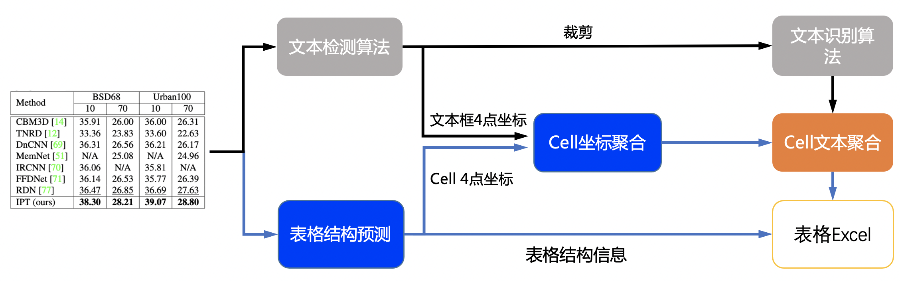

[English](README.md) | 简体中文

# 表格识别

- [1. 表格识别 pipeline](#1)
- [2. 性能](#2)
- [3. 使用](#3)
    - [3.1 快速开始](#31)
    - [3.2 训练](#32)
    - [3.3 评估](#33)
    - [3.4 预测](#34)


<a name="1"></a>
## 1. 表格识别 pipeline

表格识别主要包含三个模型
1. 单行文本检测-DB
2. 单行文本识别-CRNN
3. 表格结构和cell坐标预测-RARE

具体流程图如下



流程说明:

1. 图片由单行文字检测模型检测到单行文字的坐标，然后送入识别模型拿到识别结果。
2. 图片由表格结构和cell坐标预测模型拿到表格的结构信息和单元格的坐标信息。
3. 由单行文字的坐标、识别结果和单元格的坐标一起组合出单元格的识别结果。
4. 单元格的识别结果和表格结构一起构造表格的html字符串。


<a name="2"></a>
## 2. 性能

我们在 PubTabNet<sup>[1]</sup> 评估数据集上对算法进行了评估，性能如下


|算法|[TEDS(Tree-Edit-Distance-based Similarity)](https://github.com/ibm-aur-nlp/PubTabNet/tree/master/src)|
| --- | --- |
| EDD<sup>[2]</sup> | 88.3 |
| TableRec-RARE(ours) | 93.32 |
| SLANet(ours) | 94.98 |

<a name="3"></a>
## 3. 使用

<a name="31"></a>
### 3.1 快速开始

```python
cd PaddleOCR/ppstructure

# 下载模型
mkdir inference && cd inference
# 下载PP-OCRv3文本检测模型并解压
wget https://paddleocr.bj.bcebos.com/PP-OCRv3/chinese/ch_PP-OCRv3_det_slim_infer.tar && tar xf ch_PP-OCRv3_det_slim_infer.tar
# 下载PP-OCRv3文本识别模型并解压
wget https://paddleocr.bj.bcebos.com/PP-OCRv3/chinese/ch_PP-OCRv3_rec_slim_infer.tar && tar xf ch_PP-OCRv3_rec_slim_infer.tar
# 下载PP-Structurev2表格识别模型并解压
wget https://paddleocr.bj.bcebos.com/ppstructure/models/slanet/ch_ppstructure_mobile_v2.0_SLANet_infer.tar && tar xf ch_ppstructure_mobile_v2.0_SLANet_infer.tar
cd ..
# 执行预测
python3.7 table/predict_table.py \
    --det_model_dir=inference/ch_PP-OCRv3_det_slim_infer \
    --rec_model_dir=inference/ch_PP-OCRv3_rec_slim_infer  \
    --table_model_dir=inference/ch_ppstructure_mobile_v2.0_SLANet_infer \
    --rec_char_dict_path=../ppocr/utils/ppocr_keys_v1.txt \
    --table_char_dict_path=../ppocr/utils/dict/table_structure_dict_ch.txt \
    --image_dir=docs/table/table.jpg \
    --output=../output/table
```
运行完成后，每张图片的excel表格会保存到output字段指定的目录下，同时在该目录下回生产一个html文件，用于可视化查看单元格坐标和识别的表格。

<a name="32"></a>
### 3.2 训练

在这一章节中，我们仅介绍表格结构模型的训练，[文字检测](../../doc/doc_ch/detection.md)和[文字识别](../../doc/doc_ch/recognition.md)的模型训练请参考对应的文档。

* 数据准备  

对于中文模型和英文模型，数据来源不同，分别介绍如下

英文数据集: 训练数据使用公开数据集PubTabNet ([论文](https://arxiv.org/abs/1911.10683)，[下载地址](https://github.com/ibm-aur-nlp/PubTabNet))。PubTabNet数据集包含约50万张表格数据的图像，以及图像对应的html格式的注释。

中文数据集: 中文数据集下面两部分构成，这两部分安装1:1的采样比例进行训练。
>    1. 生成数据集: 使用[表格生成工具](https://github.com/WenmuZhou/TableGeneration)生成4w张。
>    2. 从[WTW](https://github.com/wangwen-whu/WTW-Dataset)中获取1w张。

关于公开数据集的详细介绍可以参考 [table_datasets](../../doc/doc_ch/dataset/table_datasets.md)，下述训练和评估流程均以英文数据集为例。

* 启动训练

*如果您安装的是cpu版本，请将配置文件中的 `use_gpu` 字段修改为false*
```shell
# 单机单卡训练
python3 tools/train.py -c configs/table/table_mv3.yml
# 单机多卡训练，通过 --gpus 参数设置使用的GPU ID
python3 -m paddle.distributed.launch --gpus '0,1,2,3' tools/train.py -c configs/table/table_mv3.yml
```

上述指令中，通过-c 选择训练使用configs/table/table_mv3.yml配置文件。有关配置文件的详细解释，请参考[链接](../../doc/doc_ch/config.md)。

* 断点训练

如果训练程序中断，如果希望加载训练中断的模型从而恢复训练，可以通过指定Global.checkpoints指定要加载的模型路径：
```shell
python3 tools/train.py -c configs/table/table_mv3.yml -o Global.checkpoints=./your/trained/model
```

**注意**：`Global.checkpoints`的优先级高于`Global.pretrain_weights`的优先级，即同时指定两个参数时，优先加载`Global.checkpoints`指定的模型，如果`Global.checkpoints`指定的模型路径有误，会加载`Global.pretrain_weights`指定的模型。

<a name="33"></a>
### 3.3 评估

表格使用 [TEDS(Tree-Edit-Distance-based Similarity)](https://github.com/ibm-aur-nlp/PubTabNet/tree/master/src) 作为模型的评估指标。在进行模型评估之前，需要将pipeline中的三个模型分别导出为inference模型(我们已经提供好)，还需要准备评估的gt， gt示例如下:
```txt
PMC5755158_010_01.png	<html><body><table><thead><tr><td></td><td><b>Weaning</b></td><td><b>Week 15</b></td><td><b>Off-test</b></td></tr></thead><tbody><tr><td>Weaning</td><td>–</td><td>–</td><td>–</td></tr><tr><td>Week 15</td><td>–</td><td>0.17 ± 0.08</td><td>0.16 ± 0.03</td></tr><tr><td>Off-test</td><td>–</td><td>0.80 ± 0.24</td><td>0.19 ± 0.09</td></tr></tbody></table></body></html>
```
gt每一行都由文件名和表格的html字符串组成，文件名和表格的html字符串之间使用`\t`分隔。

也可使用如下命令，由标注文件生成评估的gt文件：
```python
python3 ppstructure/table/convert_label2html.py --ori_gt_path /path/to/your_label_file --save_path /path/to/save_file
```

准备完成后使用如下命令进行评估，评估完成后会输出teds指标。
```python
cd PaddleOCR/ppstructure
python3 table/eval_table.py --det_model_dir=path/to/det_model_dir --rec_model_dir=path/to/rec_model_dir --table_model_dir=path/to/table_model_dir --image_dir=../doc/table/1.png --rec_char_dict_path=../ppocr/utils/dict/table_dict.txt --table_char_dict_path=../ppocr/utils/dict/table_structure_dict.txt --det_limit_side_len=736 --det_limit_type=min --gt_path=path/to/gt.txt
```
如使用PubLatNet评估数据集，将会输出
```bash
teds: 94.98
```

<a name="34"></a>
### 3.4 预测

```python
cd PaddleOCR/ppstructure
python3 table/predict_table.py --det_model_dir=path/to/det_model_dir --rec_model_dir=path/to/rec_model_dir --table_model_dir=path/to/table_model_dir --image_dir=../doc/table/1.png --rec_char_dict_path=../ppocr/utils/dict/table_dict.txt --table_char_dict_path=../ppocr/utils/dict/table_structure_dict.txt --det_limit_side_len=736 --det_limit_type=min --output ../output/table
```

# Reference
1. https://github.com/ibm-aur-nlp/PubTabNet
2. https://arxiv.org/pdf/1911.10683
