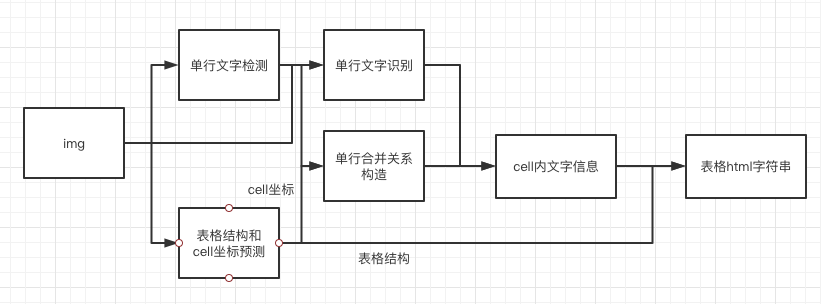

# 表格结构和内容预测

## pipeline
表格的ocr主要包含三个模型
1. 单行文本检测-DB
2. 单行文本识别-CRNN
3. 表格结构和cell坐标预测-RARE

具体流程图如下



1. 图片由单行文字检测检测到单行文字的坐标，然后送入识别模型拿到识别结果。
2. 图片由表格结构和cell坐标预测拿到表格的结构信息和单元格的坐标信息。
3. 由单行文字的坐标、识别结果和单元格的坐标一起组合出单元格的识别结果。
4. 单元格的识别结果和表格结构一起构造表格的html字符串。

## 使用


### 训练
TBD

### 评估
先cd到PaddleOCR/ppstructure目录下

表格使用 TEDS(Tree-Edit-Distance-based Similarity) 作为模型的评估指标。在进行模型评估之前，需要将pipeline中的三个模型分别导出为inference模型(我们已经提供好)，还需要准备评估的gt， gt示例如下:
```json
{"PMC4289340_004_00.png": [["<html>", "<body>", "<table>", "<thead>", "<tr>", "<td>", "</td>", "<td>", "</td>", "<td>", "</td>", "</tr>", "</thead>", "<tbody>", "<tr>", "<td>", "</td>", "<td>", "</td>", "<td>", "</td>", "</tr>",  "</tbody>", "</table>", "</body>", "</html>"], [[1, 4, 29, 13], [137, 4, 161, 13], [215, 4, 236, 13], [1, 17, 30, 27], [137, 17, 147, 27], [215, 17, 225, 27]], [["<b>", "F", "e", "a", "t", "u", "r", "e", "</b>"], ["<b>", "G", "b", "3", " ", "+", "</b>"], ["<b>", "G", "b", "3", " ", "-", "</b>"], ["<b>", "P", "a", "t", "i", "e", "n", "t", "s", "</b>"], ["6", "2"], ["4", "5"]]]}
```
示例对应的表格如下


准备完成后使用如下命令进行评估，评估完成后会输出teds指标。
```python
python3 table/eval_table.py --det_model_dir=path/to/det_model_dir --rec_model_dir=path/to/rec_model_dir --structure_model_dir=path/to/structure_model_dir --image_dir=../doc/table/1.png --rec_char_dict_path=../ppocr/utils/dict/table_dict.txt --structure_char_dict_path=../ppocr/utils/dict/table_structure_dict.txt --rec_char_type=EN --det_limit_side_len=736 --det_limit_type=min --gt_path=path/to/gt.json
```


### 预测
先cd到PaddleOCR/ppstructure目录下

```python
python3 table/predict_table.py --det_model_dir=path/to/det_model_dir --rec_model_dir=path/to/rec_model_dir --structure_model_dir=path/to/structure_model_dir --image_dir=../doc/table/1.png --rec_char_dict_path=../ppocr/utils/dict/table_dict.txt --structure_char_dict_path=../ppocr/utils/dict/table_structure_dict.txt --rec_char_type=EN --det_limit_side_len=736 --det_limit_type=min --output ../output/table
```
运行完成后，每张图片的excel表格会保存到table_output字段指定的目录下
