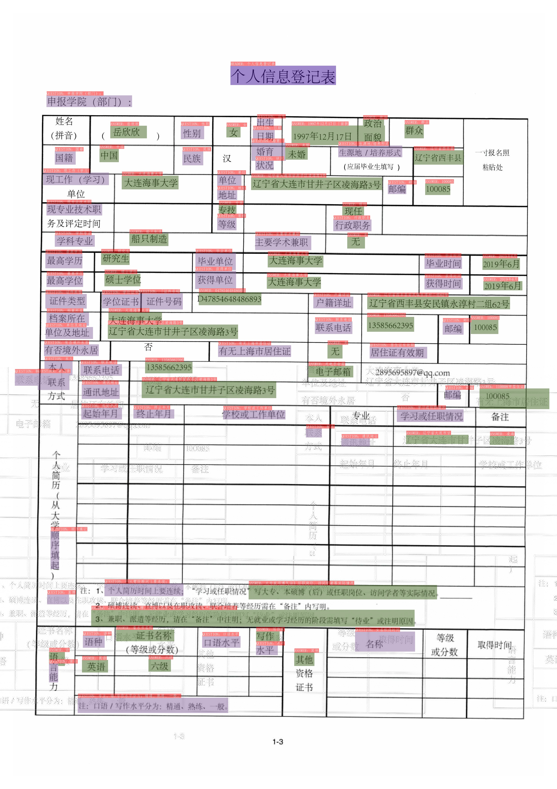
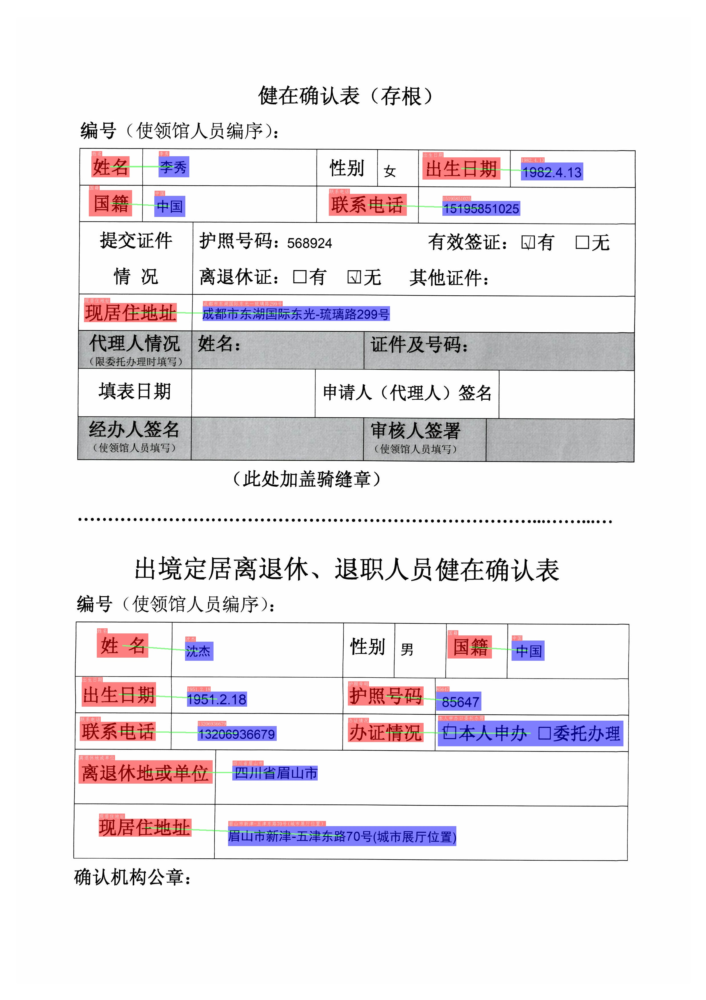

- [文档视觉问答（DOC-VQA）](#文档视觉问答doc-vqa)
  - [1. 简介](#1-简介)
  - [2. 性能](#2-性能)
  - [3. 效果演示](#3-效果演示)
    - [3.1 SER](#31-ser)
    - [3.2 RE](#32-re)
  - [4. 安装](#4-安装)
    - [4.1 安装依赖](#41-安装依赖)
    - [4.2 安装PaddleOCR（包含 PP-OCR 和 VQA）](#42-安装paddleocr包含-pp-ocr-和-vqa)
  - [5. 使用](#5-使用)
    - [5.1 数据和预训练模型准备](#51-数据和预训练模型准备)
    - [5.2 SER](#52-ser)
    - [5.3 RE](#53-re)
  - [6. 参考链接](#6-参考链接)


# 文档视觉问答（DOC-VQA）

## 1. 简介

VQA指视觉问答，主要针对图像内容进行提问和回答,DOC-VQA是VQA任务中的一种，DOC-VQA主要针对文本图像的文字内容提出问题。

PP-Structure 里的 DOC-VQA算法基于PaddleNLP自然语言处理算法库进行开发。

主要特性如下：

- 集成[LayoutXLM](https://arxiv.org/pdf/2104.08836.pdf)模型以及PP-OCR预测引擎。
- 支持基于多模态方法的语义实体识别 (Semantic Entity Recognition, SER) 以及关系抽取 (Relation Extraction, RE) 任务。基于 SER 任务，可以完成对图像中的文本识别与分类；基于 RE 任务，可以完成对图象中的文本内容的关系提取，如判断问题对(pair)。
- 支持SER任务和RE任务的自定义训练。
- 支持OCR+SER的端到端系统预测与评估。
- 支持OCR+SER+RE的端到端系统预测。


本项目是 [LayoutXLM: Multimodal Pre-training for Multilingual Visually-rich Document Understanding](https://arxiv.org/pdf/2104.08836.pdf) 在 Paddle 2.2上的开源实现，
包含了在 [XFUND数据集](https://github.com/doc-analysis/XFUND) 上的微调代码。

## 2. 性能

我们在 [XFUN](https://github.com/doc-analysis/XFUND) 的中文数据集上对算法进行了评估，性能如下

| 模型 | 任务 | hmean | 模型下载地址 |
|:---:|:---:|:---:| :---:|
| LayoutXLM | SER | 0.9038 | [链接](https://paddleocr.bj.bcebos.com/pplayout/ser_LayoutXLM_xfun_zh.tar) |
| LayoutXLM | RE | 0.7483 | [链接](https://paddleocr.bj.bcebos.com/pplayout/re_LayoutXLM_xfun_zh.tar) |
| LayoutLMv2 | SER | 0.8544 | [链接](https://paddleocr.bj.bcebos.com/pplayout/ser_LayoutLMv2_xfun_zh.tar)
| LayoutLMv2 | RE | 0.6777 | [链接](https://paddleocr.bj.bcebos.com/pplayout/re_LayoutLMv2_xfun_zh.tar) |
| LayoutLM | SER | 0.7731 | [链接](https://paddleocr.bj.bcebos.com/pplayout/ser_LayoutLM_xfun_zh.tar) |

## 3. 效果演示

**注意：** 测试图片来源于XFUN数据集。

### 3.1 SER

 | 
---|---

图中不同颜色的框表示不同的类别，对于XFUN数据集，有`QUESTION`, `ANSWER`, `HEADER` 3种类别

* 深紫色：HEADER
* 浅紫色：QUESTION
* 军绿色：ANSWER

在OCR检测框的左上方也标出了对应的类别和OCR识别结果。

### 3.2 RE

 | 
---|---


图中红色框表示问题，蓝色框表示答案，问题和答案之间使用绿色线连接。在OCR检测框的左上方也标出了对应的类别和OCR识别结果。

## 4. 安装

### 4.1 安装依赖

- **（1) 安装PaddlePaddle**

```bash
python3 -m pip install --upgrade pip

# GPU安装
python3 -m pip install "paddlepaddle-gpu>=2.2" -i https://mirror.baidu.com/pypi/simple

# CPU安装
python3 -m pip install "paddlepaddle>=2.2" -i https://mirror.baidu.com/pypi/simple

```
更多需求，请参照[安装文档](https://www.paddlepaddle.org.cn/install/quick)中的说明进行操作。

### 4.2 安装PaddleOCR（包含 PP-OCR 和 VQA）

- **（1）pip快速安装PaddleOCR whl包（仅预测）**

```bash
python3 -m pip install paddleocr
```

- **（2）下载VQA源码（预测+训练）**

```bash
【推荐】git clone https://github.com/PaddlePaddle/PaddleOCR

# 如果因为网络问题无法pull成功，也可选择使用码云上的托管：
git clone https://gitee.com/paddlepaddle/PaddleOCR

# 注：码云托管代码可能无法实时同步本github项目更新，存在3~5天延时，请优先使用推荐方式。
```

- **（3）安装VQA的`requirements`**

```bash
python3 -m pip install -r ppstructure/vqa/requirements.txt
```

## 5. 使用

### 5.1 数据和预训练模型准备

如果希望直接体验预测过程，可以下载我们提供的预训练模型，跳过训练过程，直接预测即可。

* 下载处理好的数据集

处理好的XFUN中文数据集下载地址：[https://paddleocr.bj.bcebos.com/dataset/XFUND.tar](https://paddleocr.bj.bcebos.com/dataset/XFUND.tar)。


下载并解压该数据集，解压后将数据集放置在当前目录下。

```shell
wget https://paddleocr.bj.bcebos.com/dataset/XFUND.tar
```

* 转换数据集

若需进行其他XFUN数据集的训练，可使用下面的命令进行数据集的转换

```bash
python3 ppstructure/vqa/helper/trans_xfun_data.py --ori_gt_path=path/to/json_path --output_path=path/to/save_path
```

### 5.2 SER

启动训练之前，需要修改下面的四个字段

1. `Train.dataset.data_dir`：指向训练集图片存放目录
2. `Train.dataset.label_file_list`：指向训练集标注文件
3. `Eval.dataset.data_dir`：指指向验证集图片存放目录
4. `Eval.dataset.label_file_list`：指向验证集标注文件

* 启动训练
```shell
CUDA_VISIBLE_DEVICES=0 python3 tools/train.py -c configs/vqa/ser/layoutxlm.yml
```

最终会打印出`precision`, `recall`, `hmean`等指标。
在`./output/ser_layoutxlm/`文件夹中会保存训练日志，最优的模型和最新epoch的模型。

* 恢复训练

恢复训练需要将之前训练好的模型所在文件夹路径赋值给 `Architecture.Backbone.checkpoints` 字段。

```shell
CUDA_VISIBLE_DEVICES=0 python3 tools/train.py -c configs/vqa/ser/layoutxlm.yml -o Architecture.Backbone.checkpoints=path/to/model_dir
```

* 评估

评估需要将待评估的模型所在文件夹路径赋值给 `Architecture.Backbone.checkpoints` 字段。

```shell
CUDA_VISIBLE_DEVICES=0 python3 tools/eval.py -c configs/vqa/ser/layoutxlm.yml -o Architecture.Backbone.checkpoints=path/to/model_dir
```
最终会打印出`precision`, `recall`, `hmean`等指标

* 使用`OCR引擎 + SER`串联预测

使用如下命令即可完成`OCR引擎 + SER`的串联预测

```shell
CUDA_VISIBLE_DEVICES=0 python3 tools/infer_vqa_token_ser.py -c configs/vqa/ser/layoutxlm.yml  -o Architecture.Backbone.checkpoints=ser_LayoutXLM_xfun_zh/ Global.infer_img=doc/vqa/input/zh_val_42.jpg
```

最终会在`config.Global.save_res_path`字段所配置的目录下保存预测结果可视化图像以及预测结果文本文件，预测结果文本文件名为`infer_results.txt`。

* 对`OCR引擎 + SER`预测系统进行端到端评估

首先使用 `tools/infer_vqa_token_ser.py` 脚本完成数据集的预测，然后使用下面的命令进行评估。

```shell
export CUDA_VISIBLE_DEVICES=0
python3 helper/eval_with_label_end2end.py --gt_json_path XFUND/zh_val/xfun_normalize_val.json  --pred_json_path output_res/infer_results.txt
```

### 5.3 RE

* 启动训练

启动训练之前，需要修改下面的四个字段

1. `Train.dataset.data_dir`：指向训练集图片存放目录
2. `Train.dataset.label_file_list`：指向训练集标注文件
3. `Eval.dataset.data_dir`：指指向验证集图片存放目录
4. `Eval.dataset.label_file_list`：指向验证集标注文件

```shell
CUDA_VISIBLE_DEVICES=0 python3 tools/train.py -c configs/vqa/re/layoutxlm.yml
```

最终会打印出`precision`, `recall`, `hmean`等指标。
在`./output/re_layoutxlm/`文件夹中会保存训练日志，最优的模型和最新epoch的模型。

* 恢复训练

恢复训练需要将之前训练好的模型所在文件夹路径赋值给 `Architecture.Backbone.checkpoints` 字段。

```shell
CUDA_VISIBLE_DEVICES=0 python3 tools/train.py -c configs/vqa/re/layoutxlm.yml -o Architecture.Backbone.checkpoints=path/to/model_dir
```

* 评估

评估需要将待评估的模型所在文件夹路径赋值给 `Architecture.Backbone.checkpoints` 字段。

```shell
CUDA_VISIBLE_DEVICES=0 python3 tools/eval.py -c configs/vqa/re/layoutxlm.yml -o Architecture.Backbone.checkpoints=path/to/model_dir
```
最终会打印出`precision`, `recall`, `hmean`等指标

* 使用`OCR引擎 + SER + RE`串联预测

使用如下命令即可完成`OCR引擎 + SER + RE`的串联预测
```shell
export CUDA_VISIBLE_DEVICES=0
python3 tools/infer_vqa_token_ser_re.py -c configs/vqa/re/layoutxlm.yml -o Architecture.Backbone.checkpoints=re_LayoutXLM_xfun_zh/ Global.infer_img=doc/vqa/input/zh_val_21.jpg -c_ser configs/vqa/ser/layoutxlm.yml -o_ser Architecture.Backbone.checkpoints=ser_LayoutXLM_xfun_zh/
```

最终会在`config.Global.save_res_path`字段所配置的目录下保存预测结果可视化图像以及预测结果文本文件，预测结果文本文件名为`infer_results.txt`。

## 6. 参考链接

- LayoutXLM: Multimodal Pre-training for Multilingual Visually-rich Document Understanding, https://arxiv.org/pdf/2104.08836.pdf
- microsoft/unilm/layoutxlm, https://github.com/microsoft/unilm/tree/master/layoutxlm
- XFUND dataset, https://github.com/doc-analysis/XFUND
