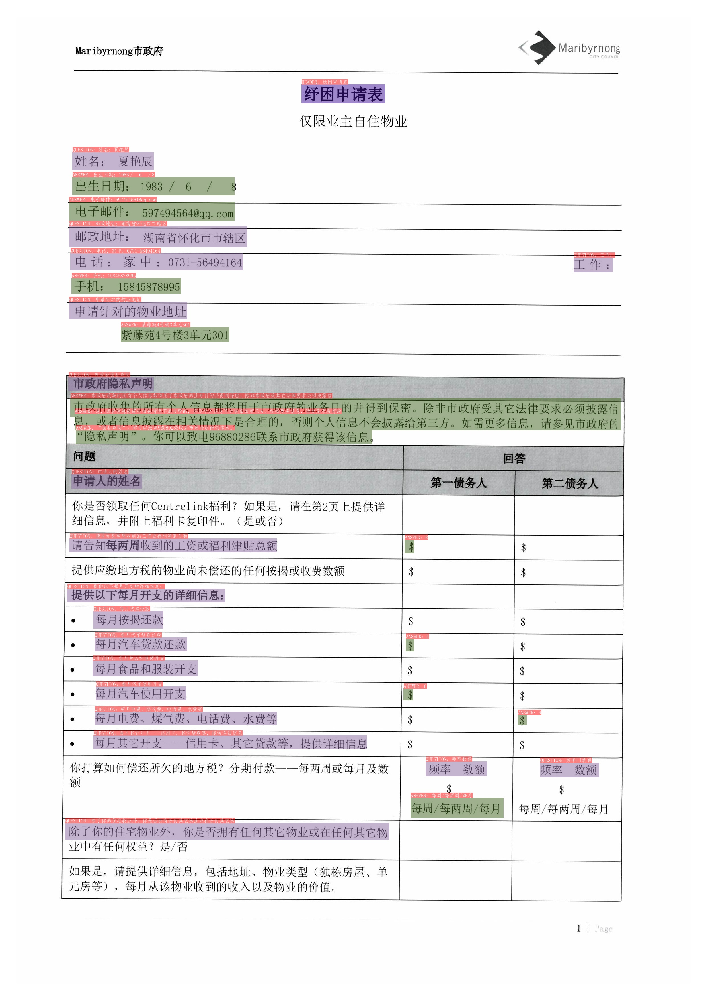

English | [简体中文](README_ch.md)

- [Document Visual Question Answering (Doc-VQA)](#Document-Visual-Question-Answering)
  - [1. Introduction](#1-Introduction)
  - [2. Performance](#2-performance)
  - [3. Effect demo](#3-Effect-demo)
    - [3.1 SER](#31-ser)
    - [3.2 RE](#32-re)
  - [4. Install](#4-Install)
    - [4.1 Installation dependencies](#41-Install-dependencies)
    - [4.2 Install PaddleOCR](#42-Install-PaddleOCR)
  - [5. Usage](#5-Usage)
    - [5.1 Data and Model Preparation](#51-Data-and-Model-Preparation)
    - [5.2 SER](#52-ser)
    - [5.3 RE](#53-re)
  - [6. Reference](#6-Reference-Links)

# Document Visual Question Answering

## 1 Introduction

VQA refers to visual question answering, which mainly asks and answers image content. DOC-VQA is one of the VQA tasks. DOC-VQA mainly asks questions about the text content of text images.

The DOC-VQA algorithm in PP-Structure is developed based on the PaddleNLP natural language processing algorithm library.

The main features are as follows:

- Integrate [LayoutXLM](https://arxiv.org/pdf/2104.08836.pdf) model and PP-OCR prediction engine.
- Supports Semantic Entity Recognition (SER) and Relation Extraction (RE) tasks based on multimodal methods. Based on the SER task, the text recognition and classification in the image can be completed; based on the RE task, the relationship extraction of the text content in the image can be completed, such as judging the problem pair (pair).
- Supports custom training for SER tasks and RE tasks.
- Supports end-to-end system prediction and evaluation of OCR+SER.
- Supports end-to-end system prediction of OCR+SER+RE.


This project is an open source implementation of [LayoutXLM: Multimodal Pre-training for Multilingual Visually-rich Document Understanding](https://arxiv.org/pdf/2104.08836.pdf) on Paddle 2.2,
Included fine-tuning code on [XFUND dataset](https://github.com/doc-analysis/XFUND).

## 2. Performance

We evaluate the algorithm on the Chinese dataset of [XFUND](https://github.com/doc-analysis/XFUND), and the performance is as follows

| Model | Task | hmean | Model download address |
|:---:|:---:|:---:| :---:|
| LayoutXLM | SER | 0.9038 | [link](https://paddleocr.bj.bcebos.com/pplayout/ser_LayoutXLM_xfun_zh.tar) |
| LayoutXLM | RE | 0.7483 | [link](https://paddleocr.bj.bcebos.com/pplayout/re_LayoutXLM_xfun_zh.tar) |
| LayoutLMv2 | SER | 0.8544 | [link](https://paddleocr.bj.bcebos.com/pplayout/ser_LayoutLMv2_xfun_zh.tar)
| LayoutLMv2 | RE | 0.6777 | [link](https://paddleocr.bj.bcebos.com/pplayout/re_LayoutLMv2_xfun_zh.tar) |
| LayoutLM | SER | 0.7731 | [link](https://paddleocr.bj.bcebos.com/pplayout/ser_LayoutLM_xfun_zh.tar) |

## 3. Effect demo

**Note:** The test images are from the XFUND dataset.

<a name="31"></a>
### 3.1 SER

 | 
---|---

Boxes with different colors in the figure represent different categories. For the XFUND dataset, there are 3 categories: `QUESTION`, `ANSWER`, `HEADER`

* Dark purple: HEADER
* Light purple: QUESTION
* Army Green: ANSWER

The corresponding categories and OCR recognition results are also marked on the upper left of the OCR detection frame.

<a name="32"></a>
### 3.2 RE

 | 
---|---


The red box in the figure represents the question, the blue box represents the answer, and the question and the answer are connected by a green line. The corresponding categories and OCR recognition results are also marked on the upper left of the OCR detection frame.

## 4. Install

### 4.1 Install dependencies

- **(1) Install PaddlePaddle**

```bash
python3 -m pip install --upgrade pip

# GPU installation
python3 -m pip install "paddlepaddle-gpu>=2.2" -i https://mirror.baidu.com/pypi/simple

# CPU installation
python3 -m pip install "paddlepaddle>=2.2" -i https://mirror.baidu.com/pypi/simple

````
For more requirements, please refer to the instructions in [Installation Documentation](https://www.paddlepaddle.org.cn/install/quick).

### 4.2 Install PaddleOCR

- **(1) pip install PaddleOCR whl package quickly (prediction only)**

```bash
python3 -m pip install paddleocr
````

- **(2) Download VQA source code (prediction + training)**

```bash
[Recommended] git clone https://github.com/PaddlePaddle/PaddleOCR

# If the pull cannot be successful due to network problems, you can also choose to use the hosting on the code cloud:
git clone https://gitee.com/paddlepaddle/PaddleOCR

# Note: Code cloud hosting code may not be able to synchronize the update of this github project in real time, there is a delay of 3 to 5 days, please use the recommended method first.
````

- **(3) Install VQA's `requirements`**

```bash
python3 -m pip install -r ppstructure/vqa/requirements.txt
````

## 5. Usage

### 5.1 Data and Model Preparation

If you want to experience the prediction process directly, you can download the pre-training model provided by us, skip the training process, and just predict directly.

* Download the processed dataset

The download address of the processed XFUND Chinese dataset: [https://paddleocr.bj.bcebos.com/dataset/XFUND.tar](https://paddleocr.bj.bcebos.com/dataset/XFUND.tar).


Download and unzip the dataset, and place the dataset in the current directory after unzipping.

```shell
wget https://paddleocr.bj.bcebos.com/dataset/XFUND.tar
````

* Convert the dataset

If you need to train other XFUND datasets, you can use the following commands to convert the datasets

```bash
python3 ppstructure/vqa/tools/trans_xfun_data.py --ori_gt_path=path/to/json_path --output_path=path/to/save_path
````

* Download the pretrained models
```bash
mkdir pretrain && cd pretrain
#download the SER model
wget https://paddleocr.bj.bcebos.com/pplayout/ser_LayoutXLM_xfun_zh.tar && tar -xvf ser_LayoutXLM_xfun_zh.tar
#download the RE model
wget https://paddleocr.bj.bcebos.com/pplayout/re_LayoutXLM_xfun_zh.tar && tar -xvf re_LayoutXLM_xfun_zh.tar
cd ../
````

<a name="52"></a>
### 5.2 SER

Before starting training, you need to modify the following four fields

1. `Train.dataset.data_dir`: point to the directory where the training set images are stored
2. `Train.dataset.label_file_list`: point to the training set label file
3. `Eval.dataset.data_dir`: refers to the directory where the validation set images are stored
4. `Eval.dataset.label_file_list`: point to the validation set label file

* start training
```shell
CUDA_VISIBLE_DEVICES=0 python3 tools/train.py -c configs/vqa/ser/layoutxlm.yml
````

Finally, `precision`, `recall`, `hmean` and other indicators will be printed.
In the `./output/ser_layoutxlm/` folder will save the training log, the optimal model and the model for the latest epoch.

* resume training

To resume training, assign the folder path of the previously trained model to the `Architecture.Backbone.checkpoints` field.

```shell
CUDA_VISIBLE_DEVICES=0 python3 tools/train.py -c configs/vqa/ser/layoutxlm.yml -o Architecture.Backbone.checkpoints=path/to/model_dir
````

* evaluate

Evaluation requires assigning the folder path of the model to be evaluated to the `Architecture.Backbone.checkpoints` field.

```shell
CUDA_VISIBLE_DEVICES=0 python3 tools/eval.py -c configs/vqa/ser/layoutxlm.yml -o Architecture.Backbone.checkpoints=path/to/model_dir
````
Finally, `precision`, `recall`, `hmean` and other indicators will be printed

* Use `OCR engine + SER` tandem prediction

Use the following command to complete the series prediction of `OCR engine + SER`, taking the pretrained SER model as an example:

```shell
CUDA_VISIBLE_DEVICES=0 python3 tools/infer_vqa_token_ser.py -c configs/vqa/ser/layoutxlm.yml -o Architecture.Backbone.checkpoints=pretrain/ser_LayoutXLM_xfun_zh/Global.infer_img=doc/vqa/input/zh_val_42.jpg
````

Finally, the prediction result visualization image and the prediction result text file will be saved in the directory configured by the `config.Global.save_res_path` field. The prediction result text file is named `infer_results.txt`.

* End-to-end evaluation of `OCR engine + SER` prediction system

First use the `tools/infer_vqa_token_ser.py` script to complete the prediction of the dataset, then use the following command to evaluate.

```shell
export CUDA_VISIBLE_DEVICES=0
python3 tools/eval_with_label_end2end.py --gt_json_path XFUND/zh_val/xfun_normalize_val.json --pred_json_path output_res/infer_results.txt
````

<a name="53"></a>
### 5.3 RE

* start training

Before starting training, you need to modify the following four fields

1. `Train.dataset.data_dir`: point to the directory where the training set images are stored
2. `Train.dataset.label_file_list`: point to the training set label file
3. `Eval.dataset.data_dir`: refers to the directory where the validation set images are stored
4. `Eval.dataset.label_file_list`: point to the validation set label file

```shell
CUDA_VISIBLE_DEVICES=0 python3 tools/train.py -c configs/vqa/re/layoutxlm.yml
````

Finally, `precision`, `recall`, `hmean` and other indicators will be printed.
In the `./output/re_layoutxlm/` folder will save the training log, the optimal model and the model for the latest epoch.

* resume training

To resume training, assign the folder path of the previously trained model to the `Architecture.Backbone.checkpoints` field.

```shell
CUDA_VISIBLE_DEVICES=0 python3 tools/train.py -c configs/vqa/re/layoutxlm.yml -o Architecture.Backbone.checkpoints=path/to/model_dir
````

* evaluate

Evaluation requires assigning the folder path of the model to be evaluated to the `Architecture.Backbone.checkpoints` field.

```shell
CUDA_VISIBLE_DEVICES=0 python3 tools/eval.py -c configs/vqa/re/layoutxlm.yml -o Architecture.Backbone.checkpoints=path/to/model_dir
````
Finally, `precision`, `recall`, `hmean` and other indicators will be printed

* Use `OCR engine + SER + RE` tandem prediction

Use the following command to complete the series prediction of `OCR engine + SER + RE`, taking the pretrained SER and RE models as an example:
```shell
export CUDA_VISIBLE_DEVICES=0
python3 tools/infer_vqa_token_ser_re.py -c configs/vqa/re/layoutxlm.yml -o Architecture.Backbone.checkpoints=pretrain/re_LayoutXLM_xfun_zh/Global.infer_img=doc/vqa/input/zh_val_21.jpg -c_ser configs/vqa/ser/layoutxlm. yml -o_ser Architecture.Backbone.checkpoints=pretrain/ser_LayoutXLM_xfun_zh/
````

Finally, the prediction result visualization image and the prediction result text file will be saved in the directory configured by the `config.Global.save_res_path` field. The prediction result text file is named `infer_results.txt`.

## 6. Reference Links

- LayoutXLM: Multimodal Pre-training for Multilingual Visually-rich Document Understanding, https://arxiv.org/pdf/2104.08836.pdf
- microsoft/unilm/layoutxlm, https://github.com/microsoft/unilm/tree/master/layoutxlm
- XFUND dataset, https://github.com/doc-analysis/XFUND

## License

The content of this project itself is licensed under the [Attribution-NonCommercial-ShareAlike 4.0 International (CC BY-NC-SA 4.0)](https://creativecommons.org/licenses/by-nc-sa/4.0/)
