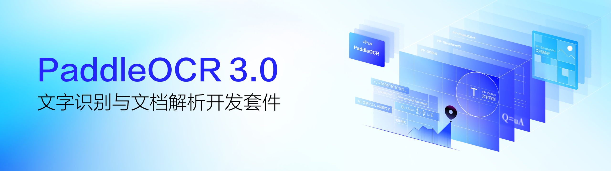

<div align="center">
  <p>
      
  </p>

<!-- language -->
[English](../README.md) | 简体中文 | [繁體中文](./README_tcn.md) | [日本語](./README_ja.md) | [한국어](./README_ko.md) | [Français](./README_fr.md) | [Русский](./README_ru.md) | [Español](./README_es.md) | [العربية](./README_ar.md)

<!-- icon -->
[](https://github.com/PaddlePaddle/PaddleOCR)
[](https://arxiv.org/pdf/2507.05595)
[](https://pepy.tech/projectsproject/paddleocr)
[](https://pepy.tech/projects/paddleocr)
[](https://github.com/PaddlePaddle/PaddleOCR/network/dependents)


[](../LICENSE)
[](https://deepwiki.com/PaddlePaddle/PaddleOCR)


**PaddleOCR 是业界领先、可直接部署的 OCR 与文档智能引擎，提供从文本识别到文档理解的全流程解决方案**

</div>

# PaddleOCR
[](https://www.paddlepaddle.org.cn/)
[](#)
[](#)
[](#)
[](#)

> [!TIP]
> PaddleOCR 现已提供 MCP服务器，支持与 Claude Desktop 等Agent应用集成。详情请参考 [PaddleOCR MCP 服务器](https://paddlepaddle.github.io/PaddleOCR/latest/version3.x/deployment/mcp_server.html)。
>
> PaddleOCR 3.0 技术报告现已发布，详情请参考：[PaddleOCR 3.0 Technical Report](https://arxiv.org/pdf/2507.05595 )


**PaddleOCR** 将文档和图像转换为**结构化、AI友好的数据**（如JSON和Markdown），**精度达到行业领先水平**——为全球从独立开发者，初创企业和大型企业的AI应用提供强力支撑。凭借**50,000+星标**和**MinerU、RAGFlow、OmniParser**等头部项目的深度集成，PaddleOCR已成为**AI时代**开发者构建智能文档等应用的**首选解决方案**。

### PaddleOCR 3.0 **核心能力**

[](https://aistudio.baidu.com/community/app/91660/webUI)
[](https://aistudio.baidu.com/community/app/518494/webUI)
[](https://aistudio.baidu.com/community/app/518493/webUI)
[](https://www.modelscope.cn/organization/PaddlePaddle)
[](https://huggingface.co/PaddlePaddle)

- **PP-OCRv5 — 全场景文字识别**  
  **单模型支持五种文字类型**（简中、繁中、英文、日文及拼音），精度提升**13个百分点**。解决多语言混合文档的识别难题。

- **PP-StructureV3 — 复杂文档解析**  
  将复杂PDF和文档图像智能转换为保留**原始结构的Markdown文件和JSON**文件，在公开评测中**领先**众多商业方案。**完美保持文档版式和层次结构**。

- **PP-ChatOCRv4 — 智能信息抽取**  
  原生集成ERNIE 4.5，从海量文档中**精准提取关键信息**，精度较上一代提升15个百分点。让文档"**听懂**"您的问题并给出准确答案。

PaddleOCR 3.0除了提供优秀的模型库外，还提供好学易用的工具，覆盖模型训练、推理和服务化部署，方便开发者快速落地AI应用。
<div align="center">
  <p>
      
  </p>
</div>

**特别说明**：PaddleOCR 3.x 引入了多项重要的接口变动，**基于 PaddleOCR 2.x 编写的旧代码很可能无法使用 PaddleOCR 3.x 运行**。请确保您阅读的文档与实际使用的 PaddleOCR 版本匹配。[此文档](https://paddlepaddle.github.io/PaddleOCR/latest/update/upgrade_notes.html) 阐述了升级原因及 PaddleOCR 2.x 到 PaddleOCR 3.x 的主要变更。

## 📣 最新动态


### 🔥🔥2025.08.21: PaddleOCR 3.2.0 发布，包含：

- **重要模型新增：**
    - 新增 PP-OCRv5 英文、泰文、希腊文识别模型的训练、推理、部署。**其中 PP-OCRv5 英文模型较 PP-OCRv5 主模型在英文场景提升 11%，泰文识别模型精度 82.68%，希腊文识别模型精度 89.28%。**

- **部署能力升级：**
    - **全面支持飞桨框架 3.1.0 和 3.1.1 版本。**
    - **全面升级 PP-OCRv5 C++ 本地部署方案，支持 Linux、Windows，功能及精度效果与 Python 方案保持一致。**
    - **高性能推理支持 CUDA 12，可使用 Paddle Inference、ONNX Runtime 后端推理。**
    - **高稳定性服务化部署方案全面开源，支持用户根据需求对 Docker 镜像和 SDK 进行定制化修改。**
    - 高稳定性服务化部署方案支持通过手动构造HTTP请求的方式调用，该方式允许客户端代码使用任意编程语言编写。

- **Benchmark支持**：
    - **全部产线支持产线细粒度 benchmark，能够测量产线端到端推理时间以及逐层、逐模块的耗时数据，可用于辅助产线性能分析。可以参考[文档](../docs/version3.x/pipeline_usage/instructions/benchmark.md)来进行性能测试。**
    - **文档中补充各产线常用配置在主流硬件上的关键指标，包括推理耗时和内存占用等，为用户部署提供参考。**

- **Bug修复：**
    - 修复模型训练时训练日志保存失败的问题。
    - 对公式模型的数据增强部分进行了版本兼容性升级，以适应新版本的 albumentations 依赖，并修复了在多进程使用 tokenizers 依赖包时出现的死锁警告。
    - 修复 PP-StructureV3 配置文件中的 `use_chart_parsing` 等开关行为与其他产线不统一的问题。

- **其他升级：**
    - **分离必要依赖与可选依赖。使用基础文字识别功能时，仅需安装少量核心依赖；若需文档解析、信息抽取等功能，用户可按需选择安装额外依赖。**
    - **支持 Windows 用户使用英伟达 50 系显卡，可根据 [安装文档](../docs/version3.x/installation.md) 安装对应版本的 paddle 框架。**
    - **PP-OCR 系列模型支持返回单文字坐标。**
    - 模型新增 AIStudio、ModelScope 等下载源。可指定相关下载源下载对应的模型。
    - 支持图表转表 PP-Chart2Table 单功能模块推理能力。
    - 优化部分使用文档中的描述，提升易用性。


<details>
<summary><strong>2025.08.15: PaddleOCR 3.1.1 发布</strong></summary>

- **bug修复：**
  - 补充 `PP-ChatOCRv4` 类缺失的`save_vector`、`save_visual_info_list`、`load_vector、load_visual_info_list` 方法。
  - 补充 `PPDocTranslation` 类的 `translate` 方法缺失的 `glossary 和 `llm_request_interval 参数。

- **文档优化：**
  - 补充 MCP 文档中的 demo。
  - 补充文档中测试性能指标使用的飞桨框架与 PaddleOCR 版本。
  - 修复文档翻译产线文档中的错漏。

- **其他：**
  - 修改 MCP 服务器依赖，使用纯 Python 库 `puremagic` 代替 `python-magic`，减少安装问题。
  - 使用 3.1.0 版本 PaddleOCR 重新测试 PP-OCRv5 性能指标，更新文档。
</details>

<details>

<summary><strong>2025.06.26: PaddleOCR 3.0.3 发布</strong></summary>

- **重要模型和产线：**
  - **新增 PP-OCRv5 多语种文本识别模型**，支持法语、西班牙语、葡萄牙语、俄语、韩语等 37 种语言的文字识别模型的训推流程。**平均精度涨幅超30%。**[详情](https://paddlepaddle.github.io/PaddleOCR/latest/version3.x/algorithm/PP-OCRv5/PP-OCRv5_multi_languages.html)
  - 升级 PP-StructureV3 中的 **PP-Chart2Table 模型**，图表转表能力进一步升级，在内部自建测评集合上指标（RMS-F1）**提升 9.36 个百分点（71.24% -> 80.60%）。**
  - 新增基于 PP-StructureV3 和 ERNIE 4.5 的**文档翻译产线 PP-DocTranslation，支持翻译 Markdown 格式文档、各种复杂版式的 PDF 文档和文档图像，结果保存为 Markdown 格式文档。**[详情](https://paddlepaddle.github.io/PaddleOCR/latest/version3.x/pipeline_usage/PP-DocTranslation.html)

- **新增MCP server：**[详情](https://paddlepaddle.github.io/PaddleOCR/latest/version3.x/deployment/mcp_server.html)
  - **支持 OCR 和 PP-StructureV3 两种工具；**
  - 支持本地Python库、星河社区云服务、自托管服务三种工作模式；
  - 支持通过 stdio 调用本地服务，通过 Streamable HTTP 调用远程服务。

- **文档优化：** 优化了部分使用文档描述，提升阅读体验。
</details>

<details>
    <summary><strong>2025.06.26: PaddleOCR 3.0.3 发布</strong></summary>
- Bug修复：修复`enable_mkldnn`参数不生效的问题，恢复CPU默认使用MKL-DNN推理的行为。
</details>

<details>
    <summary><strong>2025.06.19: PaddleOCR 3.0.2 发布</strong></summary>
- **功能新增：**
  - 模型默认下载源从`BOS`改为`HuggingFace`，同时也支持用户通过更改环境变量`PADDLE_PDX_MODEL_SOURCE`为`BOS`，将模型下载源设置为百度云对象存储BOS。
  - PP-OCRv5、PP-StructureV3、PP-ChatOCRv4等pipeline新增C++、Java、Go、C#、Node.js、PHP 6种语言的服务调用示例。
  - 优化PP-StructureV3产线中版面分区排序算法，对复杂竖版版面排序逻辑进行完善，进一步提升了复杂版面排序效果。
  - 优化模型选择逻辑，当指定语言、未指定模型版本时，自动选择支持该语言的最新版本的模型。 
  -  为MKL-DNN缓存大小设置默认上界，防止缓存无限增长。同时，支持用户配置缓存容量。
  - 更新高性能推理默认配置，支持Paddle MKL-DNN加速。优化高性能推理自动配置逻辑，支持更智能的配置选择。
  - 调整默认设备获取逻辑，考虑环境中安装的Paddle框架对计算设备的实际支持情况，使程序行为更符合直觉。
  - 新增PP-OCRv5的Android端示例，[详情](https://paddlepaddle.github.io/PaddleOCR/latest/version3.x/deployment/on_device_deployment.html)。

- **Bug修复：**
  - 修复PP-StructureV3部分CLI参数不生效的问题。
  - 修复部分情况下`export_paddlex_config_to_yaml`无法正常工作的问题。
  - 修复save_path实际行为与文档描述不符的问题。
  - 修复基础服务化部署在使用MKL-DNN时可能出现的多线程错误。
  - 修复Latex-OCR模型的图像预处理的通道顺序错误。
  - 修复文本识别模块保存可视化图像的通道顺序错误。
  - 修复PP-StructureV3中表格可视化结果通道顺序错误。
  - 修复PP-StructureV3产线中极特殊的情况下，计算overlap_ratio时，变量溢出问题。

- **文档优化：**
  - 更新文档中对`enable_mkldnn`参数的说明，使其更准确地描述程序的实际行为。
  - 修复文档中对`lang`和`ocr_version`参数描述的错误。
  - 补充通过CLI导出产线配置文件的说明。
  - 修复PP-OCRv5性能数据表格中的列缺失问题。
  - 润色PP-StructureV3在不同配置下的benchmark指标。

- **其他：**
  - 放松numpy、pandas等依赖的版本限制，恢复对Python 3.12的支持。
</details>

<details>
    <summary><strong>历史日志</strong></summary>

2025.06.05: **PaddleOCR 3.0.1** 发布，包含：

- **优化部分模型和模型配置：**
  - 更新 PP-OCRv5默认模型配置，检测和识别均由mobile改为server模型。为了改善大多数的场景默认效果，配置中的参数`limit_side_len`由736改为64
  - 新增文本行方向分类`PP-LCNet_x1_0_textline_ori`模型，精度99.42%，OCR、PP-StructureV3、PP-ChatOCRv4产线的默认文本行方向分类器改为该模型
  - 优化文本行方向分类`PP-LCNet_x0_25_textline_ori`模型，精度提升3.3个百分点，当前精度98.85%
- **优化和修复3.0.0版本部分存在的问题，[详情](https://paddlepaddle.github.io/PaddleOCR/latest/update/update.html)**

🔥🔥2025.05.20: **PaddleOCR 3.0** 正式发布，包含：
- **PP-OCRv5**: 全场景高精度文字识别

   1. 🌐 单模型支持**五种**文字类型(**简体中文**、**繁体中文**、**中文拼音**、**英文**和**日文**)。
   2. ✍️ 支持复杂**手写体**识别：复杂连笔、非规范字迹识别性能显著提升。
   3. 🎯 整体识别精度提升 - 多种应用场景达到 SOTA 精度, 相比上一版本PP-OCRv4，识别精度**提升13个百分点**！

- **PP-StructureV3**: 通用文档解析方案

   1. 🧮 支持多场景 PDF 高精度解析，在 OmniDocBench 基准测试中**领先众多开源和闭源方案**。
   2. 🧠 多项专精能力: **印章识别**、**图表转表格**、**嵌套公式/图片的表格识别**、**竖排文本解析**及**复杂表格结构分析**等。


- **PP-ChatOCRv4**: 智能文档理解方案
   1. 🔥 文档图像（PDF/PNG/JPG）关键信息提取精度相比上一代**提升15个百分点**！
   2. 💻 原生支持**ERNIE 4.5**，还兼容 PaddleNLP、Ollama、vLLM 等工具部署的大模型。
   3. 🤝 集成 [PP-DocBee2](https://github.com/PaddlePaddle/PaddleMIX/tree/develop/paddlemix/examples/ppdocbee2)，支持印刷文字、手写体文字、印章信息、表格、图表等常见的复杂文档信息抽取和理解的能力。

[更多日志](https://paddlepaddle.github.io/PaddleOCR/latest/update/update.html)

</details>

## ⚡ 快速开始
### 1. 在线体验
[](https://aistudio.baidu.com/community/app/91660/webUI)
[](https://aistudio.baidu.com/community/app/518494/webUI)
[](https://aistudio.baidu.com/community/app/518493/webUI)

### 2. 本地安装

请参考[安装指南](https://www.paddlepaddle.org.cn/install/quick?docurl=/documentation/docs/zh/develop/install/pip/linux-pip.html)完成**PaddlePaddle 3.0**的安装，然后安装paddleocr。


```bash
# 只希望使用基础文字识别功能（返回文字位置坐标和文本内容），包含 PP-OCR 系列
python -m pip install paddleocr
# 希望使用文档解析、文档理解、文档翻译、关键信息抽取等全部功能
# python -m pip install "paddleocr[all]"
```

从 3.2.0 版本开始，除了上面演示的 `all` 依赖组以外，PaddleOCR 也支持通过指定其它依赖组，安装部分可选功能。PaddleOCR 提供的所有依赖组如下：

| 依赖组名称 | 对应的功能 |
| - | - |
| `doc-parser` | 文档解析，可用于提取文档中的表格、公式、印章、图片等版面元素，包含 PP-StructureV3 等模型方案 |
| `ie` | 信息抽取，可用于从文档中提取关键信息，如姓名、日期、地址、金额等，包含 PP-ChatOCRv4 等模型方案 |
| `trans` | 文档翻译，可用于将文档从一种语言翻译为另一种语言，包含 PP-DocTranslation 等模型方案 |
| `all` | 完整功能 |

### 3. 命令行方式推理
```bash
# 运行 PP-OCRv5 推理
paddleocr ocr -i https://paddle-model-ecology.bj.bcebos.com/paddlex/imgs/demo_image/general_ocr_002.png --use_doc_orientation_classify False --use_doc_unwarping False --use_textline_orientation False 

# 运行 PP-StructureV3 推理
paddleocr pp_structurev3 -i https://paddle-model-ecology.bj.bcebos.com/paddlex/imgs/demo_image/pp_structure_v3_demo.png --use_doc_orientation_classify False --use_doc_unwarping False

# 运行 PP-ChatOCRv4 推理前，需要先获得千帆API Key
paddleocr pp_chatocrv4_doc -i https://paddle-model-ecology.bj.bcebos.com/paddlex/imgs/demo_image/vehicle_certificate-1.png -k 驾驶室准乘人数 --qianfan_api_key your_api_key --use_doc_orientation_classify False --use_doc_unwarping False 

# 查看 "paddleocr ocr" 详细参数
paddleocr ocr --help
```
### 4. API方式推理

**4.1 PP-OCRv5 示例**
```python
from paddleocr import PaddleOCR
# 初始化 PaddleOCR 实例
ocr = PaddleOCR(
    use_doc_orientation_classify=False,
    use_doc_unwarping=False,
    use_textline_orientation=False)

# 对示例图像执行 OCR 推理 
result = ocr.predict(
    input="https://paddle-model-ecology.bj.bcebos.com/paddlex/imgs/demo_image/general_ocr_002.png")
    
# 可视化结果并保存 json 结果
for res in result:
    res.print()
    res.save_to_img("output")
    res.save_to_json("output")
```

<details>
    <summary><strong>4.2 PP-StructureV3 示例</strong></summary>

```python
from pathlib import Path
from paddleocr import PPStructureV3

pipeline = PPStructureV3(
    use_doc_orientation_classify=False,
    use_doc_unwarping=False
)

# For Image
output = pipeline.predict(
    input="https://paddle-model-ecology.bj.bcebos.com/paddlex/imgs/demo_image/pp_structure_v3_demo.png",
    )

# 可视化结果并保存 json 结果
for res in output:
    res.print() 
    res.save_to_json(save_path="output") 
    res.save_to_markdown(save_path="output") 
```

</details>


<details>
   <summary><strong>4.3 PP-ChatOCRv4 示例</strong></summary>

```python
from paddleocr import PPChatOCRv4Doc

chat_bot_config = {
    "module_name": "chat_bot",
    "model_name": "ernie-3.5-8k",
    "base_url": "https://qianfan.baidubce.com/v2",
    "api_type": "openai",
    "api_key": "api_key",  # your api_key
}

retriever_config = {
    "module_name": "retriever",
    "model_name": "embedding-v1",
    "base_url": "https://qianfan.baidubce.com/v2",
    "api_type": "qianfan",
    "api_key": "api_key",  # your api_key
}

pipeline = PPChatOCRv4Doc(
    use_doc_orientation_classify=False,
    use_doc_unwarping=False
)

visual_predict_res = pipeline.visual_predict(
    input="https://paddle-model-ecology.bj.bcebos.com/paddlex/imgs/demo_image/vehicle_certificate-1.png",
    use_common_ocr=True,
    use_seal_recognition=True,
    use_table_recognition=True,
)

mllm_predict_info = None
use_mllm = False
# 如果使用多模态大模型，需要启动本地 mllm 服务，可以参考文档：https://github.com/PaddlePaddle/PaddleX/blob/release/3.0/docs/pipeline_usage/tutorials/vlm_pipelines/doc_understanding.md 进行部署，并更新 mllm_chat_bot_config 配置。
if use_mllm:
    mllm_chat_bot_config = {
        "module_name": "chat_bot",
        "model_name": "PP-DocBee",
        "base_url": "http://127.0.0.1:8080/",  # your local mllm service url
        "api_type": "openai",
        "api_key": "api_key",  # your api_key
    }

    mllm_predict_res = pipeline.mllm_pred(
        input="https://paddle-model-ecology.bj.bcebos.com/paddlex/imgs/demo_image/vehicle_certificate-1.png",
        key_list=["驾驶室准乘人数"],
        mllm_chat_bot_config=mllm_chat_bot_config,
    )
    mllm_predict_info = mllm_predict_res["mllm_res"]

visual_info_list = []
for res in visual_predict_res:
    visual_info_list.append(res["visual_info"])
    layout_parsing_result = res["layout_parsing_result"]

vector_info = pipeline.build_vector(
    visual_info_list, flag_save_bytes_vector=True, retriever_config=retriever_config
)
chat_result = pipeline.chat(
    key_list=["驾驶室准乘人数"],
    visual_info=visual_info_list,
    vector_info=vector_info,
    mllm_predict_info=mllm_predict_info,
    chat_bot_config=chat_bot_config,
    retriever_config=retriever_config,
)
print(chat_result)
```

</details>


### 5. **国产化硬件使用**
- [昆仑芯安装指南](https://paddlepaddle.github.io/PaddleOCR/latest/version3.x/other_devices_support/paddlepaddle_install_XPU.html)
- [昇腾安装指南](https://paddlepaddle.github.io/PaddleOCR/latest/version3.x/other_devices_support/paddlepaddle_install_NPU.html)

## 🧩 更多特性

- 将模型转换为 ONNX 格式：[获取 ONNX 模型](https://paddlepaddle.github.io/PaddleOCR/latest/version3.x/deployment/obtaining_onnx_models.html)。
- 使用 OpenVINO、ONNX Runtime、TensorRT等引擎加速推理，或使用 ONNX 格式模型执行推理：[高性能推理](https://paddlepaddle.github.io/PaddleOCR/latest/version3.x/deployment/high_performance_inference.html)。
- 使用多卡、多进程加速推理：[产线并行推理](https://paddlepaddle.github.io/PaddleOCR/latest/version3.x/pipeline_usage/instructions/parallel_inference.html)。
- 在 C++、C#、Java 等语言编写的应用中集成 PaddleOCR：[服务化部署](https://paddlepaddle.github.io/PaddleOCR/latest/version3.x/deployment/serving.html)。
  
## ⛰️ 进阶指南
- [PP-OCRv5 使用教程](https://paddlepaddle.github.io/PaddleOCR/latest/version3.x/pipeline_usage/OCR.html)
- [PP-StructureV3 使用教程](https://paddlepaddle.github.io/PaddleOCR/latest/version3.x/pipeline_usage/PP-StructureV3.html)
- [PP-ChatOCRv4 使用教程](https://paddlepaddle.github.io/PaddleOCR/latest/version3.x/pipeline_usage/PP-ChatOCRv4.html)

## 🔄 效果展示

<div align="center">
  <p>
       
  </p>
</div>

<div align="center">
  <p>
      
  </p>
</div>

## 🌟 关注项目

⭐ **点击右上角的 Star 关注 PaddleOCR，第一时间获取 OCR 和文档解析等重磅能力的最新动态！** ⭐

<div align="center">
  <p>
       
  </p>
</div>


## 👩‍👩‍👧‍👦 开发者社区

<div align="center">

| 扫码关注飞桨公众号 | 扫码加入技术交流群 |
| :---: | :---: |
|  |  |
</div>

## 🏆 使用 PaddleOCR 的优秀项目

<div align="center">

PaddleOCR 的发展离不开社区贡献！💗衷心感谢所有开发者、合作伙伴与贡献者！
| 项目名称 | 简介 |
| ------------ | ----------- |
| [RAGFlow](https://github.com/infiniflow/ragflow) <a href="https://github.com/infiniflow/ragflow"></a>|基于RAG的AI工作流引擎|
| [MinerU](https://github.com/opendatalab/MinerU) <a href="https://github.com/opendatalab/MinerU"></a>|多类型文档转换Markdown工具|
| [Umi-OCR](https://github.com/hiroi-sora/Umi-OCR) <a href="https://github.com/hiroi-sora/Umi-OCR"></a>|开源批量离线OCR软件|
| [OmniParser](https://github.com/microsoft/OmniParser)<a href="https://github.com/microsoft/OmniParser"></a> |基于纯视觉的GUI智能体屏幕解析工具|
| [QAnything](https://github.com/netease-youdao/QAnything)<a href="https://github.com/netease-youdao/QAnything"></a> |基于任意内容的问答系统|
| [PDF-Extract-Kit](https://github.com/opendatalab/PDF-Extract-Kit) <a href="https://github.com/opendatalab/PDF-Extract-Kit"></a>|高效复杂PDF文档提取工具包|
| [Dango-Translator](https://github.com/PantsuDango/Dango-Translator)<a href="https://github.com/PantsuDango/Dango-Translator"></a> |屏幕实时翻译工具|
| [更多项目](../awesome_projects.md) |  [更多基于PaddleOCR的项目](../awesome_projects.md) |
</div>

## 👩‍👩‍👧‍👦 贡献者

<div align="center">
<a href="https://github.com/PaddlePaddle/PaddleOCR/graphs/contributors">
  
</a>
</div>

## 🌟 Star

<div align="center">
  <p>
      
  </p>
</div>

## 📄 许可协议
本项目的发布受[Apache 2.0 license](LICENSE)许可认证。

## 🎓 学术引用

```
@misc{cui2025paddleocr30technicalreport,
      title={PaddleOCR 3.0 Technical Report}, 
      author={Cheng Cui and Ting Sun and Manhui Lin and Tingquan Gao and Yubo Zhang and Jiaxuan Liu and Xueqing Wang and Zelun Zhang and Changda Zhou and Hongen Liu and Yue Zhang and Wenyu Lv and Kui Huang and Yichao Zhang and Jing Zhang and Jun Zhang and Yi Liu and Dianhai Yu and Yanjun Ma},
      year={2025},
      eprint={2507.05595},
      archivePrefix={arXiv},
      primaryClass={cs.CV},
      url={https://arxiv.org/abs/2507.05595}
}
```
