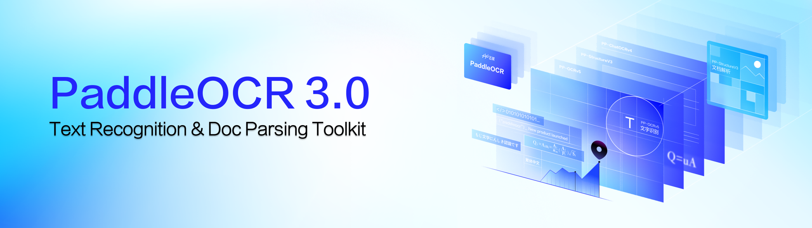

<div align="center">
  <p>
      
  </p>

<!-- language -->
[English](../README.md) | [简体中文](./README_cn.md) | [繁體中文](./README_tcn.md) | 日本語 | [한국어](./README_ko.md) | [Français](./README_fr.md) | [Русский](./README_ru.md) | [Español](./README_es.md) | [العربية](./README_ar.md)

<!-- icon -->

[](https://github.com/PaddlePaddle/PaddleOCR)
[](https://pypi.org/project/PaddleOCR/)


[](https://aistudio.baidu.com/community/app/91660/webUI)
[](https://aistudio.baidu.com/community/app/518494/webUI)
[](https://aistudio.baidu.com/community/app/518493/webUI)

</div>

## 🚀 概要
PaddleOCRは、その最先端のアルゴリズムと実世界での応用実績により、初回リリース以来、学術界、産業界、研究コミュニティから広く支持を得ています。Umi-OCR、OmniParser、MinerU、RAGFlowなどの人気オープンソースプロジェクトで既に採用されており、世界中の開発者にとって定番のOCRツールキットとなっています。

2025年5月20日、PaddlePaddleチームは**PaddlePaddle 3.0**フレームワークの公式リリースに完全対応したPaddleOCR 3.0を発表しました。このアップデートでは、**テキスト認識精度**がさらに向上し、**複数テキストタイプの認識**と**手書き文字認識**がサポートされ、大規模モデルアプリケーションからの**複雑なドキュメントの高精度解析**に対する高まる需要に応えます。**ERNIE 4.5**と組み合わせることで、キー情報抽出の精度が大幅に向上します。完全な使用方法については、[PaddleOCR 3.0 ドキュメント](https://paddlepaddle.github.io/PaddleOCR/latest/ja/index.html) をご参照ください。

PaddleOCR 3.0の3つの主要な新機能：
- 全シーン対応テキスト認識モデル [PP-OCRv5](../docs/version3.x/algorithm/PP-OCRv5/PP-OCRv5.en.md): 1つのモデルで5つの異なるテキストタイプと複雑な手書き文字を処理。全体の認識精度は前世代に比べて13パーセントポイント向上。[オンラインデモ](https://aistudio.baidu.com/community/app/91660/webUI)

- 汎用ドキュメント解析ソリューション [PP-StructureV3](../docs/version3.x/algorithm/PP-StructureV3/PP-StructureV3.en.md): 複数レイアウト、複数シーンのPDFの高精度解析を実現し、公開ベンチマークで多くのオープンソースおよびクローズドソースのソリューションを凌駕。[オンラインデモ](https://aistudio.baidu.com/community/app/518494/webUI)

- インテリジェントドキュメント理解ソリューション [PP-ChatOCRv4](../docs/version3.x/algorithm/PP-ChatOCRv4/PP-ChatOCRv4.en.md): ERNIE 4.5にネイティブで対応し、前世代よりも15パーセントポイント高い精度を達成。[オンラインデモ](https://aistudio.baidu.com/community/app/518493/webUI)

PaddleOCR 3.0は、優れたモデルライブラリを提供するだけでなく、モデルのトレーニング、推論、サービス展開をカバーする使いやすいツールも提供しており、開発者がAIアプリケーションを迅速に本番環境に導入できるよう支援します。
<div align="center">
  <p>
      
  </p>
</div>

**特別な注意**：PaddleOCR 3.x では、いくつかの重要なインターフェースの変更が導入されています。**PaddleOCR 2.x を基に作成された古いコードは、PaddleOCR 3.x では動作しない可能性があります**。ご利用中の PaddleOCR のバージョンに対応したドキュメントを参照していることを確認してください。[このドキュメント](https://paddlepaddle.github.io/PaddleOCR/latest/en/update/upgrade_notes.html) では、アップグレードの理由と PaddleOCR 2.x から 3.x への主な変更点が説明されています。

## 📣 最近のアップデート

#### **🔥🔥2025.08.21：PaddleOCR 3.2.0 をリリース**、内容は以下の通りです：


- **主要モデルのアップデート:**
    - 英語、タイ語、ギリシャ語向けPP-OCRv5認識モデルのトレーニング、推論、デプロイ機能を追加。**英語モデルは英語シナリオで従来のPP-OCRv5対比で11%の精度向上、タイ語モデルの精度は82.68%、ギリシャ語モデルは89.28%を達成。**

- **デプロイ機能の改善:**
    - **PaddlePaddle 3.1.0および3.1.1を完全サポート。**
    - **C++によるローカルデプロイソリューションを全面刷新、Linux・Windows両方に対応し、Python版と同等の機能・精度を実現。**
    - **高性能推論に向けてCUDA 12をサポート、Paddle InferenceまたはONNX Runtimeバックエンドの選択が可能。**
    - **高安定性サービス型デプロイソリューションをフルオープンソース化、ユーザー側でDockerイメージやSDKのカスタマイズが可能。**
    - 高安定性サービス型デプロイは手動でのHTTPリクエスト呼び出しもサポート、クライアントは任意言語で実装可能。

- **ベンチマークサポート:**
    - **全てのプロダクションパイプラインで詳細なベンチマーク機能を提供、エンドツーエンド推論時間やレイヤー・モジュール単位の実行時間を計測可能、性能分析に役立つ。[こちら](../docs/version3.x/pipeline_usage/instructions/benchmark.en.md)はベンチマーク機能の設定と使用方法です**
    - **ドキュメントには、主要なハードウェアプラットフォームでの代表的な設定値（推論時間、メモリ使用量等）を記載、ユーザーのデプロイ判断を支援。**

- **バグ修正:**
    - モデル学習時にログが保存されない問題を修正。
    - 数式モデルのデータ拡張部分をalbumentations新バージョンに適合、tokenizersのマルチプロセス利用時のデッドロック警告も解決。
    - PP-StructureV3の設定ファイルで`use_chart_parsing`等のフラグ挙動が他プロダクションと一致しない問題を修正。

- **その他のアップデート:**
    - **必須依存関係とオプション依存関係を分離、基本的な認識機能は最小限の依存関係で利用可能、文書解析や情報抽出等の追加機能はニーズに応じて追加インストール。**
    - **Windows環境でNVIDIA 50シリーズGPUをサポート、[インストールガイド](../docs/version3.x/installation.en.md)を参照しPaddleバージョン選択が可能。**
    - **PP-OCRシリーズモデルが各文字ごとの座標の返却に対応。**
    - モデルダウンロード元としてAIStudio・ModelScope等を追加、選択指定が可能。
    - チャートからテーブルへの変換モジュール（PP-Chart2Table）の推論もサポート。
    - 一部ドキュメントの説明を最適化し、利便性向上。


#### **2025.08.15：PaddleOCR 3.1.1 をリリース**、内容は以下の通りです：

- **バグ修正:**
  - `PP-ChatOCRv4`クラスに不足していた`save_vector`、`save_visual_info_list`、`load_vector`、`load_visual_info_list`メソッドを追加。
  - `PPDocTranslation`クラスの`translate`メソッドに不足していた`glossary`および`llm_request_interval`パラメータを追加。

- **ドキュメント最適化:**
  - MCPドキュメントにデモ例を追加。
  - 性能指標テストで使用したPaddlePaddleフレームワークとPaddleOCRバージョンを明記。
  - ドキュメント翻訳パイプラインの誤りや不足を修正。

- **その他:**
  - MCPサーバーの依存関係を変更：インストール問題を減らすために`python-magic`の代わりにpure Pythonライブラリの`puremagic`を使用。
  - PaddleOCR 3.1.0バージョンでPP-OCRv5の性能指標を再テストし、ドキュメントを更新。


#### **2025.06.29：PaddleOCR 3.1.0 をリリース**、内容は以下の通りです：

- **主なモデルとパイプライン：**
  - **PP-OCRv5 多言語テキスト認識モデルを追加**、フランス語、スペイン語、ポルトガル語、ロシア語、韓国語など 37 言語に対応。**平均精度が 30%以上向上。** [詳細](https://paddlepaddle.github.io/PaddleOCR/latest/en/version3.x/algorithm/PP-OCRv5/PP-OCRv5_multi_languages.html)
  - PP-StructureV3 の **PP-Chart2Table モデル**をアップグレードし、グラフから表への変換能力をさらに強化。社内カスタム評価セットでは、指標（RMS-F1）が **9.36 ポイント向上（71.24% → 80.60%）。**
  - PP-StructureV3 および ERNIE 4.5 に基づく**ドキュメント翻訳パイプライン PP-DocTranslation**を新たに追加。Markdown 形式ドキュメント、さまざまな複雑レイアウトの PDF ドキュメント、ドキュメント画像の翻訳に対応し、結果を Markdown 形式で保存可能。[詳細](https://paddlepaddle.github.io/PaddleOCR/latest/en/version3.x/pipeline_usage/PP-DocTranslation.html)

- **新しい MCP サーバー：**[Details](https://paddlepaddle.github.io/PaddleOCR/latest/en/version3.x/deployment/mcp_server.html)
  - **OCR と PP-StructureV3 パイプラインの両方をサポートします。**
  - ローカル Python ライブラリ、AIStudio コミュニティクラウドサービス、セルフホストサービスの3つの動作モードをサポートします。
  - stdio を介してローカルサービスを呼び出し、Streamable HTTP を介してリモートサービスを呼び出すことができます。

- **ドキュメント最適化：** 一部のユーザーガイドの説明を改善し、よりスムーズな読書体験を提供。


<details>
    <summary><strong>更新履歴</strong></summary>

#### 🔥🔥**2025.06.26: PaddleOCR 3.0.3のリリース、以下の内容を含みます：**

- バグ修正：`enable_mkldnn`パラメータが機能しない問題を修正し、CPUがデフォルトでMKL-DNN推論を使用する動作を復元しました。

#### 🔥🔥**2025.06.19: PaddleOCR 3.0.2のリリース、以下の内容を含みます：**

- **新機能：**
  - デフォルトのダウンロード元が`BOS`から`HuggingFace`に変更されました。ユーザーは環境変数 `PADDLE_PDX_MODEL_SOURCE` を `BOS` に変更することで、モデルのダウンロード元をBaidu Object Storage (BOS)に戻すこともできます。
  - PP-OCRv5、PP-StructureV3、PP-ChatOCRv4などのパイプラインに、C++、Java、Go、C#、Node.js、PHPの6言語のサービス呼び出し例を追加しました。
  - PP-StructureV3パイプラインのレイアウト分割ソートアルゴリズムを改善し、複雑な縦書きレイアウトのソートロジックを強化して、より良い結果を提供します。
  - モデル選択ロジックを強化：言語が指定されているがモデルのバージョンが指定されていない場合、システムはその言語をサポートする最新のモデルバージョンを自動的に選択します。
  - MKL-DNNキャッシュサイズにデフォルトの上限を設定し、無制限の増加を防ぎます。同時に、ユーザーがキャッシュ容量を設定することも可能です。
  - 高性能推論のデフォルト設定を更新し、Paddle MKL-DNNアクセラレーションをサポートし、よりスマートな選択のための自動設定選択ロジックを最適化しました。
  - インストールされているPaddleフレームワークによる計算デバイスの実際のサポートを考慮するようにデフォルトデバイスの取得ロジックを調整し、プログラムの動作をより直感的にしました。
  - PP-OCRv5のAndroidサンプルを追加しました。[詳細](https://paddlepaddle.github.io/PaddleOCR/latest/en/version3.x/deployment/on_device_deployment.html)。
- **バグ修正：**
  - PP-StructureV3の一部のCLIパラメータが有効にならない問題を修正しました。
  - 特定のケースで`export_paddlex_config_to_yaml`が正しく機能しない問題を解決しました。
  - `save_path`の実際の動作とそのドキュメントの記述との間の不一致を修正しました。
  - 基本的なサービス展開でMKL-DNNを使用する際の潜在的なマルチスレッドエラーを修正しました。
  - Latex-OCRモデルの画像前処理におけるチャネル順序のエラーを修正しました。
  - テキスト認識モジュールで可視化画像を保存する際のチャネル順序のエラーを修正しました。
  - PP-StructureV3パイプラインで可視化されたテーブル結果のチャネル順序のエラーを解決しました。
  - PP-StructureV3パイプラインで非常に特殊な状況下で`overlap_ratio`を計算する際のオーバーフロー問題を修正しました。
- **ドキュメントの改善：**
  - ドキュメント内の`enable_mkldnn`パラメータの説明を更新し、プログラムの実際の動作を正確に反映するようにしました。
  - `lang`および`ocr_version`パラメータに関するドキュメントのエラーを修正しました。
  - CLIを介してプロダクションライン設定ファイルをエクスポートする手順を追加しました。
  - PP-OCRv5のパフォーマンスデータテーブルで欠落していた列を修正しました。
  - さまざまな構成におけるPP-StructureV3のベンチマーク指標を洗練しました。
- **その他：**
  - numpyやpandasなどの依存関係のバージョン制限を緩和し、Python 3.12のサポートを復元しました。

#### **🔥🔥 2025.06.05: PaddleOCR 3.0.1のリリース、以下の内容を含みます：**

- **一部のモデルとモデル設定の最適化：**
  - PP-OCRv5のデフォルトモデル設定を更新し、検出と認識の両方をmobileモデルからserverモデルに変更しました。ほとんどのシーンでのデフォルト性能を向上させるため、設定の`limit_side_len`パラメータを736から64に変更しました。
  - 新しいテキスト行方向分類モデル`PP-LCNet_x1_0_textline_ori`（精度99.42%）を追加しました。OCR、PP-StructureV3、およびPP-ChatOCRv4パイプラインのデフォルトのテキスト行方向分類器がこのモデルに更新されました。
  - テキスト行方向分類モデル`PP-LCNet_x0_25_textline_ori`を最適化し、精度が3.3パーセントポイント向上し、現在の精度は98.85%です。

- **バージョン3.0.0の一部の問題の最適化と修正、[詳細](https://paddlepaddle.github.io/PaddleOCR/latest/ja/update/update.html)**

🔥🔥2025.05.20: **PaddleOCR v3.0**の公式リリース、以下の内容を含みます：
- **PP-OCRv5**: あらゆるシーンに対応する高精度テキスト認識モデル - 画像/PDFから瞬時にテキストを抽出。
   1. 🌐 単一モデルで**5つ**のテキストタイプをサポート - **簡体字中国語、繁体字中国語、簡体字中国語ピンイン、英語**、**日本語**をシームレスに処理。
   2. ✍️ **手書き文字認識**の向上：複雑な草書体や非標準的な手書き文字の認識性能が大幅に向上。
   3. 🎯 PP-OCRv4に比べて**13ポイントの精度向上**を達成し、さまざまな実世界のシナリオで最先端の性能を実現。

- **PP-StructureV3**: 汎用ドキュメント解析 – 実世界のシナリオで最先端の画像/PDF解析を解放！
   1. 🧮 **高精度な複数シーンPDF解析**により、OmniDocBenchベンチマークでオープンソースおよびクローズドソースのソリューションをリード。
   2. 🧠 **印鑑認識**、**グラフからテーブルへの変換**、**ネストされた数式/画像を含むテーブル認識**、**縦書きテキスト文書の解析**、**複雑なテーブル構造分析**などの専門機能。

- **PP-ChatOCRv4**: インテリジェントなドキュメント理解 – 画像/PDFからテキストだけでなく、キー情報を抽出。
   1. 🔥 PDF/PNG/JPGファイルからのキー情報抽出において、前世代に比べて**15ポイントの精度向上**。
   2. 💻 **ERNIE 4.5**をネイティブサポートし、PaddleNLP、Ollama、vLLMなどを介した大規模モデルのデプロイメントとの互換性あり。
   3. 🤝 [PP-DocBee2](https://github.com/PaddlePaddle/PaddleMIX/tree/develop/paddlemix/examples/ppdocbee2) と統合し、印刷テキスト、手書き文字、印鑑、テーブル、グラフなど、複雑な文書内の一般的な要素の抽出と理解をサポート。

[更新履歴](https://paddlepaddle.github.io/PaddleOCR/latest/ja/update/update.html)

</details>

## ⚡ クイックスタート
### 1. オンラインデモの実行
[](https://aistudio.baidu.com/community/app/91660/webUI)
[](https://aistudio.baidu.com/community/app/518494/webUI)
[](https://aistudio.baidu.com/community/app/518493/webUI)

### 2. インストール

[インストールガイド](https://www.paddlepaddle.org.cn/en/install/quick?docurl=/documentation/docs/en/develop/install/pip/linux-pip_en.html) を参照してPaddlePaddleをインストールした後、PaddleOCRツールキットをインストールします。

```bash
# もし基本的なテキスト認識機能（テキストの座標と内容を返す）のみを利用したい場合（PP-OCRシリーズを含む）
python -m pip install paddleocr
# ドキュメント解析、ドキュメント理解、ドキュメント翻訳、キーワード抽出など、すべての機能を利用したい場合
# python -m pip install "paddleocr[all]"
```

バージョン3.2.0以降、上記の `all` 依存グループ以外にも、PaddleOCRは他の依存グループを指定することで一部のオプション機能のインストールもサポートしています。PaddleOCRが提供するすべての依存グループは以下の通りです：

| 依存グループ名 | 対応する機能 |
| - | - |
| `doc-parser` | ドキュメント解析：ドキュメントから表、数式、スタンプ、画像などのレイアウト要素を抽出できます。PP-StructureV3などのモデルが含まれます。 |
| `ie` | 情報抽出：ドキュメントから名前、日付、住所、金額などの主要情報を抽出できます。PP-ChatOCRv4などのモデルが含まれます。 |
| `trans` | ドキュメント翻訳：ドキュメントを他の言語に翻訳できます。PP-DocTranslationなどのモデルが含まれます。 |
| `all` | 全機能 |

### 3. CLIによる推論の実行
```bash
# PP-OCRv5の推論を実行
paddleocr ocr -i https://paddle-model-ecology.bj.bcebos.com/paddlex/imgs/demo_image/general_ocr_002.png --use_doc_orientation_classify False --use_doc_unwarping False --use_textline_orientation False  

# PP-StructureV3の推論を実行
paddleocr pp_structurev3 -i https://paddle-model-ecology.bj.bcebos.com/paddlex/imgs/demo_image/pp_structure_v3_demo.png --use_doc_orientation_classify False --use_doc_unwarping False

# 最初にQianfan APIキーを取得し、その後PP-ChatOCRv4の推論を実行
paddleocr pp_chatocrv4_doc -i https://paddle-model-ecology.bj.bcebos.com/paddlex/imgs/demo_image/vehicle_certificate-1.png -k 驾驶室准乘人数 --qianfan_api_key your_api_key --use_doc_orientation_classify False --use_doc_unwarping False 

# "paddleocr ocr" の詳細情報を取得
paddleocr ocr --help
```

### 4. APIによる推論の実行
**4.1 PP-OCRv5の例**
```python
# PaddleOCRインスタンスの初期化
from paddleocr import PaddleOCR
ocr = PaddleOCR(
    use_doc_orientation_classify=False,
    use_doc_unwarping=False,
    use_textline_orientation=False)

# サンプル画像でOCR推論を実行
result = ocr.predict(
    input="https://paddle-model-ecology.bj.bcebos.com/paddlex/imgs/demo_image/general_ocr_002.png")

# 結果を可視化し、JSON形式で保存
for res in result:
    res.print()
    res.save_to_img("output")
    res.save_to_json("output")
```

<details>
    <summary><strong>4.2 PP-StructureV3の例</strong></summary>

```python
from pathlib import Path
from paddleocr import PPStructureV3

pipeline = PPStructureV3(
    use_doc_orientation_classify=False,
    use_doc_unwarping=False
)

# 画像の場合
output = pipeline.predict(
    input="https://paddle-model-ecology.bj.bcebos.com/paddlex/imgs/demo_image/pp_structure_v3_demo.png",
)

# 結果を可視化し、JSON形式で保存
for res in output:
    res.print() 
    res.save_to_json(save_path="output") 
    res.save_to_markdown(save_path="output")           
```

</details>

<details>
   <summary><strong>4.3 PP-ChatOCRv4の例</strong></summary>

```python
from paddleocr import PPChatOCRv4Doc

chat_bot_config = {
    "module_name": "chat_bot",
    "model_name": "ernie-3.5-8k",
    "base_url": "https://qianfan.baidubce.com/v2",
    "api_type": "openai",
    "api_key": "api_key",  # your api_key
}

retriever_config = {
    "module_name": "retriever",
    "model_name": "embedding-v1",
    "base_url": "https://qianfan.baidubce.com/v2",
    "api_type": "qianfan",
    "api_key": "api_key",  # your api_key
}

pipeline = PPChatOCRv4Doc(
    use_doc_orientation_classify=False,
    use_doc_unwarping=False
)

visual_predict_res = pipeline.visual_predict(
    input="https://paddle-model-ecology.bj.bcebos.com/paddlex/imgs/demo_image/vehicle_certificate-1.png",
    use_common_ocr=True,
    use_seal_recognition=True,
    use_table_recognition=True,
)

mllm_predict_info = None
use_mllm = False
# マルチモーダル大規模モデルを使用する場合、ローカルmllmサービスを起動する必要があります。ドキュメント：https://github.com/PaddlePaddle/PaddleX/blob/release/3.0/docs/pipeline_usage/tutorials/vlm_pipelines/doc_understanding.en.md を参照してデプロイを行い、mllm_chat_bot_config設定を更新してください。
if use_mllm:
    mllm_chat_bot_config = {
        "module_name": "chat_bot",
        "model_name": "PP-DocBee",
        "base_url": "http://127.0.0.1:8080/",  # your local mllm service url
        "api_type": "openai",
        "api_key": "api_key",  # your api_key
    }

    mllm_predict_res = pipeline.mllm_pred(
        input="https://paddle-model-ecology.bj.bcebos.com/paddlex/imgs/demo_image/vehicle_certificate-1.png",
        key_list=["驾驶室准乘人数"],
        mllm_chat_bot_config=mllm_chat_bot_config,
    )
    mllm_predict_info = mllm_predict_res["mllm_res"]

visual_info_list = []
for res in visual_predict_res:
    visual_info_list.append(res["visual_info"])
    layout_parsing_result = res["layout_parsing_result"]

vector_info = pipeline.build_vector(
    visual_info_list, flag_save_bytes_vector=True, retriever_config=retriever_config
)
chat_result = pipeline.chat(
    key_list=["驾驶室准乘人数"],
    visual_info=visual_info_list,
    vector_info=vector_info,
    mllm_predict_info=mllm_predict_info,
    chat_bot_config=chat_bot_config,
    retriever_config=retriever_config,
)
print(chat_result)
```

</details>

## 🧩 その他の機能

- モデルをONNX形式に変換：[ONNXモデルの取得](https://paddlepaddle.github.io/PaddleOCR/latest/en/version3.x/deployment/obtaining_onnx_models.html)
- OpenVINO、ONNX Runtime、TensorRTなどのエンジンを使用して推論を高速化、またはONNX形式モデルで推論を実行：[高性能推論](https://paddlepaddle.github.io/PaddleOCR/latest/en/version3.x/deployment/high_performance_inference.html)
- 複数GPUおよび複数プロセスを使用して推論を高速化：[パイプラインの並列推論](https://paddlepaddle.github.io/PaddleOCR/latest/en/version3.x/pipeline_usage/instructions/parallel_inference.html)
- C++、C#、Java などで書かれたアプリケーションに PaddleOCR を統合する: [サービング](https://paddlepaddle.github.io/PaddleOCR/latest/en/version3.x/deployment/serving.html)。

## ⛰️ 上級チュートリアル
- [PP-OCRv5 チュートリアル](https://paddlepaddle.github.io/PaddleOCR/latest/version3.x/pipeline_usage/OCR.html)
- [PP-StructureV3 チュートリアル](https://paddlepaddle.github.io/PaddleOCR/latest/version3.x/pipeline_usage/PP-StructureV3.html)
- [PP-ChatOCRv4 チュートリアル](https://paddlepaddle.github.io/PaddleOCR/latest/version3.x/pipeline_usage/PP-ChatOCRv4.html)

## 🔄 実行結果のクイックレビュー

<div align="center">
  <p>
     
  </p>
</div>

<div align="center">
  <p>
     
  </p>
</div>

## 🌟 最新情報をお見逃しなく

⭐ **このリポジトリにスターを付けて、強力なOCRやドキュメント解析機能を含む、エキサイティングなアップデートや新リリースに注目しましょう！** ⭐

<div align="center">
  <p>
       
  </p>
</div>

## 👩‍👩‍👧‍👦 コミュニティ

| PaddlePaddle WeChat公式アカウント |  技術ディスカッショングループへの参加 |
| :---: | :---: |
|  |  |


## 😃 PaddleOCRを活用した素晴らしいプロジェクト
PaddleOCRは、その素晴らしいコミュニティなしでは今日の姿にはなりえませんでした！💗長年のパートナー、新しい協力者、そしてPaddleOCRに情熱を注いでくださったすべての方々に心から感謝申し上げます。皆様のサポートが私たちの原動力です！

| プロジェクト名 | 概要 |
| ------------ | ----------- |
| [RAGFlow](https://github.com/infiniflow/ragflow) <a href="https://github.com/infiniflow/ragflow"></a>|詳細なドキュメント理解に基づくRAGエンジン。|
| [MinerU](https://github.com/opendatalab/MinerU) <a href="https://github.com/opendatalab/MinerU"></a>|複数タイプのドキュメントからMarkdownへの変換ツール|
| [Umi-OCR](https://github.com/hiroi-sora/Umi-OCR) <a href="https://github.com/hiroi-sora/Umi-OCR"></a>|無料、オープンソースのバッチオフラインOCRソフトウェア。|
| [OmniParser](https://github.com/microsoft/OmniParser)<a href="https://github.com/microsoft/OmniParser"></a> |OmniParser: 純粋なビジョンベースのGUIエージェントのための画面解析ツール。|
| [QAnything](https://github.com/netease-youdao/QAnything)<a href="https://github.com/netease-youdao/QAnything"></a> |あらゆるものに基づいた質疑応答。|
| [PDF-Extract-Kit](https://github.com/opendatalab/PDF-Extract-Kit) <a href="https://github.com/opendatalab/PDF-Extract-Kit"></a>|複雑で多様なPDFドキュメントから高品質なコンテンツを効率的に抽出するために設計された強力なオープンソースツールキット。|
| [Dango-Translator](https://github.com/PantsuDango/Dango-Translator)<a href="https://github.com/PantsuDango/Dango-Translator"></a> |画面上のテキストを認識し、翻訳して、リアルタイムで翻訳結果を表示します。|
| [他のプロジェクトを見る](../awesome_projects.md) | [PaddleOCRをベースにした他のプロジェクト](../awesome_projects.md)|

## 👩‍👩‍👧‍👦 貢献者

<a href="https://github.com/PaddlePaddle/PaddleOCR/graphs/contributors">
  
</a>


## 🌟 Star

[](https://star-history.com/#PaddlePaddle/PaddleOCR&Date)


## 📄 ライセンス
このプロジェクトは[Apache 2.0 license](LICENSE)の下で公開されています。

## 🎓 引用

```
@misc{paddleocr2020,
title={PaddleOCR, Awesome multilingual OCR toolkits based on PaddlePaddle.},
author={PaddlePaddle Authors},
howpublished = {\url{https://github.com/PaddlePaddle/PaddleOCR}},
year={2020}
}
```
