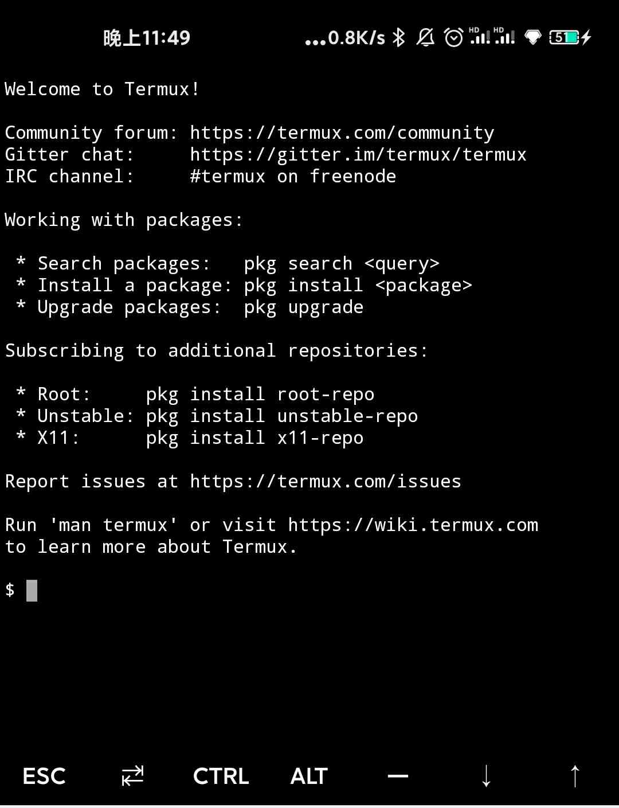

# 安卓手机通过Termux连接电脑

由于通过adb方式连接手机后，很多linux命令无法运行，自动化测试受阻，所以此处特此介绍另外一种通过Termux的连接方式，不仅可以运行大部分linux命令，方便开发者在手机上在线调试，甚至还可以多实现台机器同时连接手机。Termux不是真实的Linux环境，但是Termux可以安装真实的Linux，而且不会损失性能，与此同时，Termux不需要root。在配置Termux之前，请确保电脑已经安装adb工具，安装方式请参考[Lite端部署](https://github.com/PaddlePaddle/PaddleOCR/blob/develop/deploy/lite/readme.md) 。在运行以下命令后确保可以显示安卓设备信息。

```
adb devices
```
连接成功信息提示：
```
List of devices attached
744be294    device
```

## 1.安卓手机安装termux app

### 1.1 下载termux apk文件

由于目前该app目前各大商城暂无，所以可以直接下载如下apk文件。

打开电脑终端，执行以下命令：

```
wget http://10.12.121.133:8911/cuicheng01/fullchain/termux-v1.0.3.apk
```

### 1.2 安装termux到手机上

在手机端的开发者模式下，允许USB调试，允许USB安装。在电脑终端，执行如下命令，将termux app安装到手机上：

```
adb install termux-v1.0.3.apk
```

此处需要手机端确认安装，点击确认。

### 1.3 验证是否安装成功

打开手机，检验termux是否安装成功，如果没有，重新执行1.2，如果有相应的app，点击进入，会有如下显示。



接下来的配置环境需要在手机上此终端运行相关命令。

## 2.手机端配置termux

首先将手机联网，最好可以连接外网，部分的配置需要外网。打开Termux终端，执行以下命令安装基础件`proot`，并使用`termux-chroot`命令可以模拟 root 环境与标准的 Linux 目录结构。

```
pkg i -y proot
termux-chroot
```

Termux 默认只能访问自身内部的数据，如果要访问手机中其它的数据，输入下面的命令后，手机弹出对请求权限的窗口，允许即可（方便对部分运行出的结果在手机端可视化）。

```
termux-setup-storage
```

### 2.1 配置SSH

作为 Linux 终端或者服务器，必须有SSH。不管你是 SSH 连接到 Termux还是使用Termux去连其它主机，都需要先安装openssh。如果安装失败，请重复执行命令。

```
pkg i -y openssh
```

启动 SSH 服务端，默认端口号为8022

```
sshd
```


### 2.2 电脑通过SSH方式连接手机

1.保证手机和电脑处于同一局域网下
手机端分别输入以下命令获得ip地址和当前用户：

```
# 获取ip地址
ifconfig

# 获取当前用户
whoami
```

如获取到的ip地址和当前用户分别是`172.24.162.117`和`u0_a374`。

2.电脑端通过SSH连接手机

```
#默认端口号为8022
ssh u0_a374@172.24.162.117 -p 8022
```

3.运行ls命令后，会有如下显示：

```
ls
```


### 2.3 通过scp传输数据

1.在当前目录上新建test目录

```
mkdir test
```

2.测试scp功能

将电脑中的某个文件拷贝到手机上：
```
scp -P 8022 test.txt u0_a374@172.24.162.117:/home/storage/test
```

3.手机端查看

打开手机终端，在`/home/storage/test`下查看是否存在`test.txt`


## 3. 更多教程

本教程可以完成Termux基本配置，更多关于Termux的用法，请参考：[Termux高级终端安装使用配置教程](https://www.sqlsec.com/2018/05/termux.html)。

