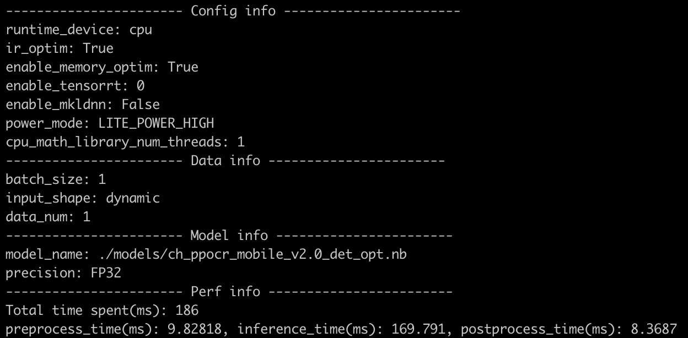

# Lite预测功能测试

Lite预测功能测试的主程序为`test_lite.sh`，可以测试基于Lite预测库的模型推理功能。

## 1. 测试结论汇总

目前Lite端的样本间支持以下四种方式的组合，共16个链条：

| 模型类型 | 样本数量 | 功耗模式 | cpu多线程 |
|  ----   |   ----   |  :----:  |  :----:  |
| 正常模型 | 单样本/多样本 | LITE_POWER_HIGH/LITE_POWER_LOW | 支持 |
| 正常模型 | 单样本/多样本 | LITE_POWER_HIGH/LITE_POWER_LOW | 支持 |
| 量化模型 | 单样本/多样本 | LITE_POWER_HIGH/LITE_POWER_LOW | 支持 |
| 量化模型 | 单样本/多样本 | LITE_POWER_HIGH/LITE_POWER_LOW | 支持 |

## 2. 测试流程

### 2.1 功能测试

先运行`prepare.sh`准备数据和模型，模型和数据会打包到test_lite.tar中，将test_lite.tar上传到手机上，然后运行`test_lite.sh`进行测试，最终在`test_lite/output`目录下生成`lite_*.log`后缀的日志文件。

```shell

# 数据和模型准备
bash test_tipc/prepare.sh ./test_tipc/configs/ppocr_det_mobile_params.txt "lite_infer"

# 手机端测试:
bash test_lite.sh ppocr_det_mobile_params.txt

```  

**注意**：数据上传到手机的方式有两种，一种是通过adb的方式通过数据线连接，可以参考[Lite端部署文档](https://github.com/PaddlePaddle/PaddleOCR/blob/develop/deploy/lite/readme.md)。另外一种是通过在手机上开启虚拟终端在局域网内通过ssh的方式连接，无需数据线，第二种方式可以在手机上支持大部分linux命令，如vim、bash等，比较推荐，可以参考[安卓手机termux连接电脑](./termux_for_android.md)。

#### 运行结果

各测试的运行情况会打印在 `./output/` 中：
运行成功时会输出：

```
Run successfully with command - ./ocr_db_crnn det ./models/ch_ppocr_mobile_v2.0_det_slim_opt.nb INT8 4 1 LITE_POWER_LOW ./test_data/icdar2015_lite/text_localization/ch4_test_images/img_233.jpg ./config.txt True > ./output/lite_ch_ppocr_mobile_v2.0_det_slim_opt.nb_precision_INT8_batchsize_1_threads_4_powermode_LITE_POWER_LOW_singleimg_True.log 2>&1!
Run successfully with command xxx
...
```

运行失败时会输出：

```
Run failed with command - ./ocr_db_crnn det ./models/ch_ppocr_mobile_v2.0_det_slim_opt.nb INT8 4 1 LITE_POWER_LOW ./test_data/icdar2015_lite/text_localization/ch4_test_images/img_233.jpg ./config.txt True > ./output/lite_ch_ppocr_mobile_v2.0_det_slim_opt.nb_precision_INT8_batchsize_1_threads_4_powermode_LITE_POWER_LOW_singleimg_True.log 2>&1!
Run failed with command xxx
...
```

在./output/文件夹下，会存在如下日志，每一个日志都是不同配置下的log结果：


在每一个log中，都会调用autolog打印如下信息：




## 3. 更多教程

本文档为功能测试用，更详细的Lite端预测使用教程请参考：[Lite端部署](https://github.com/PaddlePaddle/PaddleOCR/blob/develop/deploy/lite/readme.md)。
