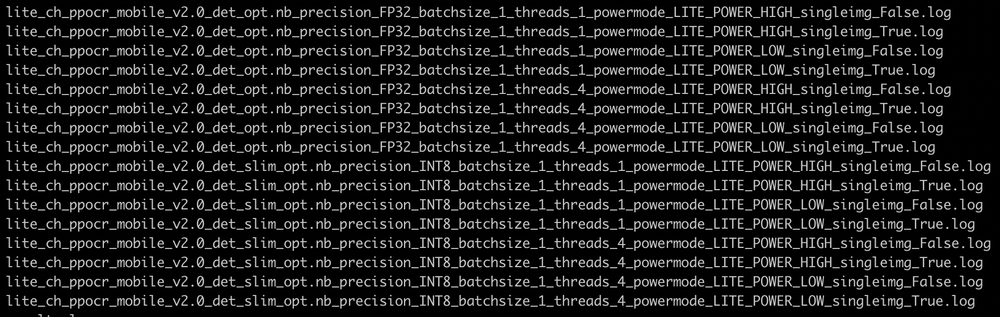

# Lite预测功能测试

Lite预测功能测试的主程序为`test_lite.sh`，可以测试基于Lite预测库的模型推理功能。

## 1. 测试结论汇总

目前Lite端的样本间支持以方式的组合：

**字段说明：**
- 输入设置：包括C++预测、python预测、java预测
- 模型类型：包括正常模型（FP32）和量化模型（FP16）
- batch-size：包括1和4
- predictor数量：包括多predictor预测和单predictor预测
- 功耗模式：包括高性能模式（LITE_POWER_HIGH）和省电模式（LITE_POWER_LOW）
- 预测库来源：包括下载方式和编译方式，其中编译方式分为以下目标硬件：(1)ARM CPU;(2)Linux XPU;(3)OpenCL GPU;(4)Metal GPU

| 模型类型 | batch-size | predictor数量 | 功耗模式 | 预测库来源 | 支持语言 |
|  :----:   |  :----:   |  :----:  |  :----:  |  :----:  |  :----:  |
| 正常模型/量化模型 | 1 | 1 | 高性能模式/省电模式 | 下载方式 | C++预测 |


## 2. 测试流程
运行环境配置请参考[文档](./install.md)的内容配置TIPC的运行环境。

### 2.1 功能测试

先运行`prepare.sh`准备数据和模型，模型和数据会打包到test_lite.tar中，将test_lite.tar上传到手机上，解压后进`入test_lite`目录中，然后运行`test_lite.sh`进行测试，最终在`test_lite/output`目录下生成`lite_*.log`后缀的日志文件。

```shell

# 数据和模型准备
bash test_tipc/prepare.sh ./test_tipc/configs/ppocr_det_mobile_params.txt "lite_infer"

# 手机端测试:
bash test_lite.sh ppocr_det_mobile_params.txt

```  

**注意**：由于运行该项目需要bash等命令，传统的adb方式不能很好的安装。所以此处推荐通在手机上开启虚拟终端的方式连接电脑，连接方式可以参考[安卓手机termux连接电脑](./termux_for_android.md)。

#### 运行结果

各测试的运行情况会打印在 `./output/` 中：
运行成功时会输出：

```
Run successfully with command - ./ocr_db_crnn det ./models/ch_ppocr_mobile_v2.0_det_slim_opt.nb INT8 4 1 LITE_POWER_LOW ./test_data/icdar2015_lite/text_localization/ch4_test_images/img_233.jpg ./config.txt True > ./output/lite_ch_ppocr_mobile_v2.0_det_slim_opt.nb_precision_INT8_batchsize_1_threads_4_powermode_LITE_POWER_LOW_singleimg_True.log 2>&1!
Run successfully with command xxx
...
```

运行失败时会输出：

```
Run failed with command - ./ocr_db_crnn det ./models/ch_ppocr_mobile_v2.0_det_slim_opt.nb INT8 4 1 LITE_POWER_LOW ./test_data/icdar2015_lite/text_localization/ch4_test_images/img_233.jpg ./config.txt True > ./output/lite_ch_ppocr_mobile_v2.0_det_slim_opt.nb_precision_INT8_batchsize_1_threads_4_powermode_LITE_POWER_LOW_singleimg_True.log 2>&1!
Run failed with command xxx
...
```

在./output/文件夹下，会存在如下日志，每一个日志都是不同配置下的log结果：



在每一个log中，都会调用autolog打印如下信息：


## 3. 更多教程

本文档为功能测试用，更详细的Lite端预测使用教程请参考：[Lite端部署](https://github.com/PaddlePaddle/PaddleOCR/blob/develop/deploy/lite/readme.md)。
