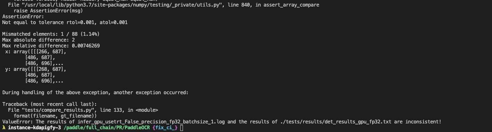

# Linux端基础训练预测功能测试

Linux端基础训练预测功能测试的主程序为`test_train_inference_python.sh`，可以测试基于Python的模型训练、评估、推理等基本功能，包括PACT在线量化。

- Mac端基础训练预测功能测试参考[链接](./mac_test_train_inference_python.md)
- Windows端基础训练预测功能测试参考[链接](./win_test_train_inference_python.md)

## 1. 测试结论汇总

- 训练相关：

| 算法名称 | 模型名称 | 单机单卡 | 单机多卡 | 多机多卡 | 模型压缩（单机多卡） |
|  :----  |   :----  |    :----  |  :----   |  :----   |  :----   |
|  DB  | ch_ppocr_mobile_v2_0_det| 正常训练 <br> 混合精度 | 正常训练 <br> 混合精度 | 正常训练 <br> 混合精度 | 正常训练：FPGM裁剪、PACT量化 |
|  DB  | ch_ppocr_server_v2_0_det| 正常训练 <br> 混合精度 | 正常训练 <br> 混合精度 | 正常训练 <br> 混合精度 | 正常训练：FPGM裁剪、PACT量化 |
| CRNN | ch_ppocr_mobile_v2_0_rec| 正常训练 <br> 混合精度 | 正常训练 <br> 混合精度 | 正常训练 <br> 混合精度 | 正常训练：PACT量化 |
| CRNN | ch_ppocr_server_v2_0_rec| 正常训练 <br> 混合精度 | 正常训练 <br> 混合精度 | 正常训练 <br> 混合精度 | 正常训练：PACT量化 |
|PP-OCR| ch_ppocr_mobile_v2_0| 正常训练 <br> 混合精度 | 正常训练 <br> 混合精度 | 正常训练 <br> 混合精度 | - |
|PP-OCR| ch_ppocr_server_v2_0| 正常训练 <br> 混合精度 | 正常训练 <br> 混合精度 | 正常训练 <br> 混合精度 | - |
|PP-OCRv2| ch_PP-OCRv2 | 正常训练 <br> 混合精度 | 正常训练 <br> 混合精度 | 正常训练 <br> 混合精度 | - |
|PP-OCRv3| ch_PP-OCRv3 | 正常训练 <br> 混合精度 | 正常训练 <br> 混合精度 | 正常训练 <br> 混合精度 | - |


- 预测相关：基于训练是否使用量化，可以将训练产出的模型可以分为`正常模型`和`量化模型`，这两类模型对应的预测功能汇总如下，

| 模型类型 |device | batchsize | tensorrt | mkldnn | cpu多线程 |
|  ----   |  ---- |   ----   |  :----:  |   :----:   |  :----:  |
| 正常模型 | GPU | 1/6 | fp32/fp16 | - | - |
| 正常模型 | CPU | 1/6 | - | fp32/fp16 | 支持 |
| 量化模型 | GPU | 1/6 | int8 | - | - |
| 量化模型 | CPU | 1/6 | - | int8 | 支持 |


## 2. 测试流程

运行环境配置请参考[文档](./install.md)的内容配置TIPC的运行环境。

### 2.1 安装依赖
- 安装PaddlePaddle >= 2.3
- 安装PaddleOCR依赖
    ```
    pip3 install  -r ../requirements.txt
    ```
- 安装autolog（规范化日志输出工具）
    ```
    pip3 install https://paddleocr.bj.bcebos.com/libs/auto_log-1.2.0-py3-none-any.whl
    ```
- 安装PaddleSlim (可选)
   ```
   # 如果要测试量化、裁剪等功能，需要安装PaddleSlim
   pip3 install paddleslim
   ```


### 2.2 功能测试
#### 2.2.1 基础训练推理链条
先运行`prepare.sh`准备数据和模型，然后运行`test_train_inference_python.sh`进行测试，最终在```test_tipc/output```目录下生成`,model_name/lite_train_lite_infer/*.log`格式的日志文件。


`test_train_inference_python.sh`包含基础链条的4种运行模式，每种模式的运行数据不同，分别用于测试速度和精度，分别是：

- 模式1：lite_train_lite_infer，使用少量数据训练，用于快速验证训练到预测的走通流程，不验证精度和速度；
```shell
bash test_tipc/prepare.sh ./test_tipc/configs/ch_ppocr_mobile_v2_0_det/train_infer_python.txt 'lite_train_lite_infer'
bash test_tipc/test_train_inference_python.sh ./test_tipc/configs/ch_ppocr_mobile_v2_0_det/train_infer_python.txt 'lite_train_lite_infer'
```

- 模式2：lite_train_whole_infer，使用少量数据训练，一定量数据预测，用于验证训练后的模型执行预测，预测速度是否合理；
```shell
bash test_tipc/prepare.sh ./test_tipc/configs/ch_ppocr_mobile_v2_0_det/train_infer_python.txt  'lite_train_whole_infer'
bash test_tipc/test_train_inference_python.sh ../test_tipc/configs/ch_ppocr_mobile_v2_0_det/train_infer_python.txt 'lite_train_whole_infer'
```

- 模式3：whole_infer，不训练，全量数据预测，走通开源模型评估、动转静，检查inference model预测时间和精度;
```shell
bash test_tipc/prepare.sh ./test_tipc/configs/ch_ppocr_mobile_v2_0_det/train_infer_python.txt 'whole_infer'
# 用法1:
bash test_tipc/test_train_inference_python.sh ../test_tipc/configs/ch_ppocr_mobile_v2_0_det/train_infer_python.txt 'whole_infer'
# 用法2: 指定GPU卡预测，第三个传入参数为GPU卡号
bash test_tipc/test_train_inference_python.sh ./test_tipc/configs/ch_ppocr_mobile_v2_0_det/train_infer_python.txt 'whole_infer' '1'
```

- 模式4：whole_train_whole_infer，CE： 全量数据训练，全量数据预测，验证模型训练精度，预测精度，预测速度；
```shell
bash test_tipc/prepare.sh ./test_tipc/configs/ch_ppocr_mobile_v2_0_det/train_infer_python.txt 'whole_train_whole_infer'
bash test_tipc/test_train_inference_python.sh ./test_tipc/configs/ch_ppocr_mobile_v2_0_det/train_infer_python.txt 'whole_train_whole_infer'
```

运行相应指令后，在`test_tipc/output`文件夹下自动会保存运行日志。如'lite_train_lite_infer'模式下，会运行训练+inference的链条，因此，在`test_tipc/output`文件夹有以下文件：
```
test_tipc/output/model_name/lite_train_lite_infer/
|- results_python.log    # 运行指令状态的日志
|- norm_train_gpus_0_autocast_null/  # GPU 0号卡上正常单机单卡训练的训练日志和模型保存文件夹
|- norm_train_gpus_0,1_autocast_null/  # GPU 0,1号卡上正常单机多卡训练的训练日志和模型保存文件夹
......
|- python_infer_cpu_usemkldnn_False_threads_6_precision_fp32_batchsize_1.log  # CPU上关闭Mkldnn线程数设置为6，测试batch_size=1条件下的fp32精度预测运行日志
|- python_infer_gpu_usetrt_False_precision_fp32_batchsize_1.log # GPU上关闭TensorRT，测试batch_size=1的fp32精度预测日志
......
```

其中`results_python.log`中包含了每条指令的运行状态，如果运行成功会输出：
```
[33m Run successfully with command - ch_ppocr_mobile_v2_0_det - python3.7 tools/train.py -c configs/det/ch_ppocr_v2_0/ch_det_mv3_db_v2_0.yml -o Global.pretrained_model=./pretrain_models/MobileNetV3_large_x0_5_pretrained Global.use_gpu=True  Global.save_model_dir=./test_tipc/output/ch_ppocr_mobile_v2_0_det/lite_train_lite_infer/norm_train_gpus_0_autocast_null Global.epoch_num=100     Train.loader.batch_size_per_card=2     !  
 Run successfully with command - ch_ppocr_mobile_v2_0_det - python3.7 tools/export_model.py -c configs/det/ch_ppocr_v2_0/ch_det_mv3_db_v2_0.yml -o  Global.checkpoints=./test_tipc/output/ch_ppocr_mobile_v2_0_det/lite_train_lite_infer/norm_train_gpus_0_autocast_null/latest Global.save_inference_dir=./test_tipc/output/ch_ppocr_mobile_v2_0_det/lite_train_lite_infer/norm_train_gpus_0_autocast_null > ./test_tipc/output/ch_ppocr_mobile_v2_0_det/lite_train_lite_infer/norm_train_gpus_0_autocast_null_nodes_1_export.log 2>&1 !  
 Run successfully with command - ch_ppocr_mobile_v2_0_det - python3.7 tools/infer/predict_det.py --use_gpu=True --use_tensorrt=False --precision=fp32 --det_model_dir=./test_tipc/output/ch_ppocr_mobile_v2_0_det/lite_train_lite_infer/norm_train_gpus_0_autocast_null --rec_batch_num=1 --image_dir=./train_data/icdar2015/text_localization/ch4_test_images/ --benchmark=True     > ./test_tipc/output/ch_ppocr_mobile_v2_0_det/lite_train_lite_infer/python_infer_gpu_usetrt_False_precision_fp32_batchsize_1.log 2>&1 !  
 Run successfully with command - ch_ppocr_mobile_v2_0_det - python3.7 tools/infer/predict_det.py --use_gpu=False --enable_mkldnn=False --cpu_threads=6 --det_model_dir=./test_tipc/output/ch_ppocr_mobile_v2_0_det/lite_train_lite_infer/norm_train_gpus_0_autocast_null --rec_batch_num=1   --image_dir=./train_data/icdar2015/text_localization/ch4_test_images/ --benchmark=True --precision=fp32   > ./test_tipc/output/ch_ppocr_mobile_v2_0_det/lite_train_lite_infer/python_infer_cpu_usemkldnn_False_threads_6_precision_fp32_batchsize_1.log 2>&1 !  
......
```
如果运行失败，会输出：
```
Run failed with command - python3.7 tools/train.py -c tests/configs/det_mv3_db.yml -o Global.pretrained_model=./pretrain_models/MobileNetV3_large_x0_5_pretrained Global.use_gpu=True  Global.save_model_dir=./tests/output/norm_train_gpus_0_autocast_null Global.epoch_num=1     Train.loader.batch_size_per_card=2   !
Run failed with command - python3.7 tools/export_model.py -c tests/configs/det_mv3_db.yml -o  Global.pretrained_model=./tests/output/norm_train_gpus_0_autocast_null/latest Global.save_inference_dir=./tests/output/norm_train_gpus_0_autocast_null!
......
```
可以很方便的根据`results_python.log`中的内容判定哪一个指令运行错误。

#### 2.2.2 PACT在线量化链条
此外，`test_train_inference_python.sh`还包含PACT在线量化模式，命令如下：
以ch_PP-OCRv2_det为例，如需测试其他模型更换配置即可。

```shell
bash test_tipc/prepare.sh ./test_tipc/configs/ch_PP-OCRv2_det/train_pact_infer_python.txt 'lite_train_lite_infer'
bash test_tipc/test_train_inference_python.sh ./test_tipc/configs/ch_PP-OCRv2_det/train_pact_infer_python.txt 'lite_train_lite_infer'
```
#### 2.2.3 混合精度训练链条
此外，`test_train_inference_python.sh`还包含混合精度训练模式，命令如下：
以ch_PP-OCRv2_det为例，如需测试其他模型更换配置即可。

```shell
bash test_tipc/prepare.sh ./test_tipc/configs/ch_PP-OCRv2_det/train_linux_gpu_normal_amp_infer_python_linux_gpu_cpu.txt 'lite_train_lite_infer'
bash test_tipc/test_train_inference_python.sh ./test_tipc/configs/ch_PP-OCRv2_det/train_linux_gpu_normal_amp_infer_python_linux_gpu_cpu.txt 'lite_train_lite_infer'
```

### 2.3 精度测试

使用compare_results.py脚本比较模型预测的结果是否符合预期，主要步骤包括：
- 提取日志中的预测坐标；
- 从本地文件中提取保存好的坐标结果；
- 比较上述两个结果是否符合精度预期，误差大于设置阈值时会报错。

#### 使用方式
运行命令：
```shell
python3.7 test_tipc/compare_results.py --gt_file=./test_tipc/results/python_*.txt  --log_file=./test_tipc/output/python_*.log --atol=1e-3 --rtol=1e-3
```

参数介绍：
- gt_file： 指向事先保存好的预测结果路径，支持*.txt 结尾，会自动索引*.txt格式的文件，文件默认保存在test_tipc/result/ 文件夹下
- log_file: 指向运行test_tipc/test_train_inference_python.sh 脚本的infer模式保存的预测日志，预测日志中打印的有预测结果，比如：文本框，预测文本，类别等等，同样支持python_infer_*.log格式传入
- atol: 设置的绝对误差
- rtol: 设置的相对误差

#### 运行结果

正常运行效果如下图：


出现不一致结果时的运行输出：



## 3. 更多教程
本文档为功能测试用，更丰富的训练预测使用教程请参考：
[模型训练](https://github.com/PaddlePaddle/PaddleOCR/blob/dygraph/doc/doc_ch/training.md)
[基于Python预测引擎推理](https://github.com/PaddlePaddle/PaddleOCR/blob/dygraph/doc/doc_ch/inference_ppocr.md)
