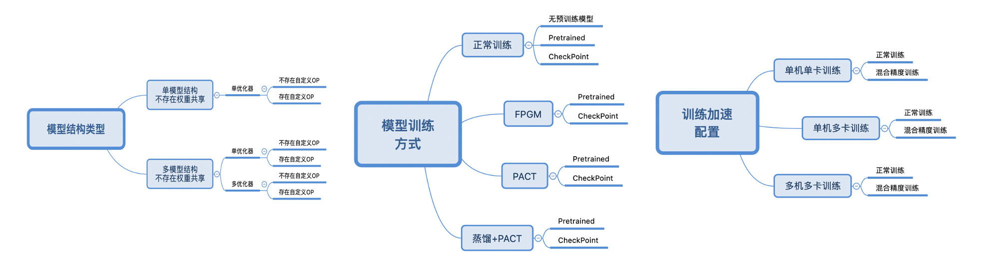

# TIPC Linux端补充训练功能测试

Linux端基础训练预测功能测试的主程序为test_train_python.sh，可以测试基于Python的模型训练、评估等基本功能，包括裁剪、量化、蒸馏训练。



测试链条如上图所示，主要测试内容有带共享权重，自定义OP的模型的正常训练和slim相关功能训练流程是否正常。


# 2. 测试流程

本节介绍补充链条的测试流程

## 2.1 安装依赖

- 安装PaddlePaddle >= 2.2
- 安装其他依赖

```
pip3 install -r requirements.txt
```

## 2.2 功能测试

`test_train_python.sh`包含2种运行模式，每种模式的运行数据不同，分别用于测试训练是否正常，分别是：

- 模式1：lite_train_lite_infer，使用少量数据训练，用于快速验证训练到预测的走通流程，不验证精度和速度；

```
bash test_tipc/test_train_python.sh ./test_tipc/train_infer_python.txt 'lite_train_lite_infer'
```

- 模式2：whole_train_whole_infer，使用全量数据训练，用于快速验证训练到预测的走通流程，验证模型最终训练精度；

```
bash test_tipc/test_train_python.sh ./test_tipc/train_infer_python.txt 'whole_train_whole_infer'
```

如果是运行量化裁剪等训练方式，需要使用不同的配置文件。量化训练的测试指令如下：
```
bash test_tipc/test_train_python.sh ./test_tipc/train_infer_python_PACT.txt 'lite_train_lite_infer'
```

同理，FPGM裁剪的运行方式如下：
```
bash test_tipc/test_train_python.sh ./test_tipc/train_infer_python_FPGM.txt 'lite_train_lite_infer'
```

多机多卡的运行配置文件分别为 `train_infer_python_fleet.txt`, `train_infer_python_FPGM_fleet.txt` 和 `train_infer_python_PACT_fleet.txt`。
运行时，需要修改配置文件中的 `gpu_list:xx.xx.xx.xx,yy.yy.yy.yy;0,1`。 将 `xx.xx.xx.xx` 替换为具体的 `ip` 地址，各个`ip`地址之间用`,`分隔。 另外，和单机训练
不同，启动多机多卡训练需要在多机的每个节点上分别运行命令。以多机多卡量化训练为例，指令如下：
```
bash test_tipc/test_train_python.sh ./test_tipc/train_infer_python_PACT_fleet.txt 'lite_train_lite_infer'
```

运行相应指令后，在`test_tipc/output`文件夹下自动会保存运行日志。如'lite_train_lite_infer'模式运行后，在test_tipc/extra_output文件夹有以下文件：

```
test_tipc/output/
|- results_python.log    # 运行指令状态的日志
```

其中results_python.log中包含了每条指令的运行状态，如果运行成功会输出：

```
Run successfully with command - python3.7 train.py -c mv3_large_x0_5.yml -o  use_gpu=True     epoch=20       AMP.use_amp=True TRAIN.batch_size=1280  use_custom_relu=False model_type=cls MODEL.siamese=False  !
Run successfully with command - python3.7 train.py -c mv3_large_x0_5.yml -o  use_gpu=True     epoch=2       AMP.use_amp=True TRAIN.batch_size=1280  use_custom_relu=False model_type=cls MODEL.siamese=False  !
Run successfully with command - python3.7 train.py -c mv3_large_x0_5.yml -o  use_gpu=True     epoch=2       AMP.use_amp=True TRAIN.batch_size=1280  use_custom_relu=False model_type=cls MODEL.siamese=True  !
Run successfully with command - python3.7 train.py -c mv3_large_x0_5.yml -o  use_gpu=True     epoch=2       AMP.use_amp=True TRAIN.batch_size=1280  use_custom_relu=False model_type=cls_distill MODEL.siamese=False  !
Run successfully with command - python3.7 train.py -c mv3_large_x0_5.yml -o  use_gpu=True     epoch=2       AMP.use_amp=True TRAIN.batch_size=1280  use_custom_relu=False model_type=cls_distill MODEL.siamese=True  !
Run successfully with command - python3.7 train.py -c mv3_large_x0_5.yml -o  use_gpu=True     epoch=2       AMP.use_amp=True TRAIN.batch_size=1280  use_custom_relu=False model_type=cls_distill_multiopt MODEL.siamese=False  !

```
