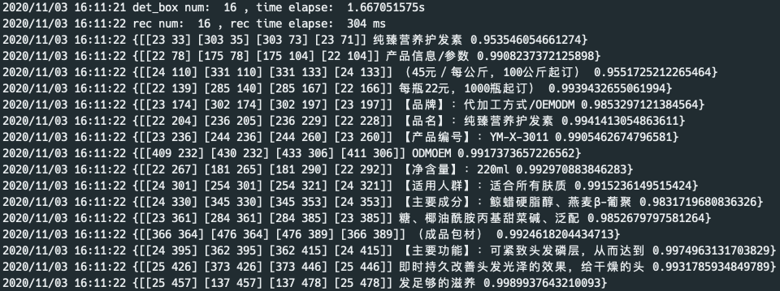
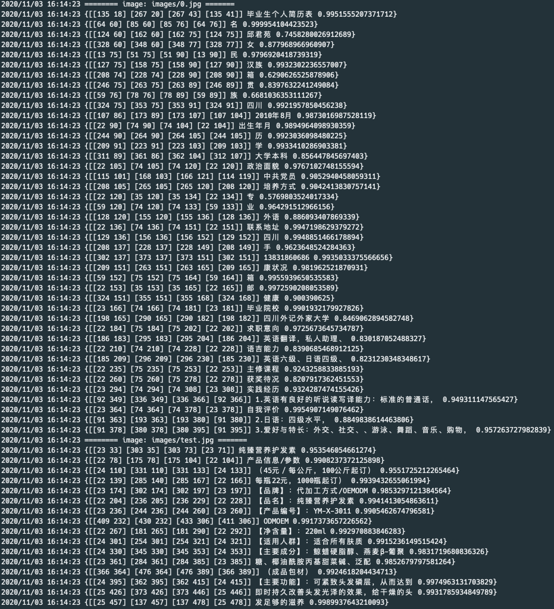
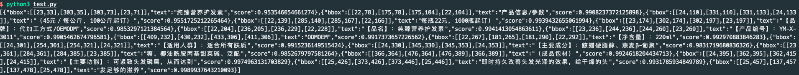

# PaddleOCR-GO

本服务是[PaddleOCR](https://github.com/PaddlePaddle/PaddleOCR)的golang部署版本。

## 1. 环境准备

### 运行环境

- go: 1.14
- OpenCV: 4.3.0
- PaddlePaddle: 1.8.4
- 编译环境：cmake 3.15.4   |   gcc 4.8.5
- 基于Centos 7.4运行环境编译，Windows请自行解决`OpenCV`和`PaddlePaddle`的编译问题

*另外，以下编译以`.bashrc`个人环境变量配置文件，如果使用`zsh`，请自行更换为`.zshrc`*

### 1.1 安装golang

从官网下载[golang](https://golang.org/dl/)，建议选择1.13版本以上进行安装。下载完成后，直接解压你需要的安装目录，并配置相关环境变量，此处以1.14版本为例。

```shell
# 下载golang
wget https://golang.org/dl/go1.14.10.linux-amd64.tar.gz

# 解压到 /usr/local 目录下
tar -xzvf go1.14.10.linux-amd64.tar.gz -C /usr/local

# 配置GOROOT，即go的安装目录
echo "export GOROOT=/usr/local/go" >> ~/.bashrc
echo "export PATH=$PATH:$GOROOT/bin" >> ~/.bashrc
# 配置GOPATH，即go相关package的安装目录，可自定义一个目录
echo "export GOPATH=$HOME/golang" >> ~/.bashrc
echo "export PATH=$PATH:$GOPATH/bin" >> ~/.bashrc
# 配置GOPROXY，即go mod包管理器的下载代理，同时打开mod模式
echo "export GO111MODULE=on" >> ~/.bashrc
echo "export GOPROXY=https://mirrors.aliyun.com/goproxy/" >> ~/.bashrc
source ~/.bashrc
```

### 1.2 编译OpenCV库

go语言中，OpenCV的使用主要以[gocv](https://github.com/hybridgroup/gocv)包为主，gocv使用cgo调用OpenCV提供接口，因此还是需要编译OpenCV库。  

**踩坑指南之一：[gocv官方实现](https://github.com/hybridgroup/gocv)中，部分接口并没有与原版C++的OpenCV的API保持一致，导致图片处理结果会出现一定的数值偏差。为处理这种偏差，[该仓库](https://github.com/LKKlein/gocv)fork了一份gocv官方源码，并对部分这些不一致的API进行了修正，保证结果与其他语言的一致性。**

对于OpenCV的编译，gocv官方提供了[Makefile](https://github.com/LKKlein/gocv/blob/lk/Makefile)，可以一键进行安装，具体安装步骤详见[官方指南](https://github.com/LKKlein/gocv/blob/lk/README_ORIGIN.md#ubuntulinux)。

这里提供逐步安装的方式，方便排查错误。

- 下载并解压OpenCV-4.3.0和OpenCV-Contrib-4.3.0

```shell
# 创建opencv安装目录
mkdir -p ~/opencv

# 下载OpenCV
cd ~/opencv
curl -sL https://github.com/opencv/opencv/archive/4.3.0.zip > opencv.zip
unzip -q opencv.zip
rm -rf opencv.zip

# 下载OpenCV-Contrib
curl -sL https://github.com/opencv/opencv_contrib/archive/4.3.0.zip > opencv-contrib.zip
unzip -q opencv-contrib.zip
rm -rf opencv-contrib.zip
```

- 安装相关依赖

```shell
sudo yum -y install pkgconfig cmake git gtk2-devel libpng-devel libjpeg-devel libtiff-devel tbb tbb-devel libdc1394-devel
```

- 编译安装

```shell
mkdir -p ~/.local/opencv-4.3.0
cd ~/opencv/opencv-4.3.0
mkdir build
cd build
cmake -D WITH_IPP=OFF \
      -D WITH_OPENGL=OFF \
      -D WITH_QT=OFF \
      -D BUILD_EXAMPLES=OFF \
      -D BUILD_TESTS=OFF \
      -D BUILD_PERF_TESTS=OFF  \
      -D BUILD_opencv_java=OFF \
      -D BUILD_opencv_python=OFF \
      -D BUILD_opencv_python2=OFF \
      -D BUILD_opencv_python3=OFF \
      -D OPENCV_GENERATE_PKGCONFIG=ON \
      -D CMAKE_INSTALL_PREFIX=$HOME/.local/opencv-4.3.0 \
      -D OPENCV_ENABLE_NONFREE=ON \
      -D OPENCV_EXTRA_MODULES_PATH=$HOME/opencv/opencv_contrib-4.3.0/modules ..
make -j8
make install
sudo ldconfig
```

make进行编译时，可能出现因`xfeatures2d`的两个模块下载失败导致的编译失败，这里只需要手动下载这部分文件到`$HOME/opencv/opencv_contrib-4.3.0/modules/xfeatures2d/src`目录下，然后重新执行`make -j8`即可。这部分文件地址可参考[这里](https://github.com/opencv/opencv_contrib/issues/1301#issuecomment-447181426)给出的链接。

- 配置环境变量

```shell
echo "export PKG_CONFIG_PATH=$PKG_CONFIG_PATH:$HOME/.local/opencv-4.3.0/lib64/pkgconfig" >> ~/.bashrc
echo "export LD_LIBRARY_PATH=$LD_LIBRARY_PATH:$HOME/.local/opencv-4.3.0/lib64" >> ~/.bashrc
source ~/.bashrc
```

- 验证安装

```shell
# 安装gocv包，先mod init
go mod init opencv
go get -u github.com/LKKlein/gocv

# 验证安装结果
cd $GOPATH/pkg/mod/github.com/!l!k!klein/gocv@v0.28.0
go run ./cmd/version/main.go

# 输出
# gocv version: 0.28.0
# opencv lib version: 4.3.0
```

### 1.3 编译PaddlePaddle的C语言API

go语言只能通过cgo调用C语言API，而不能直接与C++进行交互，因此需要编译PaddlePaddle的C语言API。当然，也可以自己写C语言调用C++的代码和头文件，这样就可以直接使用PaddlePaddle提供的已编译的C++推理库，无需自己手动编译，详见[该仓库](https://github.com/LKKlein/paddleocr-go/tree/dev_cxx)。

- 获取PaddlePaddle源代码

```shell
cd ~
git clone --recurse-submodules https://github.com/paddlepaddle/paddle

# 切换到v1.8.4版本
cd paddle
git checkout v1.8.4

# 目前版本无论单卡还是多卡都需要先安装nccl
git clone https://github.com/NVIDIA/nccl.git
make -j8
make install
```

- 编译Paddle源代码

**踩坑指南之二：PaddlePaddle的C语言API实现有一个bug，即获取输入输出变量名时只能获取到第一个模型的变量名，后续模型都无法获取输入输出变量名，进而无法获取到模型输出，详情见[issue](https://github.com/PaddlePaddle/Paddle/issues/28309)。因此，编译前需要手动将`paddle/fluid/inference/capi/pd_predictor.cc`文件中`210行`与`215行`的`static`删除。**

在处理完该bug之后，才能进行后续编译。相关编译参数见[官方文档](https://www.paddlepaddle.org.cn/documentation/docs/zh/advanced_guide/inference_deployment/inference/build_and_install_lib_cn.html#id12)，注意部分参数需要相关依赖，请确保依赖完整再启用。

```shell
# 创建c++推理库文件夹
mkdir -p ~/paddle_inference
export PADDLE_INFER=`$HOME/paddle_inference`

# 执行编译
export PADDLE_ROOT=`pwd`
mkdir build
cd build
cmake -DFLUID_INFERENCE_INSTALL_DIR=$PADDLE_INFER \
      -DWITH_CONTRIB=OFF \
      -DCMAKE_BUILD_TYPE=Release \
      -DWITH_PYTHON=OFF \
      -DWITH_MKL=ON \
      -DWITH_GPU=ON \
      -DON_INFER=ON \
      --WITH_MKLDNN=ON \
      --WITH_XBYAK=ON \
      --WITH_DSO=OFF ..
make
make inference_lib_dist
```

编译完成后，可以在`build/fluid_inference_c_install_dir`目录下，看到以下生成的文件

```
build/fluid_inference_c_install_dir
├── paddle
├── third_party
└── version.txt
```

其中`paddle`就是Paddle库的C语言预测API，`version.txt`中包含当前预测库的版本信息。最后，将C推理库配置到环境变量。

```shell
echo "export LD_LIBRARY_PATH=$LD_LIBRARY_PATH:$PADDLE_ROOT/build/fluid_inference_c_install_dir/paddle/lib" >> ~/.bashrc
echo "export LIBRARY_PATH=$LIBRARY_PATH:$PADDLE_ROOT/build/fluid_inference_c_install_dir/paddle/lib" >> ~/.bashrc

souce ~/.bashrc
```

## 2. paddleocr-go预测库

### 2.1 安装paddleocr-go

确保C推理库已配置到环境变量，然后直接执行安装命令

```shell
go get -u github.com/PaddlePaddle/PaddleOCR/thirdparty/paddleocr-go
```

### 2.2 相关使用API

在go中使用import引入包

```go
import github.com/PaddlePaddle/PaddleOCR/thirdparty/paddleocr-go/ocr
```

- 预测结果结构体

```go
type OCRText struct {
	BBox  [][]int `json:"bbox"`
	Text  string  `json:"text"`
	Score float64 `json:"score"`
}
```

一张图的OCR结果包含多个`OCRText`结果，每个结果包含预测框、预测文本、预测文本得分。

- OCR预测类


```go
func NewOCRSystem(confFile string, a map[string]interface{}) *OCRSystem
```

`OCRSystem`是主要对外提供API的结构；

`confFile`是yaml配置文件的路径，可在配置文件中修改相关预测参数，也可以传空字符串，这时会全部使用默认配置；

`a`是可以在代码中直接定义的配置参数，优先级高于配置文件，会覆盖配置文件和默认配置的参数。

- 单张图预测API

```go 
func (ocr *OCRSystem) PredictOneImage(img gocv.Mat) []OCRText
```


- 图片文件夹预测API

```go
func (ocr *OCRSystem) PredictDirImages(dirname string) map[string][]OCRText
```

`dirname`图片文件夹的目录，默认会预测改目录下所有`jpg`和`png`图片，并返回每张图的预测结果。

- OCR Server

```go
func (ocr *OCRSystem) StartServer(port string)
```

开启OCR预测Server，开启后，使用`post`请求上传需要识别的图片至`http://$ip:$port/ocr`即可直接获取该图片上所有文本的识别结果。其中，`$ip`是开启服务的主机`ip`或`127.0.0.1`的本地ip， `$port`是传入的端口参数。


## 3. 预测demo

### 3.1 生成预测demo

以下两种方式均可生成预测demo文件，任选其一即可

- 通过下载`paddleocr-go`代码并编译

```shell
git clone https://github.com/PaddlePaddle/PaddleOCR
cd PaddleOCR/thirdparty/paddleocr-go

# 确保C动态库路径已在环境变量中，执行以下命令生成ppocr-go文件
go build ppocr-go.go
```

- 通过go package自动安装

```shell
# 执行后会自动在$GOPATH/bin下生成ppocr-go文件，如果配置了PATH=$PATH:$GOPATH/bin，以下预测命令可以去掉`./`，直接执行ppocr-go
go get -u github.com/PaddlePaddle/PaddleOCR/thirdparty/paddleocr-go
```

### 3.2 修改预测配置

当前给定的配置文件`config/conf.yaml`中，包含了默认的OCR预测配置参数，可根据个人需要更改相关参数。

比如，将`use_gpu`改为`false`，使用CPU执行预测；将`det_model_dir`, `rec_model_dir`, `cls_model_dir`都更改为自己的本地模型路径，也或者是更改字典`rec_char_dict_path`的路径，这四个路径如果配置http链接，会自动下载到本地目录。另外，配置参数包含了预测引擎、检测模型、检测阈值、方向分类模型、识别模型及阈值的相关参数，具体参数的意义可参见[PaddleOCR](https://github.com/PaddlePaddle/PaddleOCR/blob/develop/doc/doc_ch/whl.md#%E5%8F%82%E6%95%B0%E8%AF%B4%E6%98%8E)。

### 3.3 执行预测demo

预测demo提供了三种预测方式，分别是单张图预测、文件夹批量预测、OCR Server预测。三者命令行优先级依次降低。

#### 3.3.1 单张图预测

```shell
./ppocr-go --config config/conf.yaml --image images/test.jpg
```

执行完成，会输出以下内容：



#### 3.3.2 文件夹批量预测

```shell
./ppocr-go --config config/conf.yaml --image_dir ./images
```

执行完成，会输出以下内容：



#### 3.3.3 开启OCR Server

```shell
./ppocr-go --use_servering --port=18600
```

开启服务后，可以在其他客户端中通过`post`请求进行ocr预测。此处以`Python`客户端为例，如下所示

```python
import requests

files = {'image': open('images/test.jpg','rb')}
url = "http://127.0.0.1:18600/ocr"

r = requests.post(url, files=files)
print(r.text)
```

执行完成可以得到以下结果



最后，在Python中将上述结果可视化可以得到以下结果


